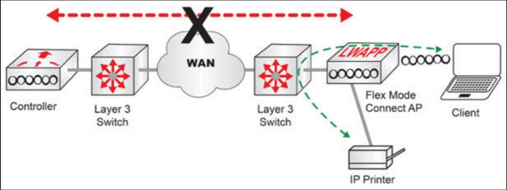
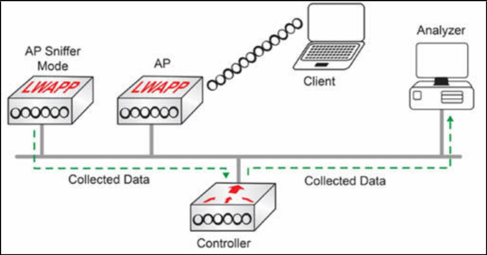
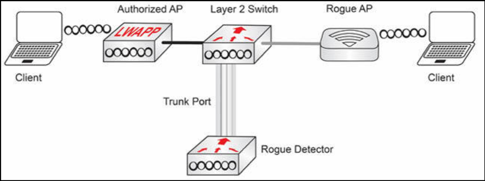

# 无线架构

部署无线网络有三种架构方法：

- 自主（自治）架构
- 基于云的架构
- 分离式 MAC 架构

## 自主（自治）架构

这种架构使用一个处理了允许无线客户端连接到无线网络所需的所有功能的独立接入点。由于这些自治接入点是单独配置的，因此诸如 VLAN 标签、信道和其他无线电配置等参数，都必须在所有自主接入点中单独复制。

**图 14.32** -- **自主架构**

以下步骤描述了某个自主 AP 下如何通信：

1. 客户端以可用的 SSID 与该 AP 关联；
2. 该 SSID 被映射到某个特定 VLAN；
3. 接入点在将数据发送到以中继模式运行的交换机接口前，会将其以映射的 VLAN 打上标签；
4. 交换机将流量转发到目的地。

## 基于云的架构

这种架构允许所有接入点从位于云上的某个单一管理接口管理，所谓云基本上是某种部署在厂商处所的平台。思科的 Meraki 解决方案，就是基于云架构的一个很好的示例。其简化了接入点的管理与初始配置，因为他们会自动与云联系，并根据指定设置加载配置。Meraki 并为在 CCNA 考试大纲中涉及。

云接口的功能包括：

- 配置与管理接入点
- 监控无线网络性能
- 生成无线报告
- 执行流量分析与七层可见性
- 维护接入点与客户端的列表
- 在地图和（建筑）平面图上可视化接入点
- 执行接入点的 SNMP 与 Syslog 轮询

**图 14.33** -- **基于云的架构**

## 分离式 MAC 架构

这种架构由一个轻量级接入点，及一个无线 LAN 控制器组成。这种架构允许在轻量级接入点和无线 LAN 控制器之间，分离 802.11 的那些功能。

无线设备由两项功能组成 -- 实时功能与管理功能。在这种结构下，实时功能由接入点负责，而无线 LAN 控制器负责管理功能。

**图 14.34** -- **实时功能与管理功能**

协议的实时要求，由接入点处理，包括以下项目：

- 无线客户端与接入点之间的数据帧交换
- 信标（802.11 的数据帧）转换（注：802.11 信标转换是指 Wi-Fi 设备（站/客户端）如何在不同的接入点（AP）之间移动。）
- 发送信号质量信息到无线 LAN 控制器
- 监控无线电信道和其他接入点的存在
- 802.11 数据帧的加密与解密

协议的管理功能，由 WLC 处理，包括以下项目：

- 安全（PSK、EAP 等）
- 关联和重关联
- 客户端 IP 地址
- 二层与三层漫游
- QoS
- 无线电管理
- 到比如 802.3（有线 LAN）等网络的转换与桥接
- 接入点的配置管理
- 接入点的（固件）镜像管理

无线接入点的控制和配置（CAPWABP），是用于管理接入点的行业标准协议。CAPWAP 推动接入点发现与加入过程、接入点的配置、接入点软件推送与无线安全等。

在接入点可广播某个 SSID 供无线客户端加入该无线网络前，接入点首先需要发现并加入 WLC，并从 WLC 下载配置。

以下步骤描述了 WLC 的发现与连接过程：

1. 接入点发现 WLC；
2. CAPWAP 隧道在 WLC 和接入点之间形成。CAPWAP 隧道将 UDP 端口 5246 用于控制平面，将 UDP 端口 5247 用于数据平面；
3. 接入点加入该 WLC；
4. 接入点从该 WLC 下载软件及配置。

**图 14.35** -- **CAPWAP 的传输**

一旦配置被推送到接入点，那么该接入点就会广播可用的 SSID，允许无线客户端加入。

**图 14.36** -- **CAPWAP 架构**

以下步骤描述了轻量级接入点下的通信方式：

1. 接入点发现并加入 WLC;
2. 一条 CAPWAP 隧道在接入点和 WLC 之间创建出来；
3. 接入点从 WLC 获取配置，并广播可用的 SSID；
4. 无线客户端以该 SSID 关联到该接入点；
5. 接入点经由管理 VLAN，将标有该 SSID 的客户端数据，通过 CAPWAP 隧道发送到 WLC；
6. WLC 接收到流量后，将其发送回与客户端的 SSID 相对应 VLAN 中的交换机中继端口；
7. 交换机将流量转发到目的地。

一旦自某个 WLC 到一个或多个轻量级 AP 的 CAPWAP 隧道建立后，WLC 就可以开始提供各项额外功能，包括以下这些：

- 动态信道分配 -- WLC 可根据区域内的其他活动接入点，自动选择和配置由各个 LAP 使用的射频信道；
- 发射功率优化 -- WLC 可根据所需的覆盖区域，自动设置各个 LAP 的发射功率；
- 自愈式无线覆盖 -- 当某个 LAP 的无线电死机时，该覆盖空洞可通过自动调高周围 LAP 的发射功率 “治愈”；
- 灵活的客户端漫游 -- 客户端可在 LAP 之间，以时间非常短的漫游时间，漫游于二层或三层；
- 动态的客户端负载均衡 -- 当两个或多个 LAP 被布置为覆盖同一地理区域时，WLC 可将客户端与使用最少的 LAP 关联。这就将客户端负载，分布到多个 LAP 了；
- 射频的监控 -- WLC 会管理每个 LAP，并扫描信道监控射频使用情况。通过监听某个信道，WLC 可远程收集有关 RF 干扰、噪音、相邻 LAP 的信号，以及来恶意 AP 或自组织客户端发出的信号等信息；
- 安全管理 -- 在允许客户端关联及访问该 WLAN 前，WLC 可根据某种中心服务认证客户端，并可要求无线客户端从某个受信任的 DHCP 服务器获取 IP 地址；
- 无线入侵保护系统 -- 利用其中心位置，WLC 可监控客户端数据，检测并防止恶意活动。

## 接入点模式

根据咱们的各项要求，轻量级接入点可被配置为以不同专门模式运行。Cisco 的接入点支持 8 种模式：

- 本地
- 监视器
- FlexConnect
- 嗅探器
- 流氓探测器
- 网桥
- Flex + 网桥
- SE-connect

### 本地模式

这是轻量级 AP 的默认模式。AP 会建立到 WLC 的隧道，并将所有客户端流量传输到 WLC。只有当 WLC 可达时，AP 才能在这一模式下运行，因此通常在这一模式下，WLC 和 AP 会同时位于一处物理位置。

**图 14.37** -- **AP 的本地模式**

### 监视器模式

在这一模式下，AP 完全不会传输（流量）。相反，他会作为一个专门的传感器运行，用于：

- 检测入侵检测系统 (IDS) 的事件；
- 检测恶意 AP；
- 利用一些基于位置的服务，确定无线站的位置。

**图 14.38** -- **监视器模式下的 AP**

### FlexConnect 模式

这种模式主要设计用于接入点位于远程分支机构，而 WLC 位于中心站点的情况。在这种模式下，接入点可在本地交换 SSID 与 VLAN 之间的流量，而没有需其发送到 WLC 的需求。这消除 WAN 电路中断对分支机构 Wi-Fi 业务运行的影响。

**图 14.39** -- **FlexConnect 模式下的 AP**

### 嗅探器模式

在这一模式下，接入点将其无线电专用于接收 802.11 的无线流量。其允许将某个特定信道内的所有流量，捕获到某台运行了诸如 [Wild packets Omni peek](https://www.liveaction.com/products/omnipeek/)、[Airmagnet Enterprise Analyze](https://airmagnet.cz/) 或 [Wireshark](https://www.wireshark.org/) 等数据包分析软件的远程机器。

**图 14.40** -- **嗅探器模式下的 AP**

### 流氓探测器

这一模式会将接入点专用于检测恶意设备。其通过将经由有线连接的 ARP 请求中发现的 MAC 地址，与无线接收到的流量关联，实现该目的。当发现一次匹配时，其就会发出警报，将这个恶意接入点或客户端识别为威胁。

**图 14.41** -- **流氓检测器模式下的 AP**

### 桥接模式

这一模式允许接入点作为某个本地 LAN 与某个远端接入点之间的专用网桥运行。在这一模式下，某个接入点会作为一个客户端，与另一接入点关联，并提供其其以太网接口和无线介质之间的桥接。

**图 14.42** -- **桥接模式下的 AP**

### Flex+桥接模式

在这一模式下，FlexConnect 的运行，会在网状组网的接入点上启用。

### SE 连接模式

在这一模式下，接入点专用于对所有无线信道的频谱分析。接入点会分析传播质量及干扰检测。这些信息可通过使用 Cisco Spectrum Expert 软件，连接接入点收集。

> *知识点*：
>
> - wireless architectures
>
> - three architectural approaches for implementing wireless networks: autonomous architecture, cloud-based architecture and split MAC architecture
>
> - a standalone access point
>
> - parameters such as VLAN tagging, channels, and other radio configurations must be individually replicated across all Autonomous APs
>
> + Steps how communication works with an Autonomous AP:
>   - the clients associate to the AP with the available SSID
>   - the SSID is mapped to a specific VLAN
>   - the access point tags the data with the mapped VLAN before sending it to the switch interface, which operates in trunk mode
>   - the switch forwards the traffic to the destination
>
> - cloud-based architecture
>
> - a single interface located in the cloud, basically a platform deployed on the vendor's premise, simplifies management and initial provisioning of Access Points, as they automatically contact the Cloud and load configurations as per specified settings
>
> + Functions of cloud interface include:
>   - Configure and manage Access Points
>   - Monitor performance of wireless networks
>   - Generate Wireless reports
>   - Perform Traffic Analytics and Layer 7 Visibility
>   - Maintain Access Point and Client lists
>   - Visualize Access Points on maps and floor plans
>   - Perform SNMP and Syslog polling of Access Points
>
> - Split MAC Architecture, composed of a lightweight access point and a wireless LAN controller, allows the splitting of 802.11 functions between the lightweight access point and the wireless LAN controller
>
> - two functions: a real-time function, and management function
>
> + the real-time requirement of the protocol, handled by the AP
>   - Frame exchange between the wireless client and the access point
>   - Transition of beacons(802.11 frames)
>   - Sending Signal Quality information to the Wireless LAN Controller
>   - Monitoring radio channels and presences of other access-point
>   - Encryption and Decryption of 802.11 frames
>
> + the management function of the protocol, handled by the WLC:
>   - Security(PSK, EAP, etc.)
>   - Association and Reassociation
>   - Client IP Addressing
>   - Layer 2 and Layer 3 roaming
>   - Qos
>   - Radio Management
>   - Translation and bridging to networks such as 802.3(Wired LAN)
>   - AP configuration management
>   - AP image management
>
> - Control and Provisioning of Wireless Access Points, CAP/WAP, an industry-standard protocol for managing access points, faciliates the discovery and access points join process, access point configuration, access point software push, and wireless security
>
> + the WLC discovery-and-join process:
>   - access point discovers the WLC
>   - CAP/WAP tunnel is formed between the WLC and the access point. A CAP/WAP tunnel uses UDP port 5246 for Channel Plane, and UDP port 5247 for Data Plane
>   - Access point joins the WLC
>   - Access point downloads the software and configuration from the WLC
>
> + how communication works with a lightweight access point:
>   - the access point discovers and joins the WLC
>   - a CAP/WAP tunnel is created between the access point and the WLC
>   - the access point gets configuration from the WLC and broadcast the available SSIDs
>   - the wireless client associate to the access point with the SSID
>   - the access point sends the client data marked with the SSID through the CAP/WAP tunnel to the WLC via Management VLAN
>   - the WLC receives the traffic and sends it back to switch trunk port in VLAN, which corresponds to the client's SSID
>   - the switch forwards the traffic to the destination
>
> + Once CAP/WAP tunnels built from a WLC to one or more lightweight APs, begin offering a variety of additional functions:
>   - dynamic channel assignment
>   - transmit power optimization
>   - self-healing wireless coverage
>   - flexible client roaming
>   - dynamic client load balancing
>   - RF monitoring
>   - security management
>   - wireless intrusion protection system
>
> + AP modes:
>   - local
>   - monitor
>   - FlexConnect
>   - sniffer
>   - rogue detector
>   - bridge
>   - Flex + Bridge
>   - SE-connect
>
> - local mode, the default mode for a lightweight AP, transmit all client traffic to WLC, both WLC and APs are located within a single physical location
>
> + monitor mode, the AP does not trasmit at all, operates as a dedicated sensor for:
>   - detecting Intrusion Detection System, IDS, events
>   - detecting rogue APs
>   - determining the position of wireless stations using location-based services
>
> - FlexConnect mode, primarily designed for APs located in remote branch offices while the WLC is on the central site, AP can locally switch the traffic between the SSID and VLAN without having the need to send it to the WLC, eliminates the impact of WAN circuit disruptions for operating Wi-Fi services in branch locations
>
> - Sniffer mode, AP dedicates its radios to receive 802.11 wireless traffic, allows capturing all traffic within a particular channel to a remote machines that runs a packet analyzer software
>
> - Rogue Detector mode, dedicates the AP to detecting rogue devices, by correlating MAC addresses discovered from ARP requests via wired connctions with traffic received wirelessly. If a match is found, it generates an alarm identifying the rogue AP or client as a threat.
>
> - Bridge mode, allows an AP to operate as a dedicated bridge between a LAN and remote AP. An AP associates to another AP as a client, and provides bridging between its Ethernet interface and wireless media
>
> - Flex+Bridge mode, the FlexConnect operation is enabled on meshed APs.
>
> - SE Connect mode, AP is dedicated to the spectrum analysis of all wireless channels. AP analyzes air quality and interference detection.
