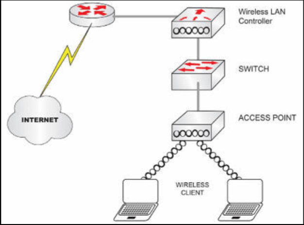
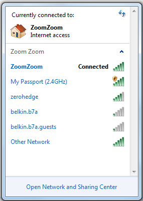

# 无线网络组件

一个典型的无线网络，由

- 一台无线局域网控制器 (WLC)
- 一个接入点
- 一台路由器（下图中未显示）
- 一台交换机
- 以及一些无线客户端

组成。

**图 14.1** -- **典型无线网络**

## 无线局域网控制器

WLC 是无线部署的核心组件。正如上面所指出的，其可使用命令行界面，或更友好的图形用户界面（经由 Web 浏览器）配置。Cisco 的 Packet Tracer 确实提供了一些无线选项。不过，诸如 QoS 等一些特性并未受到支持（除非咱们能买到一台二手 WLC），因此咱们要完成一些更加高级的实验选项，可能会受到一些限制。

其中交换机提供了局域网的连通性，而接入点允许无线客户端连接到该网络。接入点通过有线以太网，接收来自交换机的数据，并将其转换为 2.4GHz 或 5GHz 的无线射频信号。他向附近的无线客户端发送无线流量，并接收来自他们的无线流量。接入点没有防火墙功能。不过，一些最新的 Cisco 接入点，可通过使接入点提供自适应的无线 IPS 功能，监视及检测无线网络异常与射频攻击。无线客户端通过扫描可用的无线网络，启动与该网络的连接。客户端可以是任何带有无线网卡的设备，比如笔记本电脑、手机或平板电脑。

## 接入点

接入点（AP）发出其中包含无线网络信息，比如无线网络名字（SSID）、认证方式与信道等的信标。

每个无线网络都由一个唯一的 32 字符标识符，表示某个特定无线网络的服务集标识符或 SSID 标识。非技术用户通常将这个标识符，称为无线网络的名字。当咱们在酒店和咖啡厅扫描无线网络时，就曾看到过这些 SSID。在咱们前往手机或笔记本电脑的网络或无线设置时，他们通常将有某种图形用户界面，显示这些 SSID。下图 14.2 中展示了个示例。

**图 14.2** -- **显示的 SSID**

咱们可单击 SSID 名字，连接到咱们打算使用的无线网络。具体取决于对该 SSID 所配置的身份验证机制，其将提示输入用户名和密码，或者只是密码。当他使用的是开放式身份验证时，则无需密码即可连接。

> *知识点*：
>
> - wireless networking
>
> - ubiquitous
>
> - wireless standards and security
>
> - various services and protocols
>
> - wireless network components
>
> - wireless principles
>
> - wireless architectures
>
> - physical infrastructure connection
>
> - access point
>
> - a typical wireless network
>
> - wireless LAN controller, WLC
>
> - a wireless deployment
>
> - a 2.4GHz or 5Ghz wireless radio signal
>
> - network anomalies
>
> - RF attacks
>
> - adaptive Wireless IPS functionality
>
> - a wireless network card
>
> - beacons that contain the information of the wireless network, such as the name of the wireless network(SSID), authentication, and channel
>
> - Service Set Identifier, SSID, which is a unique 32-character identifier that represents a particcular wireless network
>
> - the configured authentication mechanism for that SSID
>
> - open authentication

