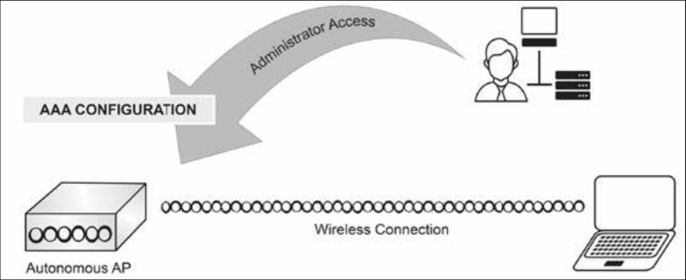
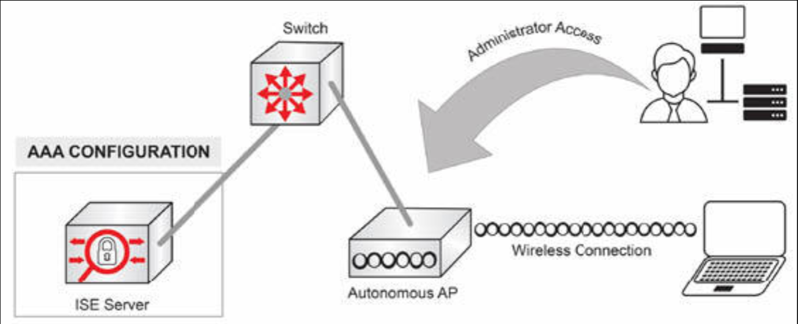
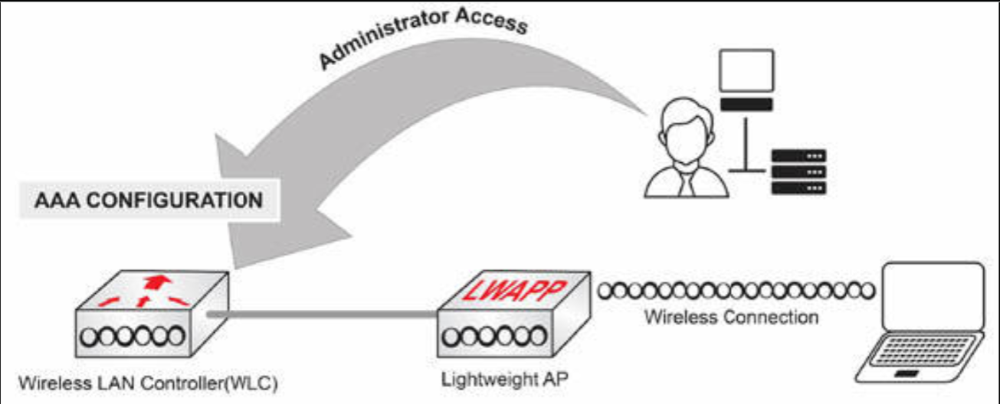
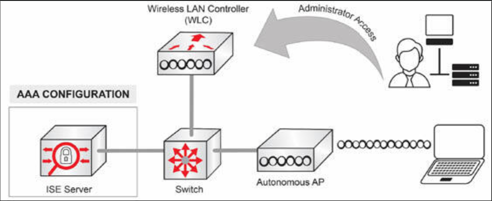
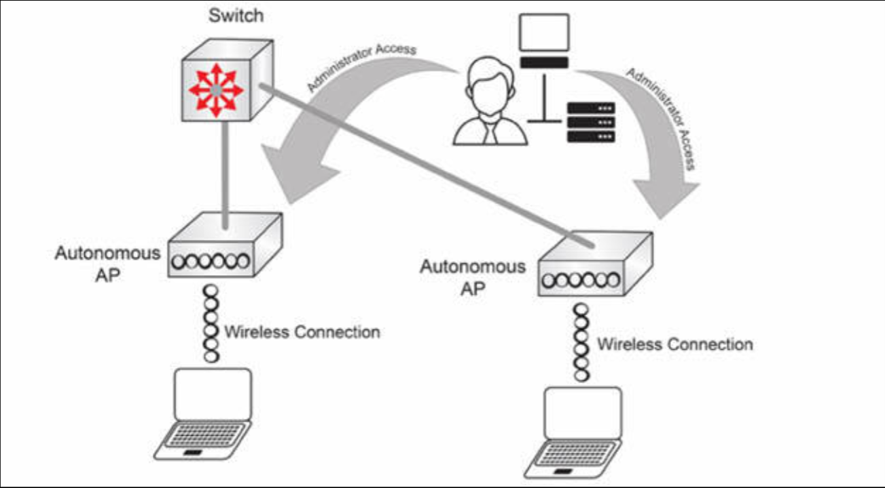
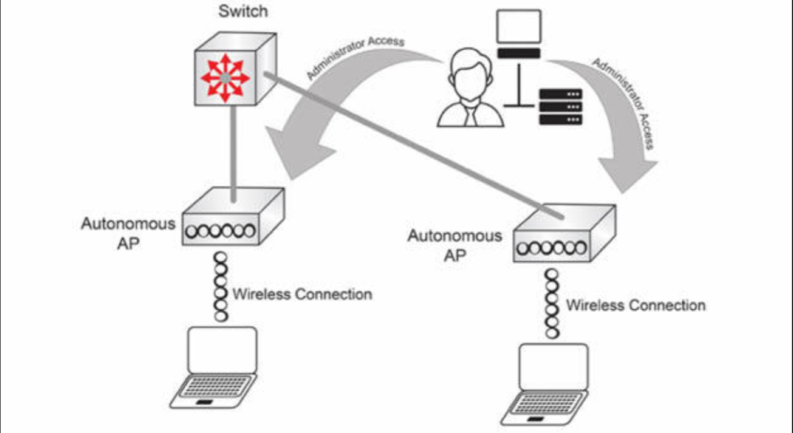
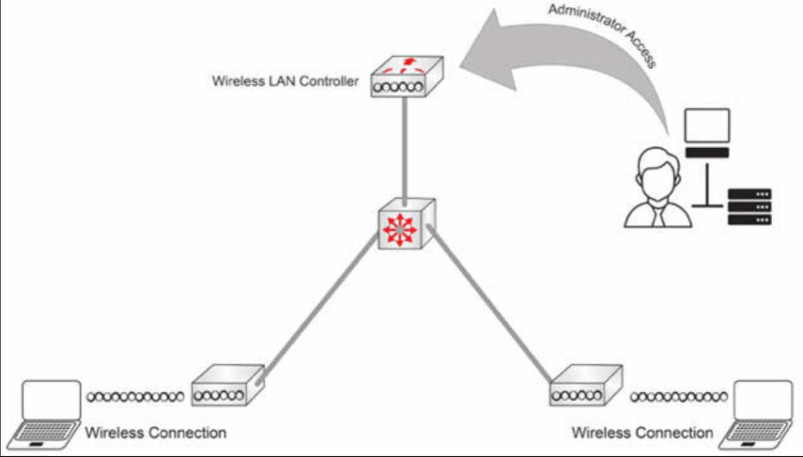
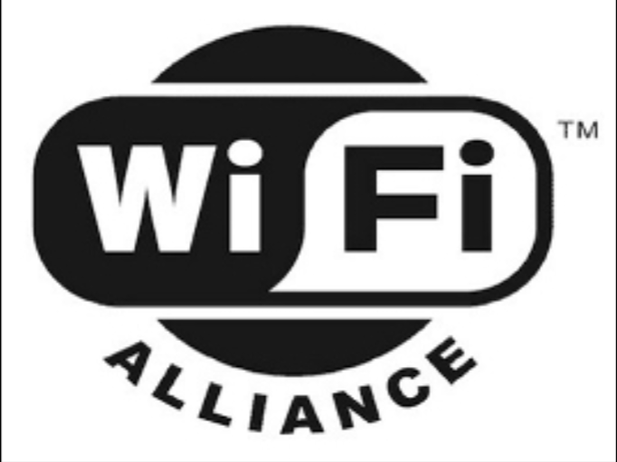

# 接入点及 WLC 的管理访问

## 身份验证、授权和计费

在无线部署中，身份验证、授权和计费（AAA）服务器，管理着两项主要功能：

- 无线客户端对网络的访问
- 设备管理的访问

在自主（自治）架构下，AAA 可在如下位置处配置：

- AAA 的用户配置，可在接入点上完成
- AAA 的服务器配置，可请求自诸如安全身份服务引擎 (ISE) 、访问控制系统 (ACS) 及身份与访问管理（IAM）等外部提供方

**图 14.48** -- **自主 AP 上的本地 AAA 用户配置**

**图 14.49** -- 自主 AP 部署中的远端 AAA 配置**

在分离式 MAC 架构下，AAA 可在以下位置处配置：

- AAA 的用户配置可在 WLC 上完成
- AAA 的服务器配置可请求自 ISE、ACS 及 IAM 等外部提供方

**图 14.50** -- **轻量级部署中的本地 AAA 配置**

**图 14.51** -- **轻量级部署中的远端 AAA 配置**

用于 AAA 的主要协议有两种：远程访问拨号用户服务 (RADIUS) ，与终端访问控制器访问控制系统 (TACACS+)。以下是这两种协议的简短比较（他们在这本书的其他章节中，有更详细的介绍）。

### RADIUS

- 开放的标准协议
- 将 UDP 端口 1812 用于身份验证和授权，UDP 端口 1813 用于计费
- 身份验证和授权相结合
- 口令加密；其他信息未加密
- 主要用于网络访问控制（比如 Dot1x 或 MAC 的身份验证绕过等）

### TACACS+

- 一种由思科开发的协议
- 使用 TCP 端口 49
- 身份验证、授权及计费分离
- 所有 AAA 的数据包都被加密
- 主要用于管理设备的管理访问

### HTTP/HTTPS

HTTP/HTTPS 是用于经由 web 浏览器，访问图形用户界面 (GUI) 的协议。这种访问方式，在 CCNA 考试大纲中特别提到过。

在自主（自治）架构下，GUI 通过自主接入点的管理 VLAN/管理端口访问。

**图 14.52** -- **到自主 AP 的 HTTP/HTTPS 管理员访问**

在分离 MAC 架构下，GUI 则是通过 WLC 的管理 VLAN/管理端口访问的。

**图 14.53** -- **到 WLC 的 HTTP/HTTPS 管理访问**

### Telnet/SSH/控制台

其是个用于配置和管理的命令行用户界面。

在自主接入点架构下，CLI 是通过自主接入点的管理 VLAN/管理端口，使用 SSH 或 telnet 访问的。控制台端口也可用于通过控制台线，访问命令行界面。

**图 14.54** -- **到自主架构中 AP 的 Telnet/SSH/控制台访问**

在分离 MAC 架构下，CLI 是通过 WLC 的管理 VLAN/管理端口，使用 SSH 或 telnet 访问的（译注：原文这里有拼写错误）。控制台端口则可通过控制台线，从 WLC 及轻量级 AP 的控制台命令行界面访问。

**图 14.55** -- **到 WLC 的 Telnet/SSH/控制台访问**

> *知识点*：
>
> - AP and WLC management access
>
> - authentication, authorization, and accounting, AAA
>
> + AAA server manages two primary functions:
>   - access to network for wireless clients
>   - access to device administration
>
> + in Autonomous Architecture, AAA can be configured in the following places:
>   - AAA user configuration can be done on the Access Point
>   - AAA server configuration can be requested from external providers such as Identity Engine Secure, ISE, or Access Control System, ACS, and Identity and Access Management, IAM
>
> + in Split MAC Architecture, AAA can be configured in the follwing places:
>   - AAA user configuration can be done on the WLC
>   - AAA server configuration can be requested from external providers such as ISE, ACS or IAM
>
> + two major protocols used for AAA(plus one new):
>   - Remote Access Dial-In User Service, RADIUS
>   - Terminal Access Controller Access Control System, TACACS+
>   - Identity and Access Management, IAM
>
> + RADIUS characteritics:
>   - open standard protocol
>   - Use UDP port 1812 for authentication and authorization, and UDP port 1813 for accounting
>   - Authentication and Authorization combined
>   - Passwords encrypted; other information not encrypted
>   - Used primarily for Network Access Control(such as dot1x or MAC authentication bypass)
>
> + TACACS+
>   - a protocol developed by Cisco
>   - Uses TCP port 49
>   - Authentication, Authorization, and Accounting separated
>   - All AAA packets encrypted
>   - Used primarily to manage device administration access
>
> + HTTP/HTTPS
>   - the protocol used for accessing graphical user interface(GUI) via a web browser
>   - In Autonomous Architecture, is accessed through the management VLAN/management port of the autonomous AP
>   - In Split MAC Architecture, is accessed through the management VLAN/management port of the WLC
>
> + Telnet/SSH/Console
>   - a command line user interface, used for configuration and management
>   - In Autonomous AP Architecture, is accessed through the management VLAN/management port of the autonomous AP, using SSH or telnet
>   - In Split MAC Architecture, the CLI is accessed thrp the management VLAN/management port of the WLC, by using SSH or telnet
>   - a console port is also available to access the CLI interface, by using a console cable

## 无线的安全协议

在 CCNA 考试中，咱们需要熟悉无线安全协议，以及哪些验证方式与哪些加密算法兼容。

咱们可能已经听说过 Wi-Fi 联盟，或在咱们的无线路由器上看到过他们的标志。

**图 14.56** -- **Wi-Fi 联盟的徽标**

Wi-Fi 联盟是个推广 Wi-Fi 技术，以及认证 Wi-Fi 产品是否符合一些互操作性标准的非营利性组织。由于认证过程成本高昂，并非所有制造商都认证过。Wi-Fi 联盟业已开发出用于无线网络的一些安全协议。目前有三种不同版本：WPA、WPA2 与 WPA3。这些协议是由这个联盟，针对研究人员在先前的有线等效保密（WEP）系统中，发现的一些严重弱点而定义的。

无线产品在一些授权的测试实验室里，根据一系列代表了某项标准授权实现的严格条件加以测试。因此，只要 Wi-Fi 联盟认证了同一 WPA 版本的某种无线客户端设备、接入点及其相关的 WLC，他们便应兼容，并应提供同样的安全组件。

### WEP

值得一提的是有线等效保密（WEP），其为 1997 年为无线网络开发的最初加密协议。正如咱们名字可能已看出的，他旨在提供与有线网络同样的安全级别。WEP 的安全性很快就被破解了，众所周知，他存在许多知名的安全漏洞。处于这一原因，即使咱们看到其作为一个选项，咱们也绝不要在网络中使用他。

### WPA

为了解决 WEP 下发现的那些严重弱点，Wi-Fi 联盟推出了其第一代的 WPA 认证。大多数 WPA 实现都将预共享密钥（PSK），称为 WPA 个人密钥，及时态密钥完整性协议（TKIP）用于加密。WPA 部分基于 802.11i，同时其包括了 802.1x 的身份验证（我们稍后会介绍这点）。

### WPA2

WPA2 包含了对 CCMP -- 一种基于 AES 的加密模式 -- 的强制支持。由于 TKIP 已被弃用，WPA2 便基于更优越的 AES CCMP 算法。显而易见，WPA2 属于 WPA 的替代品。WPA2 支持，是任何贴有 Wi-Fi 商标设备的最低要求。

### WPA3

WPA3在WPA2的基础上增加了几项重要而卓越的安全升级。其中一项升级是采用伽罗瓦/计数器模式协议（GCMP）的 AES 加密技术。它在 WPA3-Enterprise 模式中提供 192 位加密强度。受保护管理帧 (PMF) 用于保护接入点和客户端之间管理帧的安全，以防止黑客攻击。EAP 可扩展身份验证协议（EAP）是用于验证无线通信的传输协议。EAP 扩展了多种类型的身份验证，其中最常见的如下：
® PSK
®TLS
MSCHAPv2
IKEv2
® PEAP（使用 TLS 封装流量，以解决 EAP 的安全问题） PEAP '虽然 EAP 是一个很好的协议，并达到了其作为身份验证协议的目的，但在假定 EAP 使用受物理保护的通信信道时出现了一些问题。受保护的可扩展身份验证协议（PEAP）使用 TLS 对 EAP 流量进行封装，并对其本身进行加密和身份验证。PEAP-MSCHAPv2（微软挑战握手协议）是最常见的 PEAP 类型，也是大多数人提到 PEAP 时所指的类型。PEAP-MSCHAPvV2 是最常用、最受支持的协议之一，因为它用于提供点对点身份验证。PEAP-TLS (PEAP-EAP-TLS) 需要证书才能运行，因此需要 PKI 基础设施。这可以通过包括智能卡在内的多因素身份验证过程来实现，从而提高安全性。LEAP
