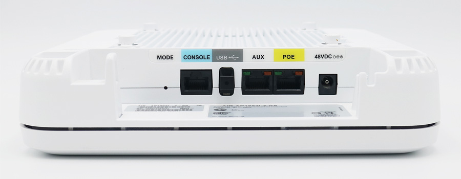
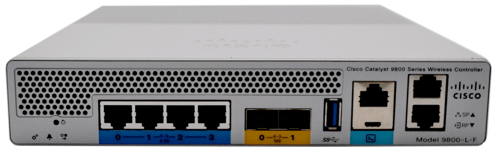
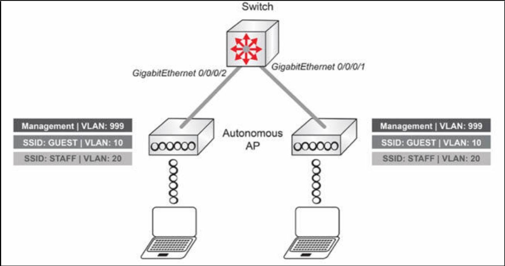
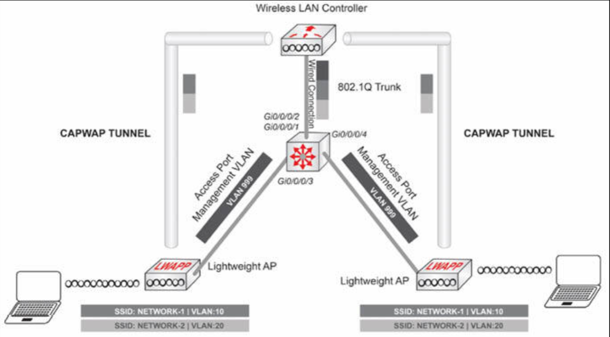
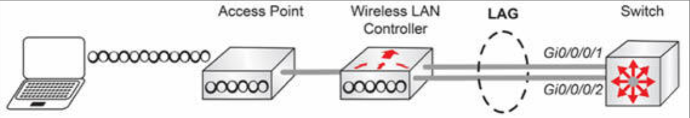

# WLAN 组件的物理基础设施连接


## 接入点物理端口概述

当咱们打算了解可用设备的硬件型号、可用接口以及所支持的服务及协议时，Cisco 网站是个很好的起点。查看销售页面获取型号信息，将是非常有用的。

下图 14.43 显示了 Cisco 1850 这个接入点。



**图 14.43** -- **Cisco 1850 接入点**


通常，思科接入点有数种类型的物理接口，比如：

- POE 端口 -- 他是到有线网络的主要接口。他提供了到 LAN 的 IP 连通性，也可用于经由以太网供电 (POE)，而无需使用专用电源适配器为设备供电；
- 辅助（AUX）端口 -- 他是个可使用链路聚合组（LAG），与 POE 捆绑在一起（形成 EtherChannel）的接口；
- USB 端口 -- 供将来用途。目前还没有软件支持他；
- 控制台端口 -- 他用于经由串行线，以 CLI 方式管理该 AP。他无需预先配置 IP 参数。因此，他在初始部署，或 AP 失去与网络连通性时最为有用。


## WLC 的物理端口概述


无线 LAN 控制器的物理端口包括：

- 业务端口 -- 这是个专用端口，用于带外管理、系统恢复及初始引导功能；
- 冗余端口 -- 在 HA（高可用性）部署中，其用于主从 WLC 之间的同步；
- RJ-45 的控制台端口 -- 其用于经由串行线的设备配置；
- Micro USB 的控制台端口 -- 他时 R]-45 控制台的替代。该设备可使用微型 USB 线配置；
- USB 端口 -- 他可用于插入一些外部存储设备；
- RJ-45 与 SFP 的数据端口 -- 他们用于到 LAN 的连通性、发送及接收接入点和控制器之间的流量、带内管理及无线流量等。


下图 14.44 显示了 Cisco Catalyst 9800-L-F 这个无线 LAN 控制器。





**图 14.44** -- **Cisco Catalyst 9800-L-F 无线 LAN 控制器**

正如早先所提到的，请在思科网站上花一些时间查看可用型号、接口选项和功能特性。Cisco CCNA 通常侧重于低端型号，高端型号则在 CCIE 级别考试中测试。

## 配置提供 AP 与 WLC 连通性的交换机端口


下面是个有关如何准备一台连接自主接入点的交换机的配置示例。




**图 14.45** -- **作为自主接入点部署一部分的交换机**

面向接入点的交换机接口，会被配置为允许多个 VLAN 穿过网络的中继端口。根据咱们的交换机型号，唯一的封装模式，可能是 802.1q。

```console
Switch#conf t
Enter configuration commands, one per line.  End with CNTL/Z.
Switch(config)#int Gi0/0/0/1
Switch(config-if)#switchport trunk encapsulation dot1q
Switch(config-if)#switchport mode trunk
Switch(config-if)#no shutdown
Switch(config)#int Gi0/0/0/2
Switch(config-if)#switchport trunk encapsulation dot1q
Switch(config-if)#switchport mode trunk
Switch(config-if)#no shutdown
```

一些 VLAN 在 VLAN 数据库中创建。其中管理 VLAN 用于访问接入点的 GUI 或 CLI。


```console
Switch#conf t
Enter configuration commands, one per line.  End with CNTL/Z.
Switch(config)#vlan 999
Switch(config)#vlan 10
Switch(config)#vlan 20
```


通过执行 `show spanning-tree vlan <vlan-id>` 命令，检查该交换机的配置，确保面向接入点的端口处于转发状态。


```console
Switch#show spanning-tree vlan 999

Interface           Role Sts Cost      Prio.Nbr Type
------------------- ---- --- --------- -------- --------------------
Gi0/0/0/1           Desg FWD 19        128.1   P2p
Gi0/0/0/2           Desg FWD 19        128.2   P2p

Switch#show spanning-tree vlan 10
Interface           Role Sts Cost      Prio.Nbr Type
------------------- ---- --- --------- -------- --------------------
Gi0/0/0/1           Desg FWD 19        128.1   P2p
Gi0/0/0/2           Desg FWD 19        128.2   P2p

Switch#show spanning-tree vlan 20

Interface           Role Sts Cost      Prio.Nbr Type
------------------- ---- --- --------- -------- --------------------
Gi0/0/0/1           Desg FWD 19        128.1   P2p
Gi0/0/0/2           Desg FWD 19        128.2   P2p
```


下图 14.46 是个如何准备一台连接轻量级 AP 与 WLC 的交换机的示例。



**图 14.46** -- **作为轻量级 AP 部署一部分的交换机**


面向 WLC 的交换机接口，被配置为允许多个 VLAN 跨越网络的中继端口。


```console
Switch#conf t
Enter configuration commands, one per line.  End with CNTL/Z.
Switch(config)#int Gi0/0/0/1
Switch(config-if)#switchport trunk encapsulation dot1q
Switch(config-if)#switchport mode trunk
Switch(config-if)#no shutdown
```

运用与 EtherChannel 同样的原理，WLC 和交换机之间的接口也可以捆绑在一起，形成一条链路聚合组（LAG）或链路聚合。LAG 会把所有数据端口，捆绑成一个通道。




**图 14.47** -- **WLC 的链路聚合设置**


```console
Switch#conf t
Enter configuration commands, one per line.  End with CNTL/Z.
Switch(config)#int Gi0/0/0/1
Switch(config-if)#switchport trunk encapsulation dot1q
Switch(config-if)#switchport mode trunk
Switch(config-if)#channel-group 1 mode active
Switch(config-if)#no shutdown
Switch(config)#int Gi0/0/0/2
Switch(config-if)#switchport trunk encapsulation dot1q
Switch(config-if)#switchport mode trunk
Switch(config-if)#no shutdown
Switch(config-if)#channel-group 1 mode active
```

面向接入点的交换机接口，被配置为接入端口，只放行管理 VLAN (`VLAN 999`)。


```console
Switch#conf t
Enter configuration commands, one per line.  End with CNTL/Z.
Switch(config)#int Gi0/0/0/3
Switch(config-if)#switchport mode access
Switch(config-if)#switchport access vlan 999
Switch(config-if)#no shutdown
Switch(config)#int Gi0/0/0/4
Switch(config-if)#switchport mode access
Switch(config-if)#switchport access vlan 999
Switch(config-if)#no shutdown
```

一些 VLAN 会在 VLAN 数据库中创建出来。管理 VLAN 用于访问接入点的 GUI 或 CLI。


```console
Switch#conf t
Enter configuration commands, one per line.  End with CNTL/Z.
Switch(config)#vlan 999
Switch(config)#vlan 10
Switch(config)#vlan 20
```

通过执行 `show spanning-tree vlan <vlan-id>` 命令，检查该交换机的配置，确保面向接入点和 WLC 的端口均处于转发状态。


```console
Switch#show spanning-tree vlan 999

Interface           Role Sts Cost      Prio.Nbr Type
------------------- ---- --- --------- -------- --------------------
Po1                     Desg FWD 19        128.1   P2p
Gi0/0/0/3          Desg FWD 19        128.2   P2p
Gi0/0/0/4          Desg FWD 19        128.2   P2p

Switch#show spanning-tree vlan 10

Interface           Role Sts Cost      Prio.Nbr Type
------------------- ---- --- --------- -------- --------------------
Po1                     Desg FWD 19        128.1   P2p

Switch#show spanning-tree vlan 20

Interface           Role Sts Cost      Prio.Nbr Type
------------------- ---- --- --------- -------- --------------------
Po1                     Desg FWD 19        128.1   P2p
```

> *知识点*：
>
> - physical infrastructure connection of WLAN components
>
> + AP physical ports
>   - AUX Port, an interface that can be bundled with the PoE by using Link Aggregation Group, LAG
>   - Console Port, used to manage the AP via serial cable in CLI, can be done without pre-configuration of IP parameters, mostly useful during initial deployments or when the AP loses connectivity to the network
>
> + WLC physical ports
>   - Service Port, a dedicated port, used for out-of-band management, system recovery, and initial boot functions
>   - Redundancy Port, used for synchronization between Primary and Secondary WLCs in HA(High Availability) deployments
>   - RJ-45 Console Port, used for device configuration via serial cable
>   - Micro USB Console Port, an alternative to RJ-45 Console
>   - USB Port, can be used to plug in external memory devices
>   - RJ-45 and SFP Data Ports, used for connectivity to LAN, sending and receiving traffic between APs and controller, in-band management, and wireless traffic
>
> - to prepare a switch that connects to an Autonomous AP
>
> - the switch interfaces facing the APs
>
> - the management VLAN is used to access the GUI or CLI of the AP
>
> - to ensure that the ports facing the APs are in Forwarding state
>
> - to prepare a switch that connects with a lightweight AP and a WLC
>
> - a Part of Lightweight AP deployment
>
> - a Link Aggregation Group, LAG
