# 无线原理

## 射频

为了理解现代无线工程解决方案的概念，就有必要了解一些基本电磁学术语，及这些方案所依据的原理。考试大纲中提到一个术语便是 RF，其是 Radio Frequence 射频的缩写。

无线信号实际上源自由无线天线产生的电磁波。这种信号在正负电压之间变化，而形成某种波形。所谓波长，是波形中波峰或波谷之间的距离。波长由频率与电磁波决定。频率越高，波长越小。频率越低，波长越长。

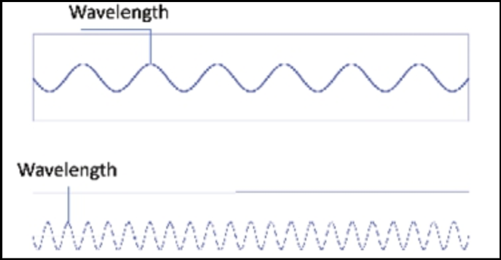

**图 14.3** -- **波长与频率**

随着无线信号传输，其会丢失信号强度（衰减）-- 距离是衰减的主要原因。信号的衰减，以分贝 (dB) 表示。例如，典型的办公室墙壁，将造成 6 分贝的衰减，而混凝土墙壁则会造成 10-15 分贝的衰减。较高频率的信号，不可能比由较低频率天线所产生信号传播得更远。

信号强度以 dBm（分贝毫瓦）度量。越接近 0，那么信号就越好。最不推荐的信号强度是 -67dBm。下图 14.4 显示了一次使用 “Metageek InSSIDer Home” -- 一种在笔记本电脑上运行的免费 WiFi 故障排除工具，测量信号强度的示例。一个无线客户端连接到某个 2.4GHz 的无线网络。

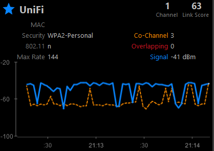

**图 14.4** -- **Metageek InSSIDer Home 的输出**

在上图中，咱们可以看到，他显示了一个 -41dBm 的信号测量值。

### 频率

频率以赫兹（Hz）度量，是某事件在一个时间间隔内发生的次数。频率越高，信号周期在给定时间内发生得月多。频率越低，给定时间内信号周期发生越少。

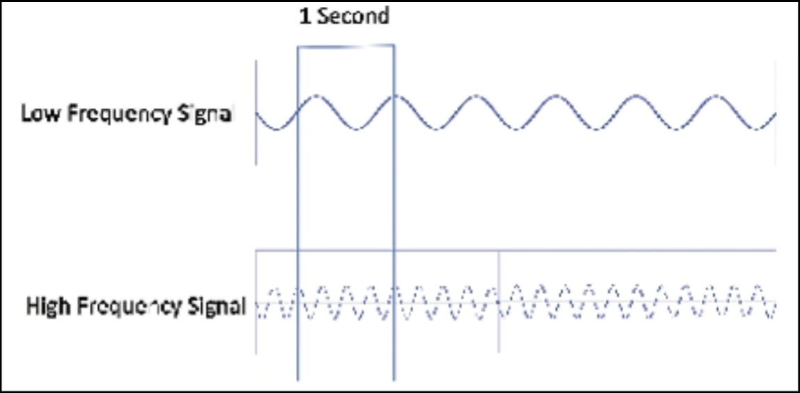

**图 14.5** -- **波长和频率之间的关系**

### 振幅

这是无线信号的强度或功率。在无线网络中，他通常被称为发射振幅或接收振幅。他被定义为（信号/电磁波）离开无线电发射机的初始振幅量。

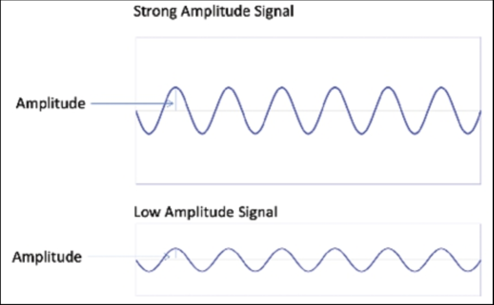

**图 14.6** -- **波的振幅，波幅**

> *知识点*：
>
> - Radio Frequence, RF
>
> - the concept of modern wireless engineering solutions
>
> - underlying electromagnetic terminology
>
> - principles
>
> - the wireless signal
>
> - the electromagnetic waves generated by the wireless antenna
>
> - a wave pattern
>
> - the wavelength is the distance between the peaks or troughs of a wave pattern
>
> - distance is the leading cause of attenuation
>
> - the attenuation of a signal is represented in decidels, dB
>
> - signal strength is measured in dBm, decibel milliwatts
>
> - the least recommended signal strength is -67dBm
>
> - frequence is measured in Hertz, Hz
>
> - the number of times an event occurs within a time interval
>
> - signal cycles
>
> - the strength or power of the wireless signal, amplitude
>
> - the trasmit amplitude
>
> - the received amplitude
>
> - the amount of initial amplitude that leaves the radio transmitter

## 无线电信号的传播

数据会从电信号，被转换为无线电信号，并由天线以无线电波形式传输。影响无线电波传播而需要解决的因素有数种，以避免对传输的任何负面影响。不同材料会以不同方式影响无线电波，取决于他们所具有的特性。

- **吸收** -- 其会消耗波的能量。吸收的效果，便是降低振幅。因此，信号就会更弱，但波长和频率保持不变。

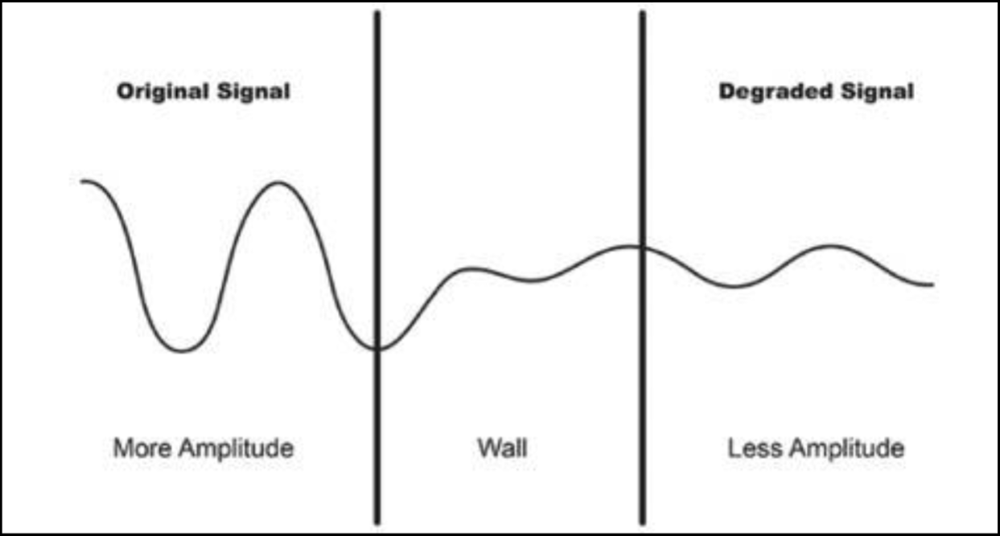

**图 14.7** -- **波的吸收**

- **反射** -- 信号从某种表面反弹。一部分能量被反射，而另一部分可能被传输了。反射取决于材料相对于波长和角度的粗糙度。

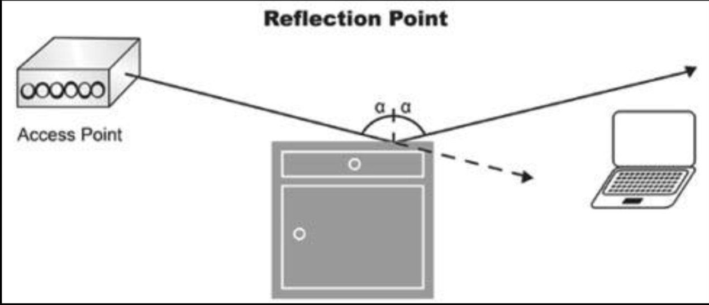

**图 14.8** -- **反射**

- **折射** -- 当波从一种介质传至另一种介质时，折射便会发生，导致某种波改变方向。

**图 14.9** -- **折射**

- **衍射** —— 波绕过某种障碍物的拐角，或穿过某种孔径的弯曲（现象）。

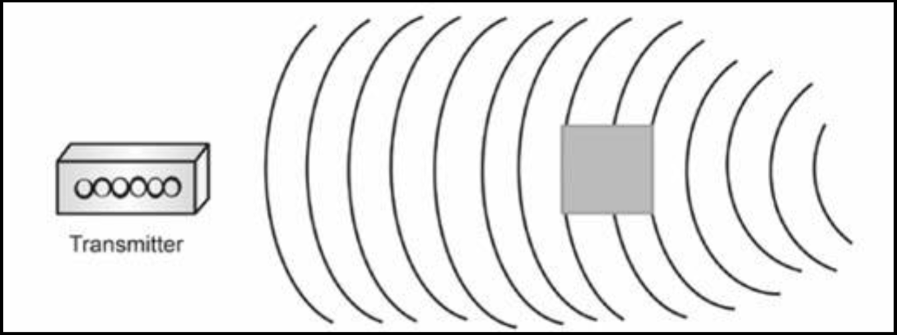

**图 14.10** -- **衍射**

- **极化** -- 他描述了电磁波中电场的方向。他可以是线性的，也可以是圆形的。

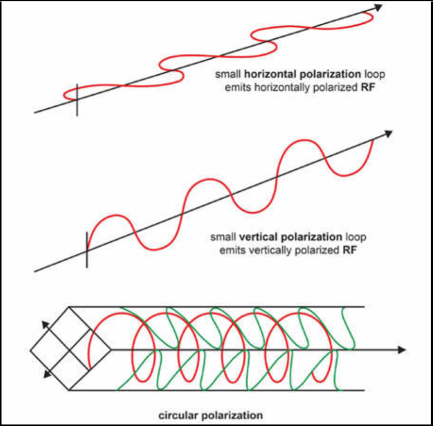

**图 14.11** -- **极化的类型**

- **散射** -- 是指某种粒子由于与另一粒子碰撞后，运动方向的改变。他对较短波长的影响，高于较长波长。

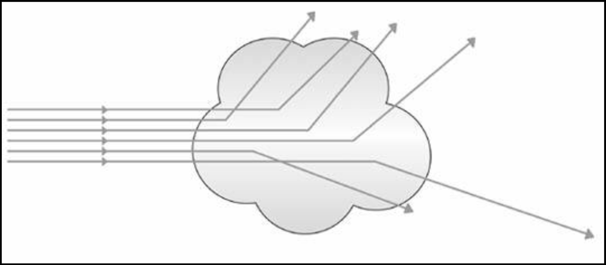

**图 14.12** -- **波的散射**

在规划一次无线网络安装时，咱们应考虑以下因素。这些也称为非 802.11 的干扰。一些专业公司可为咱们，进行一次全面的现场勘查：

- 一些模拟的摄像机
- 微波炉
- 婴儿监视器
- 运动探测器
- 荧光灯
- 无线耳机
- 无线游戏控制器
- 无线摄像机
- 雷达
- 室外微波中继器

## Wi-Fi 信道

为了提供无线的连通性，Wi-Fi 网络以称为频段或频率的两种不同无线电波长运行。Wi-Fi 网络可运行在 2.4GHz 或 5GHz 频段。运行在 2.4GHz 频段的无线网络，相比运行在 5GHz 频段的无线网络，有着范围更广的覆盖，但由于一些别的无线设备也使用 2.4GHz 频段运行，因此他们容易受到干扰。与运行在 2.4GHz 频段的无线网络相比，运行在 5GHz 频段的无线网络具有更高的数据传输速率。

2.4GHz 频段被分为 14 个信道。每个信道为 22 兆赫宽，带有 5 兆赫间隔空间。虽然总共有 14 个可用信道，但大多数国家都有特定的可用信道。这方面的示例，即美国有 11 个可用频道，而日本则有 14 个可用频道。

**表 14.1** -- **14 个 2.4Ghz 频道**

| 信道 | 频率范围（MHz） |
| :-- | :-- |
| 1 | 2401 - 2423 |
| 2 | 2406 - 2428 |
| 3 | 2411 - 2433 |
| 4 | 2416 - 2438 |
| 5 | 2421 - 2443 |
| 6 | 2426 - 2448 |
| 7 | 2431 - 2453 |
| 8 | 2436 - 2458 |
| 9 | 2441 - 2463 |
| 10 | 2446 - 2468 |
| 11 | 2451 - 2473 |
| 12 | 2456 - 2478 |
| 13 | 2461 - 2483 |
| 14 | 2473 - 2495 |

5GHz 频段被分为四个 UNNI 部分，以及一个 ISM 频段。无需授权的国家信息基础设施（U-NII）无线电频段，是由 IEEE 802.11a 的设备，及许多无线互联网服务提供商所使用的无线电频谱的部分。而 ISM 无线电频段，是国际上为电信以外的工业、科学及医疗 (ISM) 目的，保留的无线电频谱部分。
> 资料来源 -- 维基百科
>
> - [Wikipedia: Unlicensed National Information Infrastructure](https://en.wikipedia.org/wiki/Unlicensed_National_Information_Infrastructure)
>
> - [Wikipedia: ISM radio band](https://en.wikipedia.org/wiki/ISM_radio_band)

**表 14.2** -- **UNII/ISM 频率范围**

| UNII/ISM | 频率范围（GHz） |
| :-- | :-- |
| UNNI-1 | 5.15 - 5.25 |
| UNNI-2 | 5.25 - 5.35 |
| UNNI-2 扩展 | 5.470 - 5.725 |
| UNNI-4 | 5.725 - 5.825 |
| ISM | 5.725 - 5.825 |

然后每个部分被划分为若干信道。

**表 14.3** -- **UNNI 的信道**

| UNII | 信道 |
| :-- | :-- |
| UNNI-1 | 36, 40, 44, 48 |
| UNNI-2 | 52, 56, 60, 64 |
| UNNI-2 扩展 | 100, 104, 108, 122, 116, 120, 124, 128, 132, 136, 140, 144|
| UNNI-4 | 149, 153, 157, 161 |
| ISM | 165 |

在规划一次无线网络安装时，建议相邻的无线网络，不要使用同一信道。使用同一信道会造成同信道干扰。下图 14.13 显示了 2.4GHz 频带中的那些非重叠信道。请注意，“非重叠 Wi-Fi 信道” 已列入 CCNA 考试大纲。

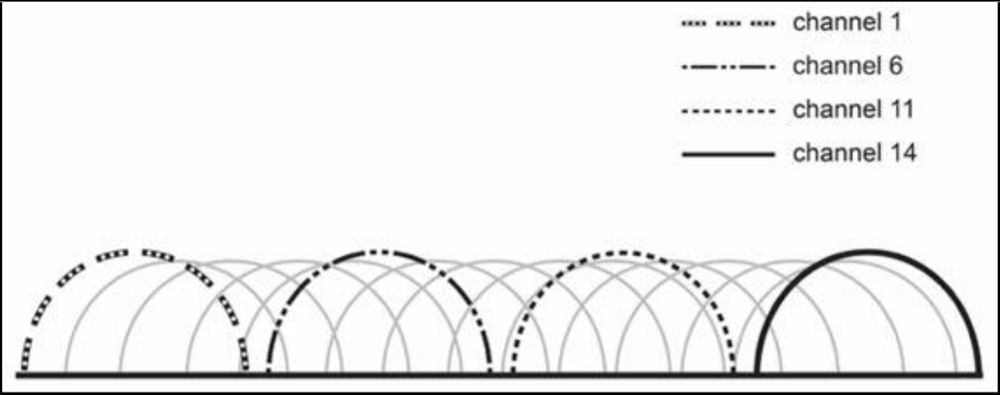

**图 14.13** -- **2.4 GHz 频段中的非重叠信道**

> *知识点*：
>
> - radio signal propagation
>
> - electrical signal
>
> - radio signal
>
> - transimitted by the antenna in the form of radio waves
>
> - any negative impact on transmission
>
> - absorption
>
> - the effect of absorption is to reduce amplitude
>
> - reflection, the signal bounces off a surface
>
> - the roughness of the material relative to the wavelength and the angle
>
> - refraction, causing a wave to change direction
>
> - diffraction, the bending of waves around the corners of an obstacle or through an apertue
>
> - polarization, the orientation of the electric field in an electromagnetic wave. It can be linear or circular
>
> - scattering, the change in the direction of motion of a particle due to collision with another particle
>
> - planning a wireless network installation
>
> - non-802.11 interference
>
> - a full site survery
>
> - Wi-Fi channels
>
> - bands, or frequencies
>
> - are prone to interference
>
> - the 2.4Ghz band is divided into 14 channels, each channel is 22-MHz wide with 5 MHz separation space
>
> - the 5 GHz band is divided into four UNNI Band sections and one ISM Band
>
> - The Unlicensed National Information Infrastructure, U-NII, radio band
>
> - the radio frequence spectrum
>
> - industrial, scientific, and medical, ISM
>
> - telecommunication
>
> - co-channel interference
>
> - the non-overlapping channels in the 2.4GHz band

## 无线监管机构、标准

经由无线介质发送数据，需要射频频谱的使用。虽然各国对特定频率内所允许的发射功率，都有自己的规定，但厂商必须使用一套通用协议，确保发送信息的互操作性。因此，咱们显然需要熟悉监管无线频谱使用的那些特定机构，以及制定了用在无线网络中那些协议的组织。

为了建立某个无线域，所有参与的主机及设备，都需要了解要使用的各种调制技术，而这将定义数据帧应如何编码。这还应包括那些类型的头部，需要包含在数据帧中，以及物理传输机制的类型。所有这些要素，都由电气与电子工程师协会（IEEE）规定。

这就是当今大多数以 802 前缀开头网络协议的原因。其中 80 代表 1980 年，2 表示二月。所有厂商在制造无线设备时，都会遵循 IEEE 802.11 的协议规范族。因此，如今只要使用无线设备，其一层和二层功能，都是由 IEEE 802.11 系列协议定义的。

### IEEE 802.11 的传输

使用典型的 802.11 规范传输信号，均会以与基本的以太网集线器类似方式工作。二者都支持双向通信，使用同一频率发送及接收数据帧，但在某个确切时刻，都只能发送或接收一个信号（半双工的传输）。

802.11 规范是为避免在大多数国家的许可要求而制订的，因此咱们才有了在不用支付任何许可费用下，安装及运行的自由。

下表列出了全球授权最多的无线机构。

**表 14.4** -- **无线（监管）机构**

| 机构 | 目的 | 网站 |
| :-- | :-- | :-- |
| 电气与电子工程师学会 (IEEE)  | 制定并维护运行标准 | www.ieee.org  |
| 联邦通信委员会 (FCC)  | 监管美国国内无线设备的使用 | www.fcc.gov |
| 欧洲电信标准协会 (ETSI) | 授权制定欧洲的共同标准 |  www.etsi.org |
| Wi-Fi 联盟 | 促进和测试 WLAN 互操作性 | www.wi-fi.com |

## 非授权频段

美国联邦通信委员会发布了三个供公众使用的非授权频段 -- 900MHz、2.4GHz 与 5GHz。900MHz 和 2.4GHz 两个频段，被称为 ISM 频段，而 5GHz 频段被称为非授权国家信息基础设施 (UNII) 频段。下图 14.14 显示了这些非授权频段，在射频频谱中的位置。

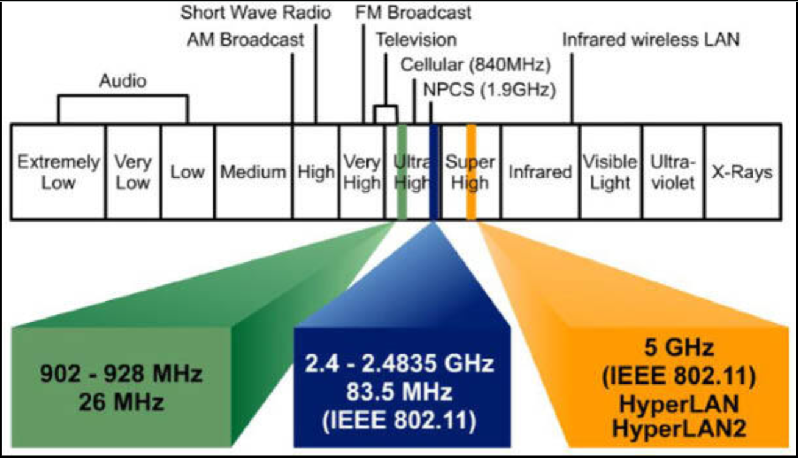

**图 14.14** -- **射频频谱内的非许可频段**（资料来源：[https://www.itu.int/en/ITU-D/Regional-Presence/AsiaPacific/SiteAssets/Pages/Events/2017/Oct2017CIIOT/CIIOT/8.Session3-3%20Bluetooth%20Technology%20and%20Applications-%E6%9D%A8%E6%B3%A2V3.pdf](https://www.itu.int/en/ITU-D/Regional-Presence/AsiaPacific/SiteAssets/Pages/Events/2017/Oct2017CIIOT/CIIOT/8.Session3-3%20Bluetooth%20Technology%20and%20Applications-%E6%9D%A8%E6%B3%A2V3.pdf)）

如上所示，当咱们打算在三个公共频段以外的频率范围上，部署某个无线网络时，那么咱们就需要获得美国联邦通信委员会（FCC），以特定许可证形式颁发的许可。可以预见的是，当 FCC 将这三个频率范围开放给公众后，制造商就就会开始提供充斥市场的全套产品，其中 802.11b/g 便率先成为了当今使用最广泛的无线网络。

IEEE 802.11（无尾字母）是第一个、最初的、标准化的无线局域网，速率为 1Mbps 和 2Mbps，而其运行在 2.4GHz 的无线电频率范围。他于 1997 年获得批准，但直到 1999 年左右 802.11b 正式推出时，我们才看到许多产品出现。除制定了独立文件的  802.11F 和 802.11T 两个委员会外，下表列出的所有委员会，都对最初的 802.11 标准进行了修订。

**表 14.5** -- **IEEE 委员会**

| 委员会 | 目的 |
| :-- | :-- |
| IEEE 802.11a | 54Mbps, 5GHz 标准 |
| IEEE 802.11b | 对 802.11 的一些增强，以支持 5.5 及 11Mbps |
| IEEE 802.11c | 网桥操作程序；包含在 IEEE 802.1d 标准中 |
| IEEE 802.11d | 国际的漫游扩展 |
| IEEE 802.11e | 服务质量与数据包暴发 |
| IEEE 802.11F | 接入点间的协议；组不再活动 |
| IEEE 802.11g | 54Mbps, 2.4GHz 标准（向后兼容 802.11b） |
| IEEE 802.11h | 5GHz 的动态频率选择 (DES) 及发射功率控制 (TPC)。避免雷达干扰 |
| IEEE 802.11i | 增强安全性 |
| IEEE 802.11j | 日本及美国公共安全的扩展 |
| IEEE 802.11k | 无线电资源测量改进 |
| IEEE 802.11m | 标准的维护；零碎工作 |
| IEEE 802.11n | 利用多输入多输出（MIMO）天线，提高吞吐量 |
| IEEE 802.11p | 车载环境下的无线接入（WAVE） |
| IEEE 802.11r | 快速漫游 |
| IEEE 802.11s | ESS 扩展服务集的网状组网 |
| IEEE 802.11T | 无线性能预测 (WPP) |
| IEEE 802.11u | 与非 802 的网络（如蜂窝网络）联网 |
| IEEE 802.11v | 无线网络管理 |
| IEEE 802.11w | 受保护的管理数据帧 |
| IEEE 802.11y | 3650-3700 MHz 在美国内的运行。参考： [Wikipedia: IEEE 802.11y-2008](https://en.wikipedia.org/wiki/IEEE_802.11y-2008) |

下图 14.15 向咱们展示了 802.11 的时间表和其他重要数据。

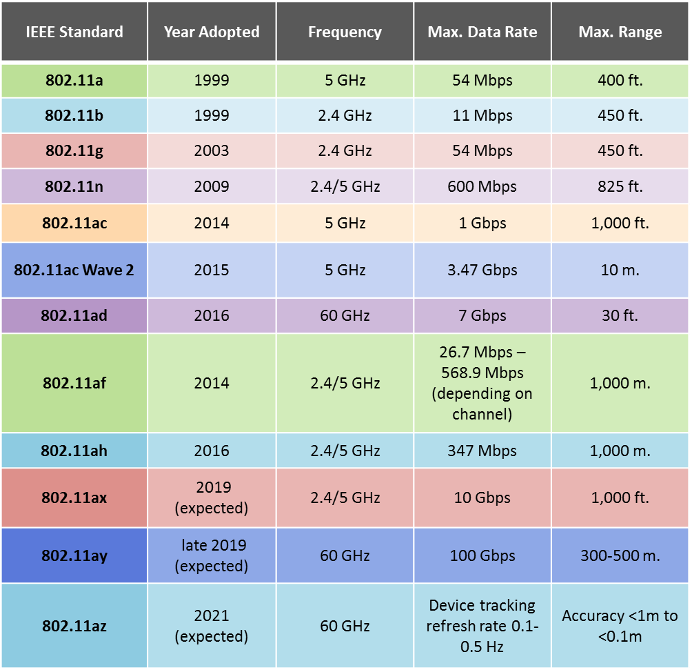

**图 14.15** -- **802.11 时间线**（来源：[cnx-software.com](https://www.cnx-software.com/2018/10/17/qualcomm-qca64x8-qca64x1-802-11ay-wifi-10-gbps-bandwidth/)）

> *知识点*：
>
> - wireless regulation bodies, standards
>
> - the RF spectrum
>
> - transmit power
>
> - a common set of protocols that ensures interoperability
>
> - the specific bodies that regulate the use of the wireless spectrum, as well as the organization that creates the protocols used in the wireless networks
>
> - a wireless domain
>
> - various modulation techniques to use
>
> - how a frame should be encoded
>
> - what types of headers need to be in the frame and types of physical transimission mechanisms
>
> - the Institute of Electrical & Electronics Engineers, IEEE
>
> - the 802 prefix, 80 stands for the year 1980, and 2 represents February
>
> - the IEEE 802.11 family of protocol specifications
>
> - transmitting a signal using the typical 802.11 specification works in a similar fashion to a basic Ethernet hub
>
> - 802.11 specifications were developed to avoid licensing requirements in most countries
>
> - the most globally authorized wireless agencies
>
> - Federal Communication Commission, FCC
>
> - European Telecommunications Standards Institute, ETSI
>
> - Wi-Fi Alliance
>
> - unlicensed bands
>
> - three unlicensed bands for public use -- 900MHz, 2.4GHz and 5 GHz
>
> - the ISM bands, 900MHz and 2.4GHz
>
> - the 5GHz band is known as the Unlicensed National Information Infrastructure(UNII) band
>
> - a specific license from the FCC(USA)
>
> - IEEE 802.11, the first, original, standardized WLAN at 1Mbps and 2Mbps, ran in the 2.4GHz radio frequence rang, ratified in 1997
>
> - bridge operation procedures
>
> - international roaming extensions
>
> - quality of service, QoS
>
> - packet bursting
>
> - Inter-Access Point Protocol
>
> - Dynamic Frequence Selection, DFS
>
> - Transmit Power Control, TPC
>
> - avoids radar interference
>
> - multiple input, multiple output antennas, MIMO antennas
>
> - Wireless Access in Vehicular Environment, WAVE
>
> - fast roaming
>
> - Extended Service Set(ESS) Mesh Networking
>
> - Wireless Performance Prediction, WPP

## 无线数据帧

无线网络设备以类似于以太网集线器的方式运行。单个冲突域被创建。当两台主机试图于同一时刻传输数据帧时，那么冲突将发生，而数据帧则将被丢弃。

数据帧传输必须加以控制。分布式协调功能（DCF），是在数据链路层处，用到的一种通用介质访问方法 -- 这正是专为这一目的设计的工具。之所以称为 “分布式”，是因为这项工作通常由每台设备处理。

当某一主机打算向正使用频率上传输时，该主机必须等待该频率上出现静默，确保任何多路径问题得以避免。该主机必须等待的时间长短不一，取决于数据帧的优先级。

当有主机需要发送高优先级的数据帧时，那么短数据帧间距（SIFS）将用于倒计时等待发送的时间。通常情况下，所有数据帧都会以低优先级发送，这也是 DCF 网络所使用的方式。在 DCF 的协调下，站点在发送前务必等待的时长，由分布式的数据帧间空间（DIFS）决定。

## CSMA/CA

无线 802.11 网络，使用了带冲突避免的载波侦测多路访问（CSMA/CA）。当主机需要发送某个数据帧时，他会挑选 0 到 31 之间的某个随机数，然后开始倒计时。每种类型的 802.11 网络，都有着不同的倒计时速度，或插槽/间隙时间。比如，802.11b 会以 20 微秒间隔倒计时；802.11g 和 802.11a 则以 9 微秒间隔倒计时，而就像以太网半双工中的情形一样，我们称之为退避计时器。

其间有个竞争窗口，其为主机在传送前，要等待的总时间，由累计倒计时时间，加上其等待别的主机停止传送的时间构成。无线主机必须监听，确保没有其他主机在该频率上传输，以防止碰撞。当另一主机正在传输时，发送主机必须停止倒计时，直到介质清空，且在其可再次开始倒计时前，其他主机已停止发送。然后，他便可最终开始传送到该频率上。

整个 CSMA/CA 过程，如下图 14.16 中所示。

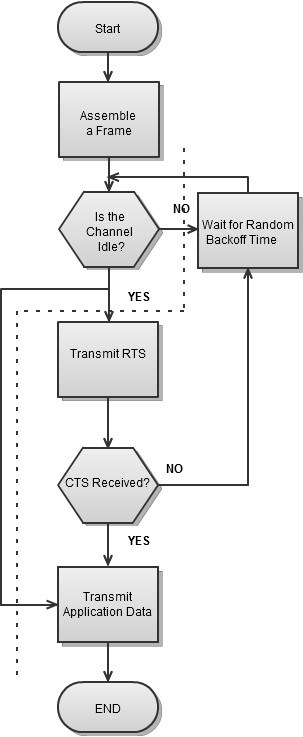

**图 14.16** -- **CSMA/CA 数据帧传输过程**

### 三种数据帧类型

所有 802.11 帧都有着类似的结构 -- 与 802.3 以太网数据帧相比，他们的头部更长而有着更多控制信息。这是因为相比 802.3 网络，802.11 必须假定会有干扰，以及更多冲突要与之抗衡。

下图 14.17 显示了 802.11 的数据帧结构。

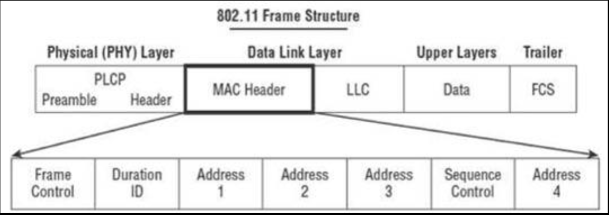

**图 14.17** -- **802.11 数据帧结构**

如下所示，三种类型的数据帧，共用了同一头部形式，但指示符有所不同。主要区别在于他们的主体中。数据帧控制字段内部，有三种主要的数据帧类型。

- **管理** -- 这些数据帧作用是帮助管理连接。数据帧控制字段的 “类型” 部分，显示为 “管理”，进而这些类型就包括信标、探针及认证方式等；
- **控制数据帧** -- 这些帧的目的，是帮助在网络介质上进行通信。例如，请求发送（RTS）数据帧，就会与控制数据帧一起使用；
- **数据数据帧** -- 这种类型的数据帧，包含着信息数据包，因此得名，但也可以是空帧或 null 帧，通常称为 null 功能。

下图 14.18 显示了一次带有扩展了数据控制字段的 Wireshark 数据帧捕获。捕获到的数据帧类型，是个数据数据帧。

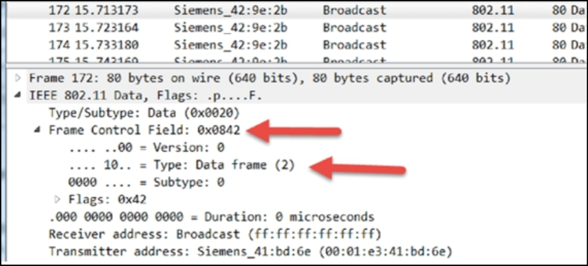

**图 14.18** -- **802.11 的数据数据帧**

下图 14.19 显示一次控制数据帧的捕获。

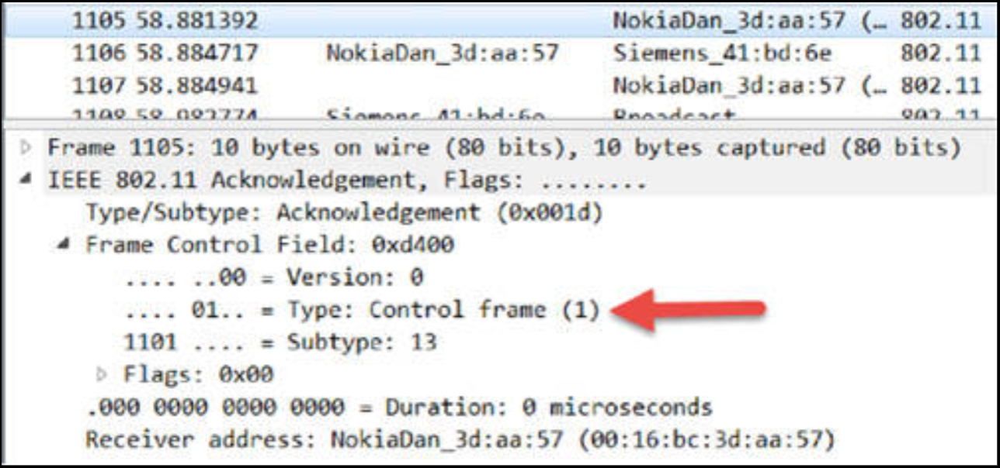

**图 14.19** -- **802.11 的控制数据帧**

下表描述了 802.11 网络下用到的各种数据帧类型。

**表 14.6** -- **802.11 的数据帧**

| 管理数据帧 | 控制数据帧 | 数据数据帧 |
| :-- | :-- | :-- |
| 协调请求 | 请求发送（RTS） | 数据 |
| 协调响应 | 清除发送（CTS） | 数据及 CF-确认 |
| 重关联请求 | 确认 (ACK) | 数据及 CF-轮询 |
| 重关联响应 | 省电轮询 | 数据及 CF-确认 与 CF-轮询 |
| 探针请求 | 无竞争信标（CF-结束） | Null |
| 信标 |  | 无数据的 CF-轮询 |
| ATIM |  | 无数据的 CF-确认 及 CF-轮询 |
| 解关联 |  |  |
| 认证 |  |  |
| 解除认证 |  |  |

花些时间学习如何使用 Wireshark 软件捕获数据包，以便咱们对 TCP/IP 与数据帧类型有深入了解，是相当值得的。请访问 [howtonetwork.com](https://www.howtonetwork.com/)，了解 WCNA Wireshark 的课程。

> *知识点*：
>
> - a single collision domain
>
> - the transmission of frames
>
> - the Distributed Coordination Function, DCF, is a common media access method that is used at the Data Link Layer, this job is usually handled by each device
>
> - tansmit onto the frequence being used
>
> - silence on the frequence
>
> - multipath issues
>
> - the priority of the frame
>
> - Short Interframe Space, SIFS
>
> - count down the period of time to wait before transmitting
>
> - the length of time a station has to wait before trasmitting
>
> - Distributed Interframe Space, DIFS
>
> - Carrier Sense Multiple Access with Collision Avoidence, CSMA/CA
>
> - a random number between 0 and 31
>
> - countdown speed
>
> - slot time
>
> - 802.11b counts down in 20-microsecond intervals
>
> - 802.11g and 802.11a can count down in 9-microsecond intervals
>
> - the back-off timer
>
> - a contention window, the total time for a host to wait before transmitting, consists of the accumulated countdown time plus the time it waited for other hosts to stop trasmitting
>
> - indicators
>
> - the Frame Control field
>
> - three types of frames: Management frames, Control Frames and Data Frames
>
> - the "type" section of the Frame Control field
>
> - Request to Send, RTS, frames
>
> - an empty or a null frame, a null function
>
> - Association Request
>
> - Association Response
>
> - Reassociation Request
>
> - Reassociation Response
>
> - Probe Request
>
> - Beacon
>
> - Announcement Traffic Indication Message, ATIM. Reference: [TIM/DTIM/ATIM](https://dot11ap.wordpress.com/timdtimatim/)
>
> - Disassociate
>
> - Authentication
>
> - Deauthentication
>
> - Request to Send, RTS
>
> - Clear to Send, CTS
>
> - Acknowledgement, ACK
>
> - Power-Save Poll
>
> - Contention-Free End Beacon, CF-End
>
> - Contention-Free  Acknowledgement Beacon, CF-ACK
>
> - Contention-Free Poll Beacon, CF-Poll

## Wi-Fi 天线

天线的主要功能，是将电信号转换为射频波，然后发射他们（作为发射器），并接收射频波，并将其转换为电信号（作为接收器）。天线的物理特性，包括决定了天线可发送与接收电波频率的尺寸及材料。由天线发射的电波，称为 “电场”。

天线会创建辐射方向图（辐射模式），其将由天线辐射出的功率变化，定义为远离天线方向的一个函数。这种功率变化，是在天线的远场观察到的到达角的一个函数。

辐射方向图（模式）有两种视图。一种磁场或 H 平面的视图，描绘了当咱们从顶部俯视时的情况，展示了信号是如何向前、后、左、右辐射，但不是向上或向下。电场或 E 平面，或仰角图，显示了是当咱们站在天线旁边，看到的图案（模式）。E 平面视图，演示了信号向前、后、上、下辐射，而不是左右辐射。下图 14.20 描述了辐射方向图（模式）的 E 平面和 H 平面视图。

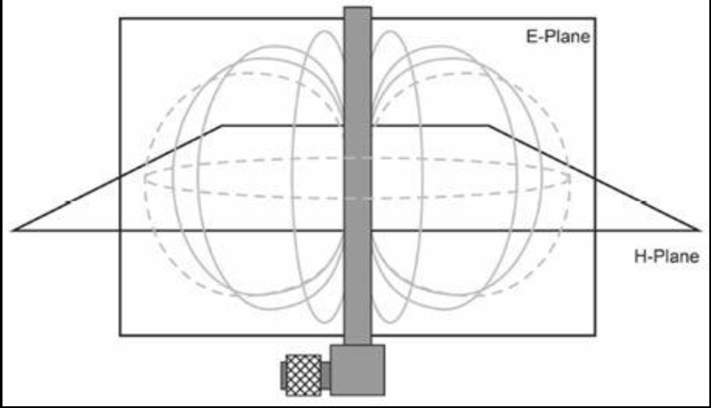

**图 14.20** -- **E 平面和 H 平面**

辐射方位图以 dBi 度量。最强点可在天线的正前方测量到，值为 0dB。辐射随后会穿过空气到另一天线，在那里信号会减弱，直到以 -xdB 的值到达某个远端点位。

### 天线特性

了解天线的一些特性，及可用类型很有必要。

- *极化*

    所谓极化，描述了基于天线位置而从该天线发出的电场。天线可以三种不同的方式移动 -- 垂直（最常见的天线类型），其中电波以线性形式上下移动；水平极化，其中电波以线性形式左右移动；环形极化，即电波向前移动。

    这里的要点，是（发射/接收）两端的极化类型必须一致，以避免信号衰减。

- *天线分集*

    在多路径情形下，主信号和反射信号到达远程天线时相位不一致，而这会导致信号衰减。为了解决这一问题，大多数接入点厂商都会通过在设备上安装两根天线，实现天线分集。当接入点接收到来自某个无线站点的数据帧时，他会使用该数据帧的前导码，同时测试这两根天线，并自动将该数据帧的其余部分，切换到信号最佳的天线。

+ *天线类型*

    辐射方位图决定了天线类型，其主要分为三大类，他们影响着根据现场勘测，选择合适天线的决策。

    可用于无线局域网的主要有三种天线类型：全向、半定向及高定向。

    - *全向型*

        全向天线会在所有方向发送同一强度的信号。他在垂直于方位角方向的所有方向上辐射同等功率，功率随与仰角的夹角变化而变化，在轴线上衰减为零。下图 14.21 显示了全向天线的辐射方位图（模式）。根据使用情形，这种辐射方位图（模式）可以是偶极子、吊顶安装、桅杆安装及双贴片等。

        

        (图片：《电动力学导论》，D. Griffiths 著，第 4 版）

    - *半定向天线*

        他会辐射信号，只是不像高定向天线那样极端。这些天线可用于我们需要覆盖某一方向而忽略其他方向的情形种。

    - **高指向性**

        高指向性的天线，会将波束聚焦发挥到极致。波束被极为紧密聚焦，因此其会给到咱们极远距离。他通常用于点对点的链路，例如两座建筑物之间。他们能在远距离上辐射很窄的波束，而通常用于专用链路。该辐射方位图（模式）最好描述为主瓣朝向接收器的抛物线。

        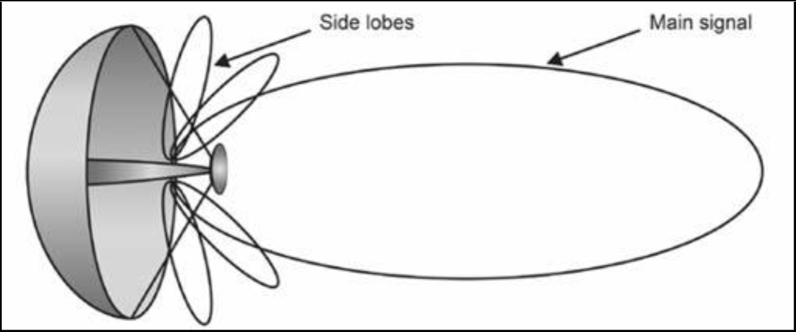

        **图 14.22** -- **高指向性的抛物面碟形天线**

> *知识点*：
>
> - Wi-Fi antennas
>
> - to convert electrical signals to RF waves and then trasmit them(as a transmitter), and receive RF waves and convert them to electrical signals(as a receiver)
>
> - the physical characteristics of the antenna include dimensions and meterials
>
> - the frequence at which the antenna can send and receive waves
>
> - the waves emitted by the antenna, are called "electrical fields"
>
> - a radiation pattern
>
> - the variation of the power radiated by the antenna as a function of the direction away from the antenna
>
> - a function of the angle of arrivals is observed in the far field of the antenna
>
> - two views of the radiation pattern
>
> - the magnetizing field or H-plane, looking down on it from the top, the signal radiates ahead, behind, left and right, but not up or down
>
> - the electric field or E-plane, or the elevation chart, see if we were standing beside the antenna, the signal radiates ahead, behind, up and down, but not left and right
>
> - the radiated pattern is measured in dBi
>
> - polarization, describes the electrical field emitted from the antenna based on antenna position
>
> - vertical polarization, the waves move up and down in linear form
>
> - horizontal polarization, the waves move left and right in linear form
>
> - circular polarization, the waves moves forward
>
> - the main signal and reflected signals arrived at the remote antenna out-of-phase, causes signal degradation
>
> - implement antenna diversity by placing two antennas on the device
>
> - AP uses the preamble of the frame, to test both antennas and automatically switches the rest of the frame to the antenna whith the best signal
>
> - the radiation pattern determines the antenna types
>
> - Omnidirectional anttena, sends a signal of the same strength in all directions, radiates equal power in all directions, perpendicular to an azimuthal direction, with power verying with the angle to the elevation angle, declining to zero on the axis
>
> - the radiation pattern based on the use case, can be dipole, ceiling mount, mast mount, and dual patch
>
> - Semi Directional Antenna, radiates the signal just not as extemely as it would with a highly directional antenna, can be used in situations where we need to cover a certain direction and ignore other directions
>
> - Highly Directional antennas, take beam focusing to its extreme. The beam is very tightly focused, gives us some great range, used for point-to-point links, e.g., between two buildings.
>
> - a parabola with its major lobes facing the antenna
>
> - Highly Directional Parabolic Dish Antenna
