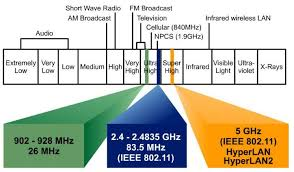

# 无线原理

## 射频

为了理解现代无线工程解决方案的概念，就有必要了解一些基本电磁学术语，及这些方案所依据的原理。考试大纲中提到一个术语便是 RF，其是 Radio Frequence 射频的缩写。

无线信号实际上源自由无线天线产生的电磁波。这种信号在正负电压之间变化，而形成某种波形。所谓波长，是波形中波峰或波谷之间的距离。波长由频率与电磁波决定。频率越高，波长越小。频率越低，波长越长。

**图 14.3** -- **波长与频率**

随着无线信号传输，其会丢失信号强度（衰减）-- 距离是衰减的主要原因。信号的衰减，以分贝 (dB) 表示。例如，典型的办公室墙壁，将造成 6 分贝的衰减，而混凝土墙壁则会造成 10-15 分贝的衰减。较高频率的信号，不可能比由较低频率天线所产生信号传播得更远。

信号强度以 dBm（分贝毫瓦）度量。越接近 0，那么信号就越好。最不推荐的信号强度是 -67dBm。下图 14.4 显示了一次使用 “Metageek InSSIDer Home” -- 一种在笔记本电脑上运行的免费 WiFi 故障排除工具，测量信号强度的示例。一个无线客户端连接到某个 2.4GHz 的无线网络。

**图 14.4** -- **Metageek InSSIDer Home 的输出**

在上图中，咱们可以看到，他显示了一个 -41dBm 的信号测量值。

### 频率

频率以赫兹（Hz）度量，是某事件在一个时间间隔内发生的次数。频率越高，信号周期在给定时间内发生得月多。频率越低，给定时间内信号周期发生越少。

**图 14.5** -- **波长和频率之间的关系**

### 振幅

这是无线信号的强度或功率。在无线网络中，他通常被称为发射振幅或接收振幅。他被定义为（信号/电磁波）离开无线电发射机的初始振幅量。

**图 14.6** -- **波的振幅，波幅**

> *知识点*：
>
> - Radio Frequence, RF
>
> - the concept of modern wireless engineering solutions
>
> - underlying electromagnetic terminology
>
> - principles
>
> - the wireless signal
>
> - the electromagnetic waves generated by the wireless antenna
>
> - a wave pattern
>
> - the wavelength is the distance between the peaks or troughs of a wave pattern
>
> - distance is the leading cause of attenuation
>
> - the attenuation of a signal is represented in decidels, dB
>
> - signal strength is measured in dBm, decibel milliwatts
>
> - the least recommended signal strength is -67dBm
>
> - frequence is measured in Hertz, Hz
>
> - the number of times an event occurs within a time interval
>
> - signal cycles
>
> - the strength or power of the wireless signal, amplitude
>
> - the trasmit amplitude
>
> - the received amplitude
>
> - the amount of initial amplitude that leaves the radio transmitter

## 无线电信号的传播

数据会从电信号，被转换为无线电信号，并由天线以无线电波形式传输。影响无线电波传播而需要解决的因素有数种，以避免对传输的任何负面影响。不同材料会以不同方式影响无线电波，取决于他们所具有的特性。

- **吸收** -- 其会消耗波的能量。吸收的效果，便是降低振幅。因此，信号就会更弱，但波长和频率保持不变。

**图 14.7** -- **波的吸收**

- **反射** -- 信号从某种表面反弹。一部分能量被反射，而另一部分可能被传输了。反射取决于材料相对于波长和角度的粗糙度。

**图 14.8** -- **反射**

- **折射** -- 当波从一种介质传至另一种介质时，折射便会发生，导致某种波改变方向。

**图 14.9** -- **折射**

- **衍射** —— 波绕过某种障碍物的拐角，或穿过某种孔径的弯曲（现象）。

**图 14.10** -- **衍射**

- **极化** -- 他描述了电磁波中电场的方向。他可以是线性的，也可以是圆形的。

**图 14.11** -- **极化的类型**

- **散射** -- 是指某种粒子由于与另一粒子碰撞后，运动方向的改变。他对较短波长的影响，高于较长波长。

**图 14.12** -- **波的散射**

在规划一次无线网络安装时，咱们应考虑以下因素。这些也称为非 802.11 的干扰。一些专业公司可为咱们，进行一次全面的现场勘查：

- 一些模拟的摄像机
- 微波炉
- 婴儿监视器
- 运动探测器
- 荧光灯
- 无线耳机
- 无线游戏控制器
- 无线摄像机
- 雷达
- 室外微波中继器

## Wi-Fi 信道

为了提供无线的连通性，Wi-Fi 网络以称为频段或频率的两种不同无线电波长运行。Wi-Fi 网络可运行在 2.4GHz 或 5GHz 频段。运行在 2.4GHz 频段的无线网络，相比运行在 5GHz 频段的无线网络，有着范围更广的覆盖，但由于一些别的无线设备也使用 2.4GHz 频段运行，因此他们容易受到干扰。与运行在 2.4GHz 频段的无线网络相比，运行在 5GHz 频段的无线网络具有更高的数据传输速率。

2.4GHz 频段被分为 14 个信道。每个信道为 22 兆赫宽，带有 5 兆赫间隔空间。虽然总共有 14 个可用信道，但大多数国家都有特定的可用信道。这方面的示例，即美国有 11 个可用频道，而日本则有 14 个可用频道。

**表 14.1** -- **14 个 2.4Ghz 频道**

| 信道 | 频率范围（MHz） |
| :-- | :-- |
| 1 | 2401 - 2423 |
| 2 | 2406 - 2428 |
| 3 | 2411 - 2433 |
| 4 | 2416 - 2438 |
| 5 | 2421 - 2443 |
| 6 | 2426 - 2448 |
| 7 | 2431 - 2453 |
| 8 | 2436 - 2458 |
| 9 | 2441 - 2463 |
| 10 | 2446 - 2468 |
| 11 | 2451 - 2473 |
| 12 | 2456 - 2478 |
| 13 | 2461 - 2483 |
| 14 | 2473 - 2495 |

5GHz 频段被分为四个 UNNI 部分，以及一个 ISM 频段。无需授权的国家信息基础设施（U-NII）无线电频段，是由 IEEE 802.11a 的设备，及许多无线互联网服务提供商所使用的无线电频谱的部分。而 ISM 无线电频段，是国际上为电信以外的工业、科学及医疗 (ISM) 目的，保留的无线电频谱部分。
> 资料来源 -- 维基百科
>
> - [Wikipedia: Unlicensed National Information Infrastructure](https://en.wikipedia.org/wiki/Unlicensed_National_Information_Infrastructure)
>
> - [Wikipedia: ISM radio band](https://en.wikipedia.org/wiki/ISM_radio_band)

**表 14.2** -- **UNII/ISM 频率范围**

| UNII/ISM | 频率范围（GHz） |
| :-- | :-- |
| UNNI-1 | 5.15 - 5.25 |
| UNNI-2 | 5.25 - 5.35 |
| UNNI-2 扩展 | 5.470 - 5.725 |
| UNNI-4 | 5.725 - 5.825 |
| ISM | 5.725 - 5.825 |

然后每个部分被划分为若干信道。

**表 14.3** -- **UNNI 的信道**

| UNII | 信道 |
| :-- | :-- |
| UNNI-1 | 36, 40, 44, 48 |
| UNNI-2 | 52, 56, 60, 64 |
| UNNI-2 扩展 | 100, 104, 108, 122, 116, 120, 124, 128, 132, 136, 140, 144|
| UNNI-4 | 149, 153, 157, 161 |
| ISM | 165 |

在规划一次无线网络安装时，建议相邻的无线网络，不要使用同一信道。使用同一信道会造成同信道干扰。下图 14.13 显示了 2.4GHz 频带中的那些非重叠信道。请注意，“非重叠 Wi-Fi 信道” 已列入 CCNA 考试大纲。

**图 14.13** -- **2.4 GHz 频段中的非重叠信道**

> *知识点*：
>
> - radio signal propagation
>
> - electrical signal
>
> - radio signal
>
> - transimitted by the antenna in the form of radio waves
>
> - any negative impact on transmission
>
> - absorption
>
> - the effect of absorption is to reduce amplitude
>
> - reflection, the signal bounces off a surface
>
> - the roughness of the material relative to the wavelength and the angle
>
> - refraction, causing a wave to change direction
>
> - diffraction, the bending of waves around the corners of an obstacle or through an apertue
>
> - polarization, the orientation of the electric field in an electromagnetic wave. It can be linear or circular
>
> - scattering, the change in the direction of motion of a particle due to collision with another particle
>
> - planning a wireless network installation
>
> - non-802.11 interference
>
> - a full site survery
>
> - Wi-Fi channels
>
> - bands, or frequencies
>
> - are prone to interference
>
> - the 2.4Ghz band is divided into 14 channels, each channel is 22-MHz wide with 5 MHz separation space
>
> - the 5 GHz band is divided into four UNNI Band sections and one ISM Band
>
> - The Unlicensed National Information Infrastructure, U-NII, radio band
>
> - the radio frequence spectrum
>
> - industrial, scientific, and medical, ISM
>
> - telecommunication
>
> - co-channel interference
>
> - the non-overlapping channels in the 2.4GHz band

## 无线监管机构、标准

经由无线介质发送数据，需要射频频谱的使用。虽然各国对特定频率内所允许的发射功率，都有自己的规定，但厂商必须使用一套通用协议，确保发送信息的互操作性。因此，咱们显然需要熟悉监管无线频谱使用的那些特定机构，以及制定了用在无线网络中那些协议的组织。

为了建立某个无线域，所有参与的主机及设备，都需要了解要使用的各种调制技术，而这将定义数据帧应如何编码。这还应包括那些类型的头部，需要包含在数据帧中，以及物理传输机制的类型。所有这些要素，都由电气与电子工程师协会（IEEE）规定。

这就是当今大多数以 802 前缀开头网络协议的原因。其中 80 代表 1980 年，2 表示二月。所有厂商在制造无线设备时，都会遵循 IEEE 802.11 的协议规范族。因此，如今只要使用无线设备，其一层和二层功能，都是由 IEEE 802.11 系列协议定义的。

### IEEE 802.11 的传输

使用典型的 802.11 规范传输信号，均会以与基本的以太网集线器类似方式工作。二者都支持双向通信，使用同一频率发送及接收数据帧，但在某个确切时刻，都只能发送或接收一个信号（半双工的传输）。

802.11 规范是为避免了在大多数国家的许可要求而制订的，因此咱们才有了在不用支付任何许可费用下，安装及运行的自由。

下表列出了全球授权最多的无线机构。

**表 14.4** -- **无线（监管）机构**

| 机构 | 目的 | 网站 |
| :-- | :-- | :-- |
| 电气与电子工程师学会 (IEEE)  | 制定并维护运行标准 | www.ieee.org  |
| 联邦通信委员会 (FCC)  | 监管美国国内无线设备的使用 | www.fee.gov |
| 欧洲电信标准协会 (ETSI) | 授权制定欧洲的共同标准 |  www.etsi.org |
| Wi-Fi 联盟 | 促进和测试 WLAN 互操作性 | www.wi-fi.com |

## 非授权频段

美国联邦通信委员会发布了三个供公众使用的非授权频段 -- 900MHz、2.4GHz 与 5GHz。900MHz 和 2.4GHz 两个频段，被称为 ISM 频段，而 5GHz 频段被称为非授权国家信息基础设施 (UNII) 频段。下图 14.14 显示了这些非授权频段，在射频频谱中的位置。

**图 14.14** -- **射频频谱内的非许可频段**（资料来源：[https://www.itu.int/en/ITU-D/Regional-Presence/AsiaPacific/SiteAssets/Pages/Events/2017/Oct2017CIIOT/CIIOT/8.Session3-3%20Bluetooth%20Technology%20and%20Applications-%E6%9D%A8%E6%B3%A2V3.pdf](https://www.itu.int/en/ITU-D/Regional-Presence/AsiaPacific/SiteAssets/Pages/Events/2017/Oct2017CIIOT/CIIOT/8.Session3-3%20Bluetooth%20Technology%20and%20Applications-%E6%9D%A8%E6%B3%A2V3.pdf)）

如上所示，当咱们打算在三个公共频段以外的频率范围上，部署某个无线网络时，那么咱们就需要获得美国联邦通信委员会（FCC），以特定许可证形式颁发的许可。可以预见的是，当 FCC 将这三个频率范围开放给公众后，制造商就就会开始提供充斥市场的全套产品，其中 802.11b/g 便率先成为了当今使用最广泛的无线网络。

IEEE 802.11（无尾字母）是第一个、最初的、标准化的无线局域网，速率为 1Mbps 和 2Mbps，而其运行在 2.4GHz 的无线电频率范围。他于 1997 年获得批准，但直到 1999 年左右 802.11b 正式推出时，我们才看到许多产品出现。除制定了独立文件的  802.11F 和 802.11T 两个委员会外，下表列出的所有委员会，都对最初的 802.11 标准进行了修订。

**表 14.5** -- **IEEE 委员会**

| 委员会 | 目的 |
| :-- | :-- |
| IEEE 802.11a | 54Mbps, 5GHz 标准 |
| IEEE 802.11b | 对 802.11 的一些增强，以支持 5.5 及 11Mbps |
| IEEE 802.11c | 网桥操作程序；包含在 IEEE 802.1d 标准中 |
| IEEE 802.11d | 国际的漫游扩展 |
| IEEE 802.11e | 服务质量与数据包暴发 |
| IEEE 802.11F | 接入点间的协议；组不再活动 |
| IEEE 802.11g | 54Mbps, 2.4GHz 标准（向后兼容 802.11b） |
| IEEE 802.11h | 5GHz 的动态频率选择 (DES) 及发射功率控制 (TPC)。避免雷达干扰 |
| IEEE 802.11i | 增强安全性 |
| IEEE 802.11j | 日本及美国公共安全的扩展 |
| IEEE 802.11k | 无线电资源测量改进 |
| IEEE 802.11m | 标准的维护；零碎工作 |
| IEEE 802.11n | 利用多输入多输出（MIMO）天线，提高吞吐量 |
| IEEE 802.11p | 车载环境下的无线接入（WAVE） |
| IEEE 802.11r | 快速漫游 |
| IEEE 802.11s | ESS 扩展服务集的网状组网 |
| IEEE 802.11T | 无线性能预测 (WPP) |
| IEEE 802.11u | 与非 802 的网络（如蜂窝网络）联网 |
| IEEE 802.11v | 无线网络管理 |
| IEEE 802.11w | 受保护的管理数据帧 |
| IEEE 802.11y | 3650-3700 MHz 在美国内的运行。参考： [Wikipedia: IEEE 802.11y-2008](https://en.wikipedia.org/wiki/IEEE_802.11y-2008) |

