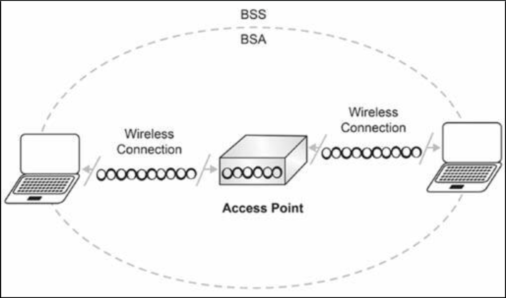
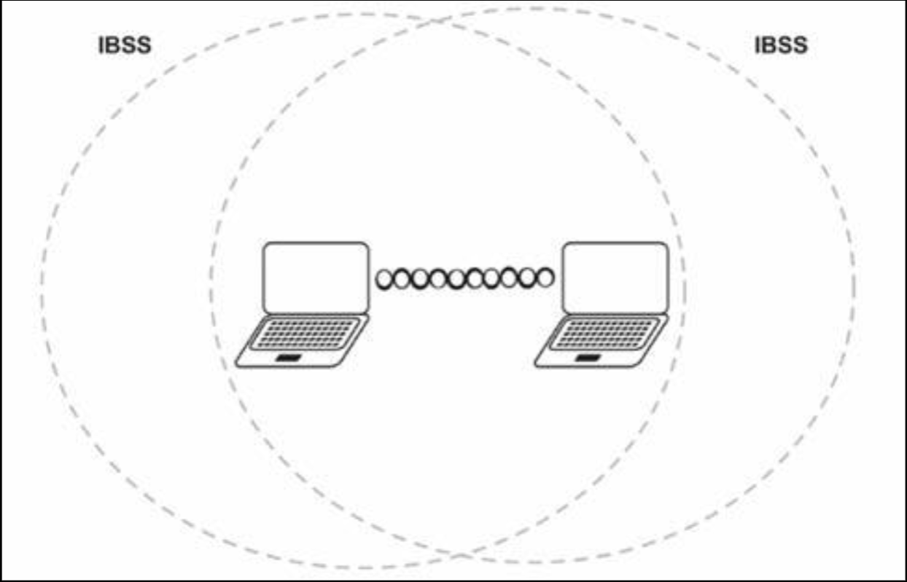
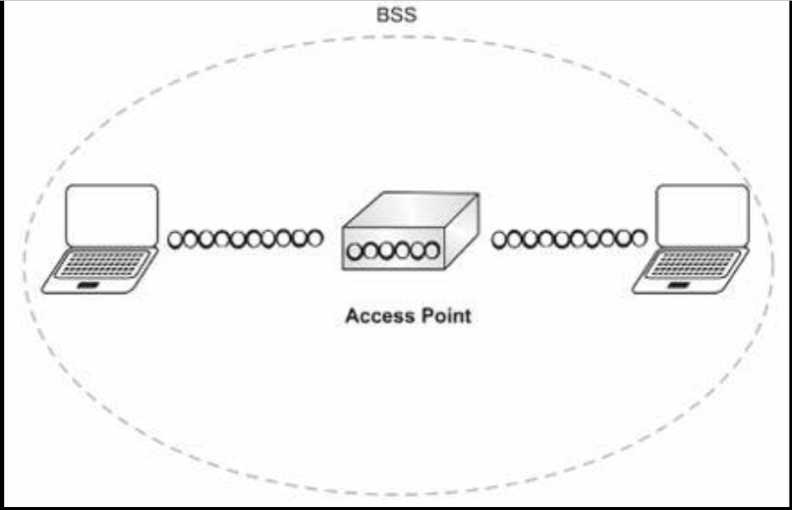
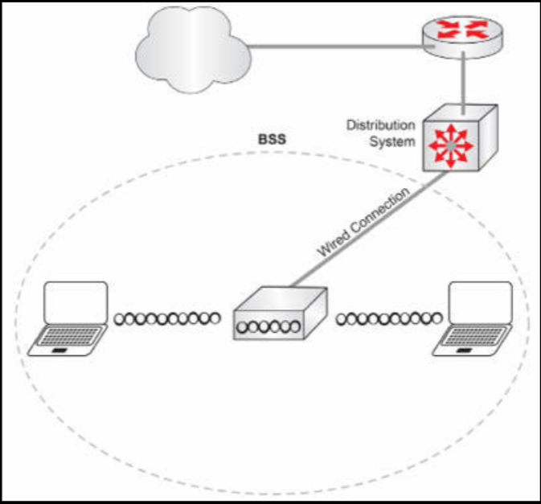
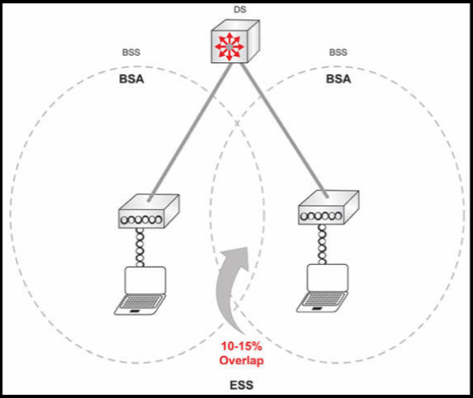
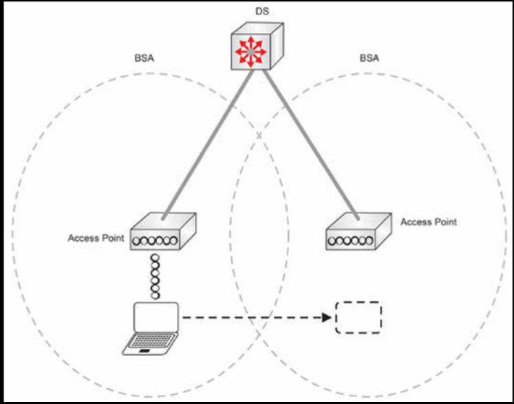
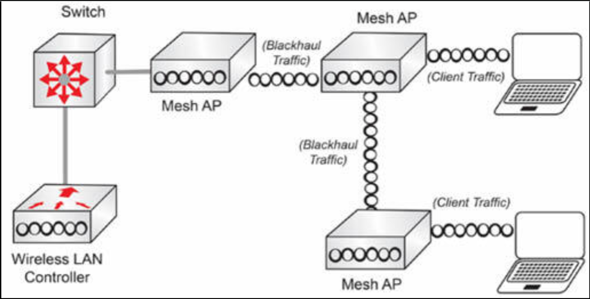
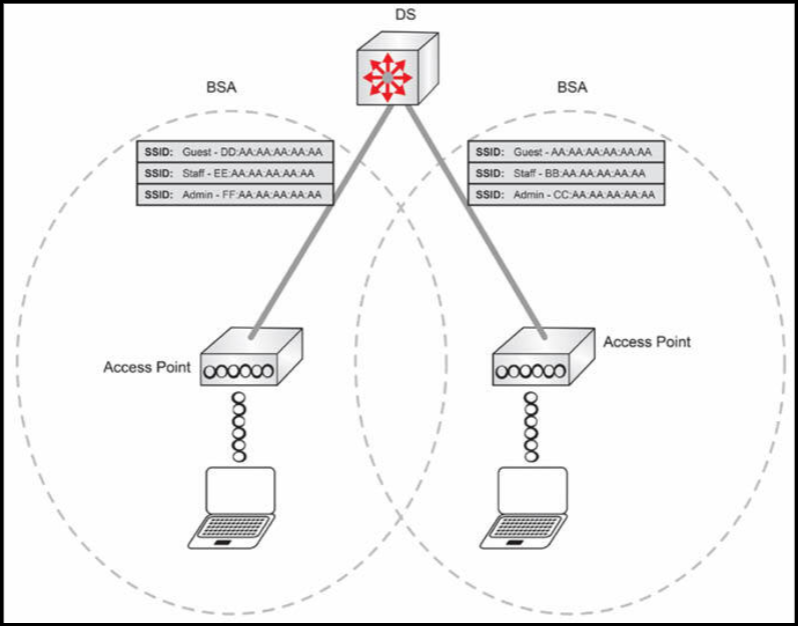

# 无线拓扑结构

无线拓扑的基本组件，是基本业务集 (BSS)，其由接入点与连接到同一无线介质的无线站组成，而基本服务区 (BSA) ，则是由其无线电信号所覆盖的区域。这在下图 14.23 中得以演示。

**图 14.23** -- **基本业务集**

802.11 标准定义了两种类型的 BSS 拓扑：独立基本业务集 (IBSS) ，和基础设施 BSS。

## 独立基本业务集

IBSS 属于一种不包含接入点的自组织网络。Ad-hoc 自组织的网络，会形成一个用于在两个无线客户端之间传输数据的点对点连接。最常见的示例，是一台笔记本电脑经由无线介质与另一笔记本电脑通信，如下图 14.24 中所示。

**图 14.24** -- **独立基本业务集**

## 基础设施 BSS

在基础设施的基本业务集下，客户端使用维护该基本业务集的一台中心化设备，连接到无线网络，如下图 14.25 中所示。

**图 14.25** -- **基础设施基本业务集**

与有线网络相比，接入点就像个集线器。他提供了二层连通性给所有连接的设备，并以半双工方式运行。不过，与交换机一样，他会学习 MAC 地址，并维护一个用于根据目的 MAC 地址引导流量的 MAC 地址表。

## 分布系统

扩展到某个有线网络的无线网络，会连接到某个分配系统。分配系统通常是承载到外部网络，或两个接入点之间无线流量的一个或一组交换机。

**图 14.26** -- **分布系统**

当两个或更多接入点连接时，就会创建一个称为扩展业务集，或 ESS 的组。

## 扩展业务集

这种拓扑结构，提供了无线主机在不断开网络连接下，于不同接入点之间漫游的能力（但前提是在可用接入点上，配置了同一个（SSID）业务集 ID）。相比单个接入点，这种设置提供了更大覆盖范围。漫游将在接下来介绍。

为了确保主机在接入点间漫游期间不会断开连接，我们需要将接入点的物理位置设计为，使其信号强度与邻近接入点的信号强度重叠 10%-15%。其原理如下所示。

**图 14.27** -- **扩展业务集**

根据无线的蜂窝设计，客户端一个 BSA 移动至另一 BSA，将经历漫游。

## 漫游

正如我们刚刚学到的，漫游会在客户离开其当前 BSA，移动至另一 BSA 时发生。他会检测到来自新 BSA 接入点的信号，在失去第一个接入点信号前与之连接。在某种精心规划和测试的 BSA 及无线蜂窝设计下，用户在漫游时不会遇到连接中断。

**图 14.28** -- **漫游**

## 网状网络

以网状网络方式运行的接入点，能够连接不具备有线连接的接入点。这些接入点使用一种无线电为服务客户端，而将另一无线电用于回传流量。所谓无线回程，属于负责将来自终端用户或节点的数据，传输到中心网络或基础的通信与网络基础设施。

**图 14.29** -- **网状网络**

当咱们需要为某个有线网络连接不可行的区域提供无线覆盖时，Mesh 组网就非常有用。远端接入点无需布线，而是使用到另一接入点的无线链路，提供对网络其他部分的访问。

## MBSSID

每个接入点都可以有多个 SSID。每个 SSID 都会映射到无线接口的 MAC 地址，或在某些接入点支持多个 SSID 的情形下，则会从无线接口的 MAC 地址，在最后一个八位组上添加随机递增值，推导出 SSID。这个映射的值称为 BSSID。他被用于确定其所属的 BSA/BSS。

在下图 14.30 中，Guest、Staff 和 Admin 便属于这些 SSID，而那些像是 MAC 地址的值，就是 BSSID。具有多个 SSID 的这种配置，称为多重基本 SSID，或 MBSSID。

**图 14.30** -- **多重基本 SSID**

在用到多个 SSID 时，每个 SSID 都会以一个 VLAN 打上标签，以识别其属于哪个 LAN，如下图所示。

**图 14.31** -- **SSID 的 VLAN 标记**

> *知识点*：
>
> - wireless topologies
>
> - the foundational component of a Wireless Topology, is the Basic Service Set, BSS
>
> - BSS comprises of the access point and wireless stations connected to the same wireless medium
>
> - the Basic Service Area, BSA, is the area covered by its radio signal
>
> - two types of BSS topologies: Independent Basic Servcie Set, IBSS, and Infrastructure BSS
>
> - an ad hoc network that contains no access points, form a peer-to-peer connection used to transfer data between each wireless client
>
> - In Infrastructure BSS, clients connect to the wireless network using an access point
>
> - AP is a centralized device maintaining the BSS
>
> - a MAC address table that is used to direct traffic based on the destination MAC address
>
> - Distribution System
>
> - a wireless network that extends to a wired network connects to a Distribution System
>
> - a switch or group of switches, to carry wireless traffic to the outside network, or between two access-points
>
> - a group called the Extended Service Set, ESS
>
> - the ability to roam different APs without disconnecting from the network, only if the same Service Set ID (SSID) is configured on the available APs
>
> - to design the physical location of APs by overlapping their signal strength with their neighbors by 10-15%
>
> - the wireless cell desgin
>
> - roaming occurs when a client leaves its current BSA and moves to another BSA
>
> - a well-planned and tested BSA and Wireless Cell design
>
> - Mesh
>
> - connecting access points that do not have wired connectivity
>
> - use one radio to serve clients and one radio to backhaul traffic
>
> - wireless backhaul, is the communication and network Infrastructure responsible for transporting data from end users or nodes, to the central network or infrastructure and vice versa
>
> - mesh networking
>
> - to provide wireless coverage to an area where a wired network connection is not an option
>
> - multiple SSIDs
>
> - each SSID is mapped to the radio interface's MAC address
>
> - each SSID is derived from the MAC-address of the radio interface with random, incremental values in the last octet
>
> - BSSID, used to determine the BSA/BSS to which it belongs
>
> - Multiple Basic SSID, MBSSID
>
> - when using multiple SSIDs, each SSID is tagged with a VLAN, to identify which LAN it belongs to
