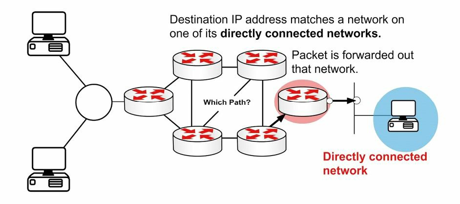
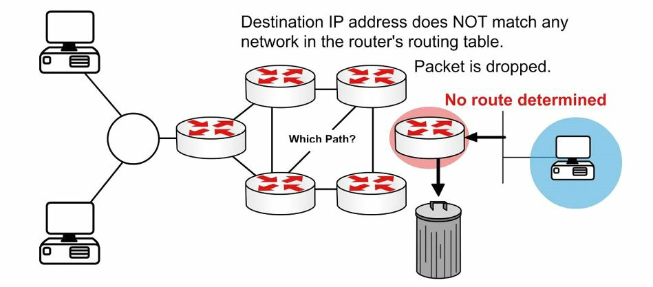
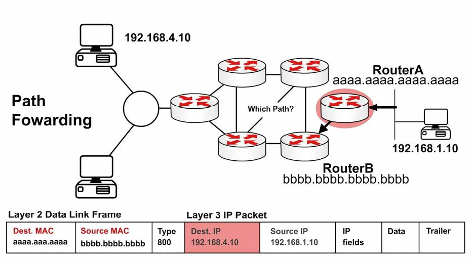

# 基本路由

路由协议的作用，是动态了解别的网络、与其他设备交换路由信息，以及连接内部和/或外部网络。

值得注意的是，路由协议 **不会** 在网络上发送数据包。他们的作用，是确定出路由的最佳路径。路由协议确实会发送数据，而路由协议最常见的示例，便是 IP。


不同路由协议，会用到不同的确定出到某个网络，或网络节点的最佳或最优路径方法。一些类型的路由协议，在静态环境，或变化很少或没有变化的环境中效果最佳，在对这些环境作出改变时，要收敛就可能需要很长时间。而别的一些路由协议，则会对网络中的变化反应迅速，而可快速收敛。

所谓网络收敛，发生在网络中所有路由器都有着同一视图，并就最佳路由达成一致时。当收敛要化很长时间才发生时，那么就可能遭遇两个远端网络之间的间歇性数据包丢失与连通性丢失。除了这些问题，慢速收敛还会导致网络路由循环与彻底的网络中断。收敛取决于所使用的路由协议算法。

由于路由协议各具特色，他们在其可扩展性和性能上各不相同。一些路由协议只适用于小型网络，而别的则可用于小型、中型及大型网络。


## 数据包转发

数据包转发涉及两个过程：

- 确定最佳路径
- 发送数据包（交换）


当路由器收到某个直连网络的数据包时，路由器会检查路由表，然后将数据包转发到该网络，如下图 17.1 中所示。



**图17.1** -- **直连网络**


当数据包的目的地是某个远端网络时，则路由表会加以检查，并在有条路由或有默认路由时，那么该数据包就被转发到下一跳路由器，如下图 17.2 中所示。


**图 17.2** -- **远端网络**

当数据包以某个不在路由表中的网络为目的地，且没有默认路由时，那么他会被丢弃，如下图 17.3 中所示：




**图 17.3** -- **没有路由**

这种交换过程，允许路由器经由一个接口接收数据包，并将其从另一接口发送出去。路由器还将把数据包，封装在传出链路的适当数据链路数据帧中。

咱们可能会被要求，解释从一个网络接收到的，同时目的地是另一网络的数据包上会发生什么。首先，路由器会通过移除二层数据帧的头部及尾部，解封装该三层数据包。接下来，路由器会检查该 IP 数据包的目的 IP 地址，找到路由表中的最佳路径。最后，他会将这个三层数据包，封装为一个新二层数据帧，并将该数据帧从出口接口转发出去，因此封装方式就从以太网，变成 HDLC。这在下图 17.4 中得以演示。




**图 17.4** -- **某个数据包中的三层地址**


在数据包前往其最终目的地期间，源与目的地 IP 地址将永不改变。但 MAC 地址将变化，以允许中间设备之间的传输。这在下图 17.5 中得以演示。


**图 17.5** -- **二层地址改变**

下图 17.6 显示了一个离开 `Host X`，目的地为 `Host Y` 的数据包。请注意，其中下一跳的 MAC 地址属于 `Router A`（使用代理 ARP）；但该 IP 地址属于 `Host Y`。当数据帧到达 `Router B` 时，以太网（数据帧）的头部和尾部，将被交换为 WAN 协议（的头部尾部），在这里咱们可假设其为 HDLC （的封装方式）。


**图 17.6** -- **离开 `Host X` 的数据包**

下图 17.7 显示离开 `Router A` 前往 `Router B` 的同一数据包。这里有着一次路由查找，然后该数据包即被从接口 `E1` 交换出去了。`Type 800` 表示该数据包为 IPv4。


**图 17.7** -- **离开 `Router A` 的数据包**

下图 17.8 显示最终到达 `Router C`，并被转发到 `Host Y` 的数据帧：


**图 17.8** -- **离开 `Router C` 的数据包**


> *知识点*：
>
> - the role of routing protocols, is to learn about other networks dynamically, exchange routing information with other devices, and connect internal and/or external networks, determine the best path for routing, have different characteristics
>
> - routing protocols DO NOT send packets across the network.
>
> - the most common example of a routed protocol, is IP
>
> - means for determining the best or most optimal path to a network or network node
>
> - network convergence occurs when all routers in the network, have the same view and agree on optimal routes
>
> - slow convergence can result in intermeittent packet loss, and loss of connectivity, network routing loop and outright network outages
>
> - convergence is determined by the routing protocol algorithm used
>
> + packet forwarding involves two processes:
>   - determining the best path
>   - sending the packet, switching
>
> - the next-hop router
>
> - the switching process
>
> - encapsulate the packet in the appropriate Data Link frame fro the outgoing link
>
> + what happens with a packet received from one network and destined for another:
>   - the router decapsulates the Layer 3 packet by removing the Layer 2 frame header and trailer
>   - it examines the destination IP address of the IP packet to find the best path in the routing table
>   - it encapsulates the Layer 3 packet into a new Layer 2 frame and forwards the frame out of the exit interface. so the encapsulation could change from Ethernet to HDLC
>
> - the source and destination IP addresses will never change as the packet traverses towards its final desitnation
>
> - routing domains

## 互联网协议的路由基础

路由协议允许路由器动态学习如何到达其他网络。路由协议还允许路由器与别的路由器或主机，交换学习到的网络信息。路由协议可用于连接内部园区网络，也用于连接不同企业或路由域。因此，除了掌握路由协议的复杂性外，对何时及在何种情况下使用一种路由协议，而不是另一种路由协议有扎实掌握也很重要。


## 扁平及分层的路由算法


路由协议算法要么采用扁平的路由系统，要么采用分层的路由系统运行。所谓分层的路由系统，采用分层方法，其中路由器被置于称为域、区域或自治系统的一些逻辑分组中。这样做允许网络中的不同路由器，就能执行一些特定任务，优化在这些层完成的功能。层次化系统中的一些路由器，可以与其他域或区域中的路由器通信，而一些路由器则只能与同一域或区域中的路由器通信。这样做减少了某个域或区域中的路由器，必须要处理的信息量，这实现了网络内的更快收敛。

所谓扁平的路由系统，则没有层次结构。在此类系统中，路由器通常必须连接到网络中的所有别的路由器，同时每个路由器本质上具备同一功能。此类算法在一些极小网络上工作良好；但他们不具扩展性。此外，随着网络增长，故障排除也会变得更加困难，因为比如咱们不仅要关注一些确切区域，现在咱们必须关注整个网络。

由分层路由系统带来的主要优势，在于其可扩展性。分层的路由系统还允许对网络的更改更加容易，这与由核心层、分布层和接入层组成的传统分层设计所提供的方式基本相同。此外，分层算法还可用于在允许完整的网络连通性同时，减少网络一些区域中的路由更新流量，以及路由表的大小。


## IP 分址与地址汇总

IP 地址分为两部分。第一部分指定了网络的地址，而第二部分指定了主机的地址。在设计某个网络时，所谓 IP 分址方案，用于唯一标识网络内主机和设备。IP 分址方案应是层次化的，并应建立在传统的逻辑分层模型上。这样做就允许寻址方案，提供网络中的一些指定点，有效的路由汇总可在这些地方得以完成。

所谓汇总，减少了路由器必须处理的信息量，这允许网络内的更快收敛。汇总还通过隐藏网络中某些区域的详细拓扑信息，限制了受网络变化影响区域的大小。这一概念在下图 17.9 中得以演示。


**图 17.9** -- **采用 Cisco 设计模型的路由汇总**


参考图 17.9，分支机构（接入层）到区域办事处路由器（分布层）是双主接入。这些分层是运用 Cisco 设计模型定义的。使用层次化的分址方案，允许分布层的路由器，通告一条分支机构子网的摘要路由到核心层。这样做保护了核心层，不受分布层与接入层路由器之间任何路由抖动的影响，因为直到从其中推导出该摘要路由的最后一个更具体前缀，从路由表中移除为止，摘要路由都不会抖动。这就提高了该区域内的稳定性。此外，核心层处的路由表大小，也会极大地缩小。


## 管理距离

所谓管理距离，用于确定一个路由信息源，相比另一路由信息源的可靠性。一些路由信息来源，被认为相比其他来源更为可靠；因此，当两种或更多不同路由协议中，有着到同一目的地的两条或更多不同路径时，管理距离就可用于确定出，到目的地网络或网络节点的最佳或首选路径。

在 Cisco 10S 软件中，路由信息的全部来源，都被分配了一个默认的管理距离值。这一默认值是个 0 到 255 之间的整数，其中 0 的值表示最可靠的信息来源，而 255 的值则表示最不可靠的信息来源。任何分配了 255 的管理距离值的路由，都被认为是不可信的，而不会被置于路由表中。

管理距离是个只影响本地路由器的本地重要值。这个值不会传播到整个路由域。因此，在某个路由器上手动调整某种路由来源，或一些路由来源的默认管理距离，只会影响该路由器上路由信息来源的优先级。下表 17.1 列出了 Cisco IOS 软件中用到的一些默认管理值（考试时咱们需要了解这些值）。

**表 17.1** -- **路由器的管理距离**

| 路由来源 | 管理距离 |
| :-- | :-- |
| 直连接口 | 0 |
| 静态路由 | 1 |
| 增强型内部网关路由选择协议 (EIGRP) 的摘要路由 | 5 |
| 外部边界网关协议 (eBGP) 的路由 | 20 |
| 内部的增强内部网关路由选择协议 (EIGRP) 的路由 | 90 |
| 开放式最短路径优先 (OSPF) 的内部及外部路由 | 110 |
| 中间系统到中间系统 (IS-IS) 的内部及外部路由 | 115 |
| 路由信息协议 (RIP) 的路由 | 120 |
| 外部网关协议 (EGP) 的路由 | 140 |
| 按需路由（ODR）的路由 | 160 |
| 外部的增强内部网关路由协议 (EIGRP) 的路由 | 170 |
| 内部的边界网关协议 (iBGP) 的路由 | 200 |
| 不可达或未知的路由 | 255 |


默认的路由来源管理距离，显示在 `show ip protocols` 命令的输出中。这在以下输出中得以演示：


```console
R1#show ip protocols

Routing Protocol is “isis”
  Invalid after 0 seconds, hold down 0, flushed after 0
  Outgoing update filter list for all interfaces is not set
  Incoming update filter list for all interfaces is not set
  Redistributing: isis
  Address Summarization:
    None
  Maximum path: 4
  Routing for Networks:
    Serial0/0
  Routing Information Sources:
    Gateway         Distance      Last Update
    10.0.0.2             115      00:06:53
  Distance: (default is 115)
```


> *知识点*：
>
> - flat routing algorithm
>
> - hierarchical routing algorithm
>
> - a flat routing system
>
> - a hierarchical routing system, a layered approach wherein routers are places in a logical groupings refered to as domains, areas, or autonomous systems
>
> - the amount of information that the routers in a domain or an area must process
>
> - hierarchical algorithms can be used to reduce routing update traffic, as well as routing table size
>
> - an IP addressing scheme
>
> - the IP addressing scheme should be hierarchical, to provicde designated points in the network, where effective route summarization can be performed
>
> - Summarization reduces the amount of information that routers must process, restricts the size of the area that is affected by network changes by hiding detailed topology information from certain areas within the network
>
> - a summary route will not flap until every last one of the more specific prefixes, from which it is derived, is removed from the routing table
>
> - administrative distance, is used to determine the reliability of one source of routing information from another, can be used to determine the best or preferred path to a destination network or network node, when there are two or more different paths to the same destination from two or more different routing protocols.
>
> - all sources of routing information, are assigned a default administrative distance value, an integer between 0 and 255, with a value of 0 assigned to the most reliable source of information, and a value of 255 assigned to the least reliable source of information
>
> - the administrative distance is a locally significant value, that affects only the local router, not propagated throughout the routing domain
>
> - ajusting the default administrative distance for a routing source or routing sources on a router, affects the preferenc of routing information sources only on that router
>
> - connected interfaces
>
> - static routes
>
> - Enhanced Interior Gateway Routing Protocol, EIGRP
>
> - External Border Gateway Protocol, eBGP
>
> - Open Shortest Path First, OSPF
>
> - Intermediate System-to-Intermediate System, IS-IS
>
> - Routing Information Protocol, RIP
>
> - Exterior Gateway Protocol, EGP
>
> - On-Demand Routing, ODR
>
> - Internal Border Gateway Protocol, iBGP
>
> - Unreachable or Unknown Routes


## 路由度量值

路由协议算法都会用到度量值，即与特定路由相关联的一些数值。这些数值用于对由路由协议学习到的路由，加以优先排序或优选，从最优选到最不优选。从本质上讲，路由度量越低，那么（该路由）就越会被路由协议优选。有着最低度量值的路由，通常是有着开销最低的路由，或是到目的地网络的最佳路由。这条路由将被置于路由表中，并将用于转发数据包到该目的地网络。

不同路由算法会使用不同变量计算这个路由度量值。一些路由算法只用到单个变量，而别的一些高级路由协议，则会使用不止一个变量，确定某条特定路由的度量值。在大多数情形下，由一种路由协议计算出的度量值，与由别的路由协议用到的度量值不兼容。不同路由协议的度量值，可能基于以下的一个或多个变量：

- 带宽
- 成本
- 延迟
- 负载
- 路径长度
- 可靠性

### 带宽

带宽一词，是指在给定时间内，从一点到另一点可承载的数据量。路由算法会使用带宽，决定哪种链路类型优于另一链路类型。例如，某种路由算法可能会优选 `GigabitEthernet` 链路而不是 `FastEthernet` 链路，因为 `GigabitEthernet` 链路提升的容量。

在 Cisco 10S 软件中，`bandwidth` 这条接口配置命令，可用于调整某个接口的默认带宽值，而有效地控制路由算法对一个接口与另一接口的选取。例如，当 `FastEthernet` 接口在以 `bandwidth 1000000` 这条接口配置命令配置后，那么对于路由算法，`FastEthernet` 与 `GigabitEthernet` 链路就表现为有着同一容量，而会分配同一度量值。其中一条链路实际上是条 `FastEthernet` 链路，另一链路实际上是 `GigabitEthernet` 链路这一事实，与路由协议无关。

从网络管理员的角度看，重要的是必须理解，`bandwidth` 命令并不影响接口的物理能力（这就是为什么他有时被指为一条道具命令）。换句话说，在 `FastEthernet` 接口上配置更高的带宽，并不意味着他就具备了支持 `GigabitEthernet` 速率的能力。开放最短路径优先（OSPF）与增强内部网关路由协议（ERP），在度量值计算中都会用到带宽。

### 成本

所谓成本，在涉及路由算法时，指的是通信成本。例如，当公司倾向于在私有链路（而非公共链路）上路由时，那么成本就会用到，私有链路会对在其上传输数据，或使用时间收费。

中间系统到中间系统（IS-IS）就支持一种用于衡量链路使用货币开销的可选费用度量值。对成本的配置，会因协议而不同。

### 延迟

有多种类型的延迟，他们均会影响不同类型的流量。一般来说，延迟指的是经由互联网络，将某个数据包从其来源处，传送到目的地所用的时间长度。在 Cisco IOS 软件中，接口延迟值以是微秒（µs）度量。


这个接口值是使用 `delay` 这一接口配置命令配置的。在咱们配置接口延迟值时，一定要记住这不会影响流量（即另一道具命令）。例如，配置 5000 的延迟值，并不意味着从该接口发出的流量，就将有着 5000 µs 的额外延迟。下表 17.2 展示了 Cisco 10S 软件中，一些常见接口的默认延迟值。

**表 17.2** -- **接口的延迟值**

| 接口类型 | 延迟（µs） |
| :-- | :-- |
| 10Mbps Ethernet | 1000 |
| `FastEthernet` | 100 |
| `GigabitEthernet` | 10 |
| `T1` 串行接口 | 20000 |


EIGRP 会将接口延迟值用作其度量值计算的一部分。手动调整接口延迟值，会导致 EIGRP 度量值的重新计算。

### 负载

负载一词，对不同的人来说表示不同的事物。例如，在一般计算术语中，负载指的是诸如 CPU 等某种资源正执行的工作量。在这一上下文中，负载指的是某个特定路由器接口的使用程度。接口上的负载，是 255 的某个分数。例如，255/255 的负载，表示该接口已完全饱和，而 128/255 的负载，则表示该接口为 50% 饱和。默认情况下，负载是以 5 分钟时长的平均值计算的（在现实世界中，这通常会使用 `load-interval 30` 命令，修改改为最少 30 秒的最小值）。接口的负载值，会被 EIGRP 用于其度量值计算。

### 路径长度

所谓路径长度度量指，是数据包从本地路由器到目标网络历经的路径总长度。不同路由算法将这个值表示为不同形式。例如，路由信息协议 (RIP) 会统计本地路由器与目的网络之间所有中间路由器（跳数），并使用该跳数作为度量值，而边界网关协议 (BGP) 则会统计本地路由器与目的网络之间，历经的自治系统数，并使用这个自治系统数选取最佳路径。


### 可靠性


与负载一样，可靠性一词也会根据其被使用的上下文，而表示不同事物。在这里，除非另有说明，则应始终假定可靠性指的是网络链接或接口的可靠性。在 Cisco IOS 软件中，某条链路或某个接口的可靠性，以 255 的分数表示。例如，255/255 的可靠性值，表示该接口 100% 可靠。与接口负载类似，默认情况下，某个接口的可靠性是以五分钟时长中的平均值计算的。


> *知识点*：
>
> - routing metics, numerical values that are associated with specific routes, used to prioritize or prefer routes learned by the routing protocol, form the most preferred to the least preferred
>
> - in essence, the lower the route metric, the more preferred the route by the routing protocol
>
> - bandwidth, the amount of data that can be carried from one point to another in a given period
>
> - the `bandwidth` command does not affect the physical capability of the interface
>
> - cost, refers to communication cost
>
> - IS-IS supports an optional expense metric, that measures the monetary cost of link utilization
>
> - delay, refers to the length of time required to move a packet from its source to its destination through the internetwork, in microseconds, the `delay` interface configuration command does not affect the traffic
>
> - load, refers to the degree of use for a particular router interface, is a fraction of 255, is caculated as an average over a period of five minutes, but is often changed to a minimum of 30 seconds using the `load-interval 30` command
>
> - path length, the total length of the path that is traversed from the local router to the destination network, RIP counts all intermediate routers, but BGP counts the number of traversed autonomous systems
>
> - reliability, refers to the dependability of network links or interface, represented as fraction of 255, caculated as an average over a period of five minutes

## 前缀匹配


思科路由器在确定那些路由会被置于路由表中，应被用于转发流量到目的网络或节点时，会运用最长前缀匹配规则。在决定要使用哪个路由表条目，将流量路由至计划的目的网络或节点时，更长的，或者说更具体的那些条目，会优先于诸如摘要地址的，不那么具体的条目。

最长前缀或最具体路由，会被用于将流量路由至目的网络或节点。当有多个重叠的前缀经由同一路由协议学习到时，则不管路由来源的管理距离，或分配给该前缀的路由协议度量值如何，都会这样做。下表 17.3 演示了在某台路由器上，发送数据包到地址 `1.1.1.1` 发送数据包时，路由选择的顺序。这一顺序便是基于最长前缀匹配的查找。


**表 17.3** -- **匹配最长前缀**

| 路由表条目 | 用到的顺序 |
| :-- | :-- |
| `1.1.1.1/32` | 首先 |
| `1.1.1.0/24` | 其次 |
| `1.1.0.0/16` | 再次 |
| `1.0.0.0/8` | 第四 |
| `0.0.0.0/0` | 第五 |


**注意**： 虽然在表 17.3 中，默认路由列在路由选择顺序的最后，但请记住，默认路由并不总会出现在路由表中。当为这种情况，且没有其他到地址 `1.1.1.1` 的条目时，到该目的地的数据包就会被路由器简单地丢弃。在大多数情况下，路由器将发送给源主机一条表明该目的地不可达的 ICMP 报文。默认路由用于引导那些以路由表中未显式列出的一些网络为地址的数据包。

## 建立 IP 路由表

在未产生出包含远端网络条目的路由表，或路由信息库（RIB）时，路由器将无法将数据包转发到这些远端网络。路由表会包含一些特定网络的条目，也可能就一条默认路由。路由表中的信息，会被转发进程用于转发流量到目标网络或主机。路由表本身并不会具体转发流量。

Cisco 路由器使用管理距离、路由协议度量及前缀长度，确定哪些路由将被实际置于路由表中。这就允许路由器建立路由表。路由表经由以下一般步骤得以建立：

1. 当该路由条目未存在于路由表时，则将其添加到路由表中；
2. 当该路由条目比某条现有路由更具体，则将其添加到路由表中。还应注意的是，那条不那么具体的条目仍会保留在路由表中；
3. 当该路由条目与某条现有路由条目相同，但他是接收自某种更优先的路由来源时，则以这个新条目替换原先的条目；
4. 当该路由条目与某个现有路由条目相同，且是接收自同一协议时，则：
    i. 当新路由的度量值高于既有路由时，丢弃该新路由；或
    ii. 当新路由的度量值较低，则替换既有路由；或
    iii. 如果新旧两条路由的度量值相同时，则将两条路由用于负载均衡。


默认在建立 RIB 期间，在路由器确定那些路由要置于路由表中时，有着最低管理距离值的路由协议将始终被选中。例如，当路由器经由外部 EIGRP、OSPF 与 iBGP 收到 `10.0.0.0/8` 这个前缀时，那么 OSPF 的路由将被置于路由表中。如果这条 OSPF 路由被移除或不再收到时，则外部 EIGRP 的路由将被置于路由表中。最后，当 OSPF 和外部 EIGRP 的两条路由都不再存在时，则 iBGP 的路由就会被用到。

一旦路由被置于路由表中，那么默认情况下，最具体或最长匹配的前缀，将总是优先于那些不台具体的路由。这在下面的示例得以演示，该示例展示一个包含着 `80.0.0.0/8`、`80.1.0.0/16` 和 `80.1.1.0/24` 三个前缀条目的路由表。这三个路由前缀，是分别经由 EIGRP、OSPF 及 RIP 路由协议收到的。


```console
R1#show ip route
Codes:	C - connected, S - static, R - RIP, M - mobile, B - BGP
		D - EIGRP, EX - EIGRP external, O - OSPF, IA - OSPF inter area
		N1 - OSPF NSSA external type 1, N2 - OSPF NSSA external type 2
		E1 - OSPF external type 1, E2 - OSPF external type 2
		i - IS-IS, L1 - IS-IS level-1, L2 - IS-IS level-2, ia - IS-IS inter area
		* - candidate default, U - per-user static route, o - ODR
		P - periodic downloaded static route

Gateway of last resort is not set

R		 80.1.1.0/24 [120/1] via 10.1.1.2, 00:00:04, Ethernet0/0.1
D		 80.0.0.0/8 [90/281600] via 10.1.1.2, 00:02:02, Ethernet0/0.1
O E2	 80.1.0.0/16 [110/20] via 10.1.1.2, 00:00:14, Ethernet0/0.1
```

参考上面给出的输出，第一条路由是 `80.1.1.0/24`。该路由是经由 RIP 学习到的，因此有着 120 的默认管理距离值。第二条路由是 `80.0.0.0/8`。该路由是经由内部 EIGRP 学习道德，因此有着 90 的默认管理距离值。第三条路由是 `80.1.0.0/16`。该路由是经由 OSPF 学习到的，并是一条有着 110 的管理距离值的外部 OSPF 路由。

**注意**：由于这些路由协议的度量值不同，因此在来自多种协议的路由，被安装到路由表中时，他们就不是确定要使用的最佳路由的因素。接下来的小节，将介绍 Cisco IOS 路由器建立路由表的方式。

根据这个路由表的内容，当路由器收到目的地为 `80.1.1.1` 的数据包时，他就会使用 RIP 的那条路由，因为这是最具体的条目，尽管 EIGRP 和 OSPF 均有着更好的管理距离值，而因此是更优先的路由来源。下面所示的 `show ip route 80.1.1.1` 命令，可用于验证这一说法。


```console
R1#show ip route 80.1.1.1
Routing entry for 80.1.1.0/24
	Known via “ rip ”, distance 120, metric 1
	Redistributing via rip
	Last update from 10.1.1.2 on Ethernet0/0.1, 00:00:15 ago
	Routing Descriptor Blocks:
	* 10.1.1.2, from 10.1.1.2, 00:00:15 ago, via Ethernet0/0.1
		Route metric is 1, traffic share count is 1
```

> *知识点*：
>
> - the longest prefix match rule, used to determine which of the routes placed into the routing table should be used to forward traffic to a destination network or node, regardless of the administrative distance of the route source, or the routing protocol metric assigned to the prefix, if multiple overlapping prefixes are learned via the same routing protocol
>
> - longer, or more specific, routing table entries are prefered over the less specific entries
>
> - a defautt route is used to direct packets addressed to networks not explicitly listed in the routing table, and is not always present in the routing table. If that is the case, and no other entries to the destination address, packets to that destination are simply discarded by the router. The router will send the source host an ICMP message indicating that the destination is unreachable.
>
> - Routing Inforamtion Base, RIB
>
> - the routing table may include specific network entries, or simply a single default route
>
> - information in the routing table, is used by the forwarding process, to forward traffic to the desitnation network or host
>
> - the routing table itself does not actually forward traffic, the forwarding process does it
>
> + What the routers use to determine which routes will actually be placed into the routing table:
>   - the administrative distance
>   - the routing protocol metric
>   - the prefix length
>
> + building the routing table
>   - if the route entry does not currently exist in the routing table, add it to the table
>   - if the route entry is more specific than an existing one, add it to the table, and the less specific one is still retained in the table
>   - if the route entry is the same as an existing one, but it received from a more prefered route source, then the old entry is replaced by the new one
>   + if the route entry is the same as an existing one, and it's received from the same protocol, then:
>       - if the metric is higher than the existing route, the new route is discarded, or
>       - if the metric of the new route is lower, then it will replace the old one, or
>       - if the metric for both is the same, then both routes are kept, used for load balancing
>
> - when building the RIB by default, the routing protocol with the lowest administrative distance value, will always be chosen, when the router is determining which routes to place into the routing table
>
> - the most specific or longest prefix, will always be preferred over less specific routes, regardless the their source routing protocols
