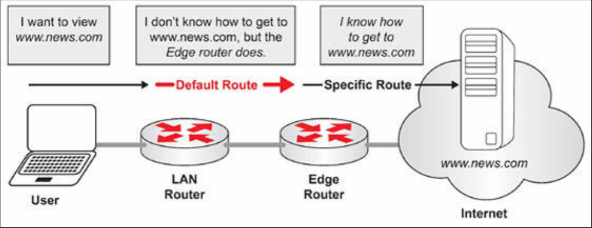
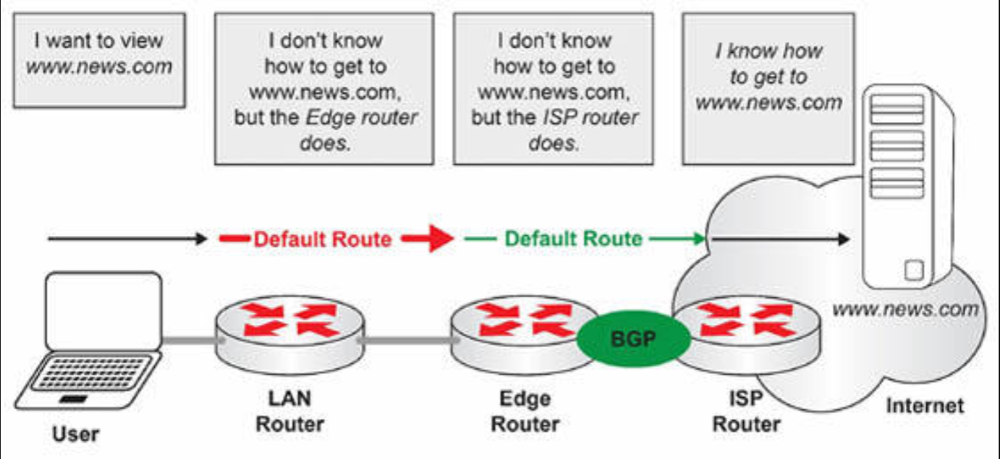
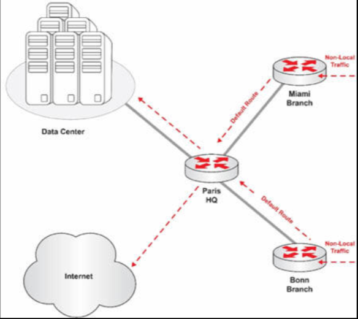
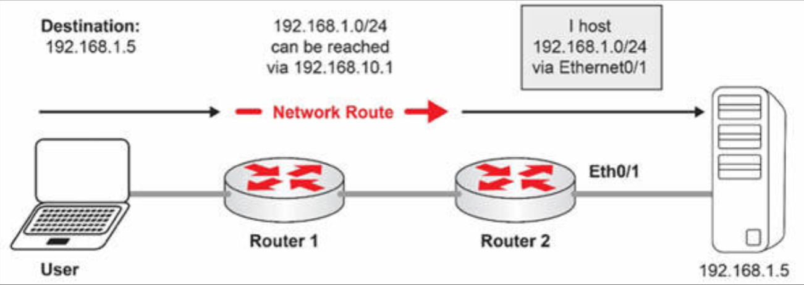
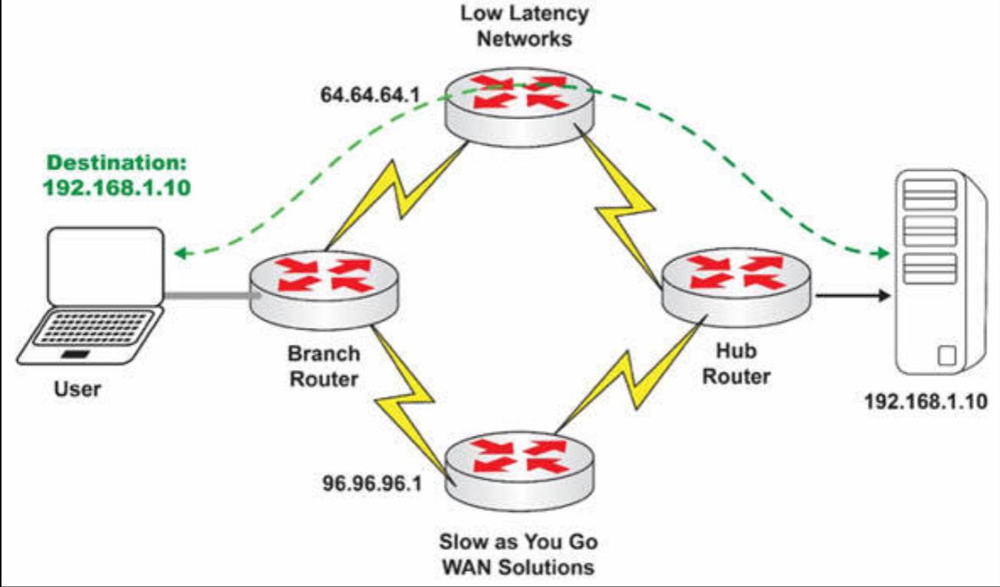

# 静态默认路由


与在目的地址未知时会广播的交换机不同，路由器会丢弃那些有着未知目的地址的数据包。路由器会存储一个到网络所有相关部分的路由的数据表，但作为网络管理员，我们很少会希望我们的路由器，在收到他们没有某条路由的数据包时直接丢弃流量。例如，LAN 路由器在其路由表中，就不会有到通往互联网的每条路由，但网络管理员仍会希望该 LAN 路由器，转发流量到互联网，以及转发来自互联网的流量。这可经由默认路由实现。

在默认路由下，当路由器收到某个数据包，而他在其路由表中没有某条目的路由时，他可转发该数据包到通常是个承载着更大路由表、更为强大的 Internet 边缘路由器的默认路由。




**图 18.3** -- **静态默认路由**

默认路由可静态创建，或动态学习到。在上图 18.3 中，该静态默认路由正指向边缘路由器。现在，当咱们不打算在咱们的边缘路由器上，保留 Internet 的整个路由表（使用 BGP），而选择咱们的互联网服务提供商为咱们完成这件事情时，咱们通常会经由 BGP 收到一条来自咱们 ISP 的动态默认路由，如下图 18.4 中所示。BGP 已从考试大纲中移除。



**图 18.4** -- **静态与动态的默认路由**

在上图 18.4 中，LAN 路由器有着一条指向边缘路由器的静态默认路由，而边缘路由器有着一条其经由 BGP 从 ISP 路由器学习到的，指向 ISP 路由器的动态默认路由。无论路由器如何学习到默认路由，该路由均会以同样方式工作。

为了理解默认路由，咱们必须记住，路由器将转发流量到最具体的那条路由。因此，路由器在转发数据包到 `192.168.0.0/16` 前，将先转发数据包到 `192.168.1.0/24`。掌握了这一概念，那么默认路由，便是一条会匹配所有数据包的单一路由。这意味着，除默认路由外，到某个目的地的任何有效路由，都将优先于默认路由。只在没有到某个目的地的有效路由时，默认路由才会用到。默认路由是 “笼统” 路由，这是说 “当我不知道他前往何处时，那么作为最后的选择，我会发送他到这里"。

默认路由并不局限于发送流量到 Internet。利用默认路由的另一种流行方法，是在企业网络下。例如，当咱们在咱们的总部，有个核心数据中心，又有两个分支机构时，那么咱们就会将所有非本地的分支机构流量，转发到该核心数据中心。当咱们在咱们的数据中心，托管着电子邮件、数据库及一些内网服务器时，咱们就会利用分支机构路由器上的默认路由，转发所有流量，而不是指定出电子邮件、数据库和内网服务器的单独路由。



**图 18.5** -- **分支机构设计中的静态默认路由**


在上图 18.5 中，所有非本地的分支机构流量，都会经由默认路由发送到巴黎总部的中心路由器。巴黎总部的中心路由器有着一些既可转发流量到数据中心的相应服务器，亦可转发流量到互联网的具体路由。

这本学习指南的这一部分，将重点介绍静态默认路由，因此所有示例都将指的是静态路由。动态路由将在这本学习指南的其他部分介绍。


## 静态默认路由配置

有三种命令可用于静态分配默认路由：

- `ip default-gateway`
- `ip default-network`
- `ip route 0.0.0.0 0.0.0.0`


### `ip default-gateway`


`ip default-gateway` 命令只应在 IP 路由已关闭的 Cisco 路由器或交换机上使用。以与 PC 使用默认网关在网络上通信的同样方式，Cisco 路由器也可利用 `ip default-gateway` 这条命令，在网络上通信。例如，当咱们有个处于引导模式（此时路由器尚未启用 IP 路由）的 Cisco 路由器时，为了 TFTP 传输一个新的 Cisco IOS 镜像到这个路由器，咱们就或许想要使用这条命令。

以下这个示例展示了将路由器的 IP 地址 `172.16.1.1` 作为默认路由：

```console
R1(config)#ip default-gateway 172.16.1.1
```


### `ip default-network`


当 IP 路由于 Cisco 路由器上启用时，咱们便可使用 `ip default-network` 这条命令。在咱们配置 `ip default-network` 命令时，路由器会考虑到该网络的路由，作为该路由器上的最后网关安装。在下面的示例中，`161.44.191.1` 为下一跳的路由器。


```console
R1(config)#ip default-network 198.10.1.0

R1(config)#end

R1#show ip route
Codes: C - connected, S - static, I - IGRP, R - RIP, M - mobile,
       B—BGP, D - EIGRP, EX - EIGRP external, O - OSPF,
       IA - OSPF inter area, N1 - OSPF NSSA external type 1,
       N2 - OSPF NSSA external type 2, E1 - OSPF external type 1,
       E2 - OSPF external type 2, E—EGP, i - IS-IS,
       su - IS-IS summary, L1 - IS-IS level-1, L2 - IS-IS level-2,
       ia - IS-IS inter area, * - candidate default,
       U - per-user static route, o - ODR,
       P - periodic downloaded static route
```


最后网关为 `161.44.191.1`，到网络 `198.10.1.0`。

```console
      161.44.0.0/24 is subnetted, 1 subnets
C    161.44.192.0 is directly connected, Ethernet0
      131.108.0.0/24 is subnetted, 1 subnets
C    131.108.99.0 is directly connected, Serial0
S*   198.10.1.0/24 [1/0] via 161.44.191.1
```

最后网关现在被设置为 `161.44.191.1`，因为在路由表中 `198.10.1.0` 在将其指向为下一跳。


### `ip route 0.0.0.0 0.0.0.0 (Destination IP)`


为了 `ip route 0.0.0.0 0.0.0` 命令生效，IP 路由必须要在路由器上启用。下面是个通过使用 `ip route 0.0.0.0 0.0.0` 命令，配置最后网关的示例。

```console
R1#configure terminal
Enter configuration commands, one per line. End with CTRL/Z.
R1(config)#ip route 0.0.0.0 0.0.0.0 170.170.3.4
R1(config)#^Z
R1#show ip route
  Codes: C - connected, S - static, I - IGRP, R - RIP, M - mobile,
         B—BGP, D - EIGRP, EX - EIGRP external, O - OSPF,
         IA - OSPF inter area, N1 - OSPF NSSA external type 1,
         N2 - OSPF NSSA external type 2, E1 - OSPF external type 1,
         E2 - OSPF external type 2, E—EGP, i - IS-IS,
         L1 - IS-IS level-1, L2 - IS-IS level-2,
         * - candidate default, U - per-user static route, o - ODR

Gateway of last resort is 170.170.3.4 to network 0.0.0.0.
170.170.0.0/24 is subnetted, 2 subnets
  C 170.170.2.0 is directly connected, Serial0
  C 170.170.3.0 is directly connected, Ethernet0
  S* 0.0.0.0/0 [1/0] via 170.170.3.4
```

静态默认路由的一些重要考量为：

- 当咱们同时使用了 `ip default-network` 和 `ip route 0.0.0.0 0.0.0` 命令配置候选默认网络时，那么以 `ip default-network` 命令定义的网络将优先；
- 当咱们使用多条 `ip route 0.0.0.0 0.0.0` 命令配置某条默认路由时，流量将经由多条路由被负载均衡；
- 当静态路是重分发到路由协议中的时，那么 EIGRP 会传播一条路由到网络 `0.0.0.0`；
- 在 Cisco IOS Software 版本 12.0T 及更高版本中，当默认路由不是经由 RIP 学习到的时，那么 RIP 就不会通告该默认路由。可能需要将该路由重分发到 RIP 中；
- 通过使用 `ip route 0.0.0.0 0.0.0.0` 命令创建的默认路由，不会被 OSPF 传播；
- 要使用 `default-information originate` 命令，产生一条默认路由到 OSPF 的路由域中。

## 网络路由


虽然咱们对于路由到特定网络的绝大多数经验，都是将使用内部网关（路由）协议完成，但无论咱们要支持何种环境，了解静态网络路由工作原理的基础知识，提供给咱们一个坚实基础。到网络的静态路由，通常不是首选方法，但现实是静态路由仍被使用，同时他们无疑提供了理解到网络的路由原理的绝佳机会。

适用于网络路由的 “网络”，是咱们希望访问的某个远端子网。一些示例可能是 `10.1.0.0/24`、`192.168.0.0/16` 或 `38.122.188.0/25` 等等。基本上，当其是低于 `/31` 子网的任何子网时，咱们最终都会需要依靠网络路由才能到达他。

Cisco 10S 允许使用 `ip route` 这条全局配置命令，一些单独静态路由的定义。在该命令下，咱们将指定子网、网络掩码及下一跳地址，即前往目的地路径中的下一步。作为下一跳地址的替代，如下图所示咱们还可使用出口接口。


```console
R1(config)#ip route 172.16.2.0 255.255.255.0 172.16.4.2
R1(config)#ip route 172.16.3.0 255.255.255.0 S0/0/1
```


在下图 18.6 中，终端用户的 PC 正试图发送流量到位于 `192.168.1.0/24` 网络上的 `192.168.1.5`。终端用户 PC 的网关路由器（`Router 1`）有条告诉该路由器，转发所有以 `192.168.1.0/24` 为目的地的流量到下一跳 `192.168.10.1`（`Router 2`）的静态路由。该路由器然后就转发这些流量，相信 `Router 2` 知道如何处理来自这里的流量。




**图 18.6** -- **网络路由**

在 `Router 1` 上，运行配置中的路由看起来像这样：


```console
ip route 192.168.1.0 255.255.255.0 192.168.10.1
```

咱们也可以使用路由器的出口接口，而不是下一跳实现这条路由。因此，举例来说，当 `Router 1` 使用 `Ethernet0/2` 连接到 `Router 2` 时，他会看起来像这样：


```console
ip route 192.168.1.0 255.255.255.0 Ethernet0/2
```

我们来使用两种方法，实现两条不同路由到路由表中，看看咱们能否分辨出路由表中的不同行为。


```console
R1(config)#ip route 192.168.2.0 255.255.255.0 172.16.4.2
R1(config)#ip route 192.168.4.0 255.255.255.0 Serial0/0/1
R1#show ip route static
Codes: L - local, C - connected, S - static, R - RIP, M - mobile,
       B -BGP

! lines omittedfor brevity

Gateway of last resort is not set

   172.16.0.0/16 is variably subnetted, 6 subnets, 2 masks
S    192.168.2.0/24 [1/0] via 172.16.4.2
S    192.168.4.0/24 is directly connected, Serial0/0/1
```


咱们注意到，使用下一跳 IP 地址的路由，在路由表条目中有个 `via` 关键字了吗？引用了出站 `Serial0/0/1` 接口的路由，被列为一条直连路由。通常情况下，工程师们会认为，由于某条路由属于直连的，那么该子网必将托管在该路由器本身上，但正如咱们所看到的，情况并非总是如此。


当 `Serial0/0/1` 因链路故障而掉线时，这条静态路由将不再显示于路由表中。当连接到 `172.16.4.2` 的链路下线时，该路由也将不再显示在路由表中。话虽如此，若使用一个不同示例，如下图 18.7 中所示，当托管 `192.168.2.0/24` 的下游路由器 `R3` 停止允许时，`R1` 会继续通过使用静态路由，转发流量到下一跳，因为静态路由不知道下游是否存在问题。

**图 18.7** -- **静态路由对下游失效的响应**

这便是动态路由协议得以使用的原因之一。在动态路由协议下，遇到问题的路由器会通知网络上的其他路由器出现了问题，他们应要么停止传输流量，要么经由一条不同路径转发流量。


## 静态主机路由


现在咱们已经了解上一小节中的网络路由，那么学习主机路由就相对容易多了。所谓主机路，由是单个主机地址的路由。他始终有着 `/32` 的子网掩码。与网络路由一样，`ip route` 命令将通过使用 `255.255.255.255` 的掩码，创建出远程主机的静态路由。下面是个示例：


```console
ip route 192.168.1.10 255.255.255.255 10.0.0.1
```

正如咱们在上面看到的，该主机的 IP 地址为 `192.168.1.10`，为到达该主机的下一跳为 `10.0.0.1`。


那么，咱们为什么会要使用主机路由呢？有时，咱们会有条通往某个主机的冗余路径，而咱们只希望到该主机的流量，流经由一条路径。在下图 18.8 中，某个分支机构需要与 IP 地址 `192.168.1.10` 的服务器上托管的，某个延迟敏感型应用程序通信。与 WAN 提供商 "Slow as You Go WAN Solutions" 相比，WAN 提供商 "Low Latency Networks" 提供了好得多的往返时间。虽然咱们仍打算对到 `192.168.1.0/24` 网络的所有流量负载均衡，但当用户与延迟敏感型服务器 `192.168.1.10` 通信时，咱们就会希望该流量，使用 Low Latency Networks 的电路。



**图 18.8** -- **主机路由**


从编程的角度来看，下面是他看起来的样子。首先，确保在两条电路上对 `192.168.1.0/24` 负载均衡。


```console
BranchRouter(config)#ip route 192.168.1.0 255.255.255.0 64.64.64.1
BranchRouter(config)#ip route 192.168.1.0 255.255.255.0 96.96.96.1
```

然后，确保到 `192.168.1.10` 的所有流量，都通过以低延迟网络为目的地的那条低延迟电路。


```console
BranchRouter(config)#ip route 192.168.1.10 255.255.255.255 64.64.64.1
```

由于路由器总是会倾向于选择更具体的路由，任何目的地为 `192.168.1.10` 的流量，都将使用那条更具体的主机路由，同时路由器不会考虑那条 `/24` 的路由转发这些流量。现在，来自分支路由器、目的地为 `192.168.1.10` 的所有流量，都将穿越 Low Latency Networks。

咱们会打算使用主机路由还有很多别的原因，但咱们已经明白了。只要明白路由器将优选主机路由，而不是路由表中的其他选项，就可以了。

## 浮动静态路由


为了掌握浮动静态路由的工作原理，咱们首先需要学习（或记住）路由的管理距离（AD）属性。每种类型的路由，都分配了一个告诉路由器哪种路由更优先的数值。这个数值越小，该候选项插入到路由表中就越强。

在下表 18.1 中，咱们将看到 Cisco 路由器会优先选择静态路由，而不是经由路由协议（如 EIGRP、BGP、IGRP、OSPF、IS-IS 等）学习到的所有路由。在讨论浮动静态路由时，要务必记住这点。

**表 18.1** -- **路由源来与默认距离值**

| 路由来源 | 默认距离值 |
| :-- | :-- |


