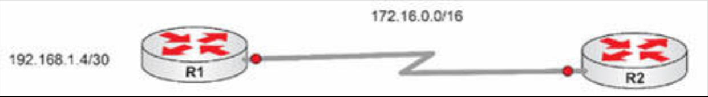

# 第 19 天实验

## RIPv2 实验

### 拓扑结构



### 实验目的

学习如何配置 RIPv2 及其排除故障。


### 实验步骤

1. 添加 IP 地址到所有接口，然后在其中的链路上 `ping`。我（作者）在这里使用了以太网，但若咱们愿意，咱们也可如上面的拓扑结构那样，使用一条串行链路；


    ```console
    R1(config)#int lo0
    R1(config-if)#ip add 192.168.1.5 255.255.255.252
    R1(config-if)#int f0/0
    R1(config-if)#ip add 172.16.1.1 255.255.0.0
    R1(config-if)#no shut
    ```

    ```console
    R2(config)#int f0/0
    R2(config-if)#ip add 172.16.1.2 255.255.0.0
    R2(config-if)#no shut
    R2(config-if)#end
    R2#ping 172.16.1.1

    Type escape sequence to abort.
    Sending 5, 100-byte ICMP Echos to 172.16.1.1, timeout is 2 seconds:
    .!!!!
    Success rate is 80 percent (4/5), round-trip min/avg/max = 24/31/44 ms
    ```


2. 使用 RIPv2 通告这些网络；

    ```console
    R1(config)#router rip
    R1(config-router)#version 2
    R1(config-router)#network 192.168.1.0
    R1(config-router)#network 172.16.0.0
    R1(config-router)#end
    ```

    ```console
    R2(config)#router rip
    R2(config-router)#ver 2
    R2(config-router)#network 172.16.0.0
    ```


3. 在 `R2` 上执行 `show ip route` 命令；

    ```console
    R2#show ip route
    Codes: C - connected, S - static, R - RIP, M - mobile, B - BGP
           D - EIGRP, EX - EIGRP external, O - OSPF, IA - OSPF inter area
           N1 - OSPF NSSA external type 1, N2 - OSPF NSSA external type 2
           E1 - OSPF external type 1, E2 - OSPF external type 2
           i - IS-IS, su - IS-IS summary, L1 - IS-IS level-1, L2 - IS-IS level-2
           ia - IS-IS inter area, * - candidate default, U - per-user static route
           o - ODR, P - periodic downloaded static route

    Gateway of last resort is not set

    C    172.16.0.0/16 is directly connected, FastEthernet0/0
    R    192.168.1.0/24 [120/1] via 172.16.1.1, 00:00:06, FastEthernet0/0
    ```

4. RIP 正对主网络边界自动汇总。要修复 `R1` 使这种情况不再发生。当咱们于 `R2` 上检查时，咱们会看到那条旧的 `/24` 路由出现。这条路由最终将从路由表中清理掉，或者咱们可执行 `clear ip route *` 命令；

    ```console
    R1(config)#router rip
    R1(config-router)#no auto-summary
    ```

    ```console
    R2#show ip route
    Codes: C - connected, S - static, R - RIP, M - mobile, B - BGP
           D - EIGRP, EX - EIGRP external, O - OSPF, IA - OSPF inter area
           N1 - OSPF NSSA external type 1, N2 - OSPF NSSA external type 2
           E1 - OSPF external type 1, E2 - OSPF external type 2
           i - IS-IS, su - IS-IS summary, L1 - IS-IS level-1, L2 - IS-IS level-2
           ia - IS-IS inter area, * - candidate default, U - per-user static route
           o - ODR, P - periodic downloaded static route

    Gateway of last resort is not set
    C    172.16.0.0/16 is directly connected, FastEthernet0/0
         192.168.1.0/24 is variably subnetted, 2 subnets, 2 masks
    R       192.168.1.0/24 [120/1] via 172.16.1.1, 00:00:40, FE0/0
    R       192.168.1.4/30 [120/1] via 172.16.1.1, 00:00:11, FE0/0
    ```

5. 执行一些 `show` 命令检查那些 RIP 设置。


    ```console
    R2#show ip rip database
    172.16.0.0/16    auto-summary
    172.16.0.0/16    directly connected, FastEthernet0/0
    192.168.1.0/24    auto-summary
    192.168.1.4/30
        [1] via 172.16.1.1, 00:00:12, FastEthernet0/0
    ```


    ```console
    R1#show ip protocols
    Routing Protocol is “rip”
      Outgoing update filter list for all interfaces is not set
      Incoming update filter list for all interfaces is not set
      Sending updates every 30 seconds, next due in 24 seconds
      Invalid after 180 seconds, hold down 180, flushed after 240
      Redistributing: rip
      Default version control: send version 2, receive version 2
          Interface             Send  Recv  Triggered RIP  Key-chain
          FastEthernet0/0       2     2                             
          Loopback0             2     2                             
      Automatic network summarization is not in effect
      Maximum path: 4
      Routing for Networks:
        172.16.0.0
        192.168.1.0
      Routing Information Sources:
        Gateway         Distance      Last Update
      Distance: (default is 120)
    ```
