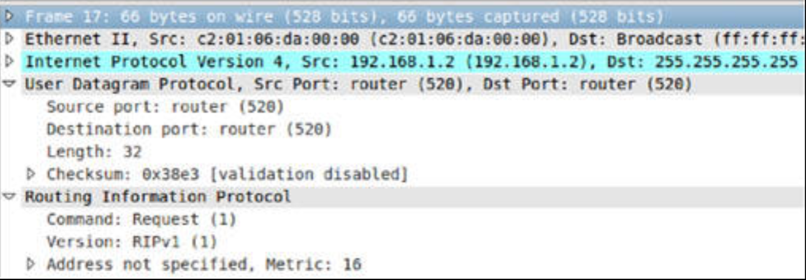
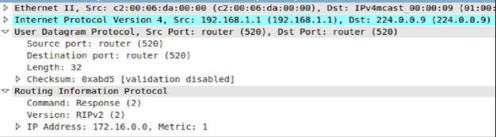
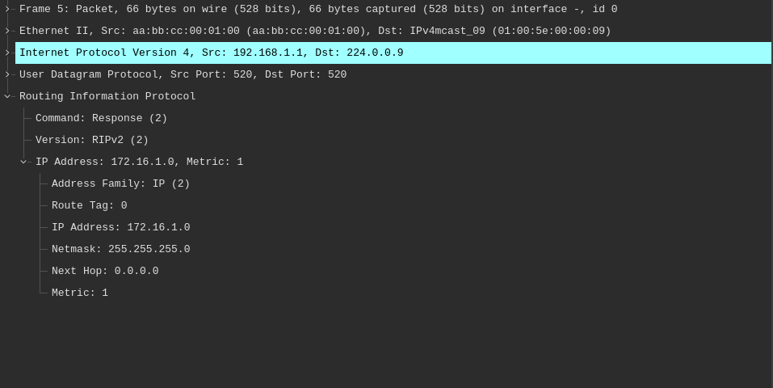
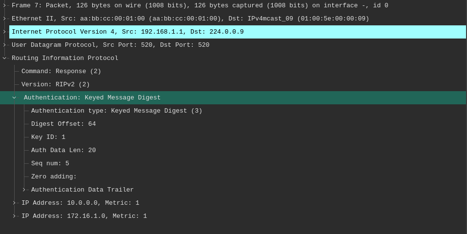

# 路由信息协议

RIPv1 是在网络规模还较小时创建的，因此跳数（路由器）限制的被设置为 15。这是为了阻止恶意的 RIP 数据包，无休止地穿越网络。早先咱们曾在 `debug ip rip` 输出下看到， RIP 会广播更新，并是有类的。因此，他没有 VLSM 的概念，意味着当咱们有个 `192.168.1.16/26` 网络时，他就会将其通告为 `192.168.1.0/24`。同样，他未提供身份验证，使其成为那些打算注入虚假路由更新到网络中攻击者的轻易目标。

在下图 19.1 中，咱们可以看到对 RIP 的的一次数据包捕获，演示了 RIPv1 使用 UDP 传输及端口 520 这一事实。



**图 19.1** -- **RIPv1 的数据包捕获**

下图 19.2 显示了用于上面数据包捕获的拓扑结构，左侧路由器配置的 RIP 部分，显示在下面。


**图 19.2** -- **RIP 的简单网络拓扑结构**


```console
R1(config-if)#router rip
R1(config-router)#network 172.16.0.0
R1(config-router)#net 192.168.1.0
```


请注意，咱们必须通告两台路由器之间的那个直连网络。在 `R2` 上，由于没有其他网络连接，咱们就只通告那个 `192` 的网络。

RIP 使用了诸如保持定时器与失效定时器等各种定时器，缓解一些路由问题。咱们还会看到那些已讨论过的路由更新、失效、保持、及刷新等设置计时器。

RIP 将在最多 16 条等价路径上负载均衡，但默认为 4 条（见下文）。


```config
R1(config-router)#maximum-paths ?
  <1-16>  Number of paths
```


通往所有路由信息的命令，是 `show ip protocols`。在咱们配置任何路由实验时，都要花时间阅读他的输出。


```console
R1#show ip protocols
Routing Protocol is “rip”
  Outgoing update filter list for all interfaces is not set
  Incoming update filter list for all interfaces is not set
  Sending updates every 30 seconds, next due in 10 seconds
  Invalid after 180 seconds, holddown 180, flushed after 240
  Redistributing: rip
  Default version control: send version 2, receive version 2
    Interface             Send  Recv  Triggered RIP  Key-chain
    FastEthernet0/0       2     2
  Automatic network summarization is not in effect
  Maximum path: 4  
  Routing for Networks:
     172.16.0.0
     192.168.1.0
```

当咱们检查路由表时，咱们就会看到 RIP 的管理距离，以及早先我们曾介绍过的那些输出。


```console
R2#show ip route
Codes: C - connected, S - static, R - RIP, M - mobile, B—BGP,
       D - EIGRP, EX - EIGRP external, O - OSPF, IA - OSPF inter area,
       N1 - OSPF NSSA external type 1, N2 - OSPF NSSA external type 2,
       E1 - OSPF external type 1, E2 - OSPF external type 2,
       i - IS-IS, su - IS-IS summary, L1 - IS-IS level-1,
       L2 - IS-IS level-2, ia - IS-IS inter area,
       * - candidate default, U - per-user static route,
       o - ODR, P - periodic downloaded static route

Gateway of last resort is not set

     172.16.0.0/24 is subnetted, 1 subnets
R       172.16.1.0 [120/1] via 192.168.1.1, 00:00:04, FastEthernet0/0
C    192.168.1.0/24 is directly connected, FastEthernet0/0
```

## RIPv2

RIP 的许多不足之处在版本 2 中都得以解决。对 VLSM 与 MD5 的身份验证支持被添加，同时经由广播的更新，被修改为对 `224.0.0.9` 的组播。我（作者）添加了版本 2 的命令，到上面的拓扑结构（在两台路由器上），咱们可在下图 19.3 中，看到新的数据包捕获。


```console
R1(config)#router rip
R1(config-router)#version 2
```




**图 19.3** -- **RIPv2 的数据包捕获**

要测试 VLSM 的支持，咱们可将 `R1` 上那个 `Loopback` 接口的 IP 地址，更改为 `172.16.1.1/24`，但咱们还需要添加 `no auto-summary` 命令，因为 RIP 的默认行为，是在网络跨越某个主要网络边界（所谓主要网络，是个某特定网络所属的有类网络）时，将该网络汇总到其自然的有类边界。咱们可以 `show ip protocols` 命令，看到这点。


```console
R1#show ip protocols
Routing Protocol is “rip”
  Outgoing update filter list for all interfaces is not set
  Incoming update filter list for all interfaces is not set
  Sending updates every 30 seconds, next due in 21 seconds
  Invalid after 180 seconds, holddown 180, flushed after 240
  Redistributing: rip
  Default version control: send version 2, receive version 2
    Interface             Send  Recv  Triggered RIP  Key-chain
    FastEthernet0/0       2     2
Automatic network summarization is in effect
```

以 `no auto-summary` 命令将其关闭：

```console
R1(config)#router rip
R1(config-router)#no auto-summary
R1(config-router)#int lo0
R1(config-if)#ip add 172.16.1.1 255.255.255.0
```



**图 19.4** -- **RIPv2 是无类的**


咱们不太可能会被问及 RIP 的那些高级特性，如身份验证及重分发等，因此我们在这里将不深入他们。


## RIP 的认证（译者补充）

RIPv2 的认证，通过使用明文或 MD5 的加密哈希值，验证源地址保障路由更新的安全性。该功能按接口进行配置，通常需要使用密钥链定义密码，其中 MD5 通过确保密码不以明文形式传输来提供更高的安全性。两台路由器必须匹配密钥 ID 和密钥字符串。

- **定义密钥链**，在全局配置模式下，创建一个密钥链，并定义密钥字符串（口令）；

    ```console
    key chain RIP_AUTH
    key 1
    key-string SECUREPASS
    ```

- **配置接口**，将认证模式（MD5 或明文）及密钥链应用到接口。

    ```console
    interface Serial0/0
    ip rip authentication mode md5
    ip rip authentication key-chain RIP_AUTH
    ```

配置完毕，捕获到带有认证的 RIPv2 数据包如下。




RIPv2 认证的关键特性：

- 认证模式：明文（默认，安全性低）或 MD5（安全，推荐）；
- 密钥链管理：支持配置多个具有不同有效期的密钥，实现无缝密钥轮换；
- 重放保护：MD5 认证包含序列号机制，防止旧数据包被重放利用；
- 功能特性：启用认证时，来自未认证对等的数据包将被丢弃；
- 版本限制：认证功能仅适用于 RIPv2 协议，不适用于 RIPv1。

## RIP 的被动接口

大多数路由协议，都提供了关闭某个接口上路由更新的能力。我们在这整本指南中，都曾详细介绍了 `passive-interface` 这条命令。这条命令的具体行为，将因协议而异。对于 RIP，他将在其被应用的接口上阻止路由更新组播，但传入更新将被接收并处理，以在路由数据表中使用。


```console
R1(config)#router rip
R1(config-router)#passive-interface loopback0
R1(config-router)#end
R1#show ip protocols
Routing Protocol is “rip”
  Outgoing update filter list for all interfaces is not set
  Incoming update filter list for all interfaces is not set
  Sending updates every 30 seconds, next due in 10 seconds
  Invalid after 180 seconds, holddown 180, flushed after 240
  Redistributing: rip
  Default version control: send version 2, receive version 2
    Interface             Send  Recv  Triggered RIP  Key-chain
    FastEthernet0/0       2     2
  Automatic network summarization is not in effect
  Maximum path: 4
  Routing for Networks:
    172.16.0.0
    192.168.1.0
  Passive Interface(s):
    Loopback0
  Routing Information Sources:
    Gateway         Distance      Last Update
  Distance: (default is 120)
```

在考试中，咱们可能会被给到一个问及为何某个邻居路由器，未在接收路由更新的故障排除实验或问题。这很可能就是原因所在！

## 配置 RIPv2

我们已经介绍了咱们将需要用以配置 RIP 的那些命令。与别的路由协议不同，咱们无需添加通配符或子网掩码，同时微调 RIP 的选项也很有限。一旦咱们的 IP 地址已被添加到接口（并且他们已使用 `no shut` 命令开启）后，就要进入路由器配置模式，添加那些咱们打算通告的网络（包括那些直连网络）。如咱们愿意，咱们可关闭自动汇总，并添加诸如身份验证及被动接口等任何其他选项。


```console
R1(config-if)#router rip
R1(config-router)#network 172.16.0.0
R1(config-router)#net 192.168.1.0
R1(config-router)#version 2
R1(config-router)#no auto-summary
R1(config-router)#passive-interface f0/1
```


接下来我们将讨论一些验证命令。


> *知识点*：
>
> + RIPv1
>   - was created when networks were small
>   - the hop(router) limit was set to 15, to prevent rogue RIP packets from endlessly traversing the network
>   - RIP broadcasts updates and is classful
>   - has no concept of VLSM
>   - offers no authentication, making it an easy target for attackers wanting to inject false route updates into the network
>   - uses UDP for transport and port 520
>   - uses various timers, such as hold down, invalid timers, and the set timers for route updates and flush, in order to mitigate routing issues
>   - will load balance over a maximum of 16 equal cost paths, but the default is 4
>   - the administrative distance for RIP is 120
>
> + RIPv2
>   - addressed many of the shortfalls with RIP
>   - added support for VLSM and MD5 authentication
>   - the updates via broadcasts, were changed to multicasts on `224.0.0.9`
>   - the default behavior for RIP, is to summarize the network to its natural classful boundary, when the network crosses a major network boundary. A major network, is a classful network that a particular network belongs to
>   + the advanced features of RIP
>       - authentication
>       - redistribution
>       - ...
>
> + RIP passive interfaces
>   - most routing protocols offer the ability to turn off routing updates per interface
>   - `passive-interface` actual behavior, will vary from protocol to protocol
>   - it will prevent route updates from being multicast from the interface it's applied to
>   - but incoming updates will be received and processed for use in the routing table
>   - it's the cause of why a neighbor router isn't receiving route updates
>
> + Configuring RIPv2
>   - don't need to add wildcard or subnet masks
>   - limited options to fine-tune it
