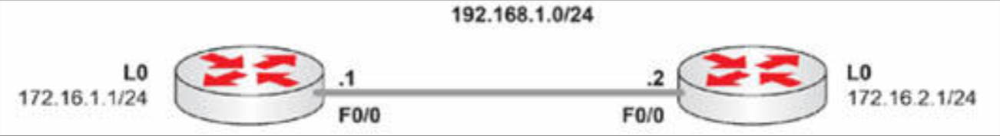

# RIP 故障排除

实际上，在咱们到了配置实验时，咱们将学到更多有关 RIP 故障排除的知识。

大多数 RIP 的问题，都与管理员错误输入命令，或误解 VLSM 有关。我们稍后将介绍 IP 的故障排除，但请仔细检查咱们的路由器接口是否起来（物理和逻辑上）。还要检查咱们的 IP 地址和子网掩码是否正确。

当咱们无法在某条直连链路上 `ping` 通时，那么咱们在检查路由问题前，先解决这个问题。接下来，要检查咱们的路由配置。咱们需要确保，其中没有一些不想要的被动接口，并确保咱们已配置正确网络。


当咱们有个诸如下面的不连续网络时，那么咱们将需要确保咱们已在 **每个** 路由器上，都配置了 `no auto-summary`。在下图 19.5 中，网络设计者做得很糟糕，在另一网络类的两端划分了 `172.16.x.x` 这个网络。当自动摘要特性启用时，路由问题就不可避免。



**图 19.5** -- **一个不连续网络**

咱们可在咱们的网络上总体调试 RIP，也可以深入到三项具体调试，但要记住，这可能产生大量输出，导致咱们的路由器或 `telnet` 会话崩溃。


```console
R1#debug ip rip ?
  database  RIP databas events
  events    RIP protocol events
  trigger   RIP trigger extension
  <cr>
```


CCNA 考试大纲之外的其他故障，包括认证错误及路由过滤等。咱们可能被问及水平分割（早先已涉及）、超过最大跳数，或防火墙阻止 RIP 流量等问题。同样，要记住 ACL 会过滤所有那些未明确允许的流量。我们会在 ACL 部分，介绍经由一个 ACL 条目放行 RIP。


为了验证 RIP 及对其排除故障，咱们会用到下面的命令（以及上面的调试命令），我（作者）建议咱们在咱们配置的任何 RIP 实验中，尝试这些命令。


```console
show ip route
show ip route rip
show ip protocols
show ip rip database
```


> *知识点*：
>
> - most RIP issues, are related to the administrator mistyping commands, or misunderstanding VLSM
>
> - double-check the interfaces are up, physically and logically
>
> - no unwanted passive interfaces
>
> - a discontiguous network
>
> - debug RIP on network generally, or drill down to three specific debugs: `database`, `events` and `trigger`
>
> + Other issues include:
>   - authentication mistakes
>   - route filtering
>   - split horizon
>   - exceeding the maximum hop count
>   - a firewall blocking RIP traffic
>   - ACLs filter all traffic not specifically permitted, permitting RIP via an ACL entry


请参加 [Free CCNA Training Bonus – Cisco CCNA in 60 Days v4](https://www.in60days.com/free/ccnain60days/) 处今天的考试。
