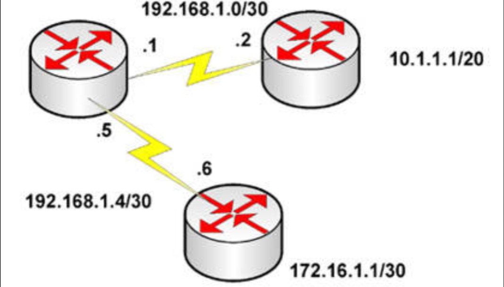
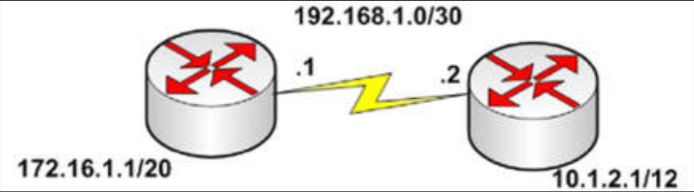

# 第 20 天 复习日

## 第 20 天任务

- 复习前 3 天的课文及实验；
- 阅读 CCNA 补习指南；
- 完成今天的挑战实验；
- 参加 [Free CCNA Training Bonus – Cisco CCNA in 60 Days v4](https://www.in60days.com/free/ccnain60days/) 处今天的考试；
- 在 subnetting.org 上花 15 分钟。

到目前为止，我们已经学习了很多内容。不过，不要担心还有多少内容要学习。请回顾一下路由概念、静态路由及 RIP 的一些学习要点。

今天要花一些时间重复前几天的实验，要在不看我（作者）实验步骤下，尽力配置他们。要使用问号（`?`）而不是看我的答案。咱们还需要开始凭记忆写出补习指南。

## 挑战 1 -- 静态路由的实验

### 拓扑结构

### 实验说明

以串口或以太网的连接，把其中三个路由器连接在一起。

1. 配置这些路由器之间的连接，并 `ping`；
2. 根据该图，添加一些环回地址到两个分支路由器；
3. 在中心路由器为 `10.1.1.0/20` 子网添加一个静态路由出口接口；
4. 为网络 `172.16.1.0/30` 添加一个下一跳地址；
5. `ping` 这两个网络；
6. 执行一条 `show ip route 172.16.1.1` 命令，并针对 `10.1.1.1` 执行同一操作；
7. 确认上述出口接口及下一跳地址均已列出。

除非咱们添加更多静态路由，否则咱们将无法从一个边缘路由器 `ping` 通另一边缘路由器。

## 挑战 2 -- RIPv2 实验

### 拓扑结构

### 实验说明

使用串口或以太网的连接，将两台路由器连接在一起。

1. 配置两台路由器之间的连接，并 `ping`；
2. 根据该图，添加一些环回地址到两台路由器；
3. 在两台路由器上配置 RIPv2；
4. 执行 `show ip route` 命令，并检查两个路由器上的所有网络；
5. 在两个路由器上配置 `no auto-summary`，并检查 `/12` 与 `/20` 的路由；
6. 哪条命令会显示到咱们，那些正被通告的网络、自动摘要及 RIP 的定时器？

