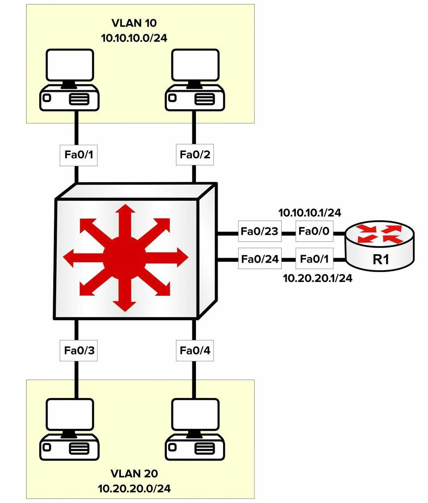

# VLAN 间路由


默认情况下，虽然 VLAN 可跨越整个二层交换网络，但一个 VLAN 中的主机无法与另一 VLAN 中的主机直接通信。为了这样做，流量必须在不同 VLAN 间得以路由。这就叫做 VLAN 间路由。在交换式 LAN 中实现 VLAN 间路由的三种方法，包括他们的优缺点，将在接下来的小节中介绍：

- 使用物理路由器接口的 VLAN 间路由
- 使用路由器子接口的 VLAN 间路由
- 使用交换式虚拟接口的 VLAN 间路由

## 使用物理路由器接口的 VLAN 间路由

实现 VLAN 间路由通信的第一种方法，意味着使用带有多个物理接口的一个路由器，作为每个单独配置 VLAN 的默认网关。该路由器随后便可使用这些物理的 LAN 接口，路由接收自一个 VLAN 的数据包到另一 VLAN。这种方法如下图 21.1 中所示。





<a name="f-21.1"></a>
**图 21.1** -- **使用多个物理路由器接口的 VLAN 间路由**

图 21.1 展示了用到两个不同 VLAN 的单台交换机，每个 VLAN 都有个分配的 IP 子网。虽然图中所示的网络主机，均连接到同一物理交换机，但由于他们位于不同 VLAN 中，那么 `VLAN 10` 和 `VLAN 20` 中主机之间的数据包，就必须被路由。同一 VLAN 内的数据包，则只需交换即可。

使用这种解决方案的主要优点，是简单易行。但主要缺点，则是其无法扩展。例如，当有 5 个、10 个甚至 20 个额外 VLAN 配置在该交换机上时，那么在路由器上也将需要与 VLAN 同样数量的物理接口。在大多数情形下，这在技术上是不可行的。


在使用多个物理的路由器接口时，连接到路由器的每个交换机链路，都会被配置为所需 VLAN 中的接入链路。路由器上的物理接口随后被配置以适当的 IP 地址。网络主机要么被静态地配置以相应 VLAN 中 IP 地址的同时，使用物理路由器接口作为默认网关，或通过使用 DHCP 动态地配置。[图 21.1](#f-21.1) 中所示的交换机配置，如下输出所示：

```console
VTP-Server-1(config)#vlan 10
VTP-Server-1(config-vlan)#name Example-VLAN-10
VTP-Server-1(config-vlan)#exit
VTP-Server-1(config)#vlan 20
VTP-Server-1(config-vlan)#name Example-VLAN-20
VTP-Server-1(config-vlan)#exit
VTP-Server-1(config)#interface range FastEthernet0/1 – 2, 23
VTP-Server-1(config-if-range)#switchport
VTP-Server-1(config-if-range)#switchport access vlan 10
VTP-Server-1(config-if-range)#switchport mode access
VTP-Server-1(config-if-range)#exit
VTP-Server-1(config)#interface range FastEthernet0/3 – 4, 24
VTP-Server-1(config-if-range)#switchport
VTP-Server-1(config-if-range)#switchport access vlan 20
VTP-Server-1(config-if-range)#switchport mode access
VTP-Server-1(config-if-range)#exit
```

正如咱们所知，`switchport` 命令在 2960 交换机上并不需要，因为接口已运行于二层模式下。

[图 21.1](#f-21.1) 中所示的路由器，被配置为如下输出中所示：

```console
R1(config)¥interface FastEthernet0/0
R1(config-if)#ip add 10.10.10.1 255.255.255.0
RI(config-if)#exit
R1(config)#interface FastEthernet0/1
R1(config-if)#ip add 10.20.20.1 255.255.255.0
RI(config-if)#exit
```

## 使用路由器子接口的 VLAN 间路由

通过使用子接口实现 VLAN 间路由，解决了使用多个物理路由器接口时，可能的扩展性问题。在子接口下，路由器上只需要一个物理接口，而后续一些子接口就会在这个物理接口上配置出来。这在下图 21.2 中得以演示。


<a name="f-21.2"></a>
**图 21.2** -- **使用路由器子接口的 VLAN 间路由**

图 21.2 描述了 [图 21.1](#f-21.1) 中所示的同一局域网。但在图 21.2 中，只有一个物理路由器接口被用到。为了实现一种 VLAN 间路由方案，通过使用 `interface [name] [subinterface number]` 这条全局配置命令，一些子接口就在那个主物理路由器接口上配置了出来。而使用 `encapsulation [isl|dot1Q] [vlan]` 这条子接口配置命令，每个子接口便与某个特定 VLAN 关联起来。最后一步是要在接口上，配置所需的 IP 地址。

在交换机上，连接到路由器的单一链路，必须配置为一条中继链路，因为路由器不支持 DTP。当该中继被配置为 802.1Q 的中继时，那么当某个非默认的 VLAN，将被用作原生 VLAN 时，则某个原生 VLAN 就必须要定义出来。这个原生 VLAN，还必须使用 `encapsulation dot1Q [vlan] native` 这条子接口配置命令，配置在相应的路由器子接口上。

以下输出演示了使用单个物理接口的 VLAN 间路由配置（也称为 ”单臂路由器“）。[图 21.2](#f-21.2) 中描述的两个 VLAN 显示于下面的输出中，此外还有个用于管理的额外 VLAN； 这个 VLAN 将被配置为原生 VLAN。

```console
VTP-Server-1(config)#vlan 10
VTP-Server-1(config-vlan)#name Example-VLAN-10
VTP-Server-1(config-vlan)#exit
VTP-Server-1(config)#vlan 20
VTP-Server-1(config-vlan)#name Example-VLAN-20
VTP-Server-1(config-vlan)#exit
VTP-Server-1(config)#vlan 30
VTP-Server-1(config-vlan)#name Management-VLAN
VTP-Server-1(config-vlan)#exit
VTP-Server-1(config)#interface range FastEthernet0/1 – 2
VTP-Server-1(config-if-range)#switchport
VTP-Server-1(config-if-range)#switchport access vlan 10
VTP-Server-1(config-if-range)#switchport mode access
VTP-Server-1(config-if-range)#exit
VTP-Server-1(config)#interface range FastEthernet0/3 – 4
VTP-Server-1(config-if-range)#switchport
VTP-Server-1(config-if-range)#switchport access vlan 20
VTP-Server-1(config-if-range)#switchport mode access
VTP-Server-1(config-if-range)#exit
VTP-Server-1(config)#interface FastEthernet0/24
VTP-Server-1(config-if)#switchport
VTP-Server-1(config-if)#switchport trunk encapsulation dot1q
VTP-Server-1(config-if)#switchport mode trunk
VTP-Server-1(config-if)#switchport trunk native vlan 30
VTP-Server-1(config-if)#exit
VTP-Server-1(config)#interface vlan 30
VTP-Server-1(config-if)#description ‘This is the Management Subnet’
VTP-Server-1(config-if)#ip address 10.30.30.2 255.255.255.0
VTP-Server-1(config-if)#no shutdown
VTP-Server-1(config-if)#exit
VTP-Server-1(config)#ip default-gateway 10.30.30.1
```

[图 21.2](#f-21.2) 所示的路由器，配置为如下输出中这样：


```console
R1(config)#interface FastEthernet0/0
R1(config-if)#no ip address
R1(config-if)#no shut <- 这一步相当重要，否则子接口也会处于 down down 状态
R1(config-if)#exit
R1(config)#interface FastEthernet0/0.10
R1(config-subitf)#description ‘Subinterface For VLAN 10’
R1(config-subif)#encapsulation dot1Q 10
R1(config-subif)#ip add 10.10.10.1 255.255.255.0
R1(config-subif)#exit
R1(config)#interface FastEthernet0/0.20
R1(config-subitf)#description ‘Subinterface For VLAN 20’
R1(config-subif)#encapsulation dot1Q 20
R1(config-subif)#ip add 10.20.20.1 255.255.255.0
R1(config-subif)#exit
R1(config)#interface FastEthernet0/0.30
R1(config-subitf)#description ‘Subinterface For Management’
R1(config-subif)#encapsulation dot1Q 30 native
R1(config-subif)#ip add 10.30.30.1 255.255.255.0
R1(config-subif)#exit
```

这种解决方案的主要优点，是路由器上只需要单个物理接口。主要缺点则是，这个物理接口带宽会在各个配置子接口间共享。因此，当有大量 VLAN 间流量时，那么路由器会很快成为网络的瓶颈。

## 使用交换虚拟接口进行 VLAN 间路由选择

多层交换机支持在物理接口上配置 IP 地址。但是，这些接口必须配置以 `no switchport` 这条接口配置命令，以允许管理员在其上配置 IP 分址。除了使用物理接口外，多层交换机还支持交换虚拟接口（SVI）。

所谓 SVI，属于表示某个 VLAN 的一些逻辑接口。虽然 SVI 表示某个 VLAN，但在某个 VLAN 于交换机上配置出来时，SVI 并不会自动得以配置；SVI 必须由管理员，使用 `interface vlan [number]` 这条全局配置命令手动予以配置。然后有关该 SVI 的一些诸如 IP 分址等三层配置参数，会以如同对某个物理接口的同样方式得以配置。


下面的输出演示了在某单个交换机上，实现 VLAN 间路由的 SVI 配置。此输出引用了这个小节前面配置输出中，用到的那些 VLAN。

```console
VTP-Server-1(config)#vlan 10
VTP-Server-1(config-vlan)#name Example-VLAN-10
VTP-Server-1(config-vlan)#exit
VTP-Server-1(config)#vlan 20
VTP-Server-1(config-vlan)#name Example-VLAN-20
VTP-Server-1(config-vlan)#exit
VTP-Server-1(config)#interface range FastEthernet0/1 – 2
VTP-Server-1(config-if-range)#switchport
VTP-Server-1(config-if-range)#switchport mode access
VTP-Server-1(config-if-range)#switchport access vlan 10
VTP-Server-1(config-if-range)#exit
VTP-Server-1(config)#interface range FastEthernet0/3 – 4
VTP-Server-1(config-if-range)#switchport
VTP-Server-1(config-if-range)#switchport mode access
VTP-Server-1(config-if-range)#switchport access vlan 20
VTP-Server-1(config-if-range)#exit
VTP-Server-1(config)#interface vlan 10
VTP-Server-1(config-if)#description “SVI for VLAN 10”
VTP-Server-1(config-if)#ip address 10.10.10.1 255.255.255.0
VTP-Server-1(config-if)#no shutdown
VTP-Server-1(config-if)#exit
VTP-Server-1(config)#interface vlan 20
VTP-Server-1(config-if)#description ‘SVI for VLAN 10’
VTP-Server-1(config-if)#ip address 10.20.20.1 255.255.255.0
VTP-Server-1(config-if)#no shutdown
VTP-Server-1(config-if)#exit
```

在使用多层交换机时，SVI 是配置和实施 VLAN 间路由解决方案的推荐方式。

咱们可通过使用 `show interface vlan x` 命令，验证 SVI 是否配置正确（IP 分址等）。输出与 `show interface x` 命令完全一致。

```console
Switch#show interfaces vlan 100
Vlan100 is up, line protocol is down
    Hardware is EtherSVI, address is c200.06c8.0000 (bia c200.06c8.0000)
    Internet address is 10.10.10.1/24
    MTU 1500 bytes, BW 100000 Kbit/sec, DLY 100 usec,
        reliability 255/255, txload 1/255, rxload 1/255
    Encapsulation ARPA, loopback not set
    ARP type: ARPA, ARP Timeout 04:00:00
```

当咱们希望使用一台 2960 交换机路由 IP 数据包时，其将需要一项配置修改及重新加载。原因是 2960 交换机及一些较新型号的交换机，已调整为以某种确切方式分配资源。这种资源管理方式，称为交换机的数据库管理 (SDM) 模板。咱们的选择包括以下这些：

- 默认 -- 平衡所有功能
- 双 IPv4/IPv6 -- 用于一些双协议栈环境
- Lanbase 的路由 -- 支持单播路由
- QoS -- 提供 QoS 特性的支持


以下是我（作者）的 3750 交换机上的一些选项。他们与 2960 的选项并不完全一致，但咱们会明白这个概念。同样，请记住咱们的交换机型号和 IOS，会影响这些配置选项，因此请查看咱们型号的配置指南。


```console
Switch(config)#sdm prefer ?
    access                  Access bias
    default                 Default bias
    dual-ipv4-and-ipv6      Support both IPv4 and IPv6
    ipe                     IPe bias
    lanbase-routing         Unicast bias
    vlan                    VLAN bias
```

当咱们希望在咱们的 2960 交换机上配置 VLAN 间路由时，那么 Lanbase 路由就需要开启。在更改生效前，咱们还将需要重新加载交换机。下面是 `show sdm prefer` 命令的输出，其告诉咱们当前的 SDM 配置与资源分配情况。


```console
Switch#show sdm prefer
The current template is “desktop default” template.
The selected template optimizes the resources in
the switch to support this level of features for
8 routed interfaces and 1024 VLANs.
    number of unicast mac addresses:                6K
    number of IPv4 IGMP groups + multicast routes:  1K
    number of IPv4 unicast routes:                  8K
        number of directly-connected IPv4 hosts:    6K
        number of indirect IPv4 routes:             2K
    number of IPv4 policy based routing aces:       0
    number of IPv4/MAC qos aces:                    0.5K
    number of IPv4/MAC security aces:               1K
Switch#
```

> *知识点*：
>
> - Inter-VLAN routing
>
> - VLANs can span the entire Layer 2 switched network
>
> - In order for hosts in one VLAN can communicate directly with the hosts in another VLAN, traffic must be routed between different VLANs
>
> + three methods for implementing inter-VLAN routing, in switched LANs
>   - using physical router interfaces
>   - using router sub interfaces
>   - using switched virtual interfaces, SVIs
>
>
> + Using Physical Router Interfaces
>   - entails using a router with multiple physical interfaces, as the default gateway for each individually-configured VLAN
>   - the router can then route packets from one VLAN to another by using these physical LAN interfaces
>   - the packets within the same VLAN, are simply switched
>   - it is simple and easy to implement
>   - it is not scalable, the same number of physical interfaces as VLANs, would also be needed on the router, and this is technically not feasible
>   - each switch link connected to the router, is configured as an access link in the desired VLAN
>   - the physical interfaces on the router, are then configured with the appropriate IP address
>   - the network hosts are either statically configured with IP addresses in the appropriate VLAN, by using the physical router interfaces as the default gateway, or dynamically configured by using DHCP
>
> + Using Router Sub Interfaces
>   - addresses the scalablility issues, which are possible when using the multiple physical router interfaces
>   - only a single physical interface is required on the router, and subsequent sub interfaces are configured off that physical interface
>   - sub interfaces are configured off the main physical router interface, by using the `interface [name].[subinterface number]` global configuration command
>   - each sub interface is associated with a particular VLAN, using the `encapsulation [isl|dotqQ]` sub interface configuration command
>   - the final step, is to configure the desired IP address on the interface
>   - the single switch link which is connected to the router, must be configured as a trunk link, because routers don't support DTP
>   - when the trunk is configured as an 802.1Q trunk, a native VLAN must be defined, if a VLAN other than the default will be used as the native VLAN
>   - this native VLAN, must also be configured on the respective router sub interface, by using the `encapsulation dot1Q [vlan] native` sub interface configuration command
>   - an additional VLAN used for Management, this VLAN will be configured as the native VLAN
>   - only a single physical interface is required on the router
>   - the bandwidth of the physical interface, is shared between the various configured sub interfaces, the router can quickly become a bottleneck in the network
>
> + Using Switched Virtual Interfaces
>   - multilayer switches support the configuration of IP addressing on physical interfaces
>   - these interfaces must be configured with the `no switchport` interface configuration command, to allow administrators to configure IP addressing on them
>   - multilayer switches also support Switched Virtual Interfaces, SVIs
>   - SVIs are logical interfaces that represent a VLAN, is not automatically configured when a Layer 2 VLAN is configured on the switched
>   - it must be manually configured by the administrators, by using the `interface vlan [number]` global configuration command
>   - the Layer 3 configuration parameters, such as IP addressing, are then configured on the SVI, in the same manner as on a Physical interface
>   - SVIs are the recommended method for configuring and implementing an inter-VLAN routing solution
>
> - When using a 2960 switch to route IP packets, a configuration change and reload are required, because the 2960 and newer model switches, are tunned to allocate resources in a certain way
>
> + the resource management, is called the Switch Database Management, SDM
>   - Default -- balances all functions
>   - Dual IPv4/IPv6 -- for use in dual-stack environments
>   - Lanbase-routing -- supports Unicast routes
>   - QoS -- gives support for QoS features
>
> - switch model and IOS will affect the configuration options
>
> - Lanbase-routing needs to be enabled, if we wish to configure inter-VLAN routing on 2960 switch, also a reload is needed to make the change taking effect
>
> - the current SDM configuration and resource allocation, being told with the output of `show sdm prefer` command


