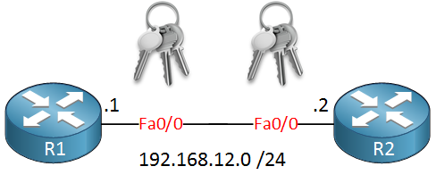
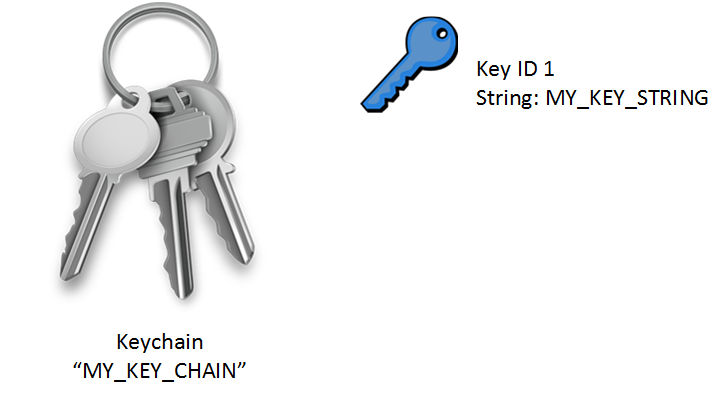
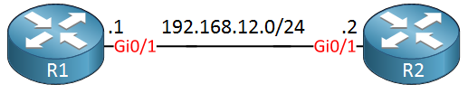
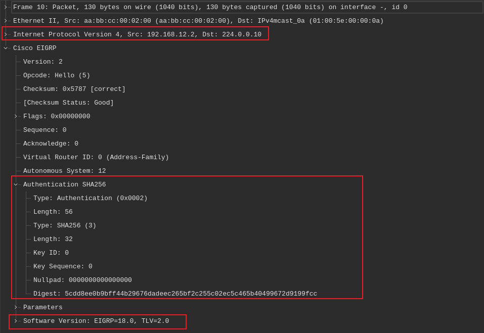
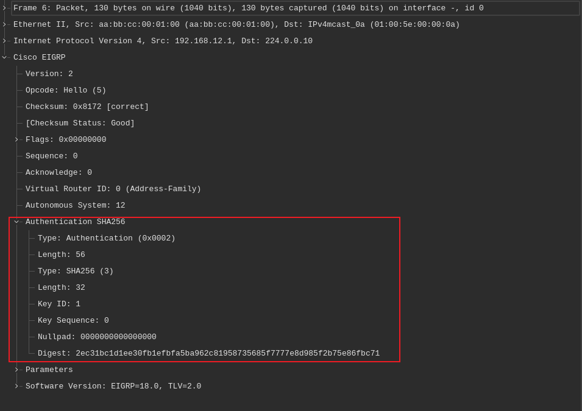

# EIGRP 认证配置

路由协议可配置为防止接收虚假路由更新，EIGRP也不例外。当咱们未启用身份验证，而运行着 EIGRP 时，那么攻击者就会试图与咱们的某台路由器建立 EIGRP 邻接关系，进而干扰咱们的网络......我们当然不希望这种情况发生，对吧？


EIGRP支持 MD5 的身份验证，与 [SHA 的身份验证](#sha-的身份验证)。没有明文的身份验证。

身份验证能带来什么？

- 咱们的路由器验证其接收到的每个路由更新数据包；
- 阻止未经证实来源的虚假路由更新；
- 忽略恶意路由更新。

潜在黑客可能携带笔记本电脑潜伏在您的网络中，引导某一虚拟思科路由器并尝试以下操作：

- 与咱们的某台路由器建立邻接关系并发布垃圾路由；
- 发送恶意数据包，看看咱们是否会丢弃咱们授权路由器的邻居邻接关系。


## 配置（MD5）

要配置 EIGRP 的身份验证，我们需要完成以下操作：

+ 配置一个密钥链
    + 在该密钥链下配置一个密钥 ID
        - 指定出该密钥 ID 的口令
        - 可选操作：指定该密钥的接受与超时生命周期

咱们来使用两个路由器，并看看咱们是否能配置 EIGRP 的 MD5 身份验证：




两个路由器的配置都很基础：


```console
R1(config)#interface fastEthernet 0/0
R1(config-if)#ip address 192.168.12.1 255.255.255.0

R1(config)#router eigrp 12
R1(config-router)#network 192.168.12.0
```


```console
R2(config)#interface fastEthernet 0/0
R2(config-if)#ip address 192.168.12.2 255.255.255.0

R2(config)#router eigrp 12
R2(config-router)#network 192.168.12.0
```

我们需要配置的第一件事，便是一个密钥链：




我将我的称为 `"MY_KEY_CHAIN"`，而两个路由器上的名字可以不同。名字没关系。不过密钥 ID 是两个路由器上必须匹配的值，当然，密钥字符串是必须匹配的密码。这是配置密钥链的方法：

```console
R1(config)#key chain MY_KEY_CHAIN
R1(config-keychain)#key 1
R1(config-keychain-key)#key-string MY_KEY_STRING

R1(config)#interface fastEthernet 0/0
R1(config-if)#ip authentication mode eigrp 12 md5
R1(config-if)#ip authentication key-chain eigrp 12 MY_KEY_CHAIN
```

首先，咱们必须创建密钥链，然后在接口上激活他。其中 `"12"` 是 EIGRP 的 AS 编号。我们可以启用一个调试，检查身份验证是否正常工作：

```console
R2#debug eigrp packets
EIGRP Packets debugging is on
    (UPDATE, REQUEST, QUERY, REPLY, HELLO, IPXSAP, PROBE, ACK, STUB, SIAQUERY, SIAREPLY)

R2# EIGRP: FastEthernet0/0: ignored packet from 192.168.12.1, opcode = 5 (authentication off or key-chain missing)
```

咱们可通过使用 `debug eigrp packets` 命令，检查咱们的配置是否正确。可以看到我们接收到了一个带有 MD5 认证的数据包，但尚未在 R2 上启用 MD5 认证。让我们来修复这个问题：


```console
R2(config)#key chain MY_KEY_CHAIN
R2(config-keychain)#key 1
R2(config-keychain-key)#key-string MY_KEY_STRING

R2(config)#interface fastEthernet 0/0
R2(config-if)#ip authentication mode eigrp 12 md5
R2(config-if)#ip authentication key-chain eigrp 12 MY_KEY_CHAIN
```


我（作者）立刻就能看到 EIGRP 邻居邻接关系正在正常工作：

```console
*Mar  1 00:37:17.195: %DUAL-5-NBRCHANGE: IP-EIGRP(0) 12: Neighbor 192.168.12.1 (FastEthernet0/0) is up: new adjacency
```

> **参考**：[How to configure EIGRP Authentication](https://networklessons.com/eigrp/how-to-configure-eigrp-authentication)


## EIGRP SHA 的身份验证


EIGRP 最初仅支持 MD5 认证，但自 IOS 15.1(2)S 和 15.2(1)T 版本起，我们也可使用 SHA-256 的认证。如今这种认证方式比 MD5 安全得多。

MD5 认证可在经典模式或命名模式下配置，而 SHA 认证仅支持命名模式下配置。在咱们配置 SHA 认证时，可选择仅使用接口口令或包含某一密钥链。仅使用口令的优势在于配置更简便（仅需一条命令），但缺点是当需要修改口令时，只要咱们修改了咱们一台路由器上的口令，那么邻居邻接关系就会立即中断。

在咱们使用密钥链时，咱们则可使用在允许咱们不破坏邻居邻接下切换口令的轮换密钥。在这一小节中，我（作者）将演示两种配置方案的具体操作。


## EIGRP SHA 认证的示例配置

下面是我们将使用的拓扑结构：



针对这个示例，我们只需两个路由器。


### 口令认证

我们来从单一口令选项开始。我们需要配置 EIGRP 的命名模式，并在地址族接口配置下查看：

```console
R1(config)#router eigrp R1_R2
R1(config-router)#address-family ipv4 unicast autonomous-system 12
R1(config-router-af)#network 192.168.12.0
R1(config-router-af)#af-interface GigabitEthernet 0/1

R1(config-router-af-interface)#authentication mode ?
  hmac-sha-256  HMAC-SHA-256 Authentication
  md5           Keyed message digest
```

上面咱们可以看到，我们可选择认证方式。我们来选择 `hmac-sha-256` 并设置一个口令：


```console
R1(config-router-af-interface)#authentication mode hmac-sha-256 XFOSSDOTCOM
```

这就是全部了。现在，`R1` 的 `GigabitEthernet0/1` 接口上已启用 SHA 身份验证，口令为 `"XFOSSDOTCOM"`。我们也来配置 `R2`：


```console
R2(config)#router eigrp R1_R2
R2(config-router)#address-family ipv4 unicast autonomous-system 12
R2(config-router-af)#network 192.168.12.0
R2(config-router-af)#af-interface GigabitEthernet 0/1
R2(config-router-af-interface)#authentication mode hmac-sha-256 XFOSSDOTCOM
```

这就是我们所要做的全部。我们来验证一下我们的工作：

```console
R1#show eigrp address-family ipv4 neighbors
EIGRP-IPv4 VR(R1_R2) Address-Family Neighbors for AS(12)
H   Address                 Interface              Hold Uptime   SRTT   RTO  Q  Seq
                                                   (sec)         (ms)       Cnt Num
0   192.168.12.2            Gi0/1                    14 00:03:19    9   100  0  4
```

```console
R2#show eigrp address-family ipv4 neighbors
EIGRP-IPv4 VR(R1_R2) Address-Family Neighbors for AS(12)
H   Address                 Interface              Hold Uptime   SRTT   RTO  Q  Seq
                                                   (sec)         (ms)       Cnt Num
0   192.168.12.1            Gi0/1                    11 00:03:32    8   150  0  4
```


看来我们有了一个邻居邻接关系。身份验证是否已启用？我们来确认一下：


```console
R1#show eigrp address-family ipv4 interfaces detail Gi0/1 | include Auth
  Authentication mode is HMAC-SHA-256, key-chain is not set
```

```console
R2#show eigrp address-family ipv4 interfaces detail Gi0/1 | include Auth
  Authentication mode is HMAC-SHA-256, key-chain is not set
```

这一输出确认了身份验证已启用。




*EIGRP 单一口令 SHA 认证的数据包捕获*


### 密钥链认证

除口令外，我们还将添加一个有着单一密钥 ID 及密钥字符串的密钥链。我们来从密钥链开始：


```console
R1(config)#key chain R1_R2_CHAIN
R1(config-keychain)#key 1
R1(config-keychain-key)#key-string NETCOMM
R1(config-keychain-key)#exit
```


```console
R2(config)#key chain R1_R2_CHAIN
R2(config-keychain)#key 1
R2(config-keychain-key)#key-string NETCOMM
R2(config-keychain-key)#exit
```

要注意这里的密钥字符串（`"NETCOMM"`）不同于我（作者）之前使用的密码（`"XFOSSDOTCOM"`）。我们来配置 EIGRP 使用这一密钥链：


```console
R1(config)#router eigrp R1_R2
R1(config-router)#address-family ipv4 unicast autonomous-system 12
R1(config-router-af)#af-interface GigabitEthernet 0/1
R1(config-router-af-interface)#authentication key-chain R1_R2_CHAIN
```

```console
R2(config)#router eigrp R1_R2
R2(config-router)#address-family ipv4 unicast autonomous-system 12
R2(config-router-af)#af-interface GigabitEthernet 0/1
R2(config-router-af-interface)#authentication key-chain R1_R2_CHAIN
```

EIGRP 现将针对身份验证使用密钥链。我们可通过以下命令验证这点：

```console
R1#show eigrp address-family ipv4 interfaces detail Gi0/1 | include Auth
  Authentication mode is HMAC-SHA-256, key-chain is "R1_R2_CHAIN"
```

```console
R2#show eigrp address-family ipv4 interfaces detail Gi0/1 | include Auth
  Authentication mode is HMAC-SHA-256, key-chain is "R1_R2_CHAIN"
```

上面咱们可以看到，我们正使用密钥链。操作就这么简单。

**注意**：在上面的示例中，我（作者）已在千兆接口上配置了全部设置。咱们也可以通过使用默认接口（`af-interface default`），全局配置 SHA 的认证。




*EIGRP 密钥链的 SHA 身份验证数据包捕获*


> **参考**：[EIGRP SHA Authentication](https://networklessons.com/eigrp/eigrp-sha-authentication)
