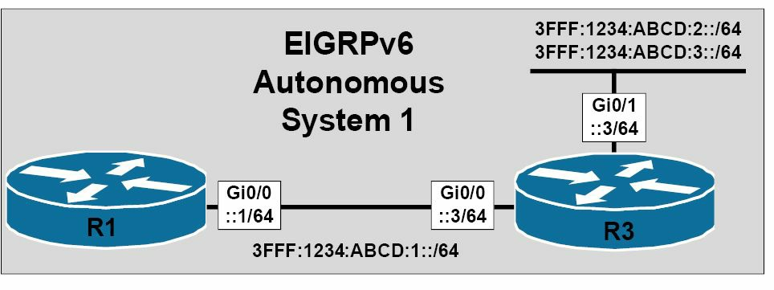

# 思科 IOS 软件 EIGRPv4 与 EIGRPv6 配置差异

思科 IOS 软件中对 EIGRPv4 与 EIGRPv4 的配置上，有着一些显著的差异。那么第一个显著差异就在于开启受路由的协议方式的不同。对于 EIGRPv4 来说，需要使用全局配置命令`router eigrp [ASN]`来开启 EIGRPv4 的路由，并指定该 EIGRPv4 自治系统编号。而在配置 EIGRPv6 时，则是使用`ipv6 router eigrp [ASN]`来开启 EIGRPv6 并指定出**本地路由器ASN**了（There are some notable differences in the configuration of EIGRPv4 and EIGRPv6 in Cisco IOS software. The first notable difference is the way in which the routing protocol is enabled. For EIGRPv4, the `router eigrp [ASN]` global configuration command is required to enable EIGRPv4 routing and to specify the EIGRPv4 autonomous system number(ASN). When configuring EIGRPv6, the `ipv6 router eigrp [ASN]` global configuration command is used instead to enable EIGRPv6 and to specify **the local router ASN**）。

尽管 EIGRPv4 与 EIGRPv6 的开启有些类似，但在两个路由进程开启之后的协议状态中，是有着非常显著的不同的。默认在开启了 EIGRPv4 时，该协议就自动启动，并在其假定有桌正确配置的情况下，开始在所有指定的运作接口上发送 Hello 数据包。而当在思科 IOS 软件中启用 EIGRPv6 时，默认情况下在该协议被开启后，其将保持关闭状态。这就意味着就算在某些指定接口下得以开启，在执行路由器配置命令`no shutdown`之前， EIGRP 进程仍不是运作中的（While enabling EIGRPv4 and EIGRPv6 is somewhat similar, there is a very notable and significant difference in the protocol states once the routing process has been enabled. By default, when EIGRPv4 is enabled, the protocol automatically starts and, assuming correct configuration, begins sending Hello packets on all specified interfaces. When enabling EIGRPv6 in Cisco IOS software, by default, after the protocol has been enabled, it remains in the shutdown state. This means that even if enabled under specified interfaces, the EIGRP process will not be operational until the `no shutdown` router configuration command is issued）。

而 EIGRPv4 与 EIGRPv6 的另一配置差异，就是在 EIGRPv6 下，路由器 ID 是强制要求的，且必须以 IPv4 的点分十进制表示法进行指定。在分配 RID 时，要记住该地址不必是一个可路由或可达的地址（Yet another configuration difference between EIGRPv4 and EIGRPv6 is that with EIGRPv6, the router ID is mandatory and must be specified in IPv4 dotted-decimal notation. When assigning the RID, keep in mind that the address does not have to be a routable or reachable address）。

> **注意：** 如在本地路由器上有任何配置了 IPv4 地址的接口，那么该路由器将从这些接口选取路由器ID -- 优先选取环回接口，在路由器上没有配置环回接口或环回接口不可运作时，就使用物理接口。在有环回接口运行时，将选取环回接口 IP 地址中最高的作为 RID 。在没有环回接口运行，而有物理接口运行时，就选择物理接口 IP 地址中最高的作为 RID 。在路由器上环回接口与物理接口都没有配置时，就必须使用`eigrp router-id [IPv4 Addresses]`命令，指定出一个 RID （If there are any interfaces with IPv4 address configured on the local router, then the router will select the router ID from these interfaces -- preferring Loopback interfaces, and then using physical interfaces if no Loopback interfaces are configured or operational on the router. The highest IP address of the Loopback interface(s), if up, will be selected. If not, the RID will be selected from the highest IP address of the physical interfaces, if up. If neither is configured on the router, the `eigrp router-id [IPv4 Address]` command must be used）。

## 思科 IOS 软件中 IPv6 的配置与验证

**Configuring and Verifying EIGRPv6 in Cisco IOS Software**

继续上一小节，其中突出了 EIGRPv4 与 EIGRPv6 之间的配置差异, 本节对在思科 IOS 软件中开启并验证 EIGRPv6 功能与路由所需的步骤序列，加以贯穿，这些步骤如下：

1. 使用全局配置命令`ipv6 unicast-routing`，来全局性地开启 IPv6 路由。在思科 IOS 软件中 IPv6 路由默认是关闭的。
2. 使用全局配置命令`ipv6 router eigrp [ASN]`来配置一或多个的 EIGRPv6 进程。
3. 如路由器上没有配置了 IPv4 地址的运行接口，就要使用路由器配置命令`eigrp router-id [IPv4 Address]`来手动配置 EIGRPv6 的 RID 。
4. 使用路由器配置命令`no shutdown`来开启 EIGRPv6 进程。
5. 在需要的接口上，使用接口配置命令`ipv6 address`与`ipv6 enable`，开启其 IPv6 功能。
6. 使用接口配置命令`ipv6 eigrp [ASN]`, 来开启该接口下的一或多个 EIGRPv6 进程。

因为对于 EIGRPv6 来说自动汇总是不适用的，因此就没有关闭此行为的需要。为对 EIGRPv6 配置的掌握进行加强，请考虑下图38.1中所演示的拓扑，该图演示了一个由两台路由器所构成的网络。两台路由器都使用`AS 1`运行着 EIGRPv6 。路由器`R3`将通过 EIGRPv6 通告两个额外的前缀：


*图38.1 -- 思科 IOS 软件中 EIGRPv6 的配置*

根据上述配置步骤顺序，路由器`R1`上 EIGRPv6 将被如下配置上：

```console
R1(config)#ipv6 unicast-routing
R1(config)#ipv6 router eigrp 1
R1(config-rtr)#eigrp router-id 1.1.1.1
R1(config-rtr)#no shutdown
R1(config-rtr)#exit
R1(config)#interface GigabitEthernet0/0
R1(config-if)#ipv6 address 3fff:1234:abcd:1::1/64
R1(config-if)#ipv6 enable
R1(config-if)#ipv6 eigrp 1
R1(config-if)#exit
```

而根据同样的步骤顺序，路由器`R3`上的 EIGRPv6 就被如下这样配置上：

```console
R3(config)#ipv6 unicast-routing
R3(config)#ipv6 router eigrp 1
R3(config-rtr)#eigrp router-id 3.3.3.3
R3(config-rtr)#no shutdown
R3(config-rtr)#exit
R3(config)#interface GigabitEthernet0/0
R3(config-if)#ipv6 address 3fff:1234:abcd:1::3/64
R3(config-if)#ipv6 enable
R3(config-if)#ipv6 eigrp 1
R3(config-if)#exit
R3(config)#interface GigabitEthernet0/1
R3(config-if)#ipv6 address 3fff:1234:abcd:2::3/64
R3(config-if)#ipv6 address 3fff:1234:abcd:3::3/64
R3(config-if)#ipv6 enable
R3(config-if)#ipv6 eigrp 1
R3(config-if)#exit
```

EIGRPv6的验证过程，将按照 EIGRPv4 的同样过程进行。首先要验证 EIGRP 的邻居关系已被成功建立。对于EIGRPv6, 这是通过使用`show ipv6 eigrp neighbours`命令完成的，如下所示：

```console
R1#show ipv6 eigrp neighbors
EIGRP-IPv6 Neighbors for AS(1)
H   Address              Interface Hold Uptime    SRTT   RTO Q   Seq
                                   (sec)          (ms)       Cnt Num
0   Link-local address:  Gi0/0      13  00:01:37  1200       0   3
    FE80::1AEF:63FF:FE63:1B00
```

如同先前指出的那样，请注意这里的下一跳地址（也就是 EIGRP 的邻居地址）被指定为本地链路地址，而不是全局单播地址。此命令所打印出的所有其它信息，与`show ip eigrp neighbors`命令打印出是相同的。而要查看详细的邻居信息，可简单地在`show ipv6 eigrp neighbours`命令后面追加上`[detail]`关键字。使用此选项就打印出有关 EIGRP 版本、以及从那个特定 EIGRP 邻居处接收到的前缀数目等信息，如下所示：

```console
R1#show ipv6 eigrp neighbors
EIGRP-IPv6 Neighbors for AS(1)
H   Address              Interface Hold Uptime    SRTT   RTO Q   Seq
                                   (sec)          (ms)       Cnt Num
0   Link-local address:  Gi0/0      13  00:01:37  1200       0   3
    FE80::1AEF:63FF:FE63:1B00
   Version 5.0/3.0, Retrans: 1, Retries: 0, Prefixes: 3
   Topology-ids from peer - 0
```

在对 EIGRPv6 的邻居关系进行验证之后，就可以对路由信息进行验证了。比如，要查看到从 EIGRPv6 邻居处接收到的那些 IPv6 前缀，就将使用`show ipv6 route`命令，如下面的输出所示：

```console
R1#show ipv6 route eigrp
IPv6 Routing Table - default - 6 entries
Codes: C - Connected, L - Local, S - Static, U - Per-user Static route
       B - BGP, HA - Home Agent, MR - Mobile Router, R - RIP
       I1 - ISIS L1, I2 - ISIS L2, IA - ISIS inter area, IS - ISIS summary
       D - EIGRP, EX - EIGRP external, ND - Neighbor Discovery
D   3FFF:1234:ABCD:2::/64 [90/3072]
     via FE80::1AEF:63FF:FE63:1B00, GigabitEthernet0/0
D   3FFF:1234:ABCD:3::/64 [90/3072]
     via FE80::1AEF:63FF:FE63:1B00, GigabitEthernet0/0
```

请再次注意，这里所接收到的前缀，都包含着作为所有接收到的前缀的下一跳 IPv6 地址的本地链路地址。而要查看 EIGRPv6 的拓扑表，就应使用`show ipv6 eigrp topology`命令。该命令支持那些与用于查看 EIGRPv4 的拓扑表的`show ip eigrp topology`命令下可用的同样的参数。这里基于上面已部署的配置，`R1`上的拓扑表显示出以下 IPv6 前缀信息：

```console
R1#show ipv6 eigrp topology
EIGRP-IPv6 Topology Table for AS(1)/ID(1.1.1.1)
Codes: P - Passive, A - Active, U - Update, Q - Query, R - Reply,
       r - reply Status, s - sia Status
P 3FFF:1234:ABCD:2::/64, 1 successors, FD is 3072
        via FE80::1AEF:63FF:FE63:1B00 (3072/2816), GigabitEthernet0/0
P 3FFF:1234:ABCD:1::/64, 1 successors, FD is 2816
        via Connected, GigabitEthernet0/0
P 3FFF:1234:ABCD:3::/64, 1 successors, FD is 3072
        via FE80::1AEF:63FF:FE63:1B00 (3072/2816), GigabitEthernet0/0
```

与 EIGRPv4 中的情况一样，可在此命令的后面追加一个前缀，以查看到有关那个前缀或子网的详细信息。比如，要查看有关子网`3FFF:1234:ABCD:2::/64`的详细信息，就应简单的输入`show ipv6 eigrp topology 3FFF:1234:ABCD:2::/64`命令，如下所示：

```console
R1#show ipv6 eigrp topology 3FFF:1234:ABCD:2::/64
EIGRP-IPv6 Topology Entry for AS(1)/ID(1.1.1.1) for 3FFF:1234:ABCD:2::/64
  State is Passive, Query origin flag is 1, 1 Successor(s), FD is 3072
  Descriptor Blocks:
  FE80::1AEF:63FF:FE63:1B00 (GigabitEthernet0/0), from FE80::1AEF:63FF:FE63:1B00, Send
flag is 0x0
      Composite metric is (3072/2816), route is Internal
      Vector metric:
        Minimum bandwidth is 1000000 Kbit
        Total delay is 20 microseconds
        Reliability is 255/255
        Load is 1/255
        Minimum MTU is 1500
        Hop count is 1
        Originating router is 3.3.3.3
```

最后，一个简单的`ping`就可以且应该用于对子网之间的连通性加以验证。下面就是一个从`R1`到`R3`上的地址`3FFF:1234:ABCD:2::3`的`ping`操作：

```console
R1#ping 3FFF:1234:ABCD:2::3 repeat 10
Type escape sequence to abort.
Sending 10, 100-byte ICMP Echos to 3FFF:1234:ABCD:2::3, timeout is 2 seconds:
!!!!!!!!!!
Success rate is 100 percent (10/10), round-trip min/avg/max = 0/0/4 ms
```

与 EIGRPv4 下的情况一样，也可使用`show ipv6 protocols`对 EIGRPv6 的一些默认协议数值进行检查，该命令的输出在下面有打印出来。该命令包含了那些开启了 EIGRP 实例的接口、路由重分发的信息（在适用时），以及手动配置指定或所配置的点分十进制的 EIGRPv6 路由器 ID 。

```console
R1#show ipv6 protocols
IPv6 Routing Protocol is “eigrp 1”
EIGRP-IPv6 Protocol for AS(1)
  Metric weight K1=1, K2=0, K3=1, K4=0, K5=0
  NSF-aware route hold timer is 240
  Router-ID: 1.1.1.1
  Topology : 0 (base)
    Active Timer: 3 min
    Distance: internal 90 external 170
    Maximum path: 16
    Maximum hopcount 100
    Maximum metric variance 1
  Interfaces:
    GigabitEthernet0/0
  Redistribution:
```

## 第 38 天问题

1. IPv6 security for EIGRPv6 is built-in. True or false?
2. Because EIGRPv6 uses the Link-Local address of the neighbour as the next-hop address, the global IPv6 Unicast subnets do not need to be the same in order for a neighbour relationship to be established between two routers that reside within the same autonomous system and are on a common network segment. True or false?
3. Which command do you use to enter EIGRP for IPv6 Router Configuration mode?
4. Which state is the EIGRP for IPv6 initially in (active or shutdown)?
5. How do you enable EIGRP for IPv6 on a router interface?


## 第 38 天答案

1. True.
2. True.
3. The `ipv6 router eigrp [ASN]` command.
4. The shutdown state.
5. Issue the `ipv6 eigrp [ASN]` command.

## 第 38 天实验

请重复第 36 天的 EIGRP 实验，不过这次要使用 IPv6 地址并激活 IPv6 下的EIGRP-IPV6：

- 在两台路由器上开启 IPv6 的单播路由
- 在接口上配置 IPv6 地址
- 使用`ipv6 router eigrp 100`命令配置 EIGRP 进程
- 使用命令`eigrp router-id 10.10.10.10`配置一个RID
- 使用`no shutdown`命令激活进程
- 使用`ipv6 eigrp 10`命令在 IPv6 接口上开启EIGRP
- 使用`show ipv6 eigrp neighbors [detail]`命令对邻居关系进行检查
- 使用命令`show ipv6 route eigrp`对所通告的路由进行检查
- 使用`show ipv6 eigrp topology`命令对 EIGRP 的拓扑进行检查

请访问[www.in60days.com](http://www.in60days.com/)并免费观看作者如何完成的此实验。


（End）


