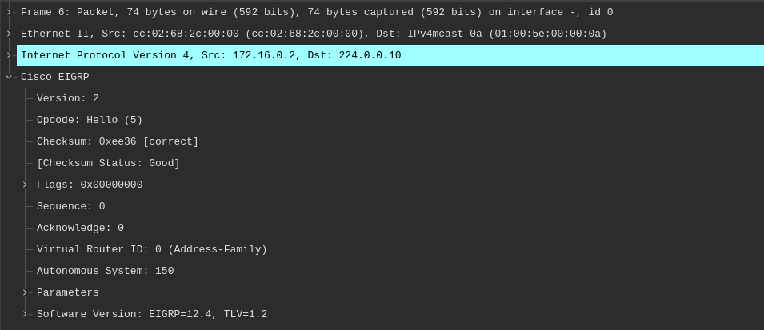
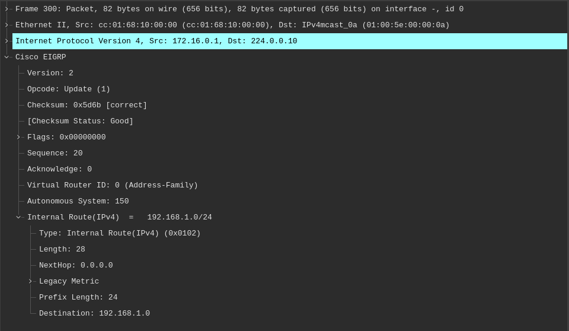

# EIGRP 报文

这一小节介绍了 EIGRP 用到的不同报文类型。不过，在深入探讨这些不同报文类型的具体内容前，必须扎实了解包含这些报文的 EIGRP 数据包头部。

## EIGRP 数据包头部

尽管深入研究 EIGRP 数据包格式的具体细节，超出了 CCNA 考试要求的范围，但为了完全理解 EIGRP 路由协议的整体运行，对 EIGRP 数据包头部的基本了解还是很重要的。下图 22.1 演示了 EIGRP 数据包头部的格式：


<a name="eigrp-packet_header"></a>
**图 22.1** -- **EIGRP 数据包头部的字段**


在 EIGRP 数据包头部中，4 位的版本字段，用于表明协议版本。当前的 Cisco 10S 映像支持 EIGRP 版本 1.x。4 位 `OPCode` 字段，指定了 EIGRP 数据包或报文的类型。不同的 EIGRP 数据包类型，均被指派了个唯一的 `OPCode` 值，这允许他们可与其他数据包类型区分开。这些报文将在本教学模组稍后介绍。

24 位校验和字段，用于对 EIGRP 数据包进行一次正确性检查。这个字段基于整个 EIGRP 数据包，不包括 IP 头部。32 位的 `Flags` 字段用于表明一次新 EIGRP 邻居的 `INIT`，还是一次 EIGRP 可靠传输协议（RTP）的有条件接收（CR）。RTP 与 CR 将在本教学模组稍后详细介绍。

32 位的序列字段，指定由 EIGRP RTP 用于确保可靠数据包有序投送的序列号。32 位的确认字段，用于确认 EIGRP 可靠数据包的接收。

32 位的自治系统编号字段，指定该 EIGRP 域的 ASN。最后，32 位的类型/长度/值（TLV）三元组字段，用于承载路由条目，以及提供 EIGRP 的 DUAL 信息。EIGRP 支持数种不同类型的 TLV，其中最常见的是以下这些：

- 参数 TLV，有着建立邻居关系的一些参数
- 序列 TLV，由 RTP 用到
- 下一组播序列 TLV，由 RTP 用到
- EIGRP 内部路由 TLV，用于内部的 EIGRP 路由
- EIGRP 外部路由 TLV，用于外部的 EIGRP 路由


**注意**：咱们不必详细了解这些不同的 EIGRP TLV。


下图 22.2 演示了不同字段，在其出现于某次 EIGRP 数据包的线路捕获中时的样子：




**图 22.2** -- **EIGRP 数据包部的线路捕获**


在这个 EIGRP 数据包头部中，4 位的 `OPCode` 字段，用于指明该 EIGRP 数据包的类型或报文。EIGRP 使用不同的报文或数据包类型，包括：

- `Hello` 数据包
- 确认数据包
- 更新数据包
- 查询数据包
- 回复数据包
- 及请求数据包


这些数据包类型，在接下来的小节中得以介绍。


## `Hello` 数据包


一旦增强型 IGRP 在路由器上已针对某个特定网络启用，其便会发送 `Hello` 数据包。这些报文用于识别邻居，且一旦识别出，就作为邻居间的一种保持机制发挥作用。EIGRP 的邻居发现与维护，会在这一教学模组稍后详细介绍。

增强型 IGRP 的 `Hello` 数据包，被发送到链路本地的组播组地址 `224.0.0.10`。由 EIGRP 发送的 `Hello` 数据包，不需要确认他们被收到的 `Acknowledgment` 数据包发送。由于 `Hello` 数据包不需要显式的确认，他们被归类为不可靠的 EIGRP 数据包。EIGRP 的 `Hello` 数据包有着 5 的 `OPCode`。


## 确认数据包


EIGRP 的确认 (`ACK`) 数据包，只是一个未包含数据的 EIGRP `Hello` 数据包。确认数据包被 EIGRP 用于确认 EIGRP 数据包的可靠传送。`ACK` 数据包总是发送到某个单播地址，即可靠数据包发送方的源地址，而不是到 EIGRP 的组播组地址。此外，`ACK` 数据包将始终包含一个非零的确认编号。`ACK` 数据包使用与 `Hello` 数据包同一 `OPCode`，因为他本质上是个未包含任何信息的 `Hello` 数据包。其 `OPCode` 为 5。

## 更新数据包


增强型 IGRP 的更新数据包，用于传送目的地的可达性。换句话说，更新数据包包含着 EIGRP 的路由更新。当某个新邻居被发现时，更新数据包即会经由单播发送，从而该邻居便能建立起其 EIGRP 拓扑数据表。在诸如链路开销发生变化等一些别的情形下，更新则会经由组播发送。重要的是要知道，更新数据包总是可靠地传输，并总是要求显式的确认。更新数据包被指派了 1 的 `OPCode`。某个 EIGRP 的更新数据包，如下图 22.3 中所示：



**图 22.3** -- **EIGRP 更新数据包**


## 查询数据包


增强型 IGRP 的查询数据包，属于组播数据包，用于请求可靠的路由信息。当某条路由不可用，以及路由器需要询问该路由的状态以快速收敛时，那么 EIGRP 的查询数据包即会被发送到邻居。当发出查询的路由器，未收到其任何邻居的响应时，他就会将该次查询，作为单播数据包重新发送到那些未响应的邻居。当在 16 次尝试后仍未收到响应时，那么 EIGRP 的邻居关系就会被重置。这一概念将在本教学模组稍后进一步详细介绍。EIGRP 查询数据包有着 `3` 的 `OPCode`。


## 回复数据包


增强型 IGRP 的回复数据包，是对查询数据包的响应。回复数据包用于对某个查询数据包的可靠相应。回复数据包属于一些到查询发起方的单播数据包。EIGRP 的回复数据包，被分配了 4 的 `OPCode`。


## 请求数据包


增强型 IGRP 的请求数据包，用于从一个或多个邻居处获取特定信息，而用于一些路由服务器应用中。这些数据包类型，可经由组播或单播发送，并总是以不可靠地传输。换句话说，他们不需要显式确认。


**注意**：虽然 EIGRP 的 `Hello` 与 `ACK` 数据包，曾被描述为两种单独的数据包类型，但必须记住，在某些文本中，ERGRP 的 `Hello` 与 `ACK` 数据包，被视为同一种类型的数据包。这是因为，正如这一小节早先所指出的，`ACK` 数据包只是未包含数据的 EIGRP `Hello` 数据包。

`debug eigrp packets` 这条命令，可用于打印有关这一小节中，所述及的不同 EIGRP 数据包的实时调试信息。请记住，这条命令还包括了一些未讲到的额外数据包，因为他们超出了当前 CCNA 考试要求的范围。以下输出演示了该命令的用法：

```console
R1#debug eigrp packets ?
  SIAquery  EIGRP SIA-Query packets
  SIAreply  EIGRP SIA-Reply packets
  ack       EIGRP ack packets
  hello     EIGRP hello packets
  ipxsap    EIGRP ipxsap packets
  probe     EIGRP probe packets
  query     EIGRP query packets
  reply     EIGRP reply packets
  request   EIGRP request packets
  retry     EIGRP retransmissions
  stub      EIGRP stub packets
  terse     Display all EIGRP packets except Hellos
  update    EIGRP update packets
  verbose   Display all EIGRP packets
  <cr>
```


`show ip eigrp traffic` 命令，用于查看本地路由器发送及接收的 EIGRP 数据包数量。这一命令还是个强大的故障排除工具。例如，当此种路由正发送 `Hello` 数据包，却未收到任何返回时，那么这可能表明，目标邻居未被配置，甚至是某条 ACL 可正屏蔽着 EIGRP 的数据包（译注：原文这里误将 ACL 写着了 ACK）。以下输出演示了这条命令：


```console
R2#show ip eigrp traffic
IP-EIGRP Traffic Statistics for AS 150
    Hellos sent/received: 21918/21922
    Updates sent/received: 10/6
    Queries sent/received: 1/0
    Replies sent/received: 0/1
    Acks sent/received: 6/10
    SIA-Queries sent/received: 0/0
    SIA-Replies sent/received: 0/0
    Hello Process ID: 178
    PDM Process ID: 154
    IP Socket queue: 0/2000/2/0 (current/max/highest/drops)
    Eigrp input queue: 0/2000/2/0 (current/max/highest/drops)
```

表 22.1 总结了这一小节所述的 EIGRP 数据包，以及他们是以不可靠还是可靠的方式发送：


**表 36.1** -- **EIGRP 数据包总结**

| 报文类型 | 说明 | 发送方式 |
| :------ | :------ | :------ |
| `Hello` | 用于邻居发现、维护及保持 | 不可靠 |
| 确认（ `ACK` ） | 用于确认信息的接收 | 不可靠 |
| 更新（ `Update` ） | 用于传递路由信息 | 可靠的 |
| 查询（ `Query` ） | 用于请求特定路由信息 | 可靠的 |
| 回复（ `Reply` ） | 用于响应查询 | 可靠的 |
| 请求（ `Request` ） | 在一些路由服务器的应用中，用于请求信息 | 不可靠 |


> *知识点*：
>
> - the EIGRP packet header, wherein the messages are contained
>
> - the overall operation of the EIGRP routing protocol
>
> + the EIGRP packet header
>   - the 4-bit `Version` field, is used to indicate the protocol version, current Cisco IOS images support EIGRP version 1.x
>   - the 4-bit `OPCode` field, specifies the EIGRP packet or message type, the different EIGRP packet types are each assigned a unique OPCode value, allows them to be differentiated from other packet types
>   - the 24-bit `Checksum` field, is used to run a sanity check, on the EIGRP packet, is based on the entire EIGRP packet, excluding the IP header
>   - the 32-bit `Flags` field, is used to indicate an `INIT` either for a new EIGRP neighbor, or for the Conditional Receive, CR for EIGRP Reliable Transport Protocol, RTP
>   - the 32-bit `Sequence` field, specifies the sequence number, used by EIGRP RTP, to ensure orderly delivery of reliable packets
>   - the 32-bit `Acknowledgment` field, is used to acknowledge the receipt of an EIGRP reliable packet
>   - the 32-bit Autonomous System Number field, specifies the ASN of the EIGRP domain
>   + the 32-bit Type/Length/Value, TLV triplet field, is used to carry route entries and provides EIGRP DUAL information, EIGRP supports several different types of TLVs, the most common:
>       - the Parameters TLV, has the parameters to establish neighbor relationships
>       - the Sequence TLV, is used by RTP
>       - the Next Multicast Sequence TLV, is used by RTP
>       - the EIGRP Internal Route TLV, is used for internal EIGRP routes
>       - the EIGRP External Route TLC, is used for external EIGRP routes
>
> + EIGRP uses different message or packet types
>
>
> + Hello packets
>   - are sent once EIGRP has been enabled on a router for a particular network
>   - used to identify neighbors
>   - and, once identified, serve or function as a keepalive mechanism between neighbours
>   - are sent to the Link Local Multicast group address `224.0.0.10`
>   - do not require an Acknowledgment to be sent confirming that they were received
>   - are classified as unreliable EIGRP packets
>   - have an OPCode of 5
>
> + Acknowledgmenat(ACK) packets
>   - is simply an EIGRP Hello packet that contains no data
>   - used by EIGRP to confirm reliable delivery of EIGRP packets
>   - are always sent to a Unicast address, which is the source address of the sender of the reliable packet, and not to the EIGRP Multicast group address
>   - always contain a non-zero acknowledgment number
>   - uses the same OPCode as the Hello packet, because it is essentially a Hello packet that contains no information
>   - the OPCode is 5
>
> + Update packets
>   - used to convey reachability of destinations
>   - contain EIGRP routing updates
>   - When a new neighbor is discovered, Update packets are sent via Unicast, so that the neighbor can build up its EIGRP topology table
>   - in cases such as a link cost change, updates are sent via Multicast
>   - are always transmitted reliably and always require explicit acknowledgment
>   - are assigned an OPCode of 1
>
>
> + Query packets
>   - are Multicast and are used to request reliable routing information
>   - are sent to neighbors when a route is not available, and the router needs to ask about status of the route for fast convergence
>   - if the router does not receive a response from any of its neighbors, it resends the Query as a Unicast packet, to the non-responsive neighbours
>   - if no response is received in 16 attempts, the neighbor relationship is reset
>   - are assigned an OPCode of 3
>
>
> + Reply packets
>   - are sent in response to Query packets
>   - are used to respond reliably to a Query packet
>   - are Unicast to the originator of the Query
>   - are assigned an OPCode of 4
>
>
> + Request packets
>   - are used to get specific information from one or more neighbors
>   - are used in route server applications
>   - can be sent via either Multicast or Unicast
>   - are always transmitted unreliably, in other words, they do not require an explicit acknowledgment
