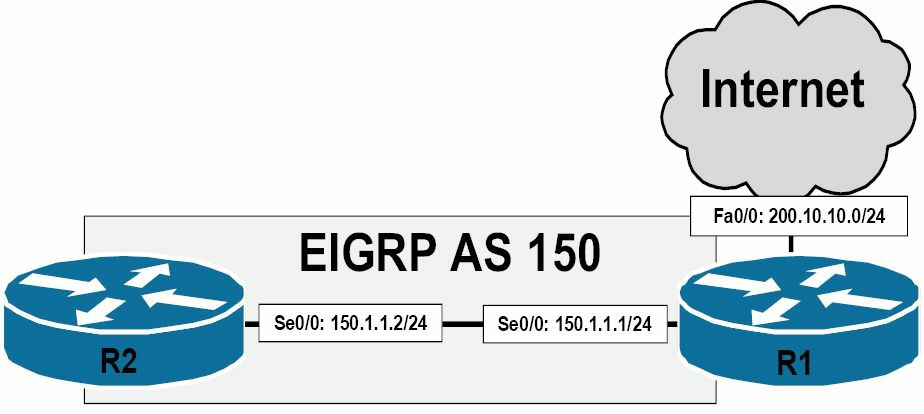
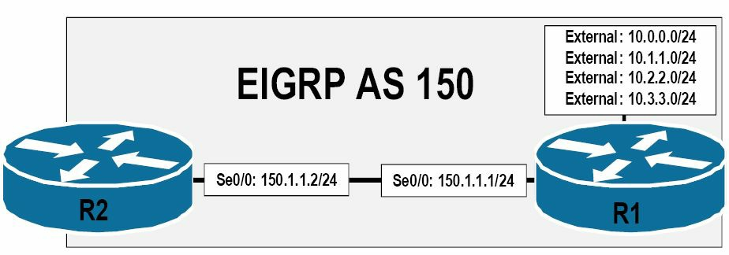
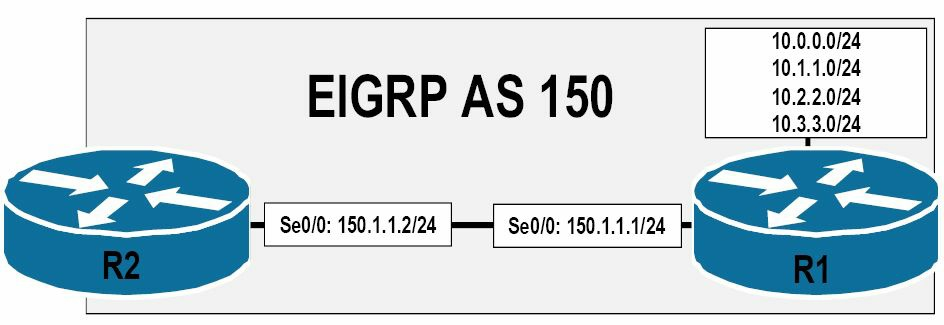

# 度量值、DUAL 及拓扑数据表


实施 EIGRP 时，在路由实际放入 IP 路由表之前，了解协议内部和协议使用的各个方面非常重要。在本节中，您将了解 EIGRP 综合度量及其计算方法。您还将了解影响度量计算以及调整计算度量的不同方法。随后，您将了解扩散更新算法 (DUAL) 和 EIGRP 拓扑表。本节最后将讨论在运行 EIGRP 的路由器上填充 IP 路由表时，所有这些信息是如何整合在一起的。EIGRP 综合度量计算

假设路由器`R3`响应了，`R2`却无法对此数据包进行响应。在 EIGRP 维护了一个未确认数据包传输窗口的情况下，就是说每个发出的单独可靠数据包，在发送下一个可靠数据包之前，都必须要邻居路由器进行显式的确认，而由于路由器`R1`将无法在收到来自`R2`的确认前，发出数据包，这样就在该多路访问网段上出现了一个可能的问题。因此路由器`R3`就间接受到`R2`上故障的影响了。

为了避免这种坑，路由器`R1`将等待连接到该多路访问网段上的以太网接口的多播流计时器超时（To avoid this potential pitfall, `R1` will wait for the Multicast Flow Timer(MFT) on the Ethernet interface connected to the Multi-access segment to expire）。多播流计时器，或简单的说就是流计时器（the Flow Timer），是发送方路由器等待自某个组成员的确认数据包的最长时间。在该计数器超时后，路由器`R1`将以多播方式，发出一个特殊的名为顺序 TLV 的 EIGRP 数据包（when the timer expires, `R1` will Multicast a special EIGRP packet called a Sequence TLV）。此数据包列出了路由器`R2`（也就是例外的那台路由器，the offender），且表明其是一个顺序错乱的多播数据包（this packet lists `R2`(the offender) and indicates an out-of-order Multicast packet）。而因为路由器`R3`未被列入到该数据包，所以其就进入到条件接收模式（the Conditional Receive(CR) mode）, 并继续侦听多播数据包。路由器`R1`此时就使用单播，将该数据包重传给`R2`。重传超时（the Retransmission Timeout, RTO）表示等待那个单播数据包的确认的时间。如在总共 16 次尝试后，仍没有来自路由器`R2`的响应， EIGRP 将重置该邻居。

> **注意：** 当前的 CCNA 考试不要求对 MFT 及 RTO 有深入了解。

## 各种度量值、弥散更新算法及拓扑表

**Metrics, DUAL, and the Topology Table**

在部署 EIGRP 时，对于路由被真正放入到 IP 路由表中之前，所用到的 EIGRP 本身及为其所用到的方方面面的概念、方法及数据结构等的掌握，是重要的。在本小节中，将学到有关 EIGRP 的综合度量值及其计算方式。还将学习影响度量值计算，及对计算出的度量值进行调整的不同方式（when implementing EIGRP, it is important to understand **the various aspects used within and by the protocol before routes are actually placed into the IP routing table**. In this section, you will learn about **the EIGRP composite metric and how it is calculated**. You will also learn about **the different ways to influence metric calculation, as well as to adjust the calculated metric**）。

在那之后，将学习到**弥散更新算法**（the Diffusing Update Algorithm, DUAL）与**EIGRP的拓扑表**。此小节包括了一个有关如何在一台运行着 EIGRP 的路由器上，将所有这些信息进行配合，以最终产生出 IP 路由表的讨论。

### EIGRP综合度量值的计算

**EIGRP Composite Metric Calculation**

增强的 EIGRP 使用了一种综合度量值（a composite metric）, 该度量值包含了以不同的 K 值所表示的不同变量（Enhanced IGRP uses a composite metric, which includes different variables referred to as the K values）。这些 K 值是一些常量，用于赋予路径的不同方面以不同的权重，这些路径的不同方面，都可能包含在该综合 EIGRP 度量值中。这些 K 值的默认值为 `K1=K3=1`, `K2=K4=K5=0`。也就是说， K1 与 K3 被默认被设置为1, 同时 K2 、 K4 和 K5 默认被设置为 0 。

假定在这些默认的 K 值下，那么完整的 EIGRP 度量值就可以使用下面的数学公式算出来：

`[K1*带宽 + (K2*带宽)/(256-负载) + K3*延迟] * [K5/(可靠性+K4)]`

但在仅有 K1 和 K3 有着默认的正值的情况下，默认的 EIGRP 度量值是由下面的数学公式计算出来的：

`[(10^7/路径上的最低带宽) + (所有延迟总和)] x 256`

这实际上就是说， EIGRP 使用了到目的网络的路径上的最小带宽，以及总的累积延迟，来计算理由度量值。不过思科 IOS 软件允许管理员将其它 K 值设置为非零值，以将其它变量结合到该综合度量值中。通过使用路由器配置命令`metric weights [tos] k1 k2 k3 k4 k5`，就可完成此操作。

在使用`metric weights`命令时，`[tos]`表示服务类型（Type of Service）。尽管思科 IOS 软件显示可以使用任何 0 到 8 之间的数值，但在撰写本手册时，该字段（`[tos]`）当前却只能被设置为 0 。而这些 K 值，就可以被设置为 0 到 255 之间的任何数值。通过执行`show ip protocols`命令，就可查看默认的这些EIGRP K值。下面的输出对此进行了演示：

```console
R2#show ip protocols
Routing Protocol is “eigrp 150”
  Outgoing update filter list for all interfaces is not set
  Incoming update filter list for all interfaces is not set
  Default networks flagged in outgoing updates
  Default networks accepted from incoming updates
  EIGRP metric weight K1=1, K2=0, K3=1, K4=0, K5=0
  EIGRP maximum hopcount 100
  EIGRP maximum metric variance 1
  Redistributing: eigrp 150
  EIGRP NSF-aware route hold timer is 240s
  Automatic network summarization is not in effect
  Maximum path: 4
  Routing for Networks:
    192.168.1.0
  Routing Information Sources:
    Gateway         Distance        Last Update
    192.168.1.3     90              00:00:15
  Distance: internal 90 external 170
```

在对这些 EIGRP 的 K 值进行调整时，重要的是记住在 EIGRP 域中的所有路由器上，都要配置上同样的这些数值。如这些**K值不匹配，那么 EIGRP 的邻居关系就不会建立**。

> **注意：** 不建议对这些默认的 K 值进行调整。对这些 K 值的调整，只应在那些对网络中这类行为造成的后果有扎实了解老练的高级工程师的指导下，或在思科公司技术支持中心的建议下完成。

### 使用接口带宽来影响 EIGRP 的度量值

**Using Interface Bandwidth to Influence EIGRP Metric Calculation**

可通过使用`bandwidth`命令对指定到那些单个接口的默认带宽进行调整，从而直接对 EIGRP 度量值计算施加影响。**通过此命令指定的带宽，是以千位（ Kilobits ）计的**。在 EIGRP 的度量值计算中，带宽也是以千位计的。下图36.8演示了一个由两台路由器通过两条带宽为1544Kbps, 的串行（ T1 ）链路连接所组成的网络。


*图 36.8 -- EIGRP度量值的带宽修改*

参考图36.8中的图示，因为路由器`R1`与`R2`之间两条链路的带宽（及延迟）是相等的，所以从路由器`R2`到子网`172.16.100.0/24`将同时继承到这两条路径的相同 EIGRP 度量值（because of the equal bandwidth (and delay) values of the links between `R1` and `R2`, the same EIGRP metric will be derived for both paths from `R2` to the `172.16.100.0/24` subnet）。 EIGRP 将在这两条链路之间进行流量负载均衡，如下面路由器`R2`上的输出所示：

```console
R2#show ip route 172.16.100.0 255.255.255.0
Routing entry for 172.16.100.0/24
  Known via “eigrp 150”, distance 90, metric 2172416, type internal
  Redistributing via eigrp 150
  Last update from 150.2.2.1 on Serial0/1, 00:48:09 ago
  Routing Descriptor Blocks:
    150.2.2.1, from 150.2.2.1, 00:48:09 ago, via Serial0/1
      Route metric is 2172416, traffic share count is 1
      Total delay is 20100 microseconds, minimum bandwidth is 1544 Kbit
      Reliability 255/255, minimum MTU 1500 bytes
      Loading 1/255, Hops 1
  * 150.1.1.1, from 150.1.1.1, 00:48:09 ago, via Serial0/0
      Route metric is 2172416, traffic share count is 1
      Total delay is 20100 microseconds, minimum bandwidth is 1544 Kbit
      Reliability 255/255, minimum MTU 1500 bytes
      Loading 1/255, Hops
```

对两条链路中的任何一条的带宽进行调整，都会直接影响到 EIGRP 对到目的网络路径的度量值计算。**这样的操作，可用于更为大型网络中路径的控制（也就是基于管理员定义的数值与配置，对流量所要采行的路径进行控制）**（Such actions can be used for path control within larger networks(i.e., controlling the path that traffic takes based on administrator-defined values and configurations)）。比如这里要令到 EIGRP 优先使用`Serial0/0`作为前往目的网络的主要路径，而将`Serial0/1`作为到目的网络的备份路径，就要采取两种操作之一。

第一种操作，就是可以增加`Serial0/0`上的带宽值，造成该路径的一个更好（更低）的度量值。那么第二种方法，就是可以降低`Serial0/1`上的带宽值，造成该路径的一个更差（更高）的度量值。两种选项都是可接受的，同时都将达成所需的结果。下面的输出演示了如何将`Serial0/0`上的默认带宽进行降低，从而有效地确保`Serial0/0`作为路由器`R2`及`172.16.100.0/24`网络之间的主要路径。

```console
R2(config)#interface Serial0/1
R2(config-if)#bandwidth 1024
R2(config-if)#exit
```

> **注意：** 如同在第 1 天指出的，该配置并不意味着接口`Serial0/1`上仅容许 1024Kbps 速率的流量通过该接口（As stated in Day 1, this configuration does not mean that `Serial0/1` is now capable of only 1024Kbps of throughput through this interface）。

该配置的结果就是接口`Serial0/0`成为路由器`R2`到达目的网络`172.16.100.0/24`网络的主要路径。这在下面的输出中有所演示：

```console
R2#show ip route 172.16.100.0 255.255.255.0
Routing entry for 172.16.100.0/24
  Known via “eigrp 150”, distance 90, metric 2172416, type internal
  Redistributing via eigrp 150
  Last update from 150.1.1.1 on Serial0/0, 00:01:55 ago
  Routing Descriptor Blocks:
  * 150.1.1.1, from 150.1.1.1, 00:01:55 ago, via Serial0/0
      Route metric is 2172416, traffic share count is 1
      Total delay is 20100 microseconds, minimum bandwidth is 1544 Kbit
      Reliability 255/255, minimum MTU 1500 bytes
      Loading 1/255, Hops 1
```

> **注意：** 这里星号（the asterisk, `*`）指向的接口，就是下一数据包要发送出去的接口。而在路由表中有着多个开销相等的路由时，星号的位置就会在这些开销相等的路径之间轮转。

在将 EIGRP 作为路由协议时，尽管经由`Serial0/1`接口的路径未被安装到**路由表**中, 重要的是记住该路径并未被完全忽略掉（Although the path via the `Serial0/1` interface is not installed into the routing table, when using EIGRP as the routing protocol, it is important to remember that this path is not completely ignored）。而是该路径被存储在**EIGRP的拓扑表**中， EIGRP 的拓扑表包含了到那些远端目网络的主要及替代（备份）路径。本课程模块后面将对 EIGRP 的拓扑表予以讲解。

> **注意:** 默认在开启了 EIGRP 时，其可能会用到高达接口带宽的50%来发送 EIGRP 本身的数据包（ EIGRP 是一种非常话痨的协议，所以其在可能的带宽使用上进行了限制，EIGRP is a very chatty protocol, so it limits itself in possible bandwidth usage）。 EIGRP 是基于接口配置命令`bandwidth`，来判断带宽数量的。因此在对接口带宽数值进行调整时，就要记住这点。而该默认设置，可使用接口配置命令**`ip bandwidth-percent eigrp [ASN] [percentage]`**，进行修改。

总的来说，在应用带宽命令`bandwidth`对 EIGRP 的度量值计算施加影响时，重要的是记住， EIGRP 会使用到目的网络路径上的最小带宽，以及延迟的累计值，来计算路由度量值（EIGRP uses the minimum bandwidth on the path to a destination network, along with the cumulative delay, to compute routing metrics）。同时还要对网络拓扑有牢固掌握，以对在何处使用`bandwidth`命令，从而实现对 EIGRP 度量值计算的影响。**但在真实世界中，对 EIGRP 度量值施加影响的首选方法，不是修改带宽，而是修改延迟**。

### 运用接口的延迟来对 EIGRP 的度量值计算进行影响

**Using Interface Delay to Influence EIGRP Metric Calculation**

接口延迟数值，是用微秒来表示的。但在 EIGRP 度量值计算中用到的延迟数值，是以 10 微秒计的（in tens of microseconds）。因此，为了计算出 EIGRP 的度量值，接口上的延迟数值，就必须除以 10 。下面的表36.3对思科 IOS 软件中使用到的默认接口带宽及延迟数值，进行了演示：

*表 36.3 -- 默认的接口带宽与延迟数值*

| 接口类型 | 带宽（ Kilobits ） | 延迟（Microseconds, us） |
| :-------- | --------: | --------: |
| 以太网（ Ethernet ） | 10000 | 1000 |
| 快速以太网（ FastEthernet ） | 100000 | 100 |
| 千兆以太网（ GigabitEthernet ） | 1000000 | 10 |
| 万兆以太网（Ten-GigabitEthernet） | 10000000 | 10 |
| 串行线路（ T1 ） | 1544 | 20000 |
| 串行线路（ E1 ） | 2048 | 20000 |
| 串行线路（ T3 ） | 44736 | 200 |
| 串行线路（ E3 ） | 34010 | 200 |

在对接口的带宽及延迟数值进行计算时，重要的是记住**对接口带宽的调整并不会自动地调整到接口的延迟，相反也是这样。这两个数值是相互独立的**。比如，下面的输出展示了一个快速以太网接口的默认带宽及延迟数值：

```console
R2#show interfaces FastEthernet0/0
FastEthernet0/0 is up, line protocol is up
  Hardware is AmdFE, address is 0013.1986.0a20 (bia 0013.1986.0a20)
  Internet address is 192.168.1.2/24
  MTU 1500 bytes, BW 100000 Kbit/sec, DLY 100 usec,
     reliability 255/255, txload 1/255, rxload 1/255
...
[Truncated Output]
```

为对此概念进行强化，下面使用接口配置命令`bandwidth`，将该快速以太网接口的带宽调整为 1544Kbps ：

```console
R2(config)#interface FastEthernet0/0
R2(config-if)#bandwidth 1544
R2(config-if)#exit
```

此时显示在`show interfaces`命令的输出中的带宽数值，反应了该已应用下去的配置，但默认的接口延迟数值却仍然保持原来的大小，如下面的输出所示：

```console
R2#show interfaces FastEthernet0/0
FastEthernet0/0 is up, line protocol is up
  Hardware is AmdFE, address is 0013.1986.0a20 (bia 0013.1986.0a20)
  Internet address is 192.168.1.2/24
  MTU 1500 bytes, BW 1544 Kbit/sec, DLY 100 usec,
     reliability 255/255, txload 1/255, rxload 1/255
```

而 EIGRP 所使用的累积延迟，则是在源网络与目的网络之间所有接口延迟的和。对路径中任何一个延迟数值的修改，都会影响到 EIGRP 度量值的计算。接口延迟数值，是通过使用接口配置命令`delay`进行调整的。该数值在用于 EIGRP 度量值计算时，会除以 10 。下图36.9演示了一个由两台通过两条有着 1544Kbps 的带宽，及默认 20000 微秒的延迟串行（ T1 ）链路，连接的路由器所组成的网络。此外，网络`172.16.100.0/24`是直接连接到一个快速以太网接口的，该以太网接口有着默认 100000Kbps 的带宽，以及默认 100 微秒的延迟数值：


*图 36.9 -- EIGRP度量值中延迟的修改*

那么从路由器`R2`到网络`172.16.100.0/24`的 EIGRP 度量值的计算如下：

度量值 = [(10^7/路径上的最小带宽) + (延迟综合)] x 256

度量值 = [(10000000/1544) + (2000+10)] x 256

> **注意：** 记住在 EIGRP 度量值计算中，要将接口延迟数值除以 10 。

> **注意：** 这里计算出的数值应总是要向下取到最接近的整数。

度量值 = [(10000000/1544) + (2000+10)] x 256

度量值 = [6476 + 2010] x 256

度量值 = 8486 x 256

度量值 = 2172416

可使用`show ip route`命令对此计算进行验证，如下所示：

```console
R2#show ip route 172.16.100.0 255.255.255.0
Routing entry for 172.16.100.0/24
  Known via “eigrp 150”, distance 90, metric 2172416, type internal
  Redistributing via eigrp 150
  Last update from 150.2.2.1 on Serial0/1, 00:03:28 ago
  Routing Descriptor Blocks:
    150.2.2.1, from 150.2.2.1, 00:03:28 ago, via Serial0/1
      Route metric is 2172416, traffic share count is 1
      Total delay is 20100 microseconds, minimum bandwidth is 1544 Kbit
      Reliability 255/255, minimum MTU 1500 bytes
      Loading 1/255, Hops 1
  * 150.1.1.1, from 150.1.1.1, 00:03:28 ago, via Serial0/0
      Route metric is 2172416, traffic share count is 1
      Total delay is 20100 microseconds, minimum bandwidth is 1544 Kbit
      Reliability 255/255, minimum MTU 1500 bytes
      Loading 1/255, Hops 1
```

与使用`bandwidth`命令一样，为了对 EIGRP 的度量值计算施加影响，我们既可以使用`delay`命令对接口延迟数值进行提升，也可以对其进行降低。比如，为了将路由器`R2`配置为使用链路`Serial0/0`到达`172.16.100.0/24`网络，而将`Serial0/1`仅用作一条备份链路，那么就可以如下将`Serial0/0`上的延迟数值进行降低：

```console
R2(config)#int s0/0
R2(config-if)#delay 100
R2(config-if)#exit
```

此配置就对经由`Serial0/0`的路径的 EIGRP 度量值进行了调整，如下所示：

```console
R2#show ip route 172.16.100.0 255.255.255.0
Routing entry for 172.16.100.0/24
  Known via “eigrp 150”, distance 90, metric 1686016, type internal
  Redistributing via eigrp 150
  Last update from 150.1.1.1 on Serial0/0, 00:01:09 ago
  Routing Descriptor Blocks:
  * 150.1.1.1, from 150.1.1.1, 00:01:09 ago, via Serial0/0
      Route metric is 1686016, traffic share count is 1
      Total delay is 1100 microseconds, minimum bandwidth is 1544 Kbit
      Reliability 255/255, minimum MTU 1500 bytes
      Loading 1/255, Hops 1
```

而经由`Serial0/1`的路径，则被保留在拓扑表中，作为到该网络的一条替代路径（an alternate path）。

### 关于弥散更新算法

**The Diffusing Update Algorithm(DUAL)**

本小节涉及以下术语：

- 可行距离，the Feasible Distance
- 后继路由器，the Successor
- 报告的距离，the Reported Distance
- 通告的距离, the Advertised Distance, 与报告的距离一样
- 可行后继，the Feasible Successor
- 可行条件，the Feasible Condition

弥散更新算法是 EIGRP 路由协议的关键所在。弥散更新算法会对从邻居路由器处接收到的所有路由进行观察与比较，然后选出有着到目的网络最低度量值（最优）--该度量值就是可行距离（the Feasible Distance, FD）--的无环回路径，从而得到后续路由（the Successor route）。可行距离既包含了由相连的路由所通告的某网络的度量值，还要加上到那台特定邻居路由器的开销。

由邻居路由器所通告的度量值，就被叫做到目的网路报告的距离（the Reported Distance, RD）, 又被叫做到目的网络通告的距离（the Advertised Distance, AD, 所以 RD == AD）。因此，可行距离就包含了报告的距离，加上到达那台特定邻居路由器的开销。那么该后续路由的下一跳路由器，就被叫做是后续路由器（the Successor）。后续路由器就被放入到 IP 路由表（the IP routing table）及 EIGRP 拓扑表（the EIGRP topology table）中, 并指向到后继路由器。

到相同目的网络的其它那些有着比起后继路由器路径的可行距离高一些的报告距离，却仍然是无环回的那些路由，就被叫做是可行后继路由器路由了（Any other routes to the same destination network that have a lower RD than the FD of the Successor path are guaranteed to be loop-free and are referred to as Feasible Successor(FS) routes, 这里疑似原作者笔误，“ lower ”应该是"higher"）。这些路由不会被放入到 IP 路由表中；但它们仍然会与其它后继路由器路由，一起被放入到 EIGRP 的拓扑表。

为了某条路由成为可行后继路由，则其必须满足可行性条件（the Feasible Condition, FC）, 该可行性条件仅会在到目的网络的报告距离少于可行距离时，才会发生。在报告距离高于可行距离时，该路由不会被选作可行后继（ FS ）。 EIGRP 这么做是为了防止可能出现的环回。下图36.10中所演示的网络拓扑，将会用于对本小节中出现的术语进行解释。


*图 36.10 -- 掌握弥散更新算法*

参考图36.10, 下表36.4给出了在路由器`R1`上观察到的到`192.168.100.0/24`网络的可行距离及报告距离数值：

*表 36.4 -- `R1`的那些路径及距离, `R1` Paths and Distances*

| 网络路径 | `R1` 的邻居 | 邻居度量值（报告距离） | `R1`的可行距离 |
| :------- | :------- | -------: | -------: |
| `R1`-`R2`-`R5` | `R2` | 30 | 35 |
| `R1`-`R3`-`R5` | `R3` | 10 | 30 |
| `R1`-`R4`-`R5` | `R4` | 15 | 25 |

基于表36.4中的信息，路由器`R1`将选择经由`R4`的路径，作为后继路由，这是根据该路由的可行距离得出的。此路由将被放入到 IP 路由表以及 EIGRP 拓扑表中。路由器`R1`随后将对那些到`192.168.100.0/24`网络的替代路径进行查看。这里邻居路由器`R3`到`192.168.100.0/24`网络的度量值，又被叫做是报告的距离或通告距离，就是 10 。该距离小于（当前的）可行距离，所以该路由满足到可行条件（ FC ），那么就被放入到 EIGRP 的拓扑表中。而邻居路由器`R2`到`192.168.100.0/24`的度量值为 30 。该值高于了当前的可行距离 25 。此路由则不能满足可行条件，就不被看作是一个可行后继（ FS ）。但该路由仍然会被放入到 EIGRP 的拓扑表中。这将在后面的 EIGRP 拓扑表小节，进行演示。

当某个邻居路由器改变了度量值，或拓扑发生了改变，以及后继路由被移除或改变时，弥散更新算法会检查那些可行后继路由器的路由，在发现了一台可行后继路由器时，弥散更新算法就使用该可行后继路由器，以避免不必要的重新计算路由。执行一次本地运算，节省了 CPU 处理能力，因为在当前后继或主路由失效时，可行后继路由本身就已选出且已经存在了。此过程就叫做**本地运算**（When a neighbor changes a metric, or when a topology change occurs, and the Successor route is removed or changes, DUAL checks for FSs for the route and if one is found, then DUAL uses it to avoid re-computing the route unnecessarily. This is referred to as local computation. Performing **a local computation** saves CPU power because the FS has been chosen and already exists before the Successor or primary route fails）。

而当目的网络的可行后继路由器不存在时，本地路由器将向邻居路由器发出一次查询，对邻居路由器是否有着关于目的网络的信息。如邻居路由器有该信息，同时另一路由器确实有着到目的网络的路由，此时该路由器将执行一次**弥散运算**，以确定出一台新的后继路由器（If the information is available and another neighbour does have a route to the destination network, then the router performs **a diffusing computation** to determine a new Successor）。

## EIGRP的拓扑表

**The EIGRP Topology Table**

EIGRP的拓扑表，是由 EIGRP 的各种**协议相关模块**, 在**弥散更新算法的有限状态机**之上，运算得到的（The EIGRP topology table is populated by **EIGRP PDMs** acted upon by **the DUAL Finite State Machine**）。由已形成邻居关系的 EIGRP 路由器（neighbouring EIGRP routers）通告的所有目的网络与子网，都被存储在 EIGRP 拓扑表中。该表包含了后继路由器路由、可行后继路由器路由，甚至那些并不满足可行条件的路由（This includes Successor routes, FS routes, and even routes that have not met the FC）。

正是拓扑表，才令到所有 EIGRP 路由器对整个网络，有着一致的视图。其还实现了 EIGRP 网络中的快速收敛。在拓扑表中的每个条目，都包含了某个目的网络及那些通告该目的网络的**那些邻居**。可行距离及通告距离，都被存储在拓扑表中。 EIGRP 的拓扑表，包含了构建出一个到所有可达网络的距离与矢量集合的所需信息（The topology table allows all EIGRP routers to have a consistent view of the entire network. It also allows for rapid convergence in EIGRP networks. Each individual entry in the topology table contains the destination network and the neighbour(s) that have advertised the destination network. Both the FD and the RD are stored in the topology table. The EIGRP topology table contains the information needed to build a set of distances and vectors to each reachable network），这些信息包括以下内容：

- 到目的网络的最低带宽, the lowest bandwidth on the path to the destination network
- 到目的网络的总/累积延迟, the total or cumulative delay to the destination network
- 到目的网络路径的可靠性, the reliability of the path to the destination network
- 到目的网络路径的负载，the loading of the path to the destination network
- 到目的网络的最大传输单元的最小值, The minimum Maximum Transmission Unit(MTU) to the destination network
- 到目的网络的可行距离, the Feasible Distance to the destination network
- 由邻居路由器所报告的到目的网络的报告距离, the Reported Distance by the neighbour router to the destination network
- 目的网络的路由源（仅针对那些外部路由），The route source(only external routes) of the destination network

> **注意：** 尽管在拓扑表中包含了最大传输单元（ MTU ），但 EIGRP 并不会在实际的度量值计算中使用到该数值。而是该 MTU 仅简单地作为判断到目的网络数据包大小最小值而被追踪。接口的最大传输单元指定了经某条链路，在无需将数据报或数据包拆分到更小片的情况下，所能传输的数据报最大大小（The interface MTU specifies the largest size of datagram that can be transferred across a certain link without the need of fragmentation, or breaking the datagram or packet into smaller pieces）。

使用`show ip eigrp topology`命令，就可查看到 EIGRP 拓扑表的内容。该命令下可用的选项如下所示：

```console
R2#show ip eigrp topology ?
  <1-65535>       AS Number
  A.B.C.D         IP prefix <network>/<length>, e.g., 192.168.0.0/16
  A.B.C.D         Network to display information about
  active          Show only active entries
  all-links       Show all links in topology table
  detail-links    Show all links in topology table
  pending         Show only entries pending transmission
  summary         Show a summary of the topology table
  zero-successors Show only zero successor entries
  |               Output modifiers
  <cr>
```

不带选项的`show ip eigrp topology`命令，将仅打印出那些拓扑表中路由的、且是该路由器上所有开启的 EIGRP 实例的后继路由器及可行后继的信息（The `show ip eigrp topology` command with no options prints only the Successor and Feasible Successor information for routes in the topology table and for all of the EIGRP instances enabled on the router）。下面演示了该命令的打印输出：

```console
R2#show ip eigrp topology
IP-EIGRP Topology Table for AS(150)/ID(2.2.2.2)
Codes: P - Passive, A - Active, U - Update, Q - Query, R - Reply,
       r - reply Status, s - sia Status
P 150.2.2.0/24, 1 successors, FD is 20512000
        via Connected, Serial0/1
        via 150.1.1.1 (2195456/2169856), Serial0/0
P 150.1.1.0/24, 1 successors, FD is 1683456
        via Connected, Serial0/0
P 172.16.100.0/24, 1 successors, FD is 1686016
        via 150.1.1.1 (1686016/28160), Serial0/0
```

而`show ip eigrp topology [network]/[prefix]`及`show ip eigrp topology [network] [mask]`两个命令，则将打印出其各自所指定路由的后继路由、可行后继路由以及未能满足可行条件的那些其它路由（The `show ip eigrp topology [network]/[prefix]` and `show ip eigrp topology [network] [mask]` commands print Successor routes, FS routes, and routes that have not met the FC for the route specified in either command）。下面的输出演示了`show ip eigrp topology [network]/[prefix]`命令的用法：

```console
R2#show ip eigrp topology 172.16.100.0/24
IP-EIGRP (AS 150): Topology entry for 172.16.100.0/24
  State is Passive, Query origin flag is 1, 1 Successor(s), FD is 1686016
  Routing Descriptor Blocks:
  150.1.1.1 (Serial0/0), from 150.1.1.1, Send flag is 0x0
      Composite metric is (1686016/28160), Route is Internal
      Vector metric:
        Minimum bandwidth is 1544 Kbit
        Total delay is 1100 microseconds
        Reliability is 255/255
        Load is 1/255
        Minimum MTU is 1500
        Hop count is 1
  150.2.2.1 (Serial0/1), from 150.2.2.1, Send flag is 0x0
      Composite metric is (2167998207/2147511807), Route is Internal
      Vector metric:
        Minimum bandwidth is 128 Kbit
        Total delay is 83906179 microseconds
        Reliability is 255/255
        Load is 1/255
        Minimum MTU is 1500
        Hop count is 1
```

在上面的输出中，可以看出经由`Serial0/1`的路径并没有满足可行条件（ FC ），因为其报告的距离（ RD ）超过了可行距离（ FD ）。这就是该路径没有在`show ip eigrp topology`命令的输出中打印出来的原因。而为了判断出那些后继路由、可行后继路由，以及未能满足可行条件的那些路由，就可以使用`show ip eigrp topology all-links`命令，而不是对单个前缀进行查看，从而查看到在 EIGRP 拓扑表中所有前缀的所有可能的路由。下面对此命令的输出进行了演示：

```console
R2#show ip eigrp topology all-links
IP-EIGRP Topology Table for AS(150)/ID(2.2.2.2)
Codes: P - Passive, A - Active, U - Update, Q - Query, R - Reply,
       r - reply Status, s - sia Status
P 150.2.2.0/24, 1 successors, FD is 20512000, serno 42
        via Connected, Serial0/1
        via 150.1.1.1 (2195456/2169856), Serial0/0
P 150.1.1.0/24, 1 successors, FD is 1683456, serno 32
        via Connected, Serial0/0
        via 150.2.2.1 (21024000/2169856), Serial0/1
P 172.16.100.0/24, 1 successors, FD is 1686016, serno 47
        via 150.1.1.1 (1686016/28160), Serial0/0
        via 150.2.2.1 (2167998207/2147511807), Serial0/1
```

在该 EIGRP 拓扑表中的路由条目，可能被标记为被动的（Passive, P）或主动的（Active, A）状态。处于被动状态的某条路由，表明 EIGRP 已经完成了该路由度量值的主动计算，同时可以使用该后继路由将流量转发到目的网络。此状态是拓扑表中所有路由的首选状态。

当后继路由丢失，且路由器为确定出可行后继而发出了一个查询数据包时，那些 EIGRP 的路由就处于主动状态了。通常情况下，是存在着可行后继的，且 EIGRP 会将那个可行后继提升为后继路由。那么在此情况下，就无需涉及到网络中其它路由器，该路由器就可以完成收敛。此过程就叫做一次本地运算（Enhanced IGRP routes are in Active state when the Successor route has been lost and the router sends out a Query packet to determine an FS. Usually, an FS is present and EIGRP promotes that to the Successor route. This way, the router converges without involving other routers in the network. This process is referred to as **a local computation**）。

不过，如后继路由已丢失或被移除，而又没有可行后继时，那么路由器就将开始弥散运算（diffused computation）。在弥散运算中， EIGRP 将往所有邻居路由器、从除开连接到后继路由的接口外的所有接口发出一次查询。当某台 EIGRP 邻居路由器收到某条路由的查询时，如那个邻居的 EIGRP 拓扑表中没有包含该被查询路由的条目，那么这个邻居就立即对该查询应答一条不可达报文，指出经过此邻居处并无这条路由的路径。

而如果邻居路由器上的 EIGRP 拓扑表已将发出查询的路由器，列为所查询路由的后继路由器，同时存在一条可行后继路由，那么该可行后继路由器路由就被安装起来，同时该邻居路由器对该邻居查询做出其有着一条到已丢失目的网络路由的应答（If the EIGRP topology table on the neighbour lists the router sending the Query as the Successor for that route, and an FS exists, then the FS is installed and the router replies to the neighbour Query that it has a route to the lost destination network）。

但如果该 EIGRP 拓扑表虽然将发出查询的路由器列为了该路由的后继路由器，却没有可行后继时，收到查询的路由器就会查询其所有的 EIGRP 邻居，除开那些作为其先前后继路由器而发出的同样接口。在尚未收到对此路由的所有查询的一条应答时，该路由器不会对先前的查询进行响应（However, if the EIGRP topology table lists the router sending the Query as the Successor for this route and there is no FS, then the router queries all of its EIGRP neighbors, except those that were sent out of the same interface as its former Successor. The router will not reply to the Query until it has received a Reply to all Queries that it originated for this route）。

最后，如某个非此目的网络后继的邻居收到了此次查询，随后该路由器以其自己的后继信息予以了应答。而假如这些邻居路由器仍然没有该已丢失的路由信息，那么这些邻居路由器就会向它们自己的邻居路由器发出查询，直到抵达查询边界。所谓查询边界，既可以是网络的末端、分发清单的边界，或者汇总的边界（Finally, if the Query was received from a neighbour that is not the Successor for this destination, then the router replies with its own Successor information. If the neighbouring routers do not have the lost route information, then Queries are sent from those neighbouring routers to their neighbouring routers until the Query boundary is reached. The Query boundary is either the end of the network, the distribute list boundary, or the summarization boundary）。

查询一旦发出，那么发出查询的 EIGRP 路由器就必须在计算后继路由前，等待完成所有应答的接收。如有任何邻居在三分钟之内没有应答，那么该路由就被称作处于活动粘滞状态（If any neighbour has not replied within three minutes, the route is said to be Stuck-In-Active(SIA)）。而当某条路由成为活动粘滞路由时，该（这些）未对查询进行响应的路由器的邻居关系，就将被重置。在此情况下，可以观察到路由器记录下了如下类似的一条消息：

```console
%DUAL-5-NBRCHANGE: IP-EIGRP 150:
    Neighbor 150.1.1.1(Serial0/0) is down: stuck in active
%DUAL-3-SIA:
    Route 172.16.100.0/24 stuck-in-active state in IP-EIGRP 150.
Cleaning up
```

造成（这些） EIGRP 邻居路由器未能对查询进行响应的原因有几种，包括下面这些：

- 该邻居路由器的 CPU 过载了，因此而无法及时响应
- 该邻居路由器本身就没有关于那条丢失路由的信息
- 电路质量问题，造成数据包丢失
- 某些低带宽链路拥塞，从而造成数据包的延迟

而为了防止因为延迟响应造成的来自其它 EIGRP 邻居的活动粘滞方面的故障，可使用路由器配置模式中的`timers active-time`命令，将本地路由器配置为等待多于默认的三分钟，以接收到返回给其查询数据包的响应。

> **注意：** 重要的是应注意在对网络中某台路由器上的该默认参数进行修改时，就必须对 EIGRP 路由域中的所有路由器上的该参数进行修改（It is important to note that if you change this default parameter on one EIGRP router in your network, you must change it on all the other routers within your **EIGRP routing domain**）。


## 相等开销及不相等开销下的负载均衡

**Equal Cost and Unequal Cost Load Sharing**

思科 IOS 软件对所有路由协议支持默认下至多 4 条路径的相等开销负载均衡（Cisco IOS software supports equal cost load sharing for a default of up to four paths for all routing protocols）。下面的`show ip protocols`命令的输出，对此进行了演示：

```console
R2#show ip protocols
Routing Protocol is “eigrp 150”
  Outgoing update filter list for all interfaces is not set
  Incoming update filter list for all interfaces is not set
  Default networks flagged in outgoing updates
  Default networks accepted from incoming updates
  EIGRP metric weight K1=1, K2=0, K3=1, K4=0, K5=0
  EIGRP maximum hopcount 100
  EIGRP maximum metric variance 1
  Redistributing: eigrp 150
  EIGRP NSF-aware route hold timer is 240s
  Automatic network summarization is not in effect
  Maximum path: 4
  Routing for Networks:
    150.1.1.2/32
    150.2.2.2/32
  Routing Information Sources:
    Gateway         Distance      Last Update
    Gateway         Distance      Last Update
    150.2.2.1       90            00:00:52
    150.1.1.1       90            00:00:52
  Distance: internal 90 external 170
```

而又可以使用路由器配置命令`maximum-paths <1-6>`，对默认的最多 4 条路径，修改为最多 6 条相等开销的路径。在进行相等开销的负载均衡时，路由器将负载在所有路径直接进行均匀地分配。有着一个流量分享计数，对每条路径上传输的数据包进行识别（The traffic share count identifies the number of outgoing packets on each path）。在进行相等开销的负载均衡时，单个的完整数据包是在某条单独路径上发出的，如下面的输出所示：

```console
R2#show ip route 172.16.100.0 255.255.255.0
Routing entry for 172.16.100.0/24
  Known via “eigrp 150”, distance 90, metric 2172416, type internal
  Redistributing via eigrp 150
  Last update from 150.2.2.1 on Serial0/1, 00:04:00 ago
  Routing Descriptor Blocks:
    150.2.2.1, from 150.2.2.1, 00:04:00 ago, via Serial0/1
      Route metric is 2172416, traffic share count is 1
      Total delay is 20100 microseconds, minimum bandwidth is 1544 Kbit
      Reliability 255/255, minimum MTU 1500 bytes
      Loading 1/255, Hops 1
  * 150.1.1.1, from 150.1.1.1, 00:04:00 ago, via Serial0/0
      Route metric is 2172416, traffic share count is 1
      Total delay is 20100 microseconds, minimum bandwidth is 1544 Kbit
      Reliability 255/255, minimum MTU 1500 bytes
      Loading 1/255, Hops 1
```

除了相等开销下的负载均衡能力， EIGRP 还能完成不相等开销下的负载均衡。这种特别的能力令到 EIGRP 能够使用那些不相等开销的路径，基于不同的流量分享权重数值，从而将传输中的数据包发送到目的网络（This unique ability allows EIGRP to use unequal cost paths to send outgoing packets to the destination network based on weighted traffic share values）。通过使用路由器配置命令`variance <multiplier>`，就可以开启不相等开销下的负载均衡特性。

关键字`<multiplier>`是一个介于 1 到 128 之间的整数。默认的倍数（ multiplier ） 1 ，就是说不进行不相等开销下的负载均衡。此默认设置在下面的`show ip protocols`命令的输出中进行了演示：

```console
R2#show ip protocols
Routing Protocol is “eigrp 150”
  Outgoing update filter list for all interfaces is not set
  Incoming update filter list for all interfaces is not set
  Default networks flagged in outgoing updates
  Default networks accepted from incoming updates
  EIGRP metric weight K1=1, K2=0, K3=1, K4=0, K5=0
  EIGRP maximum hopcount 100
  EIGRP maximum metric variance 1
  Redistributing: eigrp 150
  EIGRP NSF-aware route hold timer is 240s
  Automatic network summarization is not in effect
  Maximum path: 4
  Routing for Networks:
    150.1.1.2/32
    150.2.2.2/32
  Routing Information Sources:
    Gateway         Distance      Last Update
    150.2.2.1             90      00:00:52
    150.1.1.1             90      00:00:52
  Distance: internal 90 external 170
```

该倍数是一个可变的整数, 告诉路由器在那些有着低于最小度量值乘以该倍数的那些路由上，进行负载均衡（The multiplier is a variable integer that tells the router to load share across routes that have a metric that is less than the minimum metric multiplied by the multiplier）。比如，在指定了 5 的变化时（specifying a variance of 5），就指示路由器在那些度量值低于最小度量值 5 倍的路由上，进行负载均衡。在使用了`variance`命令，同时指定了除开 1 之外的倍数时，该路由器就将在这些满足条件的路由上，按照各条路由的度量值，成比例的分配流量。也就是说，对于那些有着较低度量值的路由，比起那些有着较高度量值的路由，要经由其发送更多的流量。

下图36.11演示了一个基本的运行 EIGRP 的网络。其中的路由器`R1`和`R2`，是通过背靠背的串行链路连接起来的（`R1` and `R2` are connected via back-to-back Serial links）。两台路由器间的链路`150.1.1.0/24`，有着 1024Kbps 的带宽。两台路由器之间的`150.2.2.0/24`链路，有着 768Kpbs 的带宽。路由器`R1`是通过 EIGRP 将`172.16.100.0/24`前缀，通告给`R2`的。


*图 36.11 -- 掌握 EIGRP 的非等价负载均衡，Understanding EIGRP Variance*

基于图36.11中所演示的拓扑，下面的输出演示在路由器`R2`上`172.16.100.0/24`前缀的路由表：

```console
R2#show ip route 172.16.100.0 255.255.255.0
Routing entry for 172.16.100.0/24
  Known via “eigrp 150”, distance 90, metric 3014400, type internal
  Redistributing via eigrp 150
  Last update from 150.1.1.1 on Serial0/0, 00:00:11 ago
  Routing Descriptor Blocks:
  * 150.1.1.1, from 150.1.1.1, 00:00:11 ago, via Serial0/0
      Route metric is 3014400, traffic share count is 1
      Total delay is 20100 microseconds, minimum bandwidth is 1024 Kbit
      Reliability 255/255, minimum MTU 1500 bytes
      Loading 1/255, Hops 1
```

下面的 EIGRP 拓扑表，同时显示了后继与可行后继路由：

```console
R2#show ip eigrp topology 172.16.100.0 255.255.255.0
IP-EIGRP (AS 150): Topology entry for 172.16.100.0/24
  State is Passive, Query origin flag is 1, 1 Successor(s), FD is 3014400
  Routing Descriptor Blocks:
  150.1.1.1 (Serial0/0), from 150.1.1.1, Send flag is 0x0
      Composite metric is (3014400/28160), Route is Internal
      Vector metric:
        Minimum bandwidth is 1024 Kbit
        Total delay is 20100 microseconds
        Reliability is 255/255
        Load is 1/255
        Minimum MTU is 1500
        Hop count is 1
  150.2.2.1 (Serial0/1), from 150.2.2.1, Send flag is 0x0
      Composite metric is (3847680/28160), Route is Internal
      Vector metric:
        Minimum bandwidth is 768 Kbit
        Total delay is 20100 microseconds
        Reliability is 255/255
        Load is 1/255
        Minimum MTU is 1500
        Hop count is 1
```

这里为了确定要配置到路由器上的非等价负载均衡数值（the variance value to configure on the router）, 就可使用下面的公式：

非等价负载均衡数值（ Variance ） = 考虑要用到路径的度量值中最高的/最优路径的度量值（最小的度量值）

使用此公式，就可以像下面这样，计算出在路由器`R2`上，所要配置的非等价负载均衡数值：

非等价负载均衡数值（ Variance ） = 考虑要用到路径的度量值中最高的/最优路径的度量值（最小的度量值）

非等价负载均衡数值（ Variance ） = 3847680/3014400

非等价负载均衡数值（ Variance ） = 1.28

随后**必须对此数值进行向上取整**，这里就是 2 了。那么就可以在路由器配置模式中，通过应用将下面的配置，将路由器`R2`配置为进行非等价的负载均衡了：

```console
R2(config)#router eigrp 150
R2(config-router)#variance 2
R2(config-router)#exit
```

而根据此配置，此时`172.16.100.0/24`前缀的路由表条目就变成如下所示了：

```console
R2#show ip route 172.16.100.0 255.255.255.0
Routing entry for 172.16.100.0/24
  Known via “eigrp 150”, distance 90, metric 3014400, type internal
  Redistributing via eigrp 150
  Last update from 150.2.2.1 on Serial0/1, 00:00:36 ago
  Routing Descriptor Blocks:
    150.2.2.1, from 150.2.2.1, 00:00:36 ago, via Serial0/1
      Route metric is 3847680, traffic share count is 47
      Total delay is 20100 microseconds, minimum bandwidth is 768 Kbit
      Reliability 255/255, minimum MTU 1500 bytes
      Loading 1/255, Hops 1
  * 150.1.1.1, from 150.1.1.1, 00:00:36 ago, via Serial0/0
      Route metric is 3014400, traffic share count is 60
      Total delay is 20100 microseconds, minimum bandwidth is 1024 Kbit
      Reliability 255/255, minimum MTU 1500 bytes
      Loading 1/255, Hops 1
```

其中的流量分配计数（The traffic share count）表明，每从`Serial0/0`转发 60 个数据包，路由器就将从`Serial0/1`转发 47 个数据包。数据包的转发，是依两条路径的路由度量值的比例完成的。这是在应用了`variance`命令后的默认行为。而**通过路由器配置命令`traffic-share balanced`（the `traffic-share balanced` router configuration command），就可以开启此智能流量分配功能（this intelligent traffic sharing functionality），该命令无需显式配置（默认是开启的）**。

> **注意：** 该`traffic-share balanced`命令默认是开启的，且就算对其进行了显式配置，其也不会在运行配置中出现。这一点在下面进行了演示：

```console
R2(config)#router eigrp 150
R2(config-router)#vari 2
R2(config-router)#traffic-share balanced
R2(config-router)#exit
R2(config)#do show run | begin router
router eigrp 150
variance 2
network 150.1.1.2 0.0.0.0
network 150.2.2.2 0.0.0.0
no auto-summary
```

如同本小节前面指出的那样，在使用了`variance`命令时，所有那些满足了可行条件、且有着低于最小度量值乘以那个倍数的路径，都将被安装到路由表中。路由器随后将使用到所有路径，并依据其各自的路由度量值来按比例地进行负载均衡。

在某些情况下，可能打算将那些替代路由，比如可行后继路，预先放入到路由表中，却只在后继路由被移除时，才使用它们。执行这类操作的典型目的，是为在开启 EIGRP 的网络中降低收敛时间。要弄明白此概念，就要回忆一下，路由器默认是只将后继路由放入到路由表中的。而在后继路由已不可用时，可行后继路由就被提升为后继路由。随后该路由才被装入到路由表中，作为到目的网络的主要路径。

可将路由器配置命令`traffic-share min across-interfaces`，与`variance`命令结合使用，从而将那些有着少于最小度量值乘以所指定倍数所有路由，都安装到路由表中，却仅使用最小（最优）度量值的那条路由（后继路由），来转发数据包，直到该路由变为不可用。此配置的主要目的，就是在主路由丢失时，保证替代路由已经处于路由表中，且立即可用（从而达到减少收敛时间的目的）。

下面的配置示例，使用了以上图36.11中展示的拓扑，用于对如何将路由器配置为把那些度量值少于最小度量值两倍的路由，放入到路由表中，而仅使用有着最低度量值的那条路由（后继路由）来转发数据包：

```console
R2(config)#router eigrp 150
R2(config-router)#vari 2
R2(config-router)#traffic-share min across-interfaces
R2(config-router)#exit
```

此配置造成路由表中`172.16.100.0/24`前缀的以下输出：


```console
R2#show ip route 172.16.100.0 255.255.255.0
Routing entry for 172.16.100.0/24
  Known via “eigrp 150”, distance 90, metric 3014400, type internal
  Redistributing via eigrp 150
  Last update from 150.2.2.1 on Serial0/1, 00:09:01 ago
  Routing Descriptor Blocks:
    150.2.2.1, from 150.2.2.1, 00:09:01 ago, via Serial0/1
      Route metric is 3847680, traffic share count is 0
      Total delay is 20100 microseconds, minimum bandwidth is 768 Kbit
      Reliability 255/255, minimum MTU 1500 bytes
      Loading 1/255, Hops 1
  * 150.1.1.1, from 150.1.1.1, 00:09:01 ago, via Serial0/0
      Route metric is 3014400, traffic share count is 1
      Total delay is 20100 microseconds, minimum bandwidth is 1024 Kbit
      Reliability 255/255, minimum MTU 1500 bytes
      Loading 1/255, Hops 1
```

如上面的输出所示，基于该种不同开销下的负载均衡配置，两条不同度量值的路由，已被安装到路由表中。但注意到经由`Serial0/1`的流量分享计数（the traffic share count）是 0 ，而经由`Serial0/0`的计数为 1 。这就意味着，尽管该路由条目已被安装到路由表中, 该路由器不会通过`Serial0/1`，向`172.16.100.0/24`网络发送任何数据包，除非经由`Serial0/0`的路径不再可用。

## 使用 EIGRP 作默认路由

**Default Routing Using EIGRP**

在将**最终网关**或网络动态地通告给路由域中的其它路由器方面， EIGRP 支持多种不同方式。最终网关，或默认路由，是在目的网络未在路由表中特别列出时，路由器用于引导流量的一种方式（Enhanced IGRP supports numerous ways to advertise dynamically the gateway or network of last resort to other routers within the routing domain. **A gateway of last resort**, or default route, is a method for the router to direct traffic when the destination network is not specifically listed in the routing table）。而在此种情形下，路由器引导流量的方式有：

- 使用`ip default-network`命令, using the `ip default-network` command
- 使用`network`命令来对网络`0.0.0.0/0`通告, using the `network` command to advertise network `0.0.0.0/0`
- 对默认静态路由进行重分发, Redistributing the default static route
- 使用命令`ip summary-address eigrp [asn] [network] [mask]`, using the `ip summary-address eigrp [asn] [network] [mask]` command

而第一种，使用`ip default-network`命令，被认为是一种 EIGRP 下对默认路由进行动态通告的过时方式。但因为在当前的 IOS 软件中仍然支持这种方式，所以这里有必要提到。

`ip default-network`配置命令通过把一个星号，插入到路由表中某个网络旁边，而将该网络标记为默认网络。那些目的地没有明确路由表条目的流量，就会被路由器转发到这个网络（Traffic for destinations to which there is no specific routing table entry is then forwarded by the router to this network）。下面参考图36.12中的 EIGRP 拓扑，对此种部署进行了演示：


*图 36.12 -- EIGRP的默认路由*

参考图36.12, 假设子网`200.10.10.0/24`是连接到互联网的。该子网位于路由器`R1`的`Fastethernet0/0`侧。路由器`R1`与`R2`相应地通过一条背靠背的串行连接相连。两台路由器都是处于EIGRP AS 150中。为了将`200.10.10.0/24`标记为最终网络，就要在路由器`R1`上进行如下配置：

```console
R1(config)#router eigrp 150
R1(config-router)#network 200.10.10.0 0.0.0.255
R1(config-router)#exit
R1(config)#ip default-network 200.10.10.0
R1(config)#exit
```

基于此配置，路由器`R2`就会将`200.10.10.0/24`作为最终网络接收下来，如下所示：

```console
R2#show ip route
Codes: C - connected, S - static, R - RIP, M - mobile, B - BGP
       D - EIGRP, EX - EIGRP external, O - OSPF, IA - OSPF inter area
       N1 - OSPF NSSA external type 1, N2 - OSPF NSSA external type 2
       E1 - OSPF external type 1, E2 - OSPF external type 2
       i - IS-IS, su - IS-IS summary, L1 - IS-IS level-1, L2 - IS-IS level-2
       ia - IS-IS inter area, * - candidate default, U - per-user static route
       o - ODR, P - periodic downloaded static route
Gateway of last resort is 150.2.2.1 to network 200.10.10.0
D*   200.10.10.0/24 [90/2172416] via 150.2.2.1, 00:01:03, Serial0/0
     150.1.0.0/24 is subnetted, 1 subnets
C       150.1.1.0 is directly connected, Serial0/0
```

`network`命令可用于对某条既有的指向某个物理或逻辑接口，通常是`Null0`接口的静态默认路由，进行通告（The `network` command can be used to advertise an existing static default route point to either a physical or a logical interface, typically the `Null0` interface）。

> **注意：** `Null0`接口是路由器上的一个虚拟接口，会将路由至该接口的所有流量进行抛弃处理。如有着一条指向`Null0`的静态路由，那么所有以该静态路由中所指定网络为目的的流量，都将被简单地做丢弃处理。可将`Null0`接口看着是一个黑洞：数据包进入了，但不会有任何东西离开那里。其基本上就是路由器上的一个数位垃圾桶（It is essentially a bit-bucket on the router）。

参考上面的图36.12, `network`命令与一条既有默认静态路由的结合使用，在以下路由器`R1`的配置中进行了演示：

```console
R1(config)#ip route 0.0.0.0 0.0.0.0 FastEthernet0/0
R1(config)#router eigrp 150
R1(config-router)#network 0.0.0.0
R1(config-router)#exit
```

基于此种配置，下面的输出，演示了路由器`R2`上的 IP 路由表：

```console
R2#show ip route
Codes: C - connected, S - static, R - RIP, M - mobile, B - BGP
       D - EIGRP, EX - EIGRP external, O - OSPF, IA - OSPF inter area
       N1 - OSPF NSSA external type 1, N2 - OSPF NSSA external type 2
       E1 - OSPF external type 1, E2 - OSPF external type 2
       i - IS-IS, su - IS-IS summary, L1 - IS-IS level-1, L2 - IS-IS level-2
       ia - IS-IS inter area, * - candidate default, U - per-user static route
       o - ODR, P - periodic downloaded static route
Gateway of last resort is 150.1.1.1 to network 0.0.0.0
D    200.10.10.0/24 [90/2172416] via 150.1.1.1, 00:01:11, Serial0/0
     150.1.0.0/24 is subnetted, 1 subnets
C       150.1.1.0 is directly connected, Serial0/0
D*   0.0.0.0/0 [90/2172416] via 150.1.1.1, 00:00:43, Serial0/0
```

尽管路由重分发（route redistribution）不是 CCNA 考试部分，这里仍将对其进行一个概述。路由重分发正是通过 EIGRP 对一条默认路由进行通告的第三种方式。为将现有的静态默认路由重分发到 EIGRP 中，就要使用路由器配置命令`redistribute static metric [bandwidth] [delay] [reliability] [load] [MTU]`。用于本小节中前面那些输出的同一网络拓扑，将用于对这种方式的部署进行演示，如下图36.13所示：


*图 36.13 -- EIGRP的默认路由（续）*

参考图36.13, 该图与图36.12是一样的，在路由器`R1`上完成以下配置：

```console
R1(config)#ip route 0.0.0.0 0.0.0.0 FastEthernet0/0
R1(config)#router eigrp 150
R1(config-router)#redistribute static metric 100000 100 255 1 1500
R1(config-router)#exit
```

> **注意：** 这里度量值中所用到的那些数值，可从接口上进行继承到，或可以在使用此命令时指定想要的任意数值。

基于此种配置，路由器`R2`上的路由表就如下所示了：

```console
R2#show ip route
Codes: C - connected, S - static, R - RIP, M - mobile, B - BGP
       D - EIGRP, EX - EIGRP external, O - OSPF, IA - OSPF inter area
       N1 - OSPF NSSA external type 1, N2 - OSPF NSSA external type 2
       E1 - OSPF external type 1, E2 - OSPF external type 2
       i - IS-IS, su - IS-IS summary, L1 - IS-IS level-1, L2 - IS-IS level-2
       ia - IS-IS inter area, * - candidate default, U - per-user static route
       o - ODR, P - periodic downloaded static route
Gateway of last resort is 150.1.1.1 to network 0.0.0.0
     150.1.0.0/24 is subnetted, 1 subnets
C       150.1.1.0 is directly connected, Serial0/0
D*EX 0.0.0.0/0 [170/2195456] via 150.1.1.1, 00:01:16, Serial0/0
```


因为该路由是在路由器`R1`上被重分发到 EIGRP 中的，所以如同上面所反应出的，其就是一条外部 EIGRP 路由了。对于那些外部路由， EIGRP 拓扑表中就包含了诸如该路由所起源的路由器、该路由是为何种协议接收的，以及该外部路由的度量值等信息。下面的输出对此进行了演示：

```console
R2#show ip eigrp topology 0.0.0.0/0
IP-EIGRP (AS 150): Topology entry for 0.0.0.0/0
  State is Passive, Query origin flag is 1, 1 Successor(s), FD is 2195456
  Routing Descriptor Blocks:
  150.1.1.1 (Serial0/0), from 150.1.1.1, Send flag is 0x0
      Composite metric is (2195456/51200), Route is External
      Vector metric:
        Minimum bandwidth is 1544 Kbit
        Total delay is 21000 microseconds
        Reliability is 255/255
        Load is 1/255
        Minimum MTU is 1500
        Hop count is 1
      External data:
        Originating router is 1.1.1.1
        AS number of route is 0
        External protocol is Static, external metric is 0
        Administrator tag is 0 (0x00000000)
        Exterior flag is set
```

可以看出该默认路由是一条在路由器`R1`上重分发到 EIGRP 中的静态路由。该路由有着度量值 0 。此外还可以看出路由器`R1`的 EIGRP 路由器 ID （the EIGRP router ID, RID）为`1.1.1.1`。

对默认路由进行通告的最后一种方法，就是使用接口配置命令`ip summary-address eigrp [asn] [network] [mask]`了。在本课程模块的后面，将对 EIGRP 的路由汇总（EIGRP route summarization）进行详细讲解。这里要着重于在应用 EIGRP 时，使用此命令来对默认路由进行通告的用途。

参考上面图36.13中所演示的网络拓扑图示，这里使用了接口配置命令`ip summary-address eigrp [asn] [network] [mask]`, 将路由器`R1`配置为把默认路由通告给`R2`，如下所示：

```console
R1(config)#interface Serial0/0
R1(config-if)#description ‘Back-to-Back Serial Connection To R2 Serial0/0’
R1(config-if)#ip summary-address eigrp 150 0.0.0.0 0.0.0.0
R1(config-if)#exit
```

使用这个命令的**主要优势在于，无需为了让 EIGRP 将网络`0.0.0.0/0`通告给邻居路由器，而将某条默认路由或某个默认网络放入到路由表中**（The primary advantage to using this command is that a default route or network does not need to exist in the routing table in order for EIGRP to advertise network `0.0.0.0/0` to its neighbour routers）。在执行了此命令后，本地路由器将生成一条到`Null0`接口的汇总路由，并将该条目标记为备选默认路由（the candidate default route）。如下所示：

```console
R1#show ip route
Codes: C - connected, S - static, R - RIP, M - mobile, B - BGP
       D - EIGRP, EX - EIGRP external, O - OSPF, IA - OSPF inter area
       N1 - OSPF NSSA external type 1, N2 - OSPF NSSA external type 2
       E1 - OSPF external type 1, E2 - OSPF external type 2
       i - IS-IS, su - IS-IS summary, L1 - IS-IS level-1, L2 - IS-IS level-2
       ia - IS-IS inter area, * - candidate default, U - per-user static route
       o - ODR, P - periodic downloaded static route
Gateway of last resort is 0.0.0.0 to network 0.0.0.0
     150.1.0.0/24 is subnetted, 1 subnets
C       150.1.1.0 is directly connected, Serial0/0
D*   0.0.0.0/0 is a summary, 00:02:26, Null0
```

于是在路由器`R2`上就作为一条内部 EIGRP 路由（an internal EIGRP route），接收到该汇总路由，如下所示：

```console
R2#show ip route
Codes: C - connected, S - static, R - RIP, M - mobile, B - BGP
       D - EIGRP, EX - EIGRP external, O - OSPF, IA - OSPF inter area
       N1 - OSPF NSSA external type 1, N2 - OSPF NSSA external type 2
       E1 - OSPF external type 1, E2 - OSPF external type 2
       i - IS-IS, su - IS-IS summary, L1 - IS-IS level-1, L2 - IS-IS level-2
       ia - IS-IS inter area, * - candidate default, U - per-user static route
       o - ODR, P - periodic downloaded static route
Gateway of last resort is 150.1.1.1 to network 0.0.0.0
     150.1.0.0/24 is subnetted, 1 subnets
C       150.1.1.0 is directly connected, Serial0/0
D*   0.0.0.0/0 [90/2297856] via 150.1.1.1, 00:03:07, Serial0/0
```

## EIGRP网络中的水平分割

**Split Horizon in EIGRP Networks**

前面已获悉水平分割是一项距离矢量协议的特性，该特性强制路由信息无法从接收到的接口再发送回去，这样做就阻止了路由信息重新通告到学习到其的同一接口（Previously, you learned that split horizon is a Distance Vector protocol feature mandating that routing information cannot be sent back out of the same interface through which it was received. This prevents the re-advertising of information back to the source from which it was learned）。虽然这个特征是一种很好的环回防止机制（a great loop prevention mechanism），但其也是一项明显的缺陷，特别是在星形网络中（especially in hub-and-spoke networks）。为更好地理解此特性的不足，就要参考下面图36.14中的 EIGRP 星形网络：


*图 36.14 -- EIGRP的水平分割*

图36.14中的拓扑，演示了一个典型的星形网络，其中的总部路由器（router HQ）是中心路由器（the hub router）, 路由器`S1`与`S2`则是分支路由器(the spoke router)。在该帧中继广域网上，每台分支路由器都有着一个在部分网状拓扑（a partial-mesh topology）中，各自与中心路由器之间的，所提供的数据链路层连接标识（Data Link Connection Identifier，这是个 6 位标识，表示正在进行的客户和服务器之间的连接。用于RFCOMM 层。On the Frame Relay WAN, each spoke router has a single DLCI provisioned between itself and the HQ router in a partial-mesh topology）。下面对这些路由器上的帧中继配置进行了检查：

```console
HQ#show frame-relay map
Serial0/0 (up): ip 172.16.1.2 dlci 102(0x66,0x1860), static,
              broadcast,
              CISCO, status defined, active
Serial0/0 (up): ip 172.16.1.1 dlci 103(0x67,0x1870), static,
              broadcast,
              CISCO, status defined, active

S1#show frame-relay map
Serial0/0 (up): ip 172.16.1.2 dlci 301(0x12D,0x48D0), static,
              broadcast,
              CISCO, status defined, active
Serial0/0 (up): ip 172.16.1.3 dlci 301(0x12D,0x48D0), static,
              broadcast,
              CISCO, status defined, active

S2#show frame-relay map
Serial0/0 (up): ip 172.16.1.1 dlci 201(0xC9,0x3090), static,
              broadcast,
              CISCO, status defined, active
Serial0/0 (up): ip 172.16.1.3 dlci 201(0xC9,0x3090), static,
              broadcast,
              CISCO, status defined, active
```

在后面的广域网章节，将涉及到帧中继。这里在所有三台路由器上都开启了 EIGRP ，使用了自治系统编号`150`。下面的输出演示了中心路由器与分支路由器之间的 EIGRP 邻居关系：

```console
HQ#show ip eigrp neighbors
IP-EIGRP neighbors for process 150
H   Address        Interface     Hold  Uptime    SRTT  RTO   Q   Seq
                                (sec)            (ms)        Cnt Num
1   172.16.1.1     Se0/0        165    00:01:07  24    200   0   2
0   172.16.1.2     Se0/0        153    00:01:25  124   744   0   2
```

下面的输出对第一台分支路由器`S1`与中心路由器之间的 EIGRP 邻居关系：

```console
S1#show ip eigrp neighbors
IP-EIGRP neighbors for process 150
H   Address        Interface     Hold  Uptime    SRTT  RTO   Q   Seq
                                (sec)            (ms)        Cnt Num
0   172.16.1.3     Se0/0        128    00:00:53  911   5000  0   4
```

下面的输出对第二台分支路由器`S2`与中心路由器之间的 EIGRP 邻居关系：

```console
S2#show ip eigrp neighbors
IP-EIGRP neighbors for process 150
H   Address        Interface     Hold  Uptime    SRTT  RTO   Q   Seq
                                (sec)            (ms)        Cnt Num
0   172.16.1.3     Se0/0        156    00:02:20  8     200   0   4
```

默认 EIGRP 的水平分割是开启的，但在**局部网状网络的非广播多路访问网络**上， EIGRP 的水平分割是不合需要的（By default, EIGRP split horizon is enabled, which is undesirable in **partial-mesh NBMA networks**）。这就意味着对于那些在`Serial0/0`上学习到的路由信息，中心路由器不会再从相同接口（`Serial0/0`）进行通告。而这种默认行为的效果，就是中心路由器不会将接收自路由器`S1`的`10.1.1.0/24`前缀，通告给`S2`，因为该路由是经由`Serial0/0`接口接收到的，而水平分割特性阻止了该路由器对从该接口学习到的信息，在通告出同一接口。这一点对于中心路由器接收自路由器`S2`的`10.2.2.0/24`前缀同样适用。

这种默认行为意味着尽管中心路由器注意到了这两条前缀，但分支路由器却只有局部的路由表。中心路由器上的路由表如下：

```console
HQ#show ip route eigrp
     10.0.0.0/8 is variably subnetted, 2 subnets, 2 masks
D       10.1.1.0/24 [90/2195456] via 172.16.1.1, 00:12:04, Serial0/0
D       10.2.2.0/24 [90/2195456] via 172.16.1.2, 00:12:06, Serial0/0
```

分支路由器`S1`上的路由表如下：

```console
S1#show ip route eigrp
     192.168.1.0/26 is subnetted, 1 subnets
D       192.168.1.0 [90/2195456] via 172.16.1.3, 00:10:53, Serial0/0
```

分支路由器`S2`上的路由表如下：

```console
S2#show ip route eigrp
     192.168.1.0/26 is subnetted, 1 subnets
D       192.168.1.0 [90/2195456] via 172.16.1.3, 00:10:55, Serial0/0
```

这种默认行为的结果，就是尽管中心（总部）路由器能够到达两个分支路由器的网络，但两台分支路由器却都无法到达对方的网络。解决此种情况的方法有几种，如下所示：

- 在中心路由器上关闭水平分割, Disabling split horizon on the HQ(hub) router
- 从中心路由器往分支路由器通告一条默认路由, Advertising a default route from the HQ router to the spoke routers
- 在路由器上手动配置 EIGRP 邻居, Mannually configuring EIGRP neighbours on the routers

通过在中心路由器的接口级别使用接口配置命令`no ip split-horizon eigrp [AS]`，就可以完成关闭水平分割。**命令`show ip split-horizon interface_name`不会显示 EIGRP 的水平分割状态，因为该命令是作用于 RIP 的**。所以要查看到 EIGRP 的水平分割状态，就必须对接口配置部分进行检查（也就是执行`show run interface_name`命令）。参考上面图36.14中所演示的网络拓扑，此接口配置命令就应在中心路由器上的`Serial0/0`接口上应用。应像下面这样完成：

```console
HQ(config)#interface Serial0/0
HQ(config-if)#no ip split-horizon eigrp 150
```

在水平分割关闭后，中心路由器就可以把在某个接口上接收到的路由信息，再在该接口上发送出去了。比如，分支路由器`S2`上的路由表现在就显示了一个由分支`S1`通告给中心路由器的`10.1.1.0/24`前缀了：

```console
S2#show ip route eigrp
     10.0.0.0/8 is variably subnetted, 2 subnets, 2 masks
D       10.1.1.0/24 [90/2707456] via 172.16.1.3, 00:00:47, Serial0/0
     192.168.1.0/26 is subnetted, 1 subnets
D       192.168.1.0 [90/2195456] via 172.16.1.3, 00:00:47, Serial0/0
```

可使用一个简单的从分支路由器`S2`到`10.1.1.0/24`的`ping`操作，对连通性进行检查，如下所示：

```console
S2#ping 10.1.1.2
Type escape sequence to abort.
Sending 5, 100-byte ICMP Echos to 10.1.1.2, timeout is 2 seconds:
!!!!!
Success rate is 100 percent (5/5), round-trip min/avg/max = 24/27/32 ms
```

关闭水平分割的第二种方法，就是简单地从中心路由器往分支路由器通告一条默认路由。在这种情况下，可以将接口配置命令`ip summary-address eigrp 150 0.0.0.0 0.0.0.0`，应用到中心路由器的`Serial0/0`接口。这样做就令到分支路由器能够经由中心路由器，到达对方的网络，中心路由器包含了完整的路由表，从而消除了对关闭水平分割的需求。

而关闭水平分割的第三种替代方式，就是在**所有路由器**上，使用路由器配置命令`neighbor`来手动配置一些 EIGRP 的邻居语句。因为在使用了此种配置后，邻居间的更新就是单播的了，所以水平分割的限制条件就得以消除。此选项在小型网络中用起来是不错的；但随着网络的增大，以及分支路由器数量的增加，工作量也会增加。

因为 EIGRP 默认路由与静态邻居方面的配置在本课程模块的前面小节都已详细介绍过了，所以这里为了简洁期间，这些特性的配置就做了省略处理。

## EIGRP的路由汇总

**EIGRP Route Summarisation**

路由汇总特性减少了路由器必须处理的信息量，这样就实现了网络更快的收敛。通过将网络中具体区域的详细拓扑信息的隐藏，汇总还对由网络变动而造成的影响范围有所限制。最后，如同本课程模块前面所指出的那样，汇总还用于**EIGRP查询边界**的定义，而**EIGRP查询边界又支持两种类型的路由汇总**（Route summarisation reduces the amount of information that routers must process, which allows for faster convergence within the network. Summarisation also restricts the size of the area that is affected by network changes by hiding detailed topology information from certain areas within the network. Finally, as was stated earlier in this module, summarisation is used to define **a Query boundary for EIGRP, which supports two types of route summarisation**），如下所示：

- 自动的路由汇总, Automatic route summarisation
- 手动的路由汇总, Manual route summarisation

默认情况下，当在路由器上开启了 EIGRP 时，自动路由汇总就生效了。这是通过使用`auto-summary`命令应用的。该命令允许 EIGRP 在**有类边界**（at classful boundaries）进行自动路由汇总。参考下图36.15中的网络拓扑，对此默认特性的运作进行了演示：


*图 36.15 -- EIGRP的自动路由汇总*

参考图36.15中的 EIGRP 网络，路由器`R1`与`R2`运行着 EIGRP ，使用着自治系统编号 150 。`10.1.1.0/24`、`10.2.2.0/24`与`10.3.3.3.0/24`子网都是直接连接到路由器`R1`上的。路由器`R1`正将这些路由通告给`R2`。路由器`R1`与`R2`是使用了一条在`150.1.1.0/24`子网（该子网是一个与`10.1.1.0/24`、`10.2.2.0/24`及`10.3.3.3.0/24`子网都不相同的主要网络(major network)）, 上的背靠背的串行链路连接起来的。根据连接在这些路由器上的网络，默认 EIGRP 将执行自动汇总，如下所示：

- `10.1.1.0/24`、`10.2.2.0/24`与`10.3.3.3.0/24`子网将被汇总到`10.0.0.0/8`
- `150.1.1.0/24`子网将被汇总到`150.1.0.0/16`

可以查看`show ip protocols`命令的输出，来对此默认行为进行验证。路由器`R1`上该命令的输出如下所示：

```console
R1#show ip protocols
Routing Protocol is “eigrp 150”
  Outgoing update filter list for all interfaces is not set
  Incoming update filter list for all interfaces is not set
  Default networks flagged in outgoing updates
  Default networks accepted from incoming updates
  EIGRP metric weight K1=1, K2=0, K3=1, K4=0, K5=0
  EIGRP maximum hopcount 100
  EIGRP maximum metric variance 1
  Redistributing: eigrp 150
  EIGRP NSF-aware route hold timer is 240s
  Automatic network summarization is in effect
  Automatic address summarization:
    150.1.0.0/16 for Loopback1, Loopback2, Loopback3
      Summarizing with metric 2169856
    10.0.0.0/8 for Serial0/0
      Summarizing with metric 128256
  Maximum path: 4
  Routing for Networks:
    10.1.1.0/24
    10.2.2.0/24
    10.3.3.0/24
    150.1.1.0/24
  Routing Information Sources:
    Gateway         Distance      Last Update
    (this router)         90      00:03:12
    150.1.1.2             90      00:03:12
  Distance: internal 90 external 170
```

在上面的输出中，`10.1.1.0/24`、`10.2.2.0/24`与`10.3.3.3.0/24`子网已被自动汇总到`10.0.0.0/8`。该汇总地址就被通告出`Serial0/0`接口。而`150.1.1.0/24`子网已被汇总到`150.1.0.0/16`。该汇总地址就被通告出`Loopback1`、`Loopback2`与`Loopback3`这三个环回接口。这里要记住，默认 EIGRP 将在所有 EIGRP 路由开启的接口上，发出路由更新（Remember, by default, EIGRP will send out updates on all interfaces for which EIGRP routing is enabled）。

参考上面的打印输出，可以看到环回接口上所发出的更新，就是一种资源的浪费，因为设备是无法物理连接到路由器环回接口上去监听此类更新的（Referencing the output printed above, you can see that sending updates on a Loopback interface is a waste of resource because a device cannot be connected physically to a router Loopback interface listening for such updates）。那么就可以通告使用路由器配置命令`passive-interface`，来关闭此默认行为，如下所示：

```console
R1(config)#router eigrp 150
R1(config-router)#passive-interface Loopback1
R1(config-router)#passive-interface Loopback2
R1(config-router)#passive-interface Loopback3
R1(config-router)#exit
```

这样的配置的结果，就是不再往这些环回发出 EIGRP 数据包了。因此，如下所示，汇总地址就不会在这些接口上通告出去了：

```console
R1#show ip protocols
Routing Protocol is “eigrp 150”
  Outgoing update filter list for all interfaces is not set
  Incoming update filter list for all interfaces is not set
  Default networks flagged in outgoing updates
  Default networks accepted from incoming updates
  EIGRP metric weight K1=1, K2=0, K3=1, K4=0, K5=0
  EIGRP maximum hopcount 100
  EIGRP maximum metric variance 1
  Redistributing: eigrp 150
  EIGRP NSF-aware route hold timer is 240s
  Automatic network summarization is in effect
  Automatic address summarization:
    10.0.0.0/8 for Serial0/0
      Summarizing with metric 128256
  Maximum path: 4
  Routing for Networks:
    10.0.0.0
    150.1.0.0
  Passive Interface(s):
    Loopback0
    Loopback1
    Loopback2
    Loopback3
  Routing Information Sources:
    Gateway         Distance     Last Update
    (this router)         90     00:03:07
    150.1.1.2             90     00:01:12
  Distance: internal 90 external 170
```

> **注意：** 本课程模块稍后会对`passive-interface`命令进行详细讲解。

继续有关自动汇总方面的内容，在对有类边界进行自动汇总后， EIGRP 就将一条到汇总地址的路由，安装到 EIGRP 的拓扑表与 IP 路由表中（Continuing with automatic summarisation, following automatic summarisation at the classful boundary, EIGRP installs a route to the summary address into the EIGRP topology table and the IP routing table）。下面的 EIGRP 拓扑表中就包含了此汇总地址的路由，以及更具体的路由条目以及这些路由条目各自所直接连接的接口：

```console
R1#show ip eigrp topology
IP-EIGRP Topology Table for AS(150)/ID(10.3.3.1)
Codes: P - Passive, A - Active, U - Update, Q - Query, R - Reply,
       r - reply Status, s - sia Status
P 10.0.0.0/8, 1 successors, FD is 128256
        via Summary (128256/0), Null0
P 10.3.3.0/24, 1 successors, FD is 128256
        via Connected, Loopback3
P 10.2.2.0/24, 1 successors, FD is 128256
        via Connected, Loopback2
P 10.1.1.0/24, 1 successors, FD is 128256
        via Connected, Loopback1
...
[Truncated Output]
```

在路由表中，汇总路由是直接连接到`Null0`接口上的。该路由有着一个默认为`5`的管理距离数值（a default administrative distance value of `5`）。下面的输出对此进行了演示：

```console
R1#show ip route 10.0.0.0 255.0.0.0
Routing entry for 10.0.0.0/8
  Known via “eigrp 150”, distance 5, metric 128256, type internal
  Redistributing via eigrp 150
  Routing Descriptor Blocks:
  * directly connected, via Null0
      Route metric is 128256, traffic share count is 1
      Total delay is 5000 microseconds, minimum bandwidth is 10000000 Kbit
      Reliability 255/255, minimum MTU 1514 bytes
      Loading 1/255, Hops 0
```

在 EIGRP 完成自动汇总时，路由器将对汇总路由进行通告，从而抑制了那些更为具体路由的通告（When EIGRP performs automatic summarisation, the router advertises the summary route and suppresses the more specific routes）。换句话说，在汇总路由得以通告时，那些更为具体的前缀，在发往 EIGRP 邻居的更新中就被省略了（the more specific prefixes are suppressed in updates to EIGRP neighbours）。这一点可通过查看路由器`R2`上的路由表，加以验证，如下所示：

```console
R2#show ip route eigrp
D    10.0.0.0/8 [90/2298856] via 150.1.1.1, 00:29:05, Serial0/0
```

这种默认行为在一些基本的网络，比如上图36.15中演示的网络中，运作不错。但其可能在**不连续网络**--那种由两个分离的主要网络所组成的网络中，如下图36.16中所演示的，有着不利影响（However, it can have an adverse impact in **a discontiguous network**, which comprises a major network that separates another major network）：


*图 36.16 -- 不连续网络, Discontiguous Network*

参考图36.16中所演示的图例，一个大的`150.1.0.0/16`网络将这里的两个大的`10.0.0.0/8`网络分开了。在开启自动汇总时，路由器`R1`与`R2`将把`10.1.1.0/24`及`10.2.2.0/24`子网，相应地都汇总到`10.0.0.0/8`地址。该汇总路由将以下一跳接口`Null0`，被安装（到路由表中）。而`Null0`接口又是一个“数位垃圾桶(bit-bucket)”。所有发送到此接口的数据包，就将实实在在地被丢弃。

> **译者注**：本小节及前面小节中所提到的大网络（the major network），是指按网络大类分的网络，也就是 A 、 B 、 C 、 D 及 E 类网络。

因为两台路由器就只把汇总地址通告给对方，所以两台路由器都将无法到达对方的`10.x.x.x/24`子网。为掌握到图36.16所演示网络中自动汇总的衍生问题（ ramifications ），下面从在路由器`R1`及`R2`上的配置开始，一次一步的走一下这些步骤，如下所示：

```console
R1(config)#router eigrp 150
R1(config-router)#network 10.1.1.0 0.0.0.255
R1(config-router)#network 150.1.1.0 0.0.0.255
R1(config-router)#exit
```

```console
R2(config)#router eigrp 150
R2(config-router)#network 10.2.2.0 0.0.0.255
R2(config-router)#network 150.1.1.0 0.0.0.255
R2(config-router)#exit
```

因为两台路由器上有类边界处的自动汇总都是默认开启的，所以这两台路由器都将生成两个汇总地址：一个是`10.0.0.0/8`的，另一个是`150.1.0.0/16`的（Because automatic summarisation at the classful boundary is enabled by default on both of the routers, they will both generate two summary addresses: one for `10.0.0.0/8` and another for `150.1.0.0/16`）。这两个汇总地址都将指向到`Null0`接口，同时路由器`R1`上的路由表将显示下面这些条目：

```console
R1#show ip route eigrp
     10.0.0.0/8 is variably subnetted, 2 subnets, 2 masks
D       10.0.0.0/8 is a summary, 00:04:51, Null0
     150.1.0.0/16 is variably subnetted, 2 subnets, 2 masks
D       150.1.0.0/16 is a summary, 00:06:22, Null0
```

与此类似，路由器`R2`上反应了同样的情况，如下所示：

```console
R2#show ip route eigrp
     10.0.0.0/8 is variably subnetted, 2 subnets, 2 masks
D       10.0.0.0/8 is a summary, 00:01:58, Null0
     150.1.0.0/16 is variably subnetted, 2 subnets, 2 masks
D       150.1.0.0/16 is a summary, 00:01:58, Null0
```

虽然汇总地址`150.1.0.0/16`被安装到了 IP 路由表中，路由器`R1`与`R2`是仍可`ping`通对方的，因为这里的更为具体路由条目（the more route-specific entry, `150.1.1.0/24`）是位处于直连接口之上的。可通过执行`show ip route [address] [mask] longer-prefixes`命令，来查看到这些某个汇总路由中的详细条目。下面演示了对于`150.1.0.0/16`汇总，该命令的输出：

```console
R1#show ip route 150.1.0.0 255.255.0.0 longer-prefixes
Codes: C - connected, S - static, R - RIP, M - mobile, B - BGP
       D - EIGRP, EX - EIGRP external, O - OSPF, IA - OSPF inter area
       N1 - OSPF NSSA external type 1, N2 - OSPF NSSA external type 2
       E1 - OSPF external type 1, E2 - OSPF external type 2
       i - IS-IS, su - IS-IS summary, L1 - IS-IS level-1, L2 - IS-IS level-2
       ia - IS-IS inter area, * - candidate default, U - per-user static route
       o - ODR, P - periodic downloaded static route
Gateway of last resort is not set
     150.1.0.0/16 is variably subnetted, 2 subnets, 2 masks
C       150.1.1.0/24 is directly connected, Serial0/0
D       150.1.0.0/16 is a summary, 00:10:29, Null0
```

因为那条更详细的`150.1.1.0/24`路由条目是存在的，所以发送到`150.1.1.2`地址的数据包将经由`Serial0/0`接口加以转发。这就令到路由器`R1`与`R2`的连通性没有问题，如下所示：

```console
R1#ping 150.1.1.2
Type escape sequence to abort.
Sending 5, 100-byte ICMP Echos to 150.1.1.2, timeout is 2 seconds:
!!!!!
Success rate is 100 percent (5/5), round-trip min/avg/max = 1/3/4 ms
```

但是，那些到这个大的`150.1.0.0/16`网络的所有其它子网的数据包，都将发送到`Null0`接口，因为没有其它具体路由条目存在（于路由表中）。

那么到这里，一切都说得通了（So far, everything appears to be in order）。可以看出，因为大的`150.1.0.0/16`网络的这条更具体路由条目（`150.1.1.0/24`）的存在，路由器`R1`与`R2`之间是能`ping`通的。不过问题在于路由器`R1`与`R2`上大的网络`10.0.0.0/8`的那些子网。路由器`R1`（的路由表）显示出下面其生成的`10.0.0.0/8`汇总地址的具体路由条目：

```console
R1#show ip route 10.0.0.0 255.0.0.0 longer-prefixes
Codes: C - connected, S - static, R - RIP, M - mobile, B - BGP
       D - EIGRP, EX - EIGRP external, O - OSPF, IA - OSPF inter area
       N1 - OSPF NSSA external type 1, N2 - OSPF NSSA external type 2
       E1 - OSPF external type 1, E2 - OSPF external type 2
       i - IS-IS, su - IS-IS summary, L1 - IS-IS level-1, L2 - IS-IS level-2
       ia - IS-IS inter area, * - candidate default, U - per-user static route
       o - ODR, P - periodic downloaded static route
Gateway of last resort is not set
     10.0.0.0/8 is variably subnetted, 2 subnets, 2 masks
C       10.1.1.0/24 is directly connected, FastEthernet0/0
D       10.0.0.0/8 is a summary, 00:14:23, Null0
```

于此类似，路由器`R2`（的路由表）显示出其生成的`10.0.0.0/8`汇总地址的以下具体路由条目：

```console
R2#show ip route 10.0.0.0 255.0.0.0 longer-prefixes
Codes: C - connected, S - static, R - RIP, M - mobile, B - BGP
       D - EIGRP, EX - EIGRP external, O - OSPF, IA - OSPF inter area
       N1 - OSPF NSSA external type 1, N2 - OSPF NSSA external type 2
       E1 - OSPF external type 1, E2 - OSPF external type 2
       i - IS-IS, su - IS-IS summary, L1 - IS-IS level-1, L2 - IS-IS level-2
       ia - IS-IS inter area, * - candidate default, U - per-user static route
       o - ODR, P - periodic downloaded static route
Gateway of last resort is not set
     10.0.0.0/8 is variably subnetted, 2 subnets, 2 masks
C       10.2.2.0/24 is directly connected, FastEthernet0/0
D       10.0.0.0/8 is a summary, 00:14:23, Null0
```

可以看出，两台路由器都没有到对方的`10.x.x.x/24`子网的路由。假设在路由器`R1`尝试往`10.2.2.0/24`发送数据包时，将使用那个汇总地址，那么数据包就将转发到`Null0`接口。下面的输出对此进行了演示：

```console
R1#show ip route 10.2.2.0
Routing entry for 10.0.0.0/8
  Known via “eigrp 150”, distance 5, metric 28160, type internal
  Redistributing via eigrp 150
  Routing Descriptor Blocks:
  * directly connected, via Null0
      Route metric is 28160, traffic share count is 1
      Total delay is 100 microseconds, minimum bandwidth is 100000 Kbit
      Reliability 255/255, minimum MTU 1500 bytes
      Loading 1/255, Hops 0
```

路由器`R1`将无法`ping`通`R2`上的`10.x.x.x/24`子网，反之亦然，如下所示：

```console
R1#ping 10.2.2.2
Type escape sequence to abort.
Sending 5, 100-byte ICMP Echos to 10.2.2.2, timeout is 2 seconds:
.....
Success rate is 0 percent (0/5)
```

而要解决这个问题，则有两种方案，如下：

- 在两台路由器上手动配置`10.x.x.x/24`的静态路由, Mannually configure static routes for the `10.x.x.x/24` subnets on both routers
- 关闭 EIGRP 的自动有类网络汇总，Disable EIGRP automatic classful network summarisation

第一个选项是相当简单粗暴基础的（very basic）。但是，静态路由配置不具备可伸缩性，且在大型网络中需要大量费时费力的配置。而第二选项，也就是**推荐做法**，除了具备伸缩性，比起第一选项只需较少的时间精力。**通过执行`no auto-summary`命令**，就可将自动汇总予以关闭（**较新版本的 IOS 中，该特性已被默认关闭了**）, 如下所示：

```console
R1(config)#router eigrp 150
R1(config-router)#no auto-summary
R1(config-router)#exit
```

```console
R2(config)#router eigrp 150
R2(config-router)#no auto-summary
R2(config-router)#exit
```

此配置的结果，就是大的网络上的那些具体子网，在两台路由器上都有通告。不会生成汇总路由，如下所示：

```console
R2#show ip route eigrp
     10.0.0.0/24 is subnetted, 2 subnets
D       10.1.1.0 [90/2172416] via 150.1.1.1, 00:01:17, Serial0/0
```

这些`10.x.x.x/24`子网之间的连通性，可使用一个简单的`ping`操作，加以验证，如下所示：

```console
R2#ping 10.1.1.1 source 10.2.2.2 repeat 10
Type escape sequence to abort.
Sending 10, 100-byte ICMP Echos to 10.1.1.1, timeout is 2 seconds:
Packet sent with a source address of 10.2.2.2
!!!!!!!!!!
Success rate is 100 percent (10/10), round-trip min/avg/max = 1/3/4 ms
```

在深入讨论手动路由汇总前，重要的是先要知道 EIGRP 是不会自动对外部网络进行汇总的, 除非某个内部网络将包含在那个汇总中（Before we go into the details pertaining to manual summarisation, it is important to know that EIGRP will not automaticlly summarise external networks unless there is an internal network that will be included in the summary）。为更好地掌握此概念，就要参考下图36.17, 该图片演示了一个基本的 EIGRP 网络：


*图 36.17 -- 对外部网络的汇总，Summrising External Networks*

参考图36.17, 路由器`R1`正在进行重分发（redistributing, 这令到这些网络成为外部的网络），并在随后将外部网络`10.0.0.0/24`、`10.1.1.0/24`、`10.2.2.0/24`与`10.3.3.0/24`这些外部网络经由 EIGRP 进行通告。路由器`R1`上开启了自动路由汇总。路由器`R1`上的初始配置是下面这样的：

```console
R1(config)#router eigrp 150
R1(config-router)#redistribute connected metric 8000000 5000 255 1 1514
R1(config-router)#network 150.1.1.1 0.0.0.0
R1(config-router)#exit
```

`show ip protocols`命令显示出路由器`R1`的`Serial0/0`接口上开启了EIGRP, 同时正通告着那些连接的网络。同时自动汇总是开启的，如下所示：

```console
R1#show ip protocols
Routing Protocol is “eigrp 150”
  Outgoing update filter list for all interfaces is not set
  Incoming update filter list for all interfaces is not set
  Default networks flagged in outgoing updates
  Default networks accepted from incoming updates
  EIGRP metric weight K1=1, K2=0, K3=1, K4=0, K5=0
  EIGRP maximum hopcount 100
  EIGRP maximum metric variance 1
  Redistributing: connected, eigrp 150
  EIGRP NSF-aware route hold timer is 240s
  Automatic network summarization is in effect
  Maximum path: 4
  Routing for Networks:
    150.1.1.1/32
Routing Information Sources:
Gateway             Distance        Last Update
150.1.1.2                 90        00:00:07
  Distance: internal 90 external 170
```

就像前面输出示例所演示的那样, 因为这些`10.x.x.x/24`前缀都是外部路由，所以 EIGRP 不会对这些前缀进行自动汇总。又因此 EIGRP 不会往拓扑表，也不会往 IP 路由表中添加一条这些前缀的汇总路由。下面的输出对此进行了演示：

```console
R1#show ip eigrp topology
IP-EIGRP Topology Table for AS(150)/ID(10.3.3.1)
Codes: P - Passive, A - Active, U - Update, Q - Query, R - Reply,
       r - reply Status, s - sia Status
P 10.0.0.0/24, 1 successors, FD is 1280256
        via Rconnected (1280256/0)
P 10.1.1.0/24, 1 successors, FD is 1280256
        via Rconnected (1280256/0)
P 10.2.2.0/24, 1 successors, FD is 1280256
        via Rconnected (1280256/0)
P 10.3.3.0/24, 1 successors, FD is 1280256
        via Rconnected (1280256/0)
...

[Truncated Output]
```

这些具体路由条目，是作为外部 EIGRP 路由，通告给路由器`R2`的，如下所示：

```console
R2#show ip route eigrp
     10.0.0.0/24 is subnetted, 4 subnets
D EX    10.3.3.0 [170/3449856] via 150.1.1.1, 00:07:02, Serial0/0
D EX    10.2.2.0 [170/3449856] via 150.1.1.1, 00:07:02, Serial0/0
D EX    10.1.1.0 [170/3449856] via 150.1.1.1, 00:07:02, Serial0/0
D EX    10.0.0.0 [170/3449856] via 150.1.1.1, 00:07:02, Serial0/0
```

现在，假设`10.0.0.0/24`是一个内部网络，而`10.1.1.0/24`、`10.2.2.0/24`与`10.3.3.0/24`三个子网却是外部网络。因为这些将构成有类汇总地址`10.0.0.0/8`的路由中有一条是内部路由，所以 EIGRP 将创建出一个汇总地址，并将其包含在 EIGRP 拓扑表与 IP 路由表中。命令`show ip protocols`显示出`10.0.0.0/24`网络此时就是一个内部 EIGRP 网络了，如下所示：

```console
R1#show ip protocols
Routing Protocol is “eigrp 150”
  Outgoing update filter list for all interfaces is not set
  Incoming update filter list for all interfaces is not set
  Default networks flagged in outgoing updates
  Default networks accepted from incoming updates
  EIGRP metric weight K1=1, K2=0, K3=1, K4=0, K5=0
  EIGRP maximum hopcount 100
  EIGRP maximum metric variance 1
  Redistributing: connected, eigrp 150
  EIGRP NSF-aware route hold timer is 240s
  Automatic network summarization is in effect
  Automatic address summarization:
    150.1.0.0/16 for Loopback0
      Summarizing with metric 2169856
    10.0.0.0/8 for Serial0/0
      Summarizing with metric 128256
  Maximum path: 4
  Routing for Networks:
    10.0.0.1/32
    150.1.1.1/32
  Routing Information Sources:
    Gateway         Distance        Last Update
    (this router)         90        00:00:05
    150.1.1.2             90        00:00:02
  Distance: internal 90 external 170
```

在上面的输出中， EIGRP 的自动汇总，已经生成一个`10.0.0.0/8`的汇总地址，因为`10.0.0.0/24`这个内部子网是该聚合地址（the aggregate address）的一部分。而 EIGRP 的拓扑表，将显示出这些外部与内部条目，以及生成的汇总地址，如下所示：

```console
R1#show ip eigrp topology
IP-EIGRP Topology Table for AS(150)/ID(10.3.3.1)
Codes: P - Passive, A - Active, U - Update, Q - Query, R - Reply,
       r - reply Status, s - sia Status
P 10.0.0.0/8, 1 successors, FD is 128256
        via Summary (128256/0), Null0
P 10.0.0.0/24, 1 successors, FD is 128256
        via Connected, Loopback0
P 10.1.1.0/24, 1 successors, FD is 1280256
        via Rconnected (1280256/0)
P 10.2.2.0/24, 1 successors, FD is 1280256
        via Rconnected (1280256/0)
P 10.3.3.0/24, 1 successors, FD is 1280256
        via Rconnected (1280256/0)
...

[Truncated Output]
```

此时，就仅有一条路由通告给路由器`R2`了，如下面的输出所示：

```console
R2#show ip route eigrp
D    10.0.0.0/8 [90/2297856] via 150.1.1.1, 00:04:05, Serial0/0
```

从路由器`R2`的角度看，该路由就是一条简单的内部 EIGRP 路由。也就是说，路由器`R2`并不知道这个汇总地址还有着一些外部路由，如下所示：

```console
R2#show ip route 10.0.0.0 255.0.0.0
Routing entry for 10.0.0.0/8
  Known via “eigrp 150”, distance 90, metric 2297856, type internal
  Redistributing via eigrp 150
  Last update from 150.1.1.1 on Serial0/0, 00:05:34 ago
  Routing Descriptor Blocks:
  * 150.1.1.1, from 150.1.1.1, 00:05:34 ago, via Serial0/0
      Route metric is 2297856, traffic share count is 1
      Total delay is 25000 microseconds, minimum bandwidth is 1544 Kbit
      Reliability 255/255, minimum MTU 1500 bytes
      Loading 1/255, Hops 1
```

经由所接收到的这条汇总路由，路由器`R2`是可以同时到达这个内部的`10.0.0.0/24`与那些其它的外部`10.x.x.x/24`网络，如下所示：

```console
R2#ping 10.0.0.1
Type escape sequence to abort.
Sending 5, 100-byte ICMP Echos to 10.0.0.1, timeout is 2 seconds:
!!!!!
Success rate is 100 percent (5/5), round-trip min/avg/max = 1/2/4 ms

R2#ping 10.3.3.1
Type escape sequence to abort.
Sending 5, 100-byte ICMP Echos to 10.3.3.1, timeout is 2 seconds:
!!!!!
Success rate is 100 percent (5/5), round-trip min/avg/max = 1/3/4 ms
```

与 EIGRP 的自动汇总不同，**EIGRP的手动路由汇总，是在接口级别使用接口配置命令`ip summary-address eigrp [ASN] [network] [mask] [distance] [leak-map <name>]`，进行配置和部署的**。默认情况下，分配给 EIGRP 汇总地址的默认**管理距离**值为`5`（By default, an EIGRP summary address is assigned a default **administrative distance** value of `5`）。可通过由`[distance]`关键字所指定的数值，从而指定所需的管理距离值，来改变此默认分配的值。

默认在配置了手动路由汇总时， EIGRP 将不会就包含在已汇总网络条目中的那些更具体路由条目，进行通告了。可将关键字`[leak-map <name>]`配置为允许 EIGRP 路由泄漏，有了此特性， EIGRP 就允许那些指定的具体路由条目，与汇总地址一起得以通告。而那些未在泄露图谱中指定的条目，则仍然会被压减（By default, when manual route summarisation is configured, EIGRP will not advertise the more specific route entries that fall within the summarised network entry. The `[leak-map <name>]` keyword can be configured to allow EIGRP route leaking, wherein EIGRP allows specified specific route entries to be advertised in conjunction with the summary address. Those entries that are not specified in the leak map are still suppressed）。

在对路由进行手动汇总时，重要的是要足够具体（When mannually summarising routes, it is important to be as specific as possible）。否则，所作出的配置将导致与先前所讲到的不连续网络示例中类似的流量黑洞问题。下图36.18中对此概念进行了演示：


*图 36.18 -- 不良路由汇总下的流量黑洞问题，Black-Holing traffic with Poor Route Summarisation*

参考图36.18, 假如在两台路由器上都手动配置了一个`10.0.0.0/8`的汇总地址，那么更为具体的那些前缀就被压减掉了。因为同时 EIGRP 将一条到该汇总地址的路由，与下一跳接口`Null0`，安装到 EIGRP 的拓扑表及 IP 路由表，那么在此网络中将经历与不连续网络中自动汇总同样的问题，两台路由器上相应子网将无法与对方联系上。

此外，同样重要的是需要明白，如网络中有着不良部署，手动汇总还将导致网络的次优路由问题（suboptimal routing）。下图36.19对此进行了演示：


*图 36.19 -- 路由汇总带来的次优路由问题，Suboptimal Routing with Route Summarisation*

默认情况下，在 EIGRP 的一条汇总路由创建出来后，路由器就将该汇总地址以其中所有更具体路由度量值中最小的度量值进行通告。也就是说，汇总地址将有着包含在汇总地址建立中最低的、最具体路由的度量值（By default, when a summary route is created for EIGRP, the router advertises the summary address with a metric equal to the minimum of all the more specific routes. In other words, the summary address will have the same metric as the lowest, most specific route included in the creation of the summary address）。

参考图36.19中所演示的网络拓扑，路由器`R2`与`R3`都正将汇总地址`10.0.0.0/8`通告给`R1`。此汇总是有更具体的`10.4.4.0/24`与`10.6.6.0/24`前缀构成的。该汇总地址所使用的度量值，在两台路由器上分别如下表36.5那样计算出来：

*表 36.5 -- 汇总路由的度量值计算*

| 起始点（路由器） | 到`10.4.4.0/24`的度量值 | 到`10.6.6.0/24`的度量值 |
| ----- | -----: | -----: |
| `R2` | `5+5=10` | `5+45+5+5=60` |
| `R3` | `5+45+5=55` | `5+5+5=15` |

基于表36.5中的度量值计算, 对于从路由器`R1`起始的流量，`R2`显然有着到`10.4.4.0`的最低度量值路径，同时`R3`有着对于起始自`R1`、到`10.6.6.0/24`网络流量的最低度量值路径。但在汇总地址`10.0.0.0/8`被通告到路由器`R1`时，该汇总地址使用了构成该汇总路由的所有路由中最低最小度量值。在这个示例中，路由器`R2`以度量值`10`, 将该汇总地址通告给`R1`。`R3`以同样逻辑，以`15`的度量值将该汇总路由通告给`R1`。

在路由器`R1`从`R2`及`R3`处接收到两条汇总路由后，它将使用最低的度量值来转发那些以包含在大的（主要）有类网络`10.0.0.0/8`中的那些子网为目的的流量。下图36.20对此进行了演示：


*图 36.20 -- 路由汇总下的次优路由，Suboptimal Routing with Route Summarisation*

参考图36.20, 可清楚地发现，尽管这对于`10.4.4.0/24`子网来说，是一条最优路径，而对于`10.6.6.0/24`子网却是一条次优路径。因此，**在网络中部署路由汇总时，先弄清楚网络拓扑是非常重要的**。

回到采用 EIGRP 时的手动路由汇总的配置上，下图36.21所演示的网络拓扑，将用于对手动路由汇总及**路由泄露特性**（route leaking）的演示：


*图 36.21 -- EIGRP手动路由汇总的配置，Configuring EIGRP Manual Route Summarisation*

基于路由器`R1`上所配置的接口，`R2`上的路由表将显示出以下条目：

```console
R2#show ip route eigrp
     10.0.0.0/24 is subnetted, 4 subnets
D       10.3.3.0 [90/2297856] via 150.1.1.1, 00:00:14, Serial0/0
D       10.2.2.0 [90/2297856] via 150.1.1.1, 00:00:14, Serial0/0
D       10.1.1.0 [90/2297856] via 150.1.1.1, 00:00:14, Serial0/0
D       10.0.0.0 [90/2297856] via 150.1.1.1, 00:00:14, Serial0/0
```

为将路由器`R1`上的这些路由条目进行汇总并通告出一条单一的特定（译者注，这里可能是“汇总”，而不是具体(specific)）路由，就要在`R1`的`Serial0/0`接口上应用如下配置：

```console
R1(config)#interface Serial0/0
R1(config-if)#ip summary-address eigrp 150 10.0.0.0 255.252.0.0
R1(config-if)#exit
```

在此配置下，该汇总条目`10.0.0.0/14`就将被安装到路由器`R1`的 EIGRP 拓扑表与 IP 路由表中。该 EIGRP 拓扑表条目如下所示：

```console
R1#show ip eigrp topology
IP-EIGRP Topology Table for AS(150)/ID(10.3.3.1)
Codes: P - Passive, A - Active, U - Update, Q - Query, R - Reply,
       r - reply Status, s - sia Status
P 10.0.0.0/14, 1 successors, FD is 128256
        via Summary (128256/0), Null0
P 10.3.3.0/24, 1 successors, FD is 128256
        via Connected, Loopback3
P 10.2.2.0/24, 1 successors, FD is 128256
        via Connected, Loopback2
P 10.0.0.0/24, 1 successors, FD is 128256
        via Connected, Loopback0
P 10.1.1.0/24, 1 successors, FD is 128256
        via Connected, Loopback1
...
[Truncated Output]
```

而该路由表条目，也同样反应出来此汇总路由的下一跳接口为`Null0`, 如下所示：

```console
R1#show ip route
Codes: C - connected, S - static, R - RIP, M - mobile, B - BGP
       D - EIGRP, EX - EIGRP external, O - OSPF, IA - OSPF inter area
       N1 - OSPF NSSA external type 1, N2 - OSPF NSSA external type 2
       E1 - OSPF external type 1, E2 - OSPF external type 2
       i - IS-IS, su - IS-IS summary, L1 - IS-IS level-1, L2 - IS-IS level-2
       ia - IS-IS inter area, * - candidate default, U - per-user static route
       o - ODR, P - periodic downloaded static route
Gateway of last resort is not set
     10.0.0.0/8 is variably subnetted, 5 subnets, 2 masks
C       10.3.3.0/24 is directly connected, Loopback3
C       10.2.2.0/24 is directly connected, Loopback2
C       10.1.1.0/24 is directly connected, Loopback1
C       10.0.0.0/24 is directly connected, Loopback0
D*      10.0.0.0/14 is a summary, 00:02:37, Null0
     150.1.0.0/24 is subnetted, 1 subnets
C       150.1.1.0 is directly connected, Serial0/0
     150.2.0.0/24 is subnetted, 1 subnets
C       150.2.2.0 is directly connected, Serial0/1
```

可再次使用`show ip route [address] [mask] longer-prefixes`命令，来查看组成该聚合或者说汇总路由的那些具体路由条目，如下面路由器`R1`上的输出所示：

```console
R1#show ip route 10.0.0.0 255.252.0.0 longer-prefixes
Codes: C - connected, S - static, R - RIP, M - mobile, B - BGP
       D - EIGRP, EX - EIGRP external, O - OSPF, IA - OSPF inter area
       N1 - OSPF NSSA external type 1, N2 - OSPF NSSA external type 2
       E1 - OSPF external type 1, E2 - OSPF external type 2
       i - IS-IS, su - IS-IS summary, L1 - IS-IS level-1, L2 - IS-IS level-2
       ia - IS-IS inter area, * - candidate default, U - per-user static route
       o - ODR, P - periodic downloaded static route
Gateway of last resort is not set
     10.0.0.0/8 is variably subnetted, 5 subnets, 2 masks
C       10.3.3.0/24 is directly connected, Loopback3
C       10.2.2.0/24 is directly connected, Loopback2
C       10.1.1.0/24 is directly connected, Loopback1
C       10.0.0.0/24 is directly connected, Loopback0
D       10.0.0.0/14 is a summary, 00:04:03, Null0
```

而在路由器`R2`上，则接收到汇总地址`10.0.0.0/14`的一条单一的路由条目，如下所示：

```console
R2#show ip route eigrp
     10.0.0.0/14 is subnetted, 1 subnets
D       10.0.0.0 [90/2297856] via 150.1.1.1, 00:06:22, Serial0/0
```

为加强该汇总路由度量值概念，这里假设路由器`R1`上的那些路由都是有着不同度量值的外部路由（也就是说，这些路由是已被重分发到 EIGRP 中的）。那么`R1`上的 EIGRP 拓扑表，将显示以下条目：

```console
R1#show ip eigrp topology
IP-EIGRP Topology Table for AS(150)/ID(10.3.3.1)
Codes: P - Passive, A - Active, U - Update, Q - Query, R - Reply,
       r - reply Status, s - sia Status
P 10.0.0.0/24, 1 successors, FD is 10127872
        via Rconnected (10127872/0)
P 10.1.1.0/24, 1 successors, FD is 3461120
        via Rconnected (3461120/0)
P 10.2.2.0/24, 1 successors, FD is 2627840
        via Rconnected (2627840/0)
P 10.3.3.0/24, 1 successors, FD is 1377792
        via Rconnected (1377792/0)
...
[Truncated Output]
```

此时再度在路由器`R1`上做先前示例中的相同汇总地址配置，如下所示：

```console
R1(config)#int s0/0
R1(config-if)#ip summary-address eigrp 150 10.0.0.0 255.252.0.0
R1(config-if)#exit
```

那么基于此配置，该汇总路由就以它所包含的所有路由中的最小度量值，而放入到 EIGRP 拓扑表和 IP 路由表中（Based on this configuration, the summary route is placed into the EIGRP topology table and the IP routing table with a metric equal to the lowest metric of all routes that it encompasses）。而根据前面所展示的`show ip eigrp topology`命令的输出，该汇总地址将获得到与`10.3.3.0/24`前缀相同的度量值，如下所示：

```console
R1#show ip eigrp topology
IP-EIGRP Topology Table for AS(150)/ID(10.3.3.1)
Codes: P - Passive, A - Active, U - Update, Q - Query, R - Reply,
    r - reply Status, s - sia Status
P 10.0.0.0/14, 1 successors, FD is 1377792
        via Summary (1377792/0), Null0
P 10.0.0.0/24, 1 successors, FD is 10127872
        via Rconnected (10127872/0)
P 10.1.1.0/24, 1 successors, FD is 3461120
        via Rconnected (3461120/0)
P 10.2.2.0/24, 1 successors, FD is 2627840
        via Rconnected (2627840/0)
P 10.3.3.0/24, 1 successors, FD is 1377792
        via Rconnected (1377792/0)
P 150.1.1.0/24, 1 successors, FD is 2169856
        via Connected, Serial0/0
```

## 什么是被动接口

**Understanding Passive Interface**

如同本课程模块前面所指出的，在对某个网络开启了 EIGRP 后，路由器就开始在其位于某个特定网络范围内的所有接口上，发出 Hello 数据包。这样做可令到 EIGRP 能够动态地发现邻居，并建立各种网络关系。这对于那些切实有着到物理介质连接的接口上，比如以太网及串行接口等，是需要的。但这种默认行为在那些绝不会有其它设备连接的逻辑接口上（logical interfaces），比如环回接口，却是不必要的，因为路由器绝不会经由这些逻辑接口建立 EIGRP 的邻居关系，相反还会造成不必要的路由器资源浪费。

思科 IOS 软件允许管理员使用**路由器配置命令`passive-interface [name|default]`**, 将命名的接口（the named interface）或把所有接口，指定为被动模式。从而不会在这些被动接口上发出 EIGRP 数据包; 在这些被动接口之间，就绝对不会建立邻居关系了。下面的输出演示了在路由器上如何将两个开启了 EIGRP 的接口，配置为被动模式：

```console
R1(config)#interface Loopback0
R1(config-if)#ip address 10.0.0.1 255.255.255.0
R1(config-if)#exit
R1(config)#interface Loopback1
R1(config-if)#ip address 10.1.1.1 255.255.255.0
R1(config-if)#exit
R1(config)#interface Serial0/0
R1(config-if)#ip address 150.1.1.1 255.255.255.0
R1(config-if)#exit
R1(config)#router eigrp 150
R1(config-router)#no auto-summary
R1(config-router)#network 150.1.1.0 0.0.0.255
R1(config-router)#network 10.0.0.0 0.0.0.255
R1(config-router)#network 10.1.1.0 0.0.0.255
R1(config-router)#passive-interface Loopback0
R1(config-router)#passive-interface Loopback1
R1(config-router)#exit
```

基于此种配置，逻辑接口`Loopback0`与`Loopback1`是开启了 EIGRP 路由的，它们上面的直连网络将被通告给 EIGRP 邻居。但路由器`R1`是不会将 EIGRP 数据包从这两个接口发出去的。另一方面，接口`Serial0/0`上也配置上了 EIGRP 路由，不过这里是允许 EIGRP 在此接口上发出数据包的，因为它不是一个被动接口。所有三个网络都是安装到 EIGRP 路由表中的，如下所示：

```console
R1#show ip eigrp topology
IP-EIGRP Topology Table for AS(150)/ID(10.3.3.1)
Codes: P - Passive, A - Active, U - Update, Q - Query, R - Reply,
       r - reply Status, s - sia Status
P 10.1.1.0/24, 1 successors, FD is 128256
        via Connected, Loopback1
P 10.0.0.0/24, 1 successors, FD is 128256
        via Connected, Loopback0
P 150.1.1.0/24, 1 successors, FD is 2169856
        via Connected, Serial0/0
```

但`show ip eigrp interfaces`显示 EIGRP 路由只是对`Serial0/0`接口是开启的，如下所示：

```console
R1#show ip eigrp interfaces
IP-EIGRP interfaces for process 150
                      Xmit Queue   Mean    Pacing Time     Multicast     Pending
Interface      Peers  Un/Reliable  SRTT    Un/Reliable     Flow Timer    Routes
Se0/0            1        0/0        0        0/15             0            0
```

也可在`show ip protocols`命令的输出中查看到那些配置为被动模式的接口，如下所示：

```console
R1#show ip protocols
Routing Protocol is “eigrp 150”
  Outgoing update filter list for all interfaces is not set
  Incoming update filter list for all interfaces is not set
  Default networks flagged in outgoing updates
  Default networks accepted from incoming updates
  EIGRP metric weight K1=1, K2=0, K3=1, K4=0, K5=0
  EIGRP maximum hopcount 100
  EIGRP maximum metric variance 1
  Redistributing: eigrp 150
  EIGRP NSF-aware route hold timer is 240s
  Automatic network summarization is not in effect
  Maximum path: 4
  Routing for Networks:
    10.0.0.0/24
    10.1.1.0/24
    150.1.1.0/24
  Passive Interface(s):
    Loopback0
    Loopback1
  Routing Information Sources:
    Gateway         Distance      Last Update
  Distance: internal 90 external 170
```

路由器配置命令`passive-interface [name|default]`中的`[default]`关键字令到所有接口，都成为被动模式。先假设路由器上配置了 50 个的环回接口。如打算将每个环回接口都配置为被动模式，那么就需要 50 行的代码。而这时就可以使用`passive-interface default`命令，来令到所有接口都成为被动接口了。对于那些确实想要发出 EIGRP 数据包的接口，就可使用`no passive-interface [name]`命令进行配置。下面对`passive-interface default`命令的用法进行了演示：

```console
R1(config)#interface Loopback0
R1(config-if)#ip address 10.0.0.1 255.255.255.0
R1(config-if)#exit
R1(config)#interface Loopback1
R1(config-if)#ip address 10.1.1.1 255.255.255.0
R1(config-if)#exit
R1(config)#interface Loopback3
R1(config-if)#ip address 10.3.3.1 255.255.255.0
R1(config-if)#exit
R1(config)#interface Loopback2
R1(config-if)#ip address 10.2.2.1 255.255.255.0
R1(config-if)#exit
R1(config)#interface Serial0/0
R1(config-if)#ip address 150.1.1.1 255.255.255.0
R1(config-if)#exit
R1(config-router)#network 10.0.0.1 255.255.255.0
R1(config-router)#network 10.1.1.1 255.255.255.0
R1(config-router)#network 10.3.3.1 255.255.255.0
R1(config-router)#network 10.2.2.1 255.255.255.0
R1(config-router)#network 150.1.1.1 255.255.255.0
R1(config-router)#passive-interface default
R1(config-router)#no passive-interface Serial0/0
R1(config-router)#exit
```

这里可以再度使用`show ip protocols`命令，来查看哪些接口是处于 EIGRP 下的被动模式的，如下所示：

```console
R1#show ip protocols
Routing Protocol is “eigrp 150”
  Outgoing update filter list for all interfaces is not set
  Incoming update filter list for all interfaces is not set
  Default networks flagged in outgoing updates
  Default networks accepted from incoming updates
  EIGRP metric weight K1=1, K2=0, K3=1, K4=0, K5=0
  EIGRP maximum hopcount 100
  EIGRP maximum metric variance 1
  Redistributing: eigrp 150
  EIGRP NSF-aware route hold timer is 240s
  Automatic network summarization is not in effect
  Maximum path: 4
  Routing for Networks:
    10.0.0.0/24
    10.1.1.0/24
    10.2.2.0/24
    10.3.3.0/24
    150.1.1.0/24
  Passive Interface(s):
    Loopback1
    Loopback2
    Loopback3
    Loopback4
  Routing Information Sources:
    Gateway         Distance       Last Update
    (this router)         90       00:02:52
  Distance: internal 90 external 170
```

这里通过使用`passive-interface default`命令，令到多个被动接口的配置就得以简化，并减少了代码。而当其与`no passive-interface Serial0/0`一起使用时， EIGRP 数据包仍旧在接口`Serial0/0`上发出，从而允许 EIGRP 邻居关系通过此接口建立起来，如下所示：

```console
R1#show ip eigrp neighbors
IP-EIGRP neighbors for process 150
H   Address      Interface  Hold  Uptime    SRTT  RTO    Q      Seq
                            (sec)           (ms)         Cnt    Num
0   150.1.1.2    Se0/0      12    00:02:47  1     3000   0      69
```

## 掌握 EIGRP 路由器 ID 的用法

**Understanding the Use of the EIGRP Router ID**

与 OSPF 使用路由器 ID （the router ID, RID）来识别 OSPF 邻居不同，**EIGRP的 RID 主要用途是阻止路由环回的形成**。 RID 被**用于识别那些外部路由的起源路由器**（the primary use of the EIGRP RID is to prevent routing loops. The RID is used to identify the originating router for external routes）。假如接收到一条有着与本地路由器一致的 RID 外部路由，那么就会将其丢弃。设计此特性的目的，就是降低那些其中有着多台**自治系统边界路由器**（AS Boundary Router, ASBR）正进行路由重分发的网络中，出现路由环回的可能性。

在确定 RID 时，**EIGRP将选取路由器上所配置的 IP 地址中最高的作为RID**。**但如果在路由器上配置了环回接口，那么将优先选取这些接口，因为环回接口是路由器上存在的最稳定接口**。除非将 EIGRP 进程移除，那么 RID 随后就绝不会变化了（也就是，假如 RID 是手动配置的情况）。 RID 始终会在 EIGRP 拓扑表中列出，如下所示：

```console
R1#show ip eigrp topology
IP-EIGRP Topology Table for AS(150)/ID(10.3.3.1)
Codes: P - Passive, A - Active, U - Update, Q - Query, R - Reply,
       r - reply Status, s - sia Status
P 10.2.2.0/24, 1 successors, FD is 128256
        via Connected, Loopback2
P 10.3.3.0/24, 1 successors, FD is 128256
        via Connected, Loopback3
P 10.1.1.0/24, 1 successors, FD is 128256
        via Connected, Loopback1
P 10.0.0.0/24, 1 successors, FD is 128256
        via Connected, Loopback0
P 150.1.1.0/24, 1 successors, FD is 2169856
        via Connected, Serial0/0
```

> **注意：** 这里重要的是掌握到 RID 与邻居 ID 通常是不同的，然而这对于那些比如只有一个接口的路由器可能不适用。（It is important to understand that the RID and the neighbour ID will typically be different, although this may not be the case in routers with a single interface, for example）。

EIGRP的路由器 ID （ RID ）是通过路由器配置命令`eigrp router-id [address]`进行配置的。在输入了此命令后， RID 就以这个新地址，在 EIGRP 的拓扑表中得以更新。为对此进行演示，这里就以查看路由器上的当前 RID 开始，如下面的拓扑表中所指出的：

```console
R1#show ip eigrp topology
IP-EIGRP Topology Table for AS(150)/ID(10.3.3.1)
Codes: P - Passive, A - Active, U - Update, Q - Query, R - Reply,
       r - reply Status, s - sia Status
...
[Truncated Output]
```

现在路由器上配置一个`1.1.1.1`的 RID ，如下所示：

```console
R1(config)#router eigrp 150
R1(config-router)#eigrp router-id 1.1.1.1
R1(config-router)#
*Mar 1 05:50:13.642: %DUAL-5-NBRCHANGE: IP-EIGRP(0) 150: Neighbor 150.1.1.2 (Serial0/0) is down: route configuration changed
*Mar 1 05:50:16.014: %DUAL-5-NBRCHANGE: IP-EIGRP(0) 150: Neighbor 150.1.1.2 (Serial0/0) is up: new adjacency
```

伴随这个改变， EIGRP 邻居关系就被重置了，同时在 EIGRP 拓扑表中立即反映出了这个新的 RID ，如下所示：

```console
R1#show ip eigrp topology
IP-EIGRP Topology Table for AS(150)/ID(1.1.1.1)
Codes: P - Passive, A - Active, U - Update, Q - Query, R - Reply,
       r - reply Status, s - sia Status
...
[Truncated Output]
```

在对 EIGRP 的路由器 ID （ RID ）进行配置时，应记住下面两点：

- 不能（无法）将 RID 配置为`0.0.0.0`
- 不能（无法）将 RID 配置为`255.255.255.255`

现在，源自该路由器的所有外部路由，就都包含了这个 EIGRP 路由器 ID 了。在下面的邻居路由器`R2`输出中，就可对此进行验证：

```console
R2#show ip eigrp topology 192.168.254.0/24
IP-EIGRP (AS 150): Topology entry for 192.168.254.0/24
  State is Passive, Query origin flag is 1, 1 Successor(s), FD is 7289856
  Routing Descriptor Blocks:
  150.1.1.1 (Serial0/0), from 150.1.1.1, Send flag is 0x0
      Composite metric is (7289856/6777856), Route is External
      Vector metric:
        Minimum bandwidth is 1544 Kbit
        Total delay is 220000 microseconds
        Reliability is 255/255
        Load is 1/255
        Minimum MTU is 1500
        Hop count is 1
      External data:
        Originating router is 1.1.1.1
        AS number of route is 0
        External protocol is Connected, external metric is 0
        Administrator tag is 0 (0x00000000)
```

而对于内部 EIGRP 路由，则是不包含 RID 的，如下面的输出所示：

```console
R2#show ip eigrp topology 10.3.3.0/24
IP-EIGRP (AS 150): Topology entry for 10.3.3.0/24
  State is Passive, Query origin flag is 1, 1 Successor(s), FD is 2297856
  Routing Descriptor Blocks:
  150.1.1.1 (Serial0/0), from 150.1.1.1, Send flag is 0x0
      Composite metric is (2297856/128256), Route is Internal
      Vector metric:
      Minimum bandwidth is 1544 Kbit
      Total delay is 25000 microseconds
      Reliability is 255/255
      Load is 1/255
      Minimum MTU is 1500
      Hop count is 1
```

## 第 36 天问题

1. You can see the ASN with the `show ip _______` command.
2. Every router you want to communicate with in your routing domain must have a different ASN. True or false?
3. What is the purpose of the EIGRP topology table?
4. By default, EIGRP uses the `_______` bandwidth on the path to a destination network and the total `_______` to compute routing metrics.
5. Dynamic neighbour discovery is performed by sending EIGRP Hello packets to the destination Multicast group address `_______`.
6. EIGRP packets are sent directly over IP using protocol number `_______`.
7. To populate the topology table, EIGRP runs the `_______` algorithm.
8. The `_______` `_______` includes both the metric of a network as advertised by the connected neighbour, plus the cost of reaching that particular neighbour.
9. Cisco IOS software supports equal cost load sharing for a default of up to four paths for all routing protocols. True or false?
10. What EIGRP command can be used to enable unequal cost load sharing?

## 第 36 天问题答案

1. `protocols`.
2. False.
3. The topology table allows all EIGRP routers to have a consistent view of the entire network. All known destination networks and subnets that are advertised by neighbouring EIGRP routers are stored there.
4. Minimum, delay.
5. `224.0.0.10`.
6. 88.
7. DUAL.
8. Feasible Distance.
9. True.
10. The `variance` command.

## 第 36 天实验

**EIGRP的实验**

### 拓扑图


### 实验目的

学习如何配置基本的 EIGRP 。

### 实验步骤

1. 基于上面的拓扑，配置上所有 IP 地址。确保可以经由串行链路`ping`通。

2. 在两台路由器上以自治系统编号30, 配置 EIGRP 。


    ```console
    RouterA(config)#router eigrp 30
    RouterA(config-router)#net 172.20.0.0
    RouterA(config-router)#net 10.0.0.0
    RouterA(config-router)#^Z
    RouterA#
    RouterB#conf t
    Enter configuration commands, one per line.
    End with CNTL/Z.
    RouterB(config)#router eigrp 30
    RouterB(config-router)#net 10.0.0.0
    %DUAL-5-NBRCHANGE: IP-EIGRP 30: Neighbor 10.0.0.1 (Serial0/1/0) is up: new adjacency
    RouterB(config-router)#net 192.168.1.0
    ```

3. 对两台路由器上的路由表分别进行检查。


    ```console
    RouterA#sh ip route
    Codes: C - connected, S - static, I - IGRP, R - RIP, M - mobile, B - BGP
           D - EIGRP, EX - EIGRP external, O - OSPF, IA - OSPF inter area
           N1 - OSPF NSSA external type 1, N2 - OSPF NSSA external type 2
           E1 - OSPF external type 1, E2 - OSPF external type 2, E - EGP
           i - IS-IS, L1 - IS-IS level-1, L2 - IS-IS level-2, ia - IS-IS inter area
           * - candidate default, U - per-user static route, o - ODR
           P - periodic downloaded static route
    Gateway of last resort is not set
         10.0.0.0/8 is variably subnetted, 2 subnets, 2 masks
    D       10.0.0.0/8 is a summary, 00:01:43, Null0
    C       10.0.0.0/30 is directly connected, Serial0/1/0
         172.20.0.0/16 is variably subnetted, 2 subnets, 2 masks
    D       172.20.0.0/16 is a summary, 00:01:43, Null0
    C       172.20.1.0/24 is directly connected, Loopback0
    D    192.168.1.0/24 [90/20640000] via 10.0.0.2, 00:00:49, Serial0/1/0
    RouterA#
    ```

    ```console
    RouterB#show ip route
    ...
    [Truncated Output]
    ...
         10.0.0.0/8 is variably subnetted, 2 subnets, 2 masks
    D       10.0.0.0/8 is a summary, 00:01:21, Null0
    C       10.0.0.0/30 is directly connected, Serial0/1/0
    D    172.20.0.0/16 [90/20640000] via 10.0.0.1, 00:01:27, Serial0/1/0
         192.168.1.0/24 is variably subnetted, 2 subnets, 2 masks
    D       192.168.1.0/24 is a summary, 00:01:21, Null0
    C       192.168.1.0/26 is directly connected, Loopback0
    RouterB#
    ```

4. 查明两台路由器都对各个网络进行着自动汇总。并于随后在路由器 B 上关闭自动汇总。


    ```console
    RouterB#show ip protocols
    Routing Protocol is “eigrp 30”
      Outgoing update filter list for all interfaces is not set
      Incoming update filter list for all interfaces is not set
      Default networks flagged in outgoing updates
      Default networks accepted from incoming updates
      EIGRP metric weight K1=1, K2=0, K3=1, K4=0, K5=0
      EIGRP maximum hopcount 100
      EIGRP maximum metric variance 1
    Redistributing: eigrp 30
      Automatic network summarization is in effect
      Automatic address summarization:
        192.168.1.0/24 for Serial0/1/0
          Summarizing with metric 128256
        10.0.0.0/8 for Loopback0
          Summarizing with metric 20512000
      Maximum path: 4
      Routing for Networks:
         10.0.0.0
         192.168.1.0
      Routing Information Sources:
        Gateway         Distance      Last Update
        10.0.0.1        90            496078
      Distance: internal 90 external 170
    RouterB(config)#router eigrp 30
    RouterB(config-router)#no auto-summary
    ```

5. 对路由器 A 上的路由表进行检查。


    ```console
    RouterA#show ip route
    ...
    [Truncated Output]
    ...
    Gateway of last resort is not set
         10.0.0.0/8 is variably subnetted, 2 subnets, 2 masks
    D       10.0.0.0/8 is a summary, 00:00:04, Null0
    C       10.0.0.0/30 is directly connected, Serial0/1/0
         172.20.0.0/16 is variably subnetted, 2 subnets, 2 masks
    D       172.20.0.0/16 is a summary, 00:00:04, Null0
    C       172.20.1.0/24 is directly connected, Loopback0
         192.168.1.0/26 is subnetted, 1 subnets
    D       192.168.1.0 [90/20640000] via 10.0.0.2, 00:00:04, Serial0/1/0
    RouterA#
    ```

请访问[www.in60days.com](http://www.in60days.com)，免费观看作者完成此试验。


（End）


