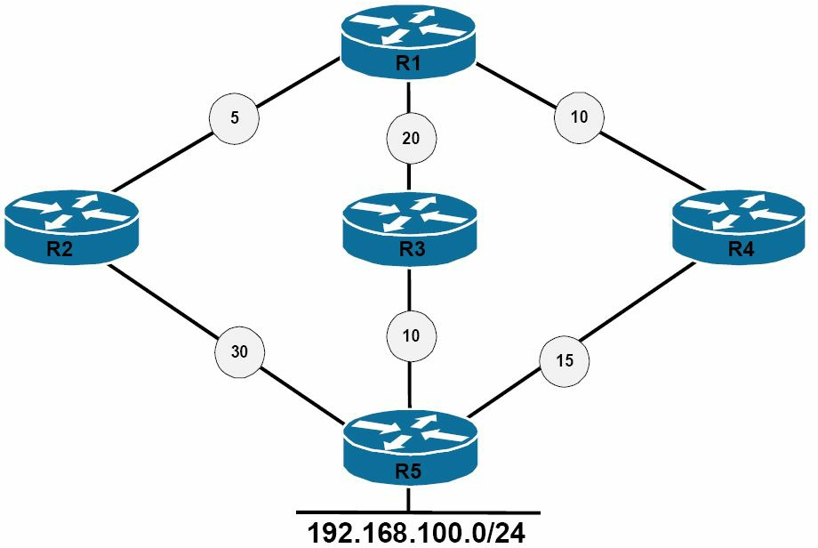

# 度量值、DUAL 及拓扑数据表

实施 EIGRP 时，掌握路由被实际放入 IP 路由表前，在协议内部及由协议用到的各个方面非常重要。在这一小节中，咱们将了解 EIGRP 的综合度量值及其计算方法。咱们还将了解影响度量值计算，以及调整计算得到的度量值的不同方法。

随后，咱们将了解扩散更新算法 (DUAL) ，以及 EIGRP 的拓扑数据表。这一小节以对在运行 EIGRP 的路由器上产生 IP 路由表时，所有这些信息如何整合在一起的讨论结束。

## EIGRP 的综合度量值计算


增强型 IGRP 使用一种复合度量值，其中包含着一些称为 `K` 值的不同变量。所谓 `K` 值，是一些分配权重到路径不同方面的常数，这些方面可能就包含在综合 EIGRP 度量值中。`K` 值的默认值，为 `K1 = K3 =1` 及 `K2 = K4 = K5 = 0`。 换句话说，`K1` 与 `K3` 被设置为 1 的默认值，而 `K2`、`K4` 和 `K5` 被设置为 0 的默认值。

假设在默认的 K 值设置下，那么完整的 EIGRP 度量值，便可通过使用以下数学公式计算出来：

`[K1 * 带宽 + (K2 * 带宽)/(256 - 负载) + K3 * 延迟] * [K5 / (可靠性 + K4)]`


但是，由于默认情况下只有 `K1` 和 `K3` 有正值，因此默认的 EIGRP 度量值计算，是通过使用以下数学公式完成的：

<code>[(10<sup>7</sup>/路径上最小带宽) + (所有延迟之和)] * 256</code>

这基本上意味着，默认情况下，EIGRP 使用到目的网络路径上的最小带宽，与总累积延迟计算路由度量值。不过，Cisco I0S 软件允许管理员，设置别的 K 值一些为非零值，以便将其他变量纳入这个综合度量值。这可使用 `metric weights [tos] k1 k2 k3 k4 k5` 这条路由器配置命令完成。


使用 `metric weights` 命令时，`[tos]` 代表服务类型。虽然 Cisco IOS 软件显示 0 到 8 之间任何值均可使用，但在编写这本指南时，这一字段只可被设置为 0。而那些 `K` 值，则可设置为 0 至 255 之间的任意值。默认 EIGRP 的 `K` 值，可通过执行 `show ip protocols` 命令查看。这在以下输出中得以演示：


```console
R2#show ip protocols
Routing Protocol is “eigrp 150”
  Outgoing update filter list for all interfaces is not set
  Incoming update filter list for all interfaces is not set
  Default networks flagged in outgoing updates
  Default networks accepted from incoming updates
  EIGRP metric weight K1=1, K2=0, K3=1, K4=0, K5=0
  EIGRP maximum hopcount 100
  EIGRP maximum metric variance 1
  Redistributing: eigrp 150
  EIGRP NSF-aware route hold timer is 240s
  Automatic network summarization is not in effect
  Maximum path: 4
  Routing for Networks:
    192.168.1.0
  Routing Information Sources:
    Gateway         Distance        Last Update
    192.168.1.3     90              00:00:15
  Distance: internal 90 external 170
```

在调整 EIGRP 的 `K` 值时，重要的是要记住，同样的一些值，必须配置在该 EIGRP 域内的所有路由器上。当这些 `K` 值不匹配时，那么 EIGRP 的邻居关系就将无法建立。

**注意**：调整默认的 `K` 值设置不被推荐。这只应在对网络中此类操作的影响，有深入了解的经验丰富的高级工程师协助下，或者根据 Cisco 技术援助中心 (TAC) 的建议完成。

### 运用接口带宽影响 EIGRP 的度量值计算


增强型 IGRP 的度量值结算，可通过使用 `bandwidth` 命令，调整指派给各个接口的默认带宽值直接施加影响。由这条命令指定的带宽值，以千位（kilobits）度量。而用于 EIGRP 度量值计算的带宽，也是以千位度量。下图 22.5 演示了一个由两台，经由两条有着 1544Kbps 带宽值的串行 (T1) 链路连接的路由器组成的网络。


**图 22.8** -- **EIGRP 度量值的带宽操作**

参照图 22.8 中的图表，由于 `R1` 和 `R2` 之间两条链路相等的带宽（及延迟）值，因此从 `R2` 到 `172.16.100.0/24` 这个子网的两条路径的同一 EIGRP 度量值就将被推导出来。EIGRP 将在这两条串行链路之间，负载均衡流量，如 `R2` 上的以下输出所示：


```console
R2#show ip route 172.16.100.0 255.255.255.0
Routing entry for 172.16.100.0/24
  Known via “eigrp 150”, distance 90, metric 2172416, type internal
  Redistributing via eigrp 150
  Last update from 150.2.2.1 on Serial0/1, 00:48:09 ago
  Routing Descriptor Blocks:
    150.2.2.1, from 150.2.2.1, 00:48:09 ago, via Serial0/1
      Route metric is 2172416, traffic share count is 1
      Total delay is 20100 microseconds, minimum bandwidth is 1544 Kbit
      Reliability 255/255, minimum MTU 1500 bytes
      Loading 1/255, Hops 1
  * 150.1.1.1, from 150.1.1.1, 00:48:09 ago, via Serial0/0
      Route metric is 2172416, traffic share count is 1
      Total delay is 20100 microseconds, minimum bandwidth is 1544 Kbit
      Reliability 255/255, minimum MTU 1500 bytes
      Loading 1/255, Hops
```

调整两个接口中任一上的默认带宽值，都将直接影响这一到目的网络路径的 EIGRP 度量值计算。此类操作可用于大型网络中的路径控制（即，根据管理员定义的值与配置，控制流量所采取的路径）。例如，当优先选择 EIGRP 将 `Serial0/0` 作为到目的网络的主路径，而将 `Serial0/1` 作为到目的网络的备份路径时，那么咱们可采取以下两种操作之一：

- `Serial0/0` 上的带宽值可被提升，得到哟该路径的一个更好（更低）度量值；
- `Serial0/1` 上的带宽值可被降低，得到该路径的一个更差（更高）度量值。


两个选项中任一都是可以接受的，并都将达到所要的结果。以下输出演示了如何降低 `Serial0/1` 上的默认带宽值，从而有效确保 `Serial0/0` 被用作 `R2` 与 `172.16.100.0/24` 网络之间的主路径：

```console
R2(config)#interface Serial0/1
R2(config-if)#bandwidth 1024
R2(config-if)#exit
```


**注意**：这一配置并不意味着 `Serial0/1` 现在只具备通过此接口的 1024Kbps 吞吐量。

这一配置的结果，便是 `Serial0/0` 是 `R2` 用于到达 `172.16.100.0/24` 这个目的网络的主要路径。这在以下输出中得以演示：


```console
R2#show ip route 172.16.100.0 255.255.255.0
Routing entry for 172.16.100.0/24
  Known via “eigrp 150”, distance 90, metric 2172416, type internal
  Redistributing via eigrp 150
  Last update from 150.1.1.1 on Serial0/0, 00:01:55 ago
  Routing Descriptor Blocks:
  * 150.1.1.1, from 150.1.1.1, 00:01:55 ago, via Serial0/0
      Route metric is 2172416, traffic share count is 1
      Total delay is 20100 microseconds, minimum bandwidth is 1544 Kbit
      Reliability 255/255, minimum MTU 1500 bytes
      Loading 1/255, Hops 1
```

**注意**：其中星号 (`*`) 指向的是，下一个数据包将于其上发送的那个接口。在路由表中有多条等价路由的情况下，`*` 的位置会在这些等价路由中轮换。


虽然经由 `Serial0/1` 接口的那条路径不会被安装到路由表中，但在使用 EIGRP 作为路由协议时，重要的是记住，这条路径不会被完全忽略。相反，这条路径被存储在 EIGRP 的拓扑数据表中，其包含着到远端目的网络的主路径和备用（备份）路径。EIGRP 的拓扑数据表，将在这一教学模组稍后详细介绍。


**注意**：默认情况下，在 EIGRP 被启用后，他可使用接口带宽的最多 50%，发送 EIGRP 数据包（EIGRP 是种非常健谈的协议，因此他在可能的带宽使用上限制了自己）。EIGRP 根据 `bandwidth` 这条接口配置命令，确定出带宽量。因此，在调整接口带宽值时，记住这点就很重要。这种默认设置，可通过使用 `ip bandwidth-percent eigrp [ASN] [percentage]` 这条接口配置命令调整。

总之，在使用 `bandwidth` 命令影响 EIGRP 的度量值计算时，重要的是记住，EIGRP 使用到目标网络路径上的最小带宽，以及累积延迟，来计算路由度量值。有着对网络拓扑结构的扎实掌握，对于最好地确定出，预期在何处使用 `bandwidth` 命令影响 EIGRP 的度量值计算，就十分重要。但在现实世界中，延迟是影响 EIGRP 度量值的首选方式。


### 使用接口延迟影响 EIGRP 的度量值计算

接口的延迟值，以微秒表示。EIGRP 度量值计算中用到的延迟值，则是以 10 微妙计。因此，为了计算 EIGRP 度量值，接口上的延迟值必须除以 10。下表 22.3 显示了 Cisco 10S 中用到的默认接口带宽与延迟值。


**表 22.3** -- **默认接口带宽与延迟值**

| 接口类型 | 带宽（ Kilobits ） | 延迟（Microseconds） |
| :-- | --: | --: |
| 以太网 | 10,000 | 1,000 |
| 快速以太网 | 100,000 | 100 |
| 千兆以太网 | 1,000,000 | 10 |
| 万兆以太网 | 10,000,000 | 10 |
| 串行线路（ T1 ） | 1,544 | 20,000 |
| 串行线路（ E1 ） | 2,048 | 20,000 |
| 串行线路（ T3 ） | 44,736 | 200 |
| 串行线路（ E3 ） | 34,010 | 200 |


在使用接口带宽与延迟值时，重要的是记住，调整接口带宽值，不会自动调整接口的延迟值，反之亦然。这两个值是各自独立的。例如，以下输出显示了一个 `FastEthernet` 接口的默认带宽与延迟值：


```console
R2#show interfaces FastEthernet0/0
FastEthernet0/0 is up, line protocol is up
  Hardware is AmdFE, address is 0013.1986.0a20 (bia 0013.1986.0a20)
  Internet address is 192.168.1.2/24
  MTU 1500 bytes, BW 100000 Kbit/sec, DLY 100 usec,
     reliability 255/255, txload 1/255, rxload 1/255
...

[Truncated Output]
```

为强化这一概念，这个 `FastEthernet` 接口上的带宽值，已使用 `bandwidth` 这条接口配置命令调整为 1,544Kbps，如下所示：


```console
R2(config)#interface FastEthernet0/0
R2(config-if)#bandwidth 1544
R2(config-if)#exit
```

虽然显示于 `show interfaces` 命令输出中的带宽值，反映了该这个已实施的配置，但默认接口延迟值则保持不变，如下所示：


```console
R2#show interfaces FastEthernet0/0
FastEthernet0/0 is up, line protocol is up
  Hardware is AmdFE, address is 0013.1986.0a20 (bia 0013.1986.0a20)
  Internet address is 192.168.1.2/24
  MTU 1500 bytes, BW 1544 Kbit/sec, DLY 100 usec,
     reliability 255/255, txload 1/255, rxload 1/255
```

EIGRP 用到的累积延迟，是源与目的网络之间所有接口延迟的总和。更改路径中的任何一个延迟值，都会影响 EIGRP 的度量值计算。接口延迟值，是通过使用 `delay` 这条接口配置命令调整的。这个值随后会在 EIGRP 计算时被除以 10。下图 22.9 演示了个由两台经由两条有着 1544Kbps 的带宽值，20000 微秒默认延迟值的串行（T1）链路连接的路由器组成的网络。此外，`172.16.100.0/24` 网络直连到一个有着 100,000Kbps 的默认带宽，100 微秒默认延迟值的 `FastEthernet` 接口。


**图 22.9** -- **EIGRP 度量值的延迟操作**

从 `R2` 到 `172.16.100.0/24` 网络的 EIGRP 度量值计算如下：

<code>
度量值 = [(10<sup>7</sup>/路径上的最低带宽) + (全部延迟之和)] x 256
度量值 = [(10,000,000/1,544) + (2,000 + 10)] x 256
</code>

**注意**：对于 EIGRP 度量值的计算，要记住将接口延迟值除以 10。

```console
度量值 = [(10,000,000/1544) + (2000 + 10)] x 256
```

**注意**： 计算得到的值，应始终向下舍入到最接近整数。

```console
度量值 = [6,476 + 2,010] x 256
度量值 = 8486 x 256
度量值 = 2,172,416
```


这一计算可通过使用 `show ip route` 命令验证，如下所示：

```console
R2#show ip route 172.16.100.0 255.255.255.0
Routing entry for 172.16.100.0/24
  Known via “eigrp 150”, distance 90, metric 2172416, type internal
  Redistributing via eigrp 150
  Last update from 150.2.2.1 on Serial0/1, 00:03:28 ago
  Routing Descriptor Blocks:
    150.2.2.1, from 150.2.2.1, 00:03:28 ago, via Serial0/1
      Route metric is 2172416, traffic share count is 1
      Total delay is 20100 microseconds, minimum bandwidth is 1544 Kbit
      Reliability 255/255, minimum MTU 1500 bytes
      Loading 1/255, Hops 1
  * 150.1.1.1, from 150.1.1.1, 00:03:28 ago, via Serial0/0
      Route metric is 2172416, traffic share count is 1
      Total delay is 20100 microseconds, minimum bandwidth is 1544 Kbit
      Reliability 255/255, minimum MTU 1500 bytes
      Loading 1/255, Hops 1
```

与 `bandwidth` 命令下一样，咱们可使用 `delay` 命令，增加或减少接口延迟值，影响 EIGRP 的度量值计算。例如，要将 `R2` 配置为使用 `Serial0/0` 链路到达 `172.16.100.0/24` 网络，而 `Serial0/1` 仅用作备份链路，那么 `Serial0/0` 上的延迟值便可按如下方式降低：


```console
R2(config)#int s0/0
R2(config-if)#delay 100
R2(config-if)#exit
```

这一配置调整了经由 `Serial0/0` 的那条路径的 EIGRP 度量值，如下所示：

```console
R2#show ip route 172.16.100.0 255.255.255.0
Routing entry for 172.16.100.0/24
  Known via “eigrp 150”, distance 90, metric 1686016, type internal
  Redistributing via eigrp 150
  Last update from 150.1.1.1 on Serial0/0, 00:01:09 ago
  Routing Descriptor Blocks:
  * 150.1.1.1, from 150.1.1.1, 00:01:09 ago, via Serial0/0
      Route metric is 1686016, traffic share count is 1
      Total delay is 1100 microseconds, minimum bandwidth is 1544 Kbit
      Reliability 255/255, minimum MTU 1500 bytes
      Loading 1/255, Hops 1
```

经由 `Serial0/1` 的那条路径，作为到该网络的一条备用路径保留在拓扑数据表中。

> *知识点*：
>
> - the EIGRP composite metric, includes different variables referred to as the `K` values
>
> - the K values are constants that are used to distribute weight to different path apspects
>
> - `K1 = K3 = 1`, `K2 = K4 = K5 = 0`
>
> - `[K1 * bandwidth + (K2 * bandwidth) / (256 - load) + K3 * delay] * [K5 / (reliability + K4)]`, the full mathematical EIGRP metric calculation formula
>
> - `[(10⁷ ⁄ least bandwidth on path) + (sum of all delays)] × 256`, the simplififed EIGRP metric calculation formula
>
> - by default, EIGRP uses the minimum bandwidth on the path to a destination network, and the total cumulative delay, to compute routing metrics
>
> - to set other K values to non-zero values to incorporate other variables into the composite metric, this may be performed using the `metric weights [tos] k1 k2 k3 k4 k5` router configuration command
>
> - `[tos]` stands for Type of Service, at the time of writing this guide, this field can be set only to zero, although that might be any value between 0 and 8
>
> - when adjusting the EIGRP K values, the same values must be configured on all routers within the EIGRP domain, if they are mismatched, EIGRP neighbor relationships will not be established
>
> + using interface bandwidth to influence EIGRP metric calculation
>   - Enhanced IGRP metric calculation can be directly influence by adjusting the default bandwidth values assigned to individual interfaces
>   - by using the `bandwidth` command
>   - values specified by this command, are in Kilobits
>   - the bandwidth used in EIGRP metric calculation, is also in Kilobits
>   - EIGRP will load-share traffic between the two links with the same EIGRP metric
>   - adjusting the default bandwidth value on interfaces, can be used for path control within larger networks, i.e., controlling the path that traffic takes based on administrator-defined values and configuration
>   - in the output of `show ip route`, the asterisk(`*`) points to the interface over which the next packet is sent, in the event that there are multiple equal-cost routes in the routing table, the position of the `*` rotates among the equal-cost paths
>   - the paths which are not installed into the routing table, are still stored in the EIGRP topology table as alternate(backup) paths, along with the primary route
>
>   - EIGRP can use up to 50% of the interface bandwidth, to send EIGRP packets, due to EIGRP is a very chatty protocol, EIGRP determines the bandwidth amount based on the `bandwidth` interface configuration command, this default setting, can be adjusted by using the `ip bandwidth-percent eigrp [ASN] [percentage]` interface configuration command
>
> + using interface delay to influence EIGRP metric calculation
>   - is the preferred method of influencing EIGRP metrics
>   - is presented in microseconds
>   - the delay value used in EIGRP metric calculation, is in tens of microseconds, so, the delay value on the interface, must be divided by 10, in order to compute the EIGRP metric
>   - ajusting the interface bandwidth value, does not automaticlly adjust the interface delay value, the two values are independent of each other
>   - the cumulative delay used by EIGRP, us the sum of all interface delays between the source and the destination network
>   - the interface delay value is adjusted by using the `delay` interface configuration command

## 弥散更新算法


所谓弥散更新算法（DUAL），是 EIGRP 路由协议的关键。DUAL 会查看接收自邻居路由器的所有路由，对他们加以比较，然后选出到目的网络的最低度量值（最佳）无环路路径，即可行距离 (FD)，从而得到继承路由。FD 包括由相连邻居通告的某个网络度量值，以及到达该特定邻居的开销。


邻居路由器通告的度量值，被称为到目的网络的报告距离（RD），或通告的距离（AD）。因此，FD 就包括了 RD，加上到达该特定邻居的开销。后续路由的下一跳路由器，称为接续者。接续者的路由，会被置于 IP 路由表以及 EIGRP 的拓扑数据表中，并指向该接续者。


有着比接续者路由 FD 更低 RD 的，到同一目的网络的任何其他路由，都保证是无环路的，并称为可行接续者（FS）路由。这些路由不会被置于 IP 路由表中；但他们仍会与接续者路由一道，置于 EIGRP 的拓扑数据表中。

为了使某条路由成为 FS 路由，其必须满足可行性条件（FC），只有在到目的网络的 RD 小于 FD 时，可行性条件才会出现。在 RD 大于 FD 的情形下，那么该路由就不会被选为 FS。这点被 EIGRP 用于防止环路的可能。下图 22.10 中所示的网络拓扑结构，将用于阐明这一小节中提到的术语。





**图 22.10** -- **理解弥散更新算法**

参照图 22.7，下表 22.4 显示了 `R1` 上观察到的，`192.168.100.0/24` 网络的可行距离与报告距离值：

**表 22.4** -- **`R1` 的路径及距离**


| 网络路径 | `R1` 的邻居 | 邻居度量值（RD） | `R1` 的可行距离 |
| :-- | :-- | --: | --: |
| `R1`-`R2`-`R5` | `R2` | 30 | 35 |
| `R1`-`R3`-`R5` | `R3` | 10 | 30 |
| `R1`-`R4`-`R5` | `R4` | 15 | 25 |


根据表 22.4 中的信息，`R1` 将根据该路由 25 的，选择通过 `R4` 的路径作为接续者路由。这条路由将被置于 IP 路由表及 EIGRP 的拓扑数据表中。`R1` 随后会查看到 `192.168.100.0/24` 网络的那些备用路径。邻居 `R3` 到 `192.168.100.0/24` 网络的度量值，也称为 RD 或 AD，为 10。这小于 FD。那么这条路由满足 FC，而会被置于 EIGRP 的拓扑数据表中。邻居 `R2` 到 `192.168.100.0/24` 网络的度量值为 30。这一值高于 25 的 FD。那么这条路由就不满足 FC，而不会被视为一条 FS。不过，该路由仍被置于 EIGRP 的拓扑数据表中。这点在接下来的 EIGRP 拓扑数据表小节会得以演示。

当某个邻居更改某个度量值，或某种拓扑变化发生，且接续者路由被移除或变更时，DUAL 就会检查该路由的那些 FS。当一个 FS 找到时，DUAL 就会使用他，以避免不必要地重新计算该路由。这被称为本地计算。执行一次本地计算，节省了 CPU 算力，因为在接续者路由或主路由失效前，FS 就已被选中并已经存在。

当没有目的网络的 FS 时，那么本地路由器将发送一个查询数据包到邻近路由器，询问他们是否有着关于该目的网络的信息。当该信息可用，且另一邻居确实有着到该目的地网络的一条路由时，那么该路由器就会执行一次弥散计算，确定出新的接续者。


> *知识点*：
>
> + the Diffusing Update Algorithm, DUAL
>   - is at the crux of the EIGRP routing protocol
>   - looks at all routes received from neighbor routers, compare them
>
> + and then selects the lowest metric(best) loop-free path to the destination network, which is the Feasible Distance, FD, resulting the Successor route
>   - the FD includes both the metric of a network, as advertised by the Connected neighbour, plus the cost of reaching that particular neighbour
>   - the metric that is advertised by the neighbour router, is referred to as the Reported Distance, RD, or as the Advertised Distance, AD, to the destination network
>   - So, the FD includes the RD, plus the cost of reaching that particular neighbour
>   - the next-hop router for the Successor route, is referred to as the Successor
>   - the Successor route is placed into the IP routing table and the EIGRP topology table, and it points to the Successor
>
> + Any other routes to the same destination network that have a lower RD than the FD of the Successor route, are guaranteed to be loop-free and are referred to as Feasible Successor, FS routes
>   - are not placed into the IP routing table
>   - are still placed into the EIGRP topology table, along with the Successor routes
>   - in order for a route to become an FS route, it must meet the Feasible Condition, FC, which occurs only when the RD to the destination network, is less thant the FD
>   - in the event that the RD is more than the FD, the route is not selected as an FS
>   - this is used by EIGRP to prevent the possibility of loops
>
> + when a neighbor changes a metric, or when a topology change occurs, and the Successor route is removed or changed, DUAL checks for FSs for the route
>   - if one is found, then DUAL uses it to avoid re-computing the route unnecessarily
>   - this is referred as local computation
>   - performing a local computation saves CPU power, because the FS has been chosen and already exists, before the Successor or primary route fails
>   - when no FS for the destination network exists, the local router will send a Query to neighboring routers, asking if they have information on the destination network
>   - if the inforamtion is available and another neighbour does have a route to the destination network, then the router performs a diffusing computation to determine a new Successor

## EIGRP 的拓扑数据表

EIGRP 的拓扑数据表，由受 DUAL 有限状态机作用下的各个 EIGRP 的协议相关模组（PMD）产生。由相邻 EIGRP 通告的全部已知目的网络与子网，均存储在 EIGRP 的拓扑数据表中。这包括接续者路由、FS 路由，甚至包括那么未满足 FC 的路由。

这种拓扑数据表，允许所有 EIGRP 路由器有着整个网络的一致视图。他还允许 EIGRP 网络的快速收敛。拓扑数据表中的各个单独条目，都包含了目的网络，以及通告该目的网络的邻居。FD 与 RD 二者都存储在拓扑数据表中。EIGRP 的拓扑数据表，包含着建立一套到每个可达网络的距离与矢量集所需的信息，包括以下这些：

- 到目的网络路径上的最低带宽
- 到目的网络的总延迟或累计延迟
- 到目的网络路径的可靠性
- 到目的网络路径的负载
- 到目的网络最大传输单元 (MTU) 的最小值
- 到目的网络的可行距离，FD
- 由邻居路由器提供的到目的网络的报告距离，RD
- 目的网络的路由源（仅限外部路由）

**注意**：虽然 MTU 包含在拓扑数据表中，但 EIGRP 不会在实际度量值计算中使用这个值。取而代之的是，MTU 只会被跟踪以确定到目的网络的最小值。接口的 MTU 指定了可在无需分片/分段，或将数据报或数据包分割成小块，即可在某一特定链路上传输的最大数据报大小。

EIGRP 拓扑数据表的内容，通过使用 `show ip eigrp topology` 命令即可查看。这一命令下的可用选项，如下所示。


```console
R2#show ip eigrp topology ?
  <1-65535>       AS Number
  A.B.C.D         IP prefix <network>/<length>, e.g., 192.168.0.0/16
  A.B.C.D         Network to display information about
  active          Show only active entries
  all-links       Show all links in topology table
  detail-links    Show all links in topology table
  pending         Show only entries pending transmission
  summary         Show a summary of the topology table
  zero-successors Show only zero successor entries
  |               Output modifiers
  <cr>
```

不带选项的 `show ip eigrp topology` 命令，只会打印拓扑数据表中路由的接续者及可行接续者（FS）信息，以及路由器上已启用的全部 EIGRP 实例信息。该命令打印的输出如下所示。


```console
R2#show ip eigrp topology
IP-EIGRP Topology Table for AS(150)/ID(2.2.2.2)
Codes: P - Passive, A - Active, U - Update, Q - Query, R - Reply,
       r - reply Status, s - sia Status
P 150.2.2.0/24, 1 successors, FD is 20512000
        via Connected, Serial0/1
        via 150.1.1.1 (2195456/2169856), Serial0/0
P 150.1.1.0/24, 1 successors, FD is 1683456
        via Connected, Serial0/0
P 172.16.100.0/24, 1 successors, FD is 1686016
        via 150.1.1.1 (1686016/28160), Serial0/0
```


`show ip eigrp topology [network]/[prefix]` 与 `show ip eigrp topology [network] [mask]` 两条命令，会打印在两条命令种所指定路由的接续者路由、FS 路由及那些未满足 FC 的路由。以下输出演示了 `show ip eigrp topology [network]/[prefix]` 这条命令的用法：


```console
R2#show ip eigrp topology 172.16.100.0/24
IP-EIGRP (AS 150): Topology entry for 172.16.100.0/24
  State is Passive, Query origin flag is 1, 1 Successor(s), FD is 1686016
  Routing Descriptor Blocks:
  150.1.1.1 (Serial0/0), from 150.1.1.1, Send flag is 0x0
      Composite metric is (1686016/28160), Route is Internal
      Vector metric:
        Minimum bandwidth is 1544 Kbit
        Total delay is 1100 microseconds
        Reliability is 255/255
        Load is 1/255
        Minimum MTU is 1500
        Hop count is 1
  150.2.2.1 (Serial0/1), from 150.2.2.1, Send flag is 0x0
      Composite metric is (2167998207/2147511807), Route is Internal
      Vector metric:
        Minimum bandwidth is 128 Kbit
        Total delay is 83906179 microseconds
        Reliability is 255/255
        Load is 1/255
        Minimum MTU is 1500
        Hop count is 1
```

在上面的输出中，咱们可以看到经由 `Serial0/1` 的那条路径，就不满足 FC，因为 RD 超过了 FD。这就是为什么该路径未在 `show ip eigrp topology` 命令的输出中被打印的原因。咱们可使用 `show ip eigrp topology all-links` 命令，查看 EIGRP 拓扑主句表中，所有前缀的所有可能路由，而不是逐个地查看每个前缀，确定接续者路由、FS 路由，以及那些不满足 FC 的路由。这一命令的输出如下所示。


```console
R2#show ip eigrp topology all-links
IP-EIGRP Topology Table for AS(150)/ID(2.2.2.2)
Codes: P - Passive, A - Active, U - Update, Q - Query, R - Reply,
       r - reply Status, s - sia Status

P 150.2.2.0/24, 1 successors, FD is 20512000, serno 42
        via Connected, Serial0/1
        via 150.1.1.1 (2195456/2169856), Serial0/0
P 150.1.1.0/24, 1 successors, FD is 1683456, serno 32
        via Connected, Serial0/0
        via 150.2.2.1 (21024000/2169856), Serial0/1
P 172.16.100.0/24, 1 successors, FD is 1686016, serno 47
        via 150.1.1.1 (1686016/28160), Serial0/0
        via 150.2.2.1 (2167998207/2147511807), Serial0/1
```


在 EIGRP 的拓扑数据表中，条目可标记为被动 (P) 或主动 (A)。处于 “被动” 状态的某条路由，表明 EIGRP 已完成该条路由度量值的主动计算，流量可通过使用该接续者路由，转发到目的网络。这是拓扑数据表中所有路由的首选状态。

当接续者路由丢失，路由器发出一个查询数据包以确定某个 FS 时，那么这些增强型 IGRP 路由便处于主动状态。通常，某个 FS 存在，而 EIGRP 会将其提升为接续者路由。在这种方式下，路由器会在不涉及网络中其他路由器的情况下收敛。这一过程被称为本地计算。

但是，当接续者路由丢失或被移除，并且没有 FS 时，那么路由器将开始弥散计算。在弥散计算下，EIGRP 将发出一个查询数据包到所有邻居，并在出了到接续路由的接口外的全部接口上发出。当某个 EIGRP 邻居收到一个路由查询数据包时，若该邻居的 EIGRP 拓扑数据表中不包含该路由的条目，那么该邻居会立即以一条不可达报文，回复这个查询数据包，声明没有经由此邻居的该路由的路径。

当邻居上的 EIGRP 拓扑数据表，将发送这个查询的路由器，列为该路由的接续者，并且一个 FS 存在时，那么这个 FS 将被安装，同时该路由器将回复这个邻居查询，他有条到那个丢失目的网络的路由。（译注：即该邻居原先有条经由发出查询路由器到目的网络的 FD，又有条经由其他路由器到目的网络的 FS，此时原先的 FD 已不可用，因此原先的 FS 将成为新的 FD）

但是，当 EIGRP 的拓扑数据表，将发送查询的路由器列为此路由的接续者，且没有 FS 时，那么该路由器就会查询其所有 EIGRP 邻居，除了那些曾作为其先前接续者，从同一接口发出的查询外。在其收到他为该路由发起的所有查询的一个回复前，该路由不会回复这个查询（译注：早先对这个邻居路由器的查询数据包）。

最后，当查询在某个并非该目的地接续者的邻居上收到的时，那么该路由器会回复以其自己的接续者信息。当这些相邻路由器都没有那条丢失路由的信息时，那么一些查询数据包，便会自这些相邻路由器，发送到其相邻路由器，直到到达查询边界。所谓查询边界，可以是网络末端、分发列表的边界，或者汇总的边界。


一旦查询数据包已发出，EIGRP 路由器在其计算接续者路由前，必须等待收到所有的回复数据包。当任何邻居在三分钟内没有回复时，那么该路由就会被指为卡在主动状态（SIA）。当某条路由处于 SIA 状态时，未回复这个查询的路由器的邻居关系，将被重置。在这种情形下，咱们将看到路由器会日志记录一条类似下面的消息：


```console
%DUAL-5-NBRCHANGE: IP-EIGRP 150:
    Neighbor 150.1.1.1(Serial0/0) is down: stuck in active
%DUAL-3-SIA:
    Route 172.16.100.0/24 stuck-in-active state in IP-EIGRP 150.
Cleaning up
```

EIGRP 邻居路由器可能不响应查询数据包的原因有数种，其中包括下面这些：

- 邻居路由器的 CPU 过载，仅而其无法及时响应
- 邻居路由器本身没有关于这条丢失路由的信息
- 电路质量问题，正导致数据包丢失
- 某些低带宽链路经历拥塞，进而数据包正被延迟


要防止因其他 EIGRP 邻居的延迟响应而导致的 SIA 问题，本地路由器可通过在路由器配置模式下，使用 `timers active-time` 命令，配置为等待超过默认的三分钟，接收对其查询数据包的响应。

**注意**：重要的是要注意，当咱们修改咱们网络中一台 EIGRP 路由器上的这个默认参数时，咱们还必须在咱们 EIGRP 路由域内的所有其他路由器上修改他。


> *知识点*：
>
> + the EIGRP topology table
>   - is populated by EIGRP Protocol-Dependent Modules, acted upon by the DUAL Finite State Machine
>   - all known destination networks and subnets that are advertised by neighbouring EIGRP routers, are stored in the EIGRP topology table
>   - includes Successor routes, FS routes, and even routes that have not met the FC
>   - allows all EIGRP routers, to have consistent view of the entire network
>   - allows for rapid convergence in EIGRP networks
>
> - each individual entry in the topology table, contains the destination network, and the neighbor(s) that have advertised the destination network, both the FD and the RD are stored in the topology table
>
> + the information contained in the EIGRP topology table, needed to build a set of distance and vectors to each reachable network, including:
>   - the lowest bandwidth on the path to the destination network
>   - the total or cumulative delay to the destination network
>   - the reliability of the path to the destination network
>   - the loading of the path to the destination network
>   - the minimum Maximum Transmission Unit, MTU to the destination network
>   - the Feasible Distance to the destination network
>   - the Reported Distance by the neighboring router to the destination network
>   - the route source (only external routes) of the destination network
>   - the interface MTU specifies the largest size of the datagram, that can be transferred across a certain link witout the need for fragmentation, or breaking the datagram or packet into smaller pieces
>   - EIGRP does not use the MTU included in the topology table, in the actual metric computation, the MTU is simply tracked to determine the minimum value to the destination network
>
> + entris in the EIGRP topology table, may be marked either as Passive(P) or as Active(A)
>   - a route in Passive state, indicates that EIGRP has completed actively computing the metric for the route, and traffic can be forwarded to the destination network by using the Successor route, is the preferred state for all routes in the topology table
>   + Enhanced IGRP routes in an Active state, when the Successor route has been lost
>       - the router sends out a Query packet to determine an FS
>       - Usually, an FS is present and EIGRP promotes that to the Successor route, in this way, the router converges without involving other routers in the network, this process is referred to as a local computation
>
> + if the Successor route has been lost or removed, and there is no FS
>   - then the router will begin diffused computation
>   - EIGRP will send a Query to all neighbors and out of all interfaces, except for the interface to the Successor route
>   - When an EIGRP neighbor receives a Query for a route, and if that neighbor's EIGRP topology table does not contain an entry for the route, then the neighbor router immediately replies to the Query with an unreachable message, stating that there is no path for this route through this neighbor
>   - if the EIGRP topology table on the neighbor lists the router sending the Query, as the Successor for that route, and an FS exists, then the FS is installed and the router replies to the neighbor Query, that is has a route to the lost destination network
>   - if the EIGRP topology table lists the router sending the Query as the Successor for this route, and there is no FS, then the router queries all of its EIGRP neighbors, except those that were sent out the same interface as its former Successor（the router which sent the original Query）, the router will not reply to the Query, until it has received a Reply to all Queries that it originated for this route
>   - if the Query was received from a neighbor that is not the Successor for this destination, then the router replies with its own Successor information
>   - if the neighboring routers do not have the lost route information, the Queries are sent from those neighboring routers, to their neighboring routers, until the Query boundary is reached
>
> - the Query boundary, is either the end of the network, the distribute list boundary, or the summarization boundary
>
> - if any neighbor has not replied within three mininutes, the route is said to be Stuck-In-Active, SIA, when a route is SIA, the neighbor relationship of the router(s) that did not respond to the Query, will be reset
>
> + reasons that why the EIGRP neighbor router(s) may not respond to the Query:
>   - the neighbor router's CPU is overloaded, and it cannot respond in time
>   - the neighbor router itself has no information about the lost route
>   - Quality issues on the circuit, are causing packets to be lost
>   - Low-bandwidth links are congested, and packets are being delayed
>
> - to prevent SIA issues, the local router can be configured to wait for longer than the default of three mininutes, to receive responses back to its Query packets, by using the `timer active-time` command, in Router Configuration mode, this default parameter must be changed on all the routers within the EIGRP routing domain
>
