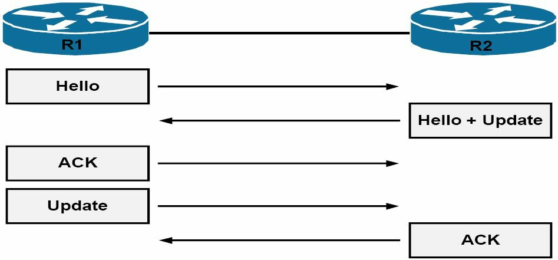
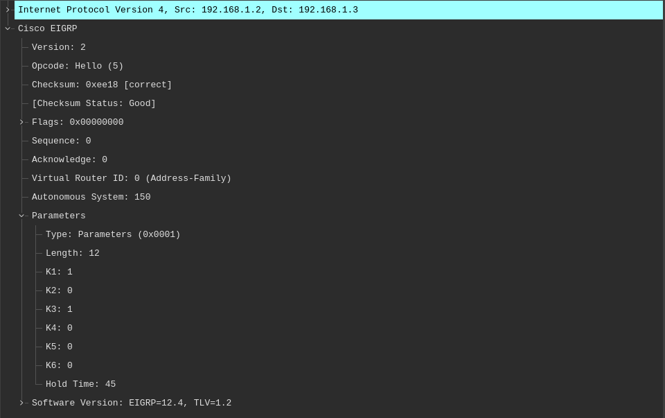

# EIGRP 的邻居发现与维护


增强型 IGRP 可配置为动态地（默认）发现邻居路由器，或经由管理手动配置发现。这两种方法，以及其他 EIGRP 邻居相关的主题，将在接下来的小节中介绍。


## 动态的邻居发现

动态邻居发现，是通过发送 EIGRP 的 `Hello` 数据包到目的组播组地址 `224.0.0.10` 完成的。这在路由器上配置 EIGRP 时，`network` 命令执行后，就会立即进行。此外，正如早先所指出的那样，EIGRP 的数据包会使用协议编号 88，直接在 IP 上发送。下图 22.4 演示了基本的 EIGRP 邻居发现及路由交换过程。




**图 22.4** -- **EIGRP 的邻居发现与路由交换**

参照图 22.4，在初始化时，这两个 EIGRP 邻居，就会发送 `Hello` 数据包以发现别的邻居。两个邻居随后便经由完整更新，交换他们的完整路由表。这些更新包含着全部已知路由的信息。由于 `Update` 数据包是可靠发送的，因此他们必须由接收者显式确认。

两个邻居已交换他们的路由信息后，会继续交换 `Hello` 数据包以维护邻居关系。此外，EIGRP 的邻居路由器，将只发送一些增量更新，通告邻居状态，或一些路由变化。他们将不再发送完整更新到邻居路由器。


重要的是要明白，仅在两个或多个路由器之间启用 EIGRP，并不能保证邻居关系将被建立。相反，为了这些路由器成为邻居，一些参数必须匹配。由于任何以下的一些情形，EIGRP 邻居关系就不会建立起来：

- 不匹配的 EIGRP 认证参数（在已配置时）
- 不匹配的 EIGRP `K` 值
- 不匹配的 EIGRP 自治系统编号
- 针对 EIGRP 邻居关系使用了辅助地址
- 邻居不在同一个子网中


尽管 `show ip eigrp neighbors` 这条命令并未区分动态配置的邻居，还是静态配置的邻居，但 `show ip eigrp interfaces detail <name>` 这条命令，却可用于检查路由器接口是否正发出组播数据包，以及是否维护着邻居关系。在某个启用了动态邻居发现的路由器上，这条命令的输出如下所示。


```console
R2#show ip eigrp interfaces detail FastEthernet0/0
IP-EIGRP interfaces for process 150
                      Xmit Queue   Mean   Pacing Time    Multicast      Pending
Interface      Peers  Un/Reliable  SRTT   Un/Reliable    Flow Timer     Routes
Fa0/0            1        0/0        1        0/1            50             0
  Hello interval is 5 sec
  Next xmit serial <none>
  Un/reliable mcasts: 0/2  Un/reliable ucasts: 2/2
  Mcast exceptions: 0  CR packets: 0  ACKs suppressed: 0
  Retransmissions sent: 1  Out-of-sequence rcvd: 0
  Authentication mode is not set
  Use multicast
```


**注意**：`show ip eigrp neighbors` 命令将在受后详细介绍。在查看 `show ip eigrp interfaces detail <name>` 命令的输出时，请记住，由于 EIGRP 同时使用了组播及单播的数据包，因此该命令的计数器，将同时包括两种类型数据包的值，如上面的输出所示。

## 静态邻居发现

与动态 EIGRP 邻居发现过程不同，静态的 EIGRP 邻居关系，需要路由器上的手动邻居配置。在一些静态的 EIGRP 邻居配置好后，本地路由器会使用单播的邻居地址，发送数据包到这些路由器。

静态的邻居关系在 EIGRP 网络中绝少使用。这其中的主要原因，是在大型网络中手动的邻居配置并不能很好地扩展。不过，重要的是要了解，为何这个选项在 Cisco IOS 中可用，以及在哪些情形下这一特性可被用到。静态邻居配置于其时可能用到的一个主要示例，便是 EIGRP 在诸如帧中继等，不支持广播或组播数据包的介质上部署时。

第二种示例，便是在当只有少数启用了 EIGRP 的路由器存在，而要阻止于一些多路访问网络（如以太网）上，发送不必要的 EIGRP 数据包时。除了基本的 EIGRP 配置外，`neighbor` 这条命令，就必须在本地路由器上，针对所有静态的 EIGRP 邻居配置。当一台路由器被配置为使用单播（静态），而别的路由器使用了多播（动态）时，那么启用 EIGRP 的路由器，将不建立邻接关系。

在 Cisco 10S 软件中，静态 EIGRP 的邻居，是使用 `neighbor <address> <interface>` 这条路由器配置命令配置的。请记住，这只是 EIGRP 基本配置的补充。下图 22.5 中所示的简单网络拓扑，将用于演示和验证静态 EIGRP 邻居的配置。


**图 22.5** -- **配置静态 EIGRP 邻居**

参照图 22.5 中所示的拓扑结构，路由器 `R2` 被配置为如下：


```console
R2(config)#router eigrp 150
R2(config-router)#network 192.168.1.0 0.0.0.255
R2(config-router)#neighbor 192.168.1.3 FastEthernet0/0
R2(config-router)#no auto-summary
R2(config-router)#exit
```


部署在路由器 `R3` 上的配置如下：


```console
R3(config)#router eigrp 150
R3(config-router)#network 192.168.1.0 0.0.0.255
R3(config-router)#neighbor 192.168.1.2 FastEthernet0/0
R3(config-router)#no auto-summary
R3(config-router)#exit
```

`show ip eigrp interfaces detail <name>` 命令，可用于确定路由器接口是在发送用于邻居发现和维护的组播（动态）数据包，还是在发送单播（静态）数据包。这在以下输出中得以演示：

```console
R2#show ip eigrp interfaces detail FastEthernet0/0
IP-EIGRP interfaces for process 150
                      Xmit Queue   Mean   Pacing Time    Multicast      Pending
Interface      Peers  Un/Reliable  SRTT   Un/Reliable    Flow Timer     Routes
Fa0/0            1        0/0        2        0/1            50             0

  Hello interval is 5 sec
  Next xmit serial <none>
  Un/reliable mcasts: 0/1  Un/reliable ucasts: 3/8
  Mcast exceptions: 1  CR packets: 1  ACKs suppressed: 2
  Retransmissions sent: 1  Out-of-sequence rcvd: 0
  Authentication mode is not set
  Use unicast
```

此外，`show ip eigrp neighbors [detail]` 命令也可用以确定 EIGRP 邻居的类型。这条命令将在本教学模组稍后详细介绍。

## EIGRP 的 `Hello` 与保持计时器

增强型 IGRP 针对不同类型介质，使用了不同的 `Hello` 与 `Hold` 计时器。`Hello` 定时器用于确定 EIGRP `Hello` 数据包发送的间隔频率。而 `Hold` 定时器用于确定路由器将某个 EIGRP 邻居视为停机前，将经历的时间。默认情况下，`Hold` 时间是 `Hello` 时间间隔的三倍。

增强型 IGRP 在广播、点对点串行链路、点对点子接口，以及速率高于 T1 的一些多点电路上，会每 5 秒发送 `Hello` 数据包。而默认保持时间为 15 秒。在其他链路类型上，EIGRP 会每 60 秒发送 `Hello` 数据包。这些链路包括速率低于 T1 的那些低带宽 WAN 链路。这些链路上邻居关系的默认保持时间，也是三倍于 `Hello` 的间隔，因此默认为 180 秒。

为了邻居关系得以建立，增强 IGRP 的那些定时器值，不必在邻居路由器上相同。此外，也没有保持时间必须是 `Hello` 间隔三倍的强制性要求。这只是一种推荐准则，而可在 Cisco IOS 软件中手动调整。 EIGRP 的 `Hello` 时间，可使用 `ip hello-interval eigrp <ASN> <secs>` 这条接口配置命令调整。而 EIGRP 的保持时间，则可使用 `ip hold-time eigrp <ASN> <secs>` 这条接口配置命令调整。


重要的是要理解，`Hello` 定时器和保持定时器的用途，对于 EIGRP 很重要。保持时间值会在 EIGRP 的 `Hello` 数据包中通告，而 `Hello` 时间值，则告诉本地路由器，多久发送给其邻居 `Hello` 数据包。另一方面，保持时间会告诉本地路由器的邻居路由器，在宣布该本地路由器 “死亡” 前，要等待多长时间。EIGRP 的 `Hello` 数据包与保持时间字段，在下图 22.6 中得以演示。



**图 22.6** -- **EIGRP `Hello` 数据包中的保持时间**

参考图 22.6，除其他内容外，EIGRP 的 `Hello` 数据包（`OPCode 5`）包含着配置的保持时间值。图 22.3 中所示的值 `15`，是通过使用 `ip hold-time eigrp <ASN> <secs>` 这条接口配置命令，部署的一个非默认的配置值。重要的是要记住，具体的 `Hello` 时间间隔并未包含（在上面的捕获中）。不过，所配置的 `Hello` 时间，可通过使用 `show ip eigrp interfaces detail <name>` 命令查看。这一命令打印的信息如下所示。


```console
R2#show ip eigrp interfaces detail FastEthernet0/0
IP-EIGRP interfaces for process 150
                      Xmit Queue   Mean   Pacing Time    Multicast      Pending
Interface      Peers  Un/Reliable  SRTT   Un/Reliable    Flow Timer     Routes
Fa0/0            1        0/0        7        0/1            50             0

  Hello interval is 5 sec
  Next xmit serial <none>
  Un/reliable mcasts: 0/1  Un/reliable ucasts: 2/5
  Mcast exceptions: 1  CR packets: 1  ACKs suppressed: 0
  Retransmissions sent: 1  Out-of-sequence rcvd: 0
  Authentication mode is not set
  Use multicast
```

调整 EIGRP 默认定时器值的最常见原因，是要加快路由协议收敛。例如，在某条低速 WAN 链路上，在 EIGRP 宣布某个邻居路由器宕机前，180 秒的保持时间，就可能是个要等待的很长时间了。相反，在某些情形下，在一些高速链路上就有必要增加 EIGRP 的定时器值，以确保一种稳定的路由拓扑。这在实施某种部署某种解决一直停留在 Active 状态路由（SIA routes）问题解决方案时，这种做法就很常见。SIA 将在本教学模组稍后详细介绍。


## EIGRP 的邻居数据表


EIGRP 的邻居数据表，会被运行 EIGRP 的路由器用于维护 EIGRP 邻居的状态信息。当一些新近发现的邻居被学习到时，邻居的地址与接口会被记录。这点同时适用于动态发现的邻居及静态定义的邻居。针对每个协议相关模组 (PDM)，都有个 EIGRP 的邻居数据表。


当 EIGRP 邻居发送一个 `Hello` 数据包时，他便通告了个保持时间，即路由器将某个邻居视为可达与可运行的时间量。路由器收到一个 `Hello` 数据包后，保持时间值就开始递减并会倒计时到零。当另一个 `Hello` 数据包被收到时，保持时间值又会从头开始，而这一过程会不断重复。当在保持时间内未收到一个 `Hello` 数据包时，那么保持时间就超时了（归零）。当保持时间超时时，DUAL 会被告知这一拓扑变化，同时这一邻居将由 EIGRP 宣布宕机。随后一条类似下面的信息，会由路由器打印并日志记录下来：


`%DUAL-5-NBRCHANGE: IP-EIGRP(0) 1: Neighbor 10.1.1.2 (Serial0/0) is down: holding time expired`

EIGRP 的邻居数据表条目，还包含了可靠传输协议（RTP）所需的信息。RTP 被 EIGRP 用于确保更新、查询及回复数据包得以可靠发送。此外，序列编号也被用于匹配数据包的确认。接收自邻居的最后一个序列编号会被记录，以便检测那些失序的数据包。这确保了可靠的数据包投送。

**注意**：RTP 会这一教学模组稍后详细介绍。


邻居数据表包括了个用于按每个邻居，对那些可能的重传数据包排队的传输列表。此外，一些往返计时器也保留在邻接数据结构中，以估算最佳重传间隔。所有这些信息，都会打印在 `show ip eigrp neighbors` 命令的输出中，如下所示。

```console
R2#show ip eigrp neighbors
IP-EIGRP neighbors for process 150
H   Address      Interface  Hold   Uptime     SRTT    RTO    Q     Seq
                            (sec)             (ms)           Cnt   Num
0   192.168.1.3  Fa0/0      14     00:43:08    2      200    0     12
```

重要的是，要理解该命令所打印的这些信息，这些信息既是展示 EIGRP 核心组件能力的基础，也是排除 EIGRP 问题的基础。下表 22.1 列出并描述了该命令输出中包含的字段。

**表 22.2** -- **EIGRP 邻居数据表的字段**

| 字段 | 说明 |
| :------ | :------ |
| `H` | 以其被学习到的顺序排列的邻居列表，从 0 开始 |
| `Address` | 该邻居的 IP 地址 |
| `Interface` | 该邻居经由其被学习到的接口 |
| `Hold` | 该邻居的保持计时器；当其为 0 时，那么该邻居为宕机 |
| `Uptime` | 这一邻居关系已保持多长时间的计时器 |
| `SRTT` | 平滑往返时间，即发送和接收一个可靠 EIGRP 数据包所需的时间 |
| `RTO` | 重传超时，即当某个 `ACK` 未收到时，路由器将等待重传 EIGRP 可靠数据包的时间 |
| `Q Cnt` | 软件等待要发送的 EIGRP 数据包（更新、查询和回复）数量 |
| `Sequence Number` | 正接收自邻居的最后一个 EIGRP 可靠数据包的序列号，以确保接收自邻居的数据包，是有序的 |


`show ip eigrp neighbors` 命令会打印出有关那些已知 EIGRP 邻居的信息，但他不会区分动态发现的邻居，与手动配置的邻居。例如，`R2` 上 `show ip eigrp neighbors` 命令的输出，表明该路由器有着两个 EIGRP 邻居关系。根据这一配置，一个是静态配置的邻居，而另一个则是动态发现的邻居。正如咱们会看到的，根据以下输出，要确定出哪个是哪种是不可能的：


```console
R2#show ip eigrp neighbors
IP-EIGRP neighbors for process 150
H   Address      Interface  Hold   Uptime     SRTT    RTO    Q     Seq
                            (sec)             (ms)           Cnt   Num
1   150.2.2.2    Se0/0      13     00:00:48    153    918    0     4
0   192.168.1.3  Fa0/0      10     08:33:23    1      200    0     20
```

在那些路由器既有动态发现的邻居关系，又有手动配置邻居关系的环境中，`show ip eigrp neighbors detail` 命令便可用于确定，哪个邻居属于静态配置的，哪个邻居属于动态发现的，如下所示：

```console
R2#show ip eigrp neighbors
IP-EIGRP neighbors for process 150
H   Address      Interface  Hold   Uptime     SRTT    RTO    Q     Seq
                            (sec)             (ms)           Cnt   Num
1   150.2.2.2    Se0/0      11     00:04:22    153    918    0     4
   Version 12.3/1.2, Retrans: 0, Retries: 0, Prefixes: 1
0   192.168.1.3  Fa0/0      10     08:33:23    1      200    0     20
   Static neighbour
   Version 12.4/1.2, Retrans: 0, Retries: 0, Prefixes: 1
```

参考上面的输出，邻居 `192.168.1.3` 便是个手动配置的邻居，而邻居 `150.2.2.2` 则是个动态发现的邻居。静态的邻居，还可使用 `show ip eigrp neighbors static <interface>` 命令查看，如下所示：

```console
R2#show ip eigrp neighbors static FastEthernet0/0
IP-EIGRP neighbors for process 150
Static Address           Interface
192.168.1.3              FastEthernet0/0
```

## 可靠传输协议

增强型 IGRP 要确保数据包的可靠送达，就需要其自己的传输协议。RTP 被 EIGRP 用于确保更新、查询及回复数据包得以可靠发送。序列号的使用，还确保了 EIGRP 数据包以正确顺序得以接收。

在一些可靠的 EIGRP 数据包发往某个邻居时，发送路由器会希望自接收路由器的一个，声明该数据包已收到的 ACK 数据包。通过使用 RTP，EIGRP 维护着（长度为）一个未确认数据包的传输窗口，这意味着在下一个可靠数据包可被发送前，发出的每一个可靠数据包，都必须得以确认。发送路由器在其收到一个 ACK 数据包前，其将重传这个未得到确认的可靠数据包。


但需要注意的是，未经确认的数据包，将最多重传 16 次。当 16 次重传后仍无确认时，那么 EIGRP 将重置这一邻居关系。RTP 会同时使用组播与单播的数据包。在诸如以太网的广播多路访问网络上，EIGRP 会使用组播数据包，而不是发送单个数据包（单播）到网段上的每个路由器。但是，当在多路访问网段上，没有响应从一个或多个邻居处接收到时，数据包也会使用单播发送。这点通过参考下图 22.4 中的图表，得以说明。


**图 22.7** -- **EIGRP RTP 的运行**

在图 22.7 中，路由器 `R1`、`R2` 和 `R3` 位于其中多路访问网段上的共同子网中。考虑这种介质，EIGRP 将使用组播在这些路由器间发送可靠的数据包。例如，假设 `R1` 发送了个需要确认的数据包到 `R2` 与 `R3`。`R1` 随后便会等待自 `R2` 和 `R3` 的确认这个数据包接收的一个确认（数据包）。

假设 `R3` 响应了，但 `R2` 却无法响应这个数据包。鉴于 EIGRP 维护着（长度为）一个未确认数据包的传输窗口，这意味着下一可靠数据包可被发送前，发出的每个可靠数据包，都必须由邻居路由器显式确认，这就表示在这个多路访问网段上，可能有某种问题，因为 `R1` 在收到自 `R2` 的确认前，将无法发出数据包。因此，`R3` 会间接受 `R2` 上问题的影响。

为避免这一潜在隐患，`R1` 将等待连接到这个多路访问网段的以太网接口上，多播流量定时器 (MFT) 过期。所谓 MFT，或简称流量定时器，是发送路由器，将等待某个来自组内成员的 `ACK` 数据包的最长时间。在这个计时器超时后，`R1` 将组播一个称为序列 TLV 的特殊 EIGRP 数据包。这个数据包会列出 `R2`（违规者），并指出某个失序组播数据包。由于 `R3` 未在这个此数据包中列出，他便进入有条件接收 (CR) 模式，并继续监听组播数据包。`R1` 会使用单播重传该数据包到 `R2`。所谓重传超时 (RTO)，表示路由器等待这个单播数据包的确认的时间。当在 16 次尝试后，仍无自 `R2` 的响应时，那么 EIGRP 将重置这个邻居。


**注意**：在当前的 CCNA 考试中，咱们不需要详细了解 MFT 或 RTO。


> *知识点*：
>
> + EIGRP may be configured to discover neighboring routers in
>   - dynamically(default)
>   - or via manual administrator configuration
>
> + dynamic neighbor discovery
>   - is performed by sending EIGRP `Hello` packets to the destination Multicast group address `224.0.0.10`
>   - is performed as soon as the `network` command is issued, when configuring EIGRP on the router, upon initialization
>   - EIGRP packets are sent directly over IP with protocol number 88
>
> - the neighbors then exchange their full routing tables via full Updates, which contain information about all known routes
>
> - as Update packets are sent reliably, they must be explicitly acknowledged by the recipient
>
> - the neighbors exchange Hello packets, to maintain the neighbor relationship
>
> - the neighbor routers will only send incremental updates, to advise neighbours of status or routing changes, they will no longer send full Updates to neighbor routers after they have exchanged their routing information
>
> + simply enabling EIGRP between two or more routers, does not guarantee that a neighbor relationship will be established, the EIGRP neighbor relationship may not establish, due to any of the followin circumstances:
>   - EIGRP authentication parameters(if configured) mismatch
>   - EIGRP `K` values mismatch
>   - EIGRP autonomous system number mismatch
>   - Using secondary addresses for EIGRP neighbor relationships
>   - the neighbors are not on a common subnet
>
>
> - the router interface is sending out Multicast packets, to discover and maintain neighbor relationships
>
> - EIGRP uses both Multicast and Unicast packets
>
> + Static neighbor discovery
>   - require manual neighbor configuration on the router
>   - the local router uses the Unicast neighbor address, to send packets to these neighbor routers
>   + are seldom used in EIGRP networks, it's because the manual configuration of neighbors, does not scale well in large networks
>       - could be used in a situation where EIGRP is being deployed accross media that does not natively support Broadcast or Multicast packets, such as Frame Relay
>       - to prevent sending unnecessary EIGRP packets, on Multi-Access networks, such as Ethernet, when only a few EIGRP-enable routers exist
>
> - In addition to basic EIGRP configuration, the `neighbor` command must be configured on the local router for all static EIGRP neighbors.
>
> - EIGRP-enabled routers will not establish an adjacency, if one router is configured to use Unicast(static), while another uses Multicast(dynamic)
>
> - EIGRP uses different Hello and Hold timers, for different types of media
>
> - Hello timers are used to determine the interval rate at which EIGRP Hello packets are sent
>
> - the Hold timer is used to determine the time that will elapse before a router considers an EIGRP neighbor as down
>
> - By default, the Hold time is three times the Hello interval
>
> - EIGRP sends Hello packets every 5 seconds on Broadcast, Point-to-Point Serial, and Point-to-Point sub interfaces, and Multipoint circuits greater than T1 speed
> - the default Hold time is 15 seconds
> - EIGRP sends Hello packets every 60 seconds on other link types, these include low-bandwidth WAN links less than T1 speed
>
> - EIGRP timer values do not have to be the same on neighboring routers, in order for a neighbor relationship to be established
>
> - EIGRP timer values can be mannually adjusted
>
> - The Hello time value is advertised in the EIGRP Hello packet, tells the local router how often to send its neighbor(s) Hello packets
>
> - the Hold time, tells the neighbor router(s) of the local router, how long to wait before declaring the local router "dead"
>
> - the most common reason for adjusting the default EIGRP timer values, is to speed up routing protocol convergence, this is common when implementing a solution for Stuck-In-Active, SIA routes
>
> + EIGRP neighbor table
>   - is used by routers running EIGRP, to maintain state information about EIGRP neighbors
>   - the address and interface of a newly found neighbor, are recorded
>   - is applicable to both dynamically discovered neighbors, and statically defined neighbors
>   - there is a single EIGRP neighbor table, for each Protocol-Dependent Module, PDM
>
> - a Hold time is advertised when an EIGRP Hello packet is sent by a neighbor, which is the amount of time a router treats a neighbor as reachable and operational
> - when the Hold time expires, DUAL is informed of the topology change, and the neighbor is declared down by EIGRP
>
> - The EIGRP neighbor table entry, also includes information required by the RTP， which is used by EIGRP to ensure that Update, Query, and Reply packets are sent reliably
>
> - the sequence numbers are also used, to match acknowledgments with data packets, the last sequence number received from the neighbor is recorded, in order to detect out-of-order packets, this ensures reliable packet delivery
>
> - the neighbor table includes a transmission list, that is used to queue packets for possible retransmission on a per-neighbor basis
>
> - also round-trip timers are kept in the neighbor table, to estimate an optimal retransmission interval
>
> + to understand the information printed by the `show ip eigrp neighbors` command, is important
>   - is the base for demonstrating competency on a core EIGRP component
>   - also the base for troubleshooting EIGRP issues
>
> + reliable transport protocol, RTP
>   - is the EIGRP own transport protocol
>   - used to ensure the reliable delivery of packets
>   - used to ensure that Update, Query, and Reply packets are sent reliably
>
> - the use of sequence numbers, also ensures that the EIGRP packets are received in the correct order
>
> - the sending router expects an ACK from the receiving routers, stating that the packet has been received
>
> - EIGRP maintains a transport window of one unacknowledged packet using RTP, means that every single reliable packet that is sent out, must be acknowledged before the next reliable packet can be sent
>
> - the sending router will retransmit the unacknowledged reliable packet, until it receives an ACK
>
> - the unacknowledged packet will be retransmitted only up to 16 times, or EIGRP will reset the neighbor relationship
>
> - RTP uses both Multicast and Unicast packets
>
> - On Broadcast Multi-Access networks, EIGRP uses Multicast packets, instead of sending an individual packet(Unicast) to each router on the segment
>
> - packets may also be sent using Unicast, if a response is not received from one or more of the neighbors on the Multi-Access segment
>
> - The Multicast Flow Timer, MFT, or simply the Flow Timer, is the maximum amount of time, that the sending router will wait for an ACK packet from a group member, when it expires, the router will Multicast a special EIGRP packet, which called a Sequence TLV
>
> - the Sequence TLV EIGRP packet lists the offender router, and indicates an out-of-sequence Multicast packet, is sent using Unicast
>
> - the Retransmission Timeout, RTO, indicates the time that the router waits for an acknowledgment of that Sequence TLV EIGRP packet
>
> if after 16 attempts there still no response from the offender router, then EIGRP will reset this neighbor
