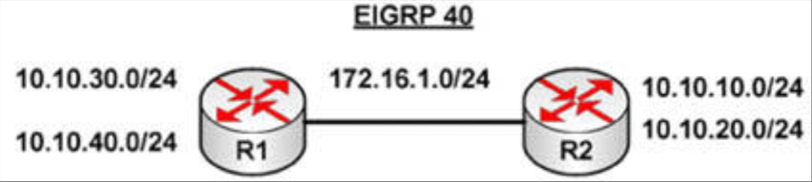

# 第 23 天 复习

## 第 23 天任务

- 复习前两天的课文
- 完成上述章节中的实验
- 若咱们愿意，完成这些挑战实验
- 参加 [Free CCNA Training Bonus – Cisco CCNA in 60 Days v4](https://www.in60days.com/free/ccnain60days/) 处今天的考试；
- 阅读 CCNA 补习指南
- 在 subnetting.org 上花 15 分钟

过去两天中我们曾讨论了一些棘手的话题。不要纠结于细节。只需复习并做笔记、重复实验，并开始熟悉一些重要命令。我们将再次进行复习。

## 挑战 1 -- VLAN 间的 SVI 实验

### 拓扑结构

### 实验说明

如上面拓扑结构，将那些主机连接到交换机。咱们将需要一台比如 3550/3560/3570 的三层交换机，或 Packet Tracer 软件。

1. 添加相应 VLAN 内主机的 IP 地址；
2. 将一些端口置于正确的 VLAN 中；
3. 配置一个 `VLAN 10` 的 SVI -- `10.10.10.1 255.255.255.0`；
4. 配置一个 `VLAN 20` 的 SVI -- `10.20.20.1 255.255.255.0`；
5. 设置那些主机上相应 SVI 地址的默认网关；
6. 通过 `ping` 这些 VLAN 上的设备进行测试；
7. 检查交换机上的 MAC 地址表。

## 挑战 2 -- EIGRP 实验

### 拓扑

### 实验说明

使用串行线，或交叉线连接两台路由器在一起。

1. 根据图示添加 IP 地址到两个路由，并添加换回接口到两个路由器；
2. 在 `Router A` 与 `Router B` 之间 `ping`，测试串行线路（要记住时钟频率）；
3. 设置两条串行线路使用带有 CHAP 的 PPP（要同时设置用户名及口令）；
4. 在全部两个路由器上配置 EIGRP 40，并添加所有网络；
5. 修复阻止 `R2`  `ping` 通 `10.10.30.0` 及 `10.10.40.0` 上的主机，以及 `R1` 无法 `ping` 通 `R2` 上 `10` 地址的问题；
6. 更改路由，便只有 `R2` 上的 `10.10.10.0` 与 `R1` 上的 `10.10.30.0` 得以通告。将那些使用别的 `10` 网络的环回接口，置于 EIGRP 的被动模式下。

