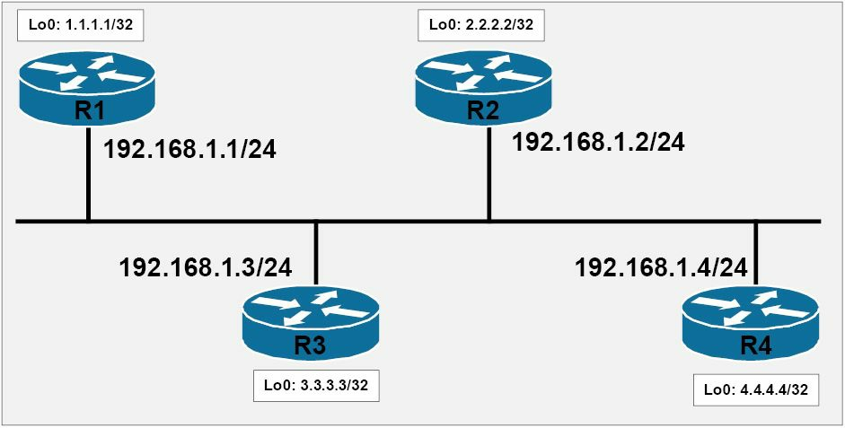
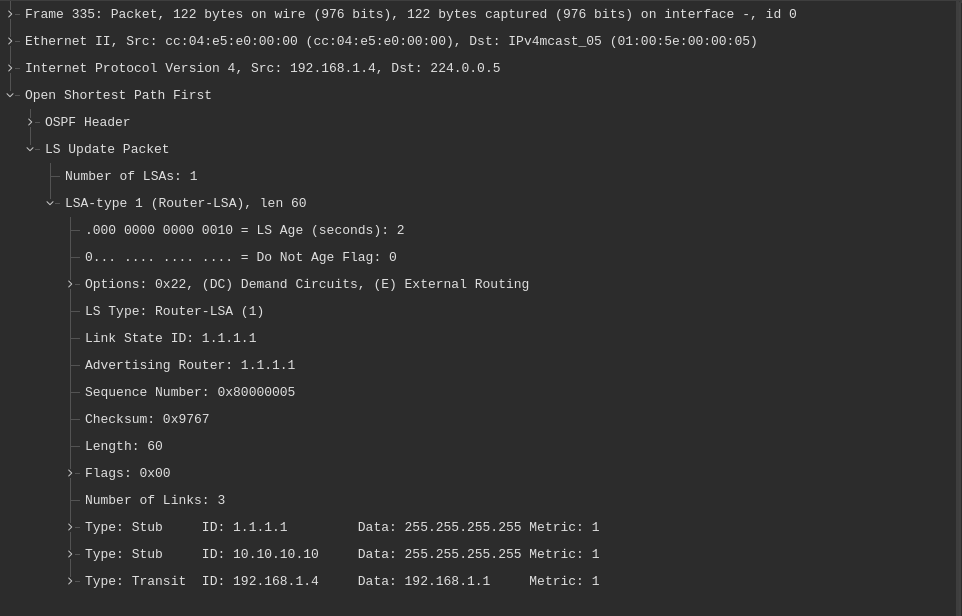

# 指定路由器与后备指定路由器

正如早先所指出的，OSPF 会在广播及非广播网络类型上，选出一个指定路由器 (DR) 和/或一个备份指定路由器 (BDR)。重要的是要理解，BDR 并非这些网络类型上的强制组件。事实上，OSPF 仍将在只有一个 DR 而没有 BDR 时正常工作；但是，当 DR 失效就将没有冗余，同时 OSPF 的路由器就需要再次经历选举过程，选出新的 DR。


在网段（广播及非广播的网络类型）上，每个非 DR/BDR 路由器，都会与 DR 建立邻接关系，同时当有个路由器已被选中为 BDR 时，这些非 DR/BDR 路由器还会与 BDR 建立邻接关系，只不过不会与该网段上的任何其他非 DR/BDR 路由器建立邻接关系。DR 和 BDR 两个路由器，属于彼此邻接的，并与网段上的所有别的路由器完全邻接。那些非 DR/BDR 的路由器，会发送报文及更新到 `AllDRRouters` 的组播组地址 `224.0.0.6`。只有 DR/BDR 两台路由器，会监听发送到这个组地址的组播报文。DR 随后会通告报文到 `AllSPFRouters` 的组播组地址 `224.0.0.5`。这一过程便允许网段上全部其他 OSPF 路由器，接收到更新。

重要的是要理解，在一个 DR 和/或一个 BDR 路由器已选出后，报文交换的顺序。例如，设想某有着四个分别是 `R1`、`R2`、`R3` 及 `R4` 路由器的广播网络。假设 `R4` 已被选为 DR，`R3` 已被选为 BDR。那么 `R2` 和 `R1` 便既不属于 DR 也不属于 BDR，而因此在 Cisco 的 OSPF 术语中，被称为 `DROther` 路由器。一条配置变更在 `R1` 上做出了，`R1` 随后便会发送一个更新（数据包），到 `AllDRRouters` 的组播组地址 `224.0.0.6`。作为 `DR` 的 `R4` 便会收到这个更新数据包，并发送一个确认数据包到 `AllSPFRouters` 的组播组地址 `224.0.0.5`。`R4` 随后会使用 `AllSPFRouters` 的组播组地址，发送这个更新数据包到全部其他非 DR/BDR 路由器。这个更新数据包，会被另一 `DROther` 路由器 `R2` 接收，同时 `R2` 会发送一个确认数据包，到 `AllDRRouters` 的组播组 `224.0.0.6`。这一过程在下图 24.2 中得以演示。


**图 24.2** -- **OSPF 的 DR 和 BDR 通告**

**注意**：BDR 只会监听发送到两个组播组的那些数据包。


为了让某个路由器成为该网段的 DR 或 BDR，该路由器必须要被选中。这种选举基于以下因素：

- 最高路由器优先级值
- 最高的路由器 ID


默认情况下，所有路由器都有着 1 的默认优先级值。这个值可通过使用 `ip ospf priority <0-255>` 这条接口配置命令调整。优先级越高，该路由器将被选作该网段 DR 的可能性就越大。有着第二高优先级的路由器，随后将被选为 BDR。当 0 的优先级值被配置了时，那么该路由器将不参与 DR/BDR 的选举过程。只有当 OSPF 的进程在参与 DR/BDR 选举过程的所有路由器上同时加载时，最高路由器优先级与路由器 ID 才重要。否则，最先完成加载 OSPF 进程的路由器，将成为该网段上的 DR。

在确定 OSPF 的路由器 ID 时，Cisco IOS 软件会选择已配置 `Loopback` 接口中的最高 IP 地址。当没有环回接口被配置时，那么 Cisco IOS 软件会使用所有已配置物理接口的最高 IP 地址，作为 OSPF 的路由器 ID。Cisco 10S 软件同时允许管理员，通过使用 `router-id [address]` 这条路由器配置命令，手动指定路由器 ID。


重要的是要记住，在 OSPF 下，一旦 DR 与 BDR 已被选出，那么直到一次新的选举举行后，他们将一直作为 DR/BDR 路由器。例如，当一个 DR 与一个 BDR 存在于某个多路访问网络上，同时一个有着更高优先级或更高 IP 地址的路由被添加到这同一网段时，现有的 DR 于 BDR 路由器将不改变。当这个 DR 失效时，BDR 将承担 DR 的角色，而不是有着更高优先级或 IP 地址的那个新路由器。相反，一次新的选举将被举行时，该路由器就很可能当被选作 BDR。为了使该路由器成为 DR，这个 BDR 就必须被移除，或这个 OSPF 进程必须被使用 `clear ip ospf` 命令重置，从而强制进行一次新的 DR/BDR 选举。一旦被选中，OSPF 就会如下使用 DR 和 BDR 路由器：


- 用来减少该网段上所需的邻接数
- 用来通告多路访问网段上的路由器
- 用来确保更新数据包得以发送到该网段上的所有路由器

要更好地理解这些基本概念，请参考下面图 24.3 中所示的基本 OSPF 网络拓扑。




<a name="f-24.3"></a>
**图 24.3** -- **OSPF 的 DR 与 BDR 基本原理**

参照图 24.3，该网段上的每个路由器，都会与 DR 和 BDR 建立邻接关系，但不会相互建立邻接关系。换句话说，非 DR/BDR 的路由器不会与对方建立邻接关系。这就阻止了该网段上的路由器，相互之间形成 `N(N-1)` 的邻接关系，从而减少了该网段上过多的 OSPF 数据包泛洪。

例如，当网段上没有 DR/BDR 的概念时，每个单独路由器，都将需要与网段上的每个其他路由器建立邻接关系。这将造成网段上的 `4(4-1)` 或 12 个邻接关系。但是，在 DR/BDR 下，每个单独路由器都只需与这两个路由器建立邻接关系，而无需与其他非 DR 及 BDR 路由器建立邻接关系。DR 和 BDR 也会在他们之间建立邻接关系。这就减少了在网段及每个 OSPF 路由器上，所需的邻接关系数量，进而减少了这些路由器上的资源消耗（如内存及处理器的使用）。

关于第二点，OSPF 会将某条链路，视为两个路由器或节点之间的连接。在诸如以太网的多路访问网络中，多个路由器可位于同一网段，如 [图 24.3](#f-24.3) 中所示。在此类网络中，OSPF 会使用网络链路状态通告（`Type 2` 的 LSA），通告该多路访问网段上的路由器。这种 LSA 会由 DR 生成，并只会在该区域内得以泛洪。由于其他非 DR/BDR 路由器，不会建立相互之间的邻接关系，因此这种 LSA 便会允许这些路由器，获悉该多路访问网段上的其他路由器。

要进一步阐明这点，参考 [图 24.3](#f-24.3)，假设该网段上所有路由器，都有着 1 的默认 OSPF 优先级值（并于同一时刻加载了 OSPF 进程），那么 `R4` 便会因其有着最高的路由器 ID，而被选为该网段的 DR。`R3` 则会因其有着第二高的路由器 ID，而被选为该网段的 BDR。由于 `R2` 和 `R1` 均既不是 DR 也不是 BDR，因此他们就被称为 Cisco 术语中的 `DROther` 路由器。这点可在所有路由器上使用 `show ip ospf neighbor` 命令加以验证，如下所示：

```console
R1#show ip ospf neighbor

Neighbor ID     Pri     State           Dead Time   Address         Interface
2.2.2.2           1     2WAY/DROTHER    00:00:38    192.168.1.2     Ethernet0/0
3.3.3.3           1     FULL/BDR        00:00:39    192.168.1.3     Ethernet0/0
4.4.4.4           1     FULL/DR         00:00:38    192.168.1.4     Ethernet0/0
```

```console
R2#show ip ospf neighbor

Neighbor ID     Pri     State           Dead Time   Address         Interface
1.1.1.1           1     2WAY/DROTHER    00:00:32    192.168.1.1     FastEthernet0/0
3.3.3.3           1     FULL/BDR        00:00:33    192.168.1.3     FastEthernet0/0
4.4.4.4           1     FULL/DR         00:00:32    192.168.1.4     FastEthernet0/0
```

```console
R3#show ip ospf neighbor

Neighbor ID     Pri     State           Dead Time   Address         Interface
1.1.1.1           1     FULL/DROTHER    00:00:36    192.168.1.1     FastEthernet0/0
2.2.2.2           1     FULL/DROTHER    00:00:36    192.168.1.2     FastEthernet0/0
4.4.4.4           1     FULL/DR         00:00:35    192.168.1.4     FastEthernet0/0
```

```console
R4#show ip ospf neighbor

Neighbor ID     Pri     State           Dead Time   Address         Interface
1.1.1.1           1     FULL/DROTHER    00:00:39    192.168.1.1     FastEthernet0/0
2.2.2.2           1     FULL/DROTHER    00:00:39    192.168.1.2     FastEthernet0/0
3.3.3.3           1     FULL/BDR        00:00:30    192.168.1.3     FastEthernet0/0
```


**注意**： 其中的 `DROther` 路由器保持着 `2WAY/DROTHER` 状态，因为他们只会与 DR 和 BDR 路由器交换数据库。因此，由于 `DROther` 路由器之间没有完整的数据库交换，他们将永远不会达到 OSPF 的完全邻接状态。


由于 `R4` 已被选为 DR，他便会生成 网络 LSA，这种 LSA 会通告这个多路访问网段上的其他路由器。这点可通过在该网段上的任何路由器上，使用 `show ip ospf database network [link state ID]` 命令，或只在该 DR 上，使用 `show ip ospf database network selforiginate` 命令加以验证。下面演示了 DR (`R4`) 上 `show ip ospf database network self-originate` 命令的输出：


```console
R4#show ip ospf database network self-originate
            OSPF Router with ID (4.4.4.4) (Process ID 4)

                Net Link States (Area 0)

  Routing Bit Set on this LSA
  LS age: 429
  Options: (No TOS-capability, DC)
  LS Type: Network Links
  Link State ID: 192.168.1.4 (address of Designated Router)
  Advertising Router: 4.4.4.4
  LS Seq Number: 80000006
  Checksum: 0x7E08
  Length: 40
  Network Mask: /24
        Attached Router: 4.4.4.4
        Attached Router: 1.1.1.1
        Attached Router: 2.2.2.2
        Attached Router: 3.3.3.3
```


参考上面的输出，DR（`R4`）发起了表示 `192.168.1.0/24` 这个子网的 `Type 2`（网络）LSA。由于多个路由器存在于这一子网上，因此这个 `192.168.1.0/24` 子网，就叫做 OSPF 术语中的一条传输链路, a transit link in OSPF terminology。其中的 `Advertising Router`（通告路由器）字段，显示了发起这一 LSA 的路由器。`Network Mask` 字段，显示了这个传输网络的子网掩码，即 `24-bit` 或 `255.255.255.0`。


其中 `Attached Router` 字段，列出了该网段上所有路由器的路由器 ID。这允许该网段上的所有路由器，均可获悉还有哪些其他路由器位于该网段上。如以下输出中所示，`show ip ospf database network [link state ID]` 这一命令在 `R1`、`R2` 和 `R3` 上的输出，反映了相同的信息：

```console
R2#show ip ospf database network

            OSPF Router with ID (2.2.2.2) (Process ID 2)

                Net Link States (Area 0)

  Routing Bit Set on this LSA
  LS age: 923
  Options: (No TOS-capability, DC)
  LS Type: Network Links
  Link State ID: 192.168.1.4 (address of Designated Router)
  Advertising Router: 4.4.4.4
  LS Seq Number: 80000006
  Checksum: 0x7E08
  Length: 40
  Network Mask: /24
        Attached Router: 4.4.4.4
        Attached Router: 1.1.1.1
        Attached Router: 2.2.2.2
        Attached Router: 3.3.3.3
```

```console
R1#show ip ospf database network

            OSPF Router with ID (1.1.1.1) (Process ID 1)

                Net Link States (Area 0)

  Routing Bit Set on this LSA
  LS age: 951
  Options: (No TOS-capability, DC)
  LS Type: Network Links
  Link State ID: 192.168.1.4 (address of Designated Router)
  Advertising Router: 4.4.4.4
  LS Seq Number: 80000006
  Checksum: 0x7E08
  Length: 40
  Network Mask: /24
        Attached Router: 4.4.4.4
        Attached Router: 1.1.1.1
        Attached Router: 2.2.2.2
        Attached Router: 3.3.3.3
            OSPF Router with ID (4.4.4.4) (Process ID 4)
```

```console
R3#show ip ospf database network

            OSPF Router with ID (3.3.3.3) (Process ID 3)

                Net Link States (Area 0)

  Routing Bit Set on this LSA
  LS age: 988
  Options: (No TOS-capability, DC)
  LS Type: Network Links
  Link State ID: 192.168.1.4 (address of Designated Router)
  Advertising Router: 4.4.4.4
  LS Seq Number: 80000006
  Checksum: 0x7E08
  Length: 40
  Network Mask: /24
        Attached Router: 4.4.4.4
        Attached Router: 1.1.1.1
        Attached Router: 2.2.2.2
        Attached Router: 3.3.3.3
```


> *译注*：
>
> + OSPF 中链路类型（link type）有 4 种：
>   - `P2P`
>   - `Stub`
>   - `Transit`
>   - `Virtual`
>
> + 网络类型（network type）有两种：
>   - 传输网络（Transit network）
>   - 末梢网络（Stub network）
>
> + 链路状态通告有 11 种：
>   - Router LSA（`Type 1`）
>   - Network LSA（`Type 2`）
>   - Network Summary LSA（ `Type 3`）
>   - ASBR Summary LSA（`Type 4`）
>   - ASBR External LSA（`Type 5`）
>   - Group Membership LSA(`Type 6`)
>   - NSSA LSA（`Type 7`）
>   - External Attributes(V2)/Link Local(V3), `Type 8`
>   - Link Scope Opaque(V2)/Intra Area Prefix(V3), `Type 9`
>   - Area Scope Opaque, `Type 10`
>   - AS Scope Opaque, `Type 11`
>
>   [参考链接](https://www.firewall.cx/networking/routing-protocols/ospf-lsa-types-explained.html)

网络 LSA 的功能，及其与另一 LSA 的关联，尤其是路由器 LSA （`Type 1`），将在这一教学模组稍后详细介绍。这一小节的主要重点，应放在是理解多路访问网段上，DR 会生成并通告网络 LSA，以通告位于同一网段上的其他路由器。这是因为该网段上的路由器，只会与 DR 及 BDR 路由器建立邻接关系，而不会相互建立邻接关系。在没有相互之间邻接关系下，这些路由器将永远不会清楚，该多路访问网段上的其他非 DR/BDR 路由器。

最后，关于 DR/BDR 路由器的第三点，DR/BDR 路由器确保了该网段上的所有路由器，都有着完整数据库。那些非 DR/BDR 路由器，会发送更数数据包到组播组地址 `224.0.0.6`（`AllDRRouters`）。DR 随后会通过发送这一更新到组播组地址 `224.0.0.5`（`AllSPFRouters`），通告这些更新通告到其他非 DR/BDR 路由器。下图 24.4 通过引用 [图 24.3](#f-24.3) 中所示的路由器，演示了自 `R1`（`DROther`）到 DR 组地址的一个更新数据包。


**图 24.4** -- **到 DR/BDR 组地址的 `DROther` 更新**


`R4`（DR）会收到这个更新数据包，接着就会发送同一个数据包，到组播组地址 `224.0.0.5`。这个组地址被全体 OSPF 路由器使用，确保了该网段上的所有其他路由器，都会收到这个更新数据包。来自 DR（`R4`）的这个更新数据包，在下图 24.5 中得以演示。




**图 24.5** -- **到 OSPF 组地址的 DR 更新**

**注意**：咱们可以看到，这便是来自 `R1` 的那个更新数据包，因为图 24.4 和 24.5 中的 `Advertising Router` 字段，都包含着 `R1` 的路由器 ID (RID)，即 `1.1.1.1`。


**注意**：OSPF 用到其他的 LSA，将在这一教学模组稍后详细介绍。


