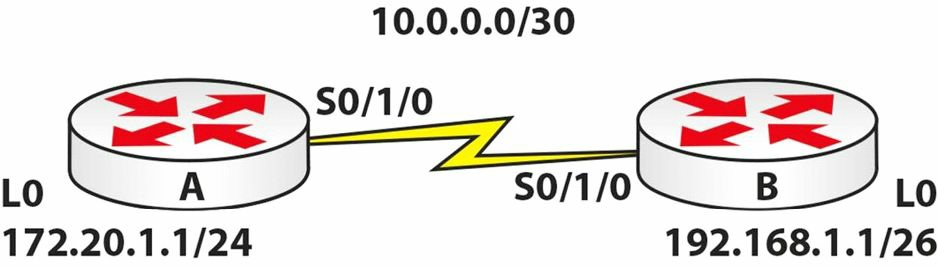

# 第 24 天实验

## OSPF 实验

### 拓扑结构



### 实验目的

学习如何配置基本的 OSPF 。

### 实验步骤

1. 根据上面的拓扑结构，配置所有 IP 地址。要确保咱们可通过其中的串行链路 `ping` 通；
2. 添加 OSPF 到 `Router A`。将 `Loopback0` 上的网络，置于 `Area 1` 中，将 `10` 网络置于 `Area 0` 中；

    ```console
    RouterA(config)#router ospf 4
    RouterA(config-router)#network 172.20.1.0 0.0.0.255 area 1
    RouterA(config-router)#network 10.0.0.0 0.0.0.3 area 0
    RouterA(config-router)#^Z
    RouterA#
    %SYS-5-CONFIG_I: Configured from console by console

    RouterA#show ip protocols

    Routing Protocol is “ospf 4”
      Outgoing update filter list for all interfaces is not set
      Incoming update filter list for all interfaces is not set
      Router ID 172.20.1.1
      Number of areas in this router is 2. 2 normal 0 stub 0 nssa
      Maximum path: 4
      Routing for Networks:
        172.20.1.0 0.0.0.255 area 1
        10.0.0.0 0.0.0.3 area 0
      Routing Information Sources:
        Gateway         Distance      Last Update
        172.20.1.1      110           00:00:09
    Distance: (default is 110)
    ```

3. 添加 OSPF 到 `Router B`。将那个环回网络，置于 OSPF 的 `Area 40` 中；


    ```console
    RouterB(config)#router ospf 2
    RouterB(config-router)#net 10.0.0.0 0.0.0.3 area 0
    RouterB(config-router)#
    00:22:35: %OSPF-5-ADJCHG: Process 2, Nbr 172.20.1.1 on Serial0/1/0 from LOADING to FULL, Loading Done

    RouterB(config-router)#net 192.168.1.0 0.0.0.63 area 40
    RouterB(config-router)# ^Z
    RouterB#show ip protocols

    Routing Protocol is “ospf 2”
      Outgoing update filter list for all interfaces is not set
      Incoming update filter list for all interfaces is not set
      Router ID 192.168.1.1
      Number of areas in this router is 2. 2 normal 0 stub 0 nssa
      Maximum path: 4
      Routing for Networks:
        10.0.0.0 0.0.0.3 area 0
        192.168.1.0 0.0.0.63 area 40
      Routing Information Sources:
        Gateway         Distance      Last Update
        172.20.1.1      110           00:01:18
        192.168.1.1     110           00:00:44
    Distance: (default is 110)
    ```


4. 检查咱们两个路由器上的路由表。查找 OSPF 通告的网络。咱们会看到一个 `IA`，其表示 `IA -- OSPF inter-area`。咱们还将看到 OSPF 的管理距离（AD），即 110；


    ```console
    RouterA#sh ip route
    ...
    [Truncated Output]


          10.0.0.0/8 is variably subnetted, 2 subnets, 2 masks
    C        10.0.0.0/30 is directly connected, Serial2/0
    L        10.0.0.1/32 is directly connected, Serial2/0
          172.20.0.0/16 is variably subnetted, 2 subnets, 2 masks
    C        172.20.1.0/24 is directly connected, Loopback0
    L        172.20.1.1/32 is directly connected, Loopback0
          192.168.1.0/32 is subnetted, 1 subnets
    O IA     192.168.1.1 [110/65] via 10.0.0.2, 00:04:15, Serial2/0
    RouterA#
    ```

5. 在两台路由器上均执行一些可用的 OSPF 命令。


    ```console
    RouterA#sh ip ospf ?
      <1-65535>       Process ID numberborder-routers Border and Boundary Router Information
      database        Database summary
      interface       Interface information
      neighbor        Neighbor list
    ```

## 基本 OSPF 实验

再次重复前一实验，但要使用一种不同 IP 分址方式。再次使用 OSPF 的 `Area 0`：

1. 分配一个 IPv4 到两个直连接口（`10.10.10.1/24` 和 `10.10.10.2/24`）；
2. 使用 `ping` 测试直接的连通性；
3. 在两个路由器上均配置一个环回接口，并分配两个不同范围中的地址（`11.11.11.1/32` 与 `12.12.12.2/32`）；
4. 配置标准的 OSPF `process 1`，并在 `Area 0` 中通告所有本地网络。同时，还要配置两个设备的路由器 ID：

    **`R1`**：

    ```console
    router ospf 1
    router-id 1.1.1.1
    network 10.10.10.0 0.0.0.255 area 0
    network 11.11.11.1 0.0.0.0 area 0
    ```

    **`R2`**：

    ```console
    router ospf 1
    router-id 2.2.2.2
    network 10.10.10.0 0.0.0.255 area 0
    network 12.12.12.2 0.0.0.0 area 0
    ```

5. 自 `R1` `Ping` `R2` 的环回接口，测试连通性；
6. 执行 `show ip route` 命令，验证路由是否经由 OSPF 得以接收；
7. 执行 `show ip protocols` 命令，验证 OSPF 已在设备上配置并处于活动状态；
8. 验证接口的那些特定于 OSPF 的参数：`show ip ospf interface` 及 `show ip ospf interface brief`；
9. 在两个路由器（直连接口）上，修改 OSPF 的 `Hello` 与 `Dead` 定时器：`ip ospf hello 和 ip ospf dead`；
10. 执行 `show ip ospf 1` 命令，查看那些路由进程的参数；
11. 重复这个实验，但这次要使用 `ip ospf 1 area 0 interface specific` 命令，而不是 `router OSPF` 下的 `network` 命令，以 OSPF 方式通告这些网络。


