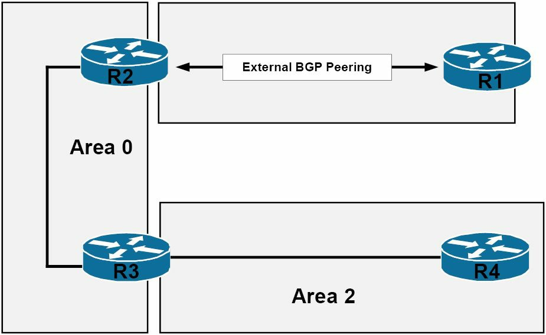

# 其他路由器类型

除了多路访问网段上的指定路由器与后备指定路由器外，OSPF 路由器还会根据其在 OSPF 网络中的位置及功能加以描述。常见于 OSPF 网络中的一些其他路由器类型，包括以下这些：

- 区域边界路由器
- 自治系统边界路由器
- 内部路由器
- 骨干路由器

下图 24.6 演示了由 OSPF 主干区域（`Area 0`）及另一普通 OSPF 区域（`Area 2`），两个区域组成的一个基本 OSPF 网络。其中 `R2` 有着一个与 `R1` 的外部 BGP 邻居关系。这个图示将用于描述这一网络中的不同 OSPF 路由器类型。

**图 24.6** -- **其他 OSPF 路由器类型**

所谓区域边界路由器 (ABR) ，是连接一个或多个 OSPF 区域到 OSPF 骨干区域的某个 OSPF 路由器。这意味着他必须有至少一个 `Area 0` 中的接口，以及另一或多个位于某个别的 OSPF 区域的接口。ABR 是所有其所属区域的成员，同时他们还为每个其所属区域，保存着一个单独链路状态数据库。参考图 24.6，`R3 `将被视为一个 ABR，因为他将 `Area 2` 连接到了 OSPF 的骨干区域，或 `Area 0`。

传统意义上的自治系统边界路由器（ASBR），位于路由域的边缘，并定义了内部网络与外部网络的边界。参考图 24.6，`R2` 会被视为 ASBR。除了注入来自其他协议（如 BGP）的路由信息外，当某个路由器会注入一些静态路由或直连子网到 OSPF 域中时，其也会被归类为 ASBR。

所谓内部路由器，维护着某单一 OSPF 区域内的所有运行接口。根据图 24.6 中所示的网络拓扑，`R4` 会被视为一个内部路由器，因为他唯一的接口，就位于一个单一 OSPF 区域内。

所谓骨干路由器，属于有个接口在 OSPF 主干区域中的那些路由器。骨干路由器可包括那些只在 OSPF 主干区域中有接口的路由器，也可以包括在 OSPF 主干区域有接口，在其他区域（ABR）也有接口的路由器。根据图 24.6 中所示的拓扑结构，`R2` 和 `R3` 都会被视为骨干路由器。

**注意**：OSPF 的路由器可扮演多种角色。例如，`R2` 既是个 ASBR ，同时还是个骨干路由器，而 `R3` 既是个骨干路由器，同时又是个 ABR。在这整个教学模组中，我们将详细介绍这些类型的路由器，以及他们在 OSPF 域中的角色及功能。

