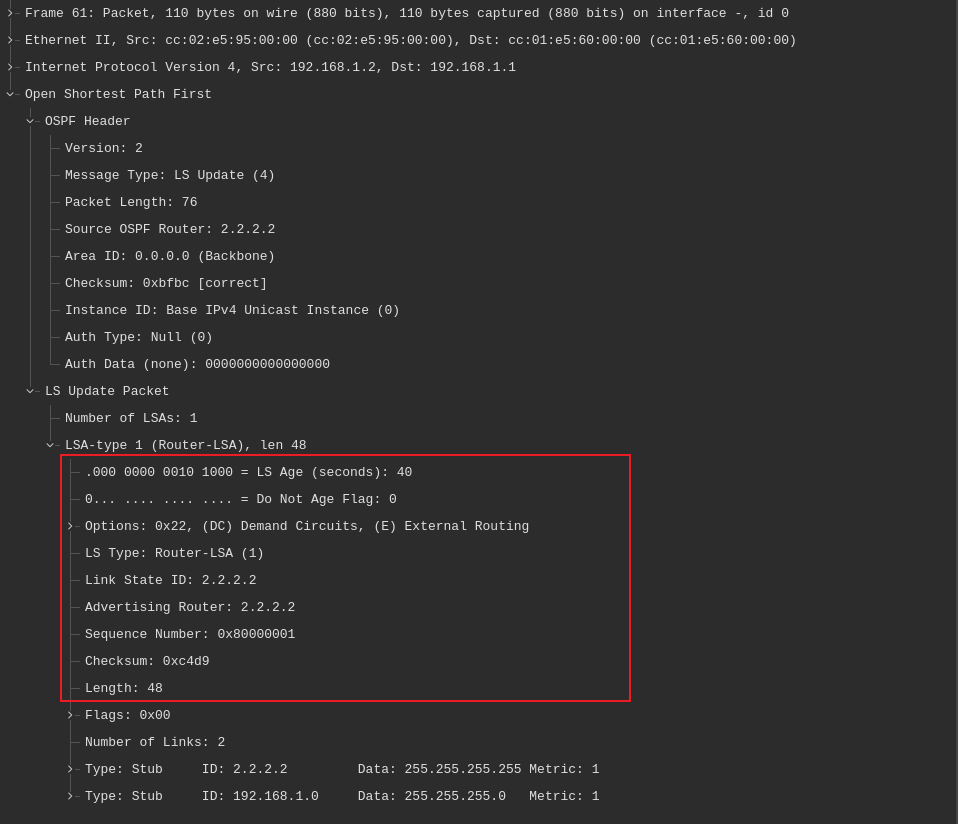

# OSPF 的链路状态通告 LSA 与链路状态数据库 LSDB


正如如 [上一小节](../d24/packet_types.md#lsa-types) 曾提到的，OSPF 会用到数种 LSA 类型。每条 LSA 都以一个标准的 20 字节 LSA 头部开始。这一头部包含以下字段：

- 链路状态寿命，`LS Age`
- 一些选项，`Options`
- 链路状态类型，`LS Type`
- 链路状态 ID，`Link State ID`
- 通告路由器，`Advertising Router`
- 链路状态的序列编号，`Link State Sequence Number`
- 链路状态的校验和，`Link State Checksum`
- 长度，`Length`




其中 2 字节的 `LS Age` 字段，表示自这条 LSA 发起以来的时间（以秒为单位）。LSA 的最大寿命为 3600 秒，这意味着当寿命达到 3600 秒后，这条 LSA 就会从数据库中移除。为了避免这种情况，LSA 会每 1800 秒刷新。

1 个字节的 `Options` 字段，包含与 OSPF `Hello` 数据包中那些相同的选项。

1 字节的 `LS Type` 字段，表示 LSA 的类型。这些不同的 LSA 数据包类型，会在接下来的小节中介绍。

4 字节 `Link State ID` 字段，标识由这条 LSA 所描述的网络部分。这一字段的内容，取决于该通告的 LS 类型。

4 字节 `Advertising Router` 字段，表示发起这条 LSA 的路由器的路由器 ID。

4 字节的 `Link State Sequence Number` 字段，会检测那些旧的或重复的 LSA。某条 LSA 的后续实例，被被赋予后续的链路状态序列编号。第一个序列编号 `0x80000000` 被保留了下来；因此，实际的第一个序列编号，会总是 `0x80000001`。这个值会随着数据包发送而递增。最大序列编号为 `Ox7FFFFFFF`。

> **译注**：这里明明是 4 个字节，原文写作了 1 字节。此外 `0x7FFFFFFF` 小于 `0x80000000`，因此原文表述应是有误。

2 字节 `Link State Checksum` 字段，会对包括这个 LSA 头部的该 LSA 全部内容，执行 Fletcher 校验和计算。`Link State Age` 字段不会包括与这个校验和中。这个校验和之所以会被执行，是因为在其被存储于内存期间由于路由器软件或硬件问题，或在其被泛洪期间由于物理层的错误等原因，链路状态通告会被损坏。

**注意**：校验和计算是 LSA 被生成，或被接收时执行的。此外，校验和计算会在每 10 分钟的 `CheckAge` 间隔时间执行的。当这一字段有着一个 0 的值时，那么就校验和计算尚未被执行。

2 字节的 `Length` 字段，是最后的字段，包含着这条 LSA 的长度（以字节为单位）。这包括了 20 字节的 LSA 头部。下图 25.1 演示了 LSA 头部。


**图25.1** -- **链路状态通告头部**


虽然 OSPF 支持 11 种不同的链路状态通告类型，但只有用于计算内部路由的 `Type 1`、`Type 2` 与 `Type 3`，与用于计算外部路由的 `Type 4`、`Type 5` 与 `Type 7`，属于 CCNA 考试要求范围。由于出于 CCNA 考试目的，实在无必要深入其他 LSA 类型细节，这些其他 LSA 类型将不在这本指南中进一步介绍。

在 Cisco IOS 软件中，`show ip ospf database` 这条命令，用于查看链路状态数据库的内容。这条命令在不带任何任何关键字使用时，会打印出该路由器所连接的所有区域中 LSA 的一个摘要。这条命令支持数个提供更细粒度的关键字，允许网络管理员限制输出到特定的 LSA 类型、由本地路由器通告的 LSA，甚至由该 OSPF 域内其他路由器通告的 LSA。

虽然演示每个关键字使用的输出不现实，但接下来的小节，会介绍这些不同 LSA，以及与 `show ip ospf database` 命令结合使用，查看这些 LSA 详细信息的一些常用关键字。这条命令所支持的关键字，如以下输出中所示：


```console
R3#show ip ospf database ?
  adv-router        Advertising Router link states
  asbr-summary      ASBR Summary link states
  database-summary  Summary of database
  external          External link states
  network           Network link states
  nssa-external     NSSA External link states
  opaque-area       Opaque Area link states
  opaque-as         Opaque AS link states
  opaque-link       Opaque Link-Local link states
  router            Router link states
  self-originate    Self-originated link states
  summary           Network Summary link states
  |                 Output modifiers
<cr>
```

## 路由器 LSA，`Type 1`

`Type 1` 的 LSA 是由每个路由器，针对其所属的每个区域生成的。路由器 LSA 会列出发起路由器的路由器 ID（`RID`）。每个单独路由器，都会对其所在的区域，生成一条 `Type 1` 的 LSA。路由器 LSA 是 `show ip ospf database` 命令输出中，所打印的第一种 LSA 类型。


## 网络 LSA, `Type 2`

OSPF 使用网络链路状态通告（`Type 2` 的 LSA），通告多路访问网段上的路由器。这种 LSA 由 DR 生成，并只会在区域内泛洪。由于其他非 DR/BDR 路由器不会相互建立邻接关系，因此网络 LSA 就允许这些路由器，获悉该多路访问网段上的其他路由器。


## 网络摘要 LSA, `Type 3`

网络（`Type 3`）的 LSA  是对本地区域外，但在该 OSPF 域内目的网络的摘要。换句话说，这种 LSA 同时通告了区域间及区域内的路由信息。网络摘要 LSA 未承载任何拓扑信息。相反，包含于 LSA 中的唯一信息，便是某个 IP 前缀。`Type 3` 的 LSA 由 ABR 生成，并被泛洪到所有邻接区域。默认情况下，每条 `Type 3` 的 LSA，都会以一对一方式，匹配单个路由器，或单条的网络 LSA。换句话说，一条 `Type 3` 的 LSA，都会因每条单独的 `Type 1` 及 `Type 2` 的 LSA 而存在。必须特别留意，这些 LSA 的传播方式，与 OSPF 主干区域之间的关系。这种传播或泛洪，是以如下方式完成的：

- 针对一些区域内路由（即 `Type 1` 与 `Type 2` 的 LSA），网络摘要（`Type 3`）LSA，会从某个非骨干区域，通告到向 OSPF 骨干区域；
- 针对区域内（`Area 0` 的 `Type 1` 与 `Type 2` LSA）以及区域间路由（即由 ABR 泛洪到骨干区域的 `Type 3` LSA），网络摘要（`Type 3`）LSA 会从 OSPF 骨干区域通告到其他非骨干区域。


接下来的三中链路状态广告，`Type 4`、`Type 5` 及 `Type 7`，用于外部路由的计算。`Type 4` 与 `Type 5` 的 LSA 将在接下来的小节中介绍。`Type 7` 的 LSA 将在这一教学模组稍后，我们讨论不同的 OSPF 区域类型时介绍。


## ASBR 摘要 LSA, `Type 4`

`Type 4` 的 LSA，描述有关自治系统边界路由器（ASBR）的信息。这种 LSA 包含着与 `Type 3` LSA 相同的数据包格式，完成同一基本功能，但有一些明显区别。与 `Type 3` 的 LSA 一样，`Type 4` 的 LSA 由 ABR 生成。对于这两种 LSA，`Advertising Router` 字段都包含生成这条摘要 LSA 的 ABR 的 RID。但是，`Type 4` 的 LSA 是由 ABR 针对每个根据某条路由器 LSA 可达的 ASBR 创建。这个 ABR 随后会将这条 `Type 4` 的 LSA，注入相应区域。这条 LSA 提供了有关这个 ASBR 本身的可达性信息。咱们应熟悉的 `Type 3` 与 `Type 4` LSA 之间的关键区域，列出于下表 25.1 中。


**表 25.1** -- **`Type 3` 与 `Type 4` 的汇总 LSA**

| `Type 3` 的汇总 LSA | `Type 4` 的汇总 LSA |
| :-- | :-- |
| 提供有关网络链路的信息。 | 提供有关 ASBR 的信息。 |
| `Network Mask` 字段包含着该网络的子网掩码值。 | `Network Mask` 字段将始终包含一个 `0.0.0.0` 的值，或者干脆就是 `0`。 |
| `Link State ID` 字段包含具体网络编号。 | `Link State ID` 字段包含着 ASBR 的路由器 ID。 |


## AS 外部 LSA, `Type 5`

外部链路状态通告，用于描述自治系统外部的目的网络。换句话说，`Type 5` 的 LSA 提供了到达外部网络的必要网络信息。除外部路由外，某个 OSPF 路由域的默认路由，也可作为一条 `Type 5` 的链路状态通告加以注入。


