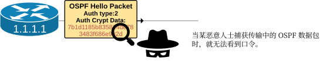
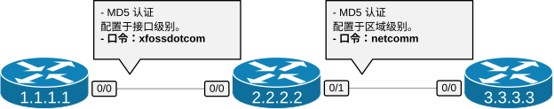
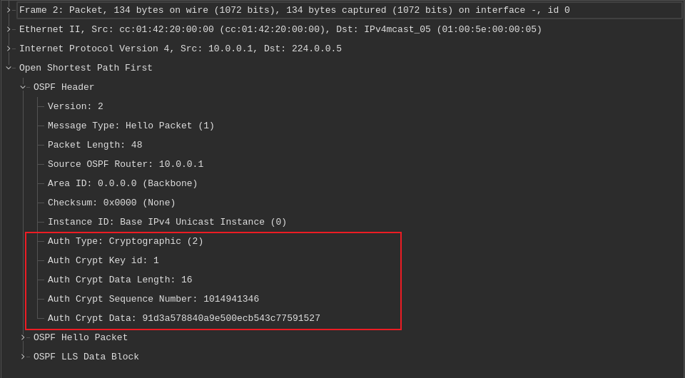

# OSPF 认证


开放最短路径优先（OSPF）路由协议支持四种不同的认证类型：

- `Type 0`：无认证（默认）；
- `Type 1`：明文认证；
- `Type 2`：MD5 认证；
- `Type 3`：HMAC-SHA 认证（包括 HMAC-SHA-1、HMAC-SHA-256 等）。


这一小节将讲解 OSPF 的 MD5 与 SHA 认证（`Type 2` 与 `Type 3`）。

## OSPF MD5 认证

相较于明文认证，MD5 认证安全性更高。采用 MD5 认证时，路由器不会发送明文密码，仅传输其 MD5 哈希值。即使恶意攻击者截获传输中的 OSPF 数据包，也无法获取密码内容，相较于明文认证方式，其属于一项显著的安全提升。




### 什么是 MD5？

MD5（5 号消息摘要算法，Message Digest Algorithm 5），是一种广泛使用的密码哈希函数，可生成 128 位哈希值，通常以 32 位十六进制数表示。其于 1991 年推出，通过为消息或文件生成 “指纹”，验证数据完整性，如下图示中所示。


哈希函数的关键特征在于：无论输入的大小如何，MD5 始终会生成一个 128 位哈希值，这使其具有高度确定性。例如，口令 `"Cisco"` 将生成哈希值 `"7b1d1185b835814de783483f686e9825"`。

然而，MD5 如今已被认为 **在密码学上不安全**，不再用于银行及金融科技等敏感服务。

## 配置 MD5 认证

我们可使用两种方法，在 Cisco IOS 路由器上配置 OSPF 的  MD5 认证：按接口配置与按区域配置。

### 按接口配置 OSPF 的 MD5 认证

通常，通过使用以下两步，在接口层面配置 OSPF 的 MD5 认证：

- 步骤 1. 在接口配置模式下，使用 `ip ospf authentication message-digest` 命令启用认证。其中 `message-digest` 关键字表示要使用消息摘要算法（MD5）；
- 步骤 2. 使用 `ip ospf message-digest-key [key] md5 [pwd]` 命令设置口令，其中 `key` 为 1 至 255 之间的整数，`pwd` 为口令字符串。

要注意口令长度不得超过 16 个字符。更长的密码将被截断。字符可包含任意 ASCII 符号，包括问号 `?` 及末尾的空格，他们在考试环境中易出错。（提示：要经由 CLI 输入问号，就要按下 ctrl-V 禁用上下文帮助）


### 按区域配置 OSPF 的 MD5 认证

要按区域配置同一认证类型，我们就要执行以下两个步骤：

- 步骤 1. 在路由进程下，我们要针对我们打算启用认证的区域，配置 `area [area-id] authentication message-digest` 命令；
- 步骤 2. 在该区域内每个接口的接口配置模式下，配置 `ip ospf message-digest-key [key] md5 [pwd]` 命令。


## OSPF 的 MD5 认证配置示例

现在，我们来使用以下简单拓扑，完成一个配置示例：





我们有三台运行着单区域 OSPF 的直连路由器。

### 按接口的配置

首先我们来使用按接口的配置方法，配置 `R1` 和 `R2` 之间的认证。


```console
R1# conf t
Enter configuration commands, one per line.  End with CNTL/Z.
R1(config)# interface e0/0
R1(config-if)# ip ospf authentication message-digest
R1(config-if)# ip ospf message-digest-key 1 md5 xfossdotcom
R1(config-if)# end
R1#
```

```console
R2# conf t
Enter configuration commands, one per line.  End with CNTL/Z.
R2(config)# interface e0/0
R2(config-if)# ip ospf authentication message-digest
R2(config-if)# ip ospf message-digest-key 1 md5 xfossdotcom
R2(config-if)# end
R2#
```

请注意，两端的密钥编号必须匹配，否则邻接关系无法建立。配置完成后，我们便可进行一次流量捕获，并观察结果。以下屏幕截图展示了 `R1` 通过 `Eth0/0` 接口发送的 OSPF `Hello` 数据包。要注意标注的头部部分：

- `Auth Type` 为 2，表示 MD5 模式；
- 密钥编号（`Auth Crypt Key id`）属于该头部的部分。两端必须就密钥 ID 达成一致；
- 口令不再以明文形式传输。相反，加密的哈希值在数据包中发送。



咱们可以看到相较于纯文本安全性的提升。

### 按区域的配置

现在，我们来运用区域配置方法，配置 `R2` 与 `R3` 之间的身份验证。

```console
R2# conf t
Enter configuration commands, one per line.  End with CNTL/Z.
R2(config)# router ospf 1
R2(config-router)# area 0 authentication message-digest
R2(config-router)# exit
!
R2(config)# int e0/1
R2(config-if)# ip ospf message-digest-key 1 md5 netcomm
R2(config-if)# exit
!
```


```console
R3# conf t
Enter configuration commands, one per line.  End with CNTL/Z.
R3(config)# router ospf 1
R3(config-router)# area 0 authentication message-digest
R3(config-router)# exit
!
R3(config)# int e0/1
R3(config-if)# ip ospf message-digest-key 1 md5 netcomm
R3(config-if)# exit
!
```

请记住，我们还可以在每台路由器上启用密码加密功能，这样密码就不会在运行配置中显示，如下图所示。


```console
R2# conf t
Enter configuration commands, one per line.  End with CNTL/Z.
R2(config)# service password-encryption
R2(config)# end
R2#
R2# show run interface e0/1
!
interface Ethernet0/1
 ip address 10.1.2.2 255.255.255.0
 ip ospf message-digest-key 1 md5 7 072E25414707485744
end
```

### 验证

验证和故障排除步骤明文安全机制相同。


通过以下命令，我们可以查看区域级别是否配置了身份验证类型。


```console
R2# sh ip ospf
 Routing Process "ospf 1" with ID 2.2.2.2
 Start time: 00:00:02.892, Time elapsed: 01:05:52.046
 Supports only single TOS(TOS0) routes
 Supports opaque LSA
 Supports Link-local Signaling (LLS)
 Supports area transit capability
 Supports NSSA (compatible with RFC 3101)
 Supports Database Exchange Summary List Optimization (RFC 5243)
 Maximum number of non self-generated LSA allowed 50000
    Current number of non self-generated LSA 3
    Threshold for warning message 75%
    Ignore-time 5 minutes, reset-time 10 minutes
    Ignore-count allowed 5, current ignore-count 0
 Event-log enabled, Maximum number of events: 1000, Mode: cyclic
 Router is not originating router-LSAs with maximum metric
 Initial SPF schedule delay 50 msecs
 Minimum hold time between two consecutive SPFs 200 msecs
 Maximum wait time between two consecutive SPFs 5000 msecs
 Incremental-SPF disabled
 Initial LSA throttle delay 50 msecs
 Minimum hold time for LSA throttle 200 msecs
 Maximum wait time for LSA throttle 5000 msecs
 Minimum LSA arrival 100 msecs
 LSA group pacing timer 240 secs
 Interface flood pacing timer 33 msecs
 Retransmission pacing timer 66 msecs
 EXCHANGE/LOADING adjacency limit: initial 300, process maximum 300
 Number of external LSA 0. Checksum Sum 0x000000
 Number of opaque AS LSA 0. Checksum Sum 0x000000
 Number of DCbitless external and opaque AS LSA 0
 Number of DoNotAge external and opaque AS LSA 0
 Number of areas in this router is 1. 1 normal 0 stub 0 nssa
 Number of areas transit capable is 0
 External flood list length 0
 IETF NSF helper support enabled
 Cisco NSF helper support enabled
 Reference bandwidth unit is 100 mbps
    Area BACKBONE(0)
        Number of interfaces in this area is 2
        Area has message digest authentication
        SPF algorithm last executed 00:01:13.031 ago
        SPF algorithm executed 14 times
        Area ranges are
        Number of LSA 5. Checksum Sum 0x02794C
        Number of opaque link LSA 0. Checksum Sum 0x000000
        Number of DCbitless LSA 0
        Number of indication LSA 0
        Number of DoNotAge LSA 0
        Flood list length 0
 Maintenance Mode ID:     140695246863152
 Maintenance Mode:        disabled
 Maintenance Mode Timer:  stopped (0)
  Graceful Reload FSU Global status : None (global: None)
```

在上面的输出中，`Area BACKBONE(0)` 小节下已显示 `Area has message digest authentication`。


使用以下命令，我们可以检查特定接口上是否启用了身份验证，以及正在使用的密钥标识符。


```console
R1# sh ip ospf interface e0/0
Ethernet0/0 is up, line protocol is up
  Internet Address 10.1.1.1/24, Interface ID 2, Area 0
  Attached via Network Statement
  Process ID 1, Router ID 1.1.1.1, Network Type BROADCAST, Cost: 10
  Topology-MTID    Cost    Disabled    Shutdown      Topology Name
        0           10        no          no            Base
  Transmit Delay is 1 sec, State BDR, Priority 1
  Designated Router (ID) 2.2.2.2, Interface address 10.1.1.2
  Backup Designated router (ID) 1.1.1.1, Interface address 10.1.1.1
  Timer intervals configured, Hello 10, Dead 40, Wait 40, Retransmit 5
    oob-resync timeout 40
    Hello due in 00:00:08
  Supports Link-local Signaling (LLS)
  Cisco NSF helper support enabled
  IETF NSF helper support enabled
  Can be protected by per-prefix Loop-Free FastReroute
  Can be used for per-prefix Loop-Free FastReroute repair paths
  Not Protected by per-prefix TI-LFA
  Index 1/1/1, flood queue length 0
  Next 0x0(0)/0x0(0)/0x0(0)
  Last flood scan length is 2, maximum is 2
  Last flood scan time is 0 msec, maximum is 0 msec
  Neighbor Count is 1, Adjacent neighbor count is 1
    Adjacent with neighbor 2.2.2.2  (Designated Router)
  Suppress hello for 0 neighbor(s)
  Message digest authentication enabled
    Youngest key id is 1
```

上面输出中最后两行，显示已启动 MD5 的认证，`key id` 为 1。


然而，排查故障的最佳方法，是检查运行配置。这是能够实际查看密码的唯一可行方法（当未使用 `service password encryption` 时）。

```console
R2# sh run | section router
router ospf 1
 router-id 2.2.2.2
 area 0 authentication message-digest
 network 10.0.0.0 0.255.255.255 area 0
```

```console
R2# sh run interface e0/0
Building configuration...
Current configuration : 143 bytes
!
interface Ethernet0/0
 ip address 10.1.1.2 255.255.255.0
 ip ospf authentication message-digest
 ip ospf message-digest-key 1 md5 Cisco
end
```

要记住，如今 MD5 哈希算法已被认为 **在密码学上不安全** 而可被破解。因此，在生产环境中实施该算法，并不能保证网络域免受路由攻击。正因如此，思科引入了另一种认证类型 —— HMAC-SHA，该算法被认为更具安全性。
