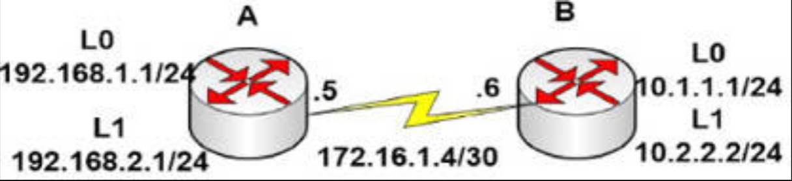

# 第 26 天 复习

## 第 26 天任务

- 复习前两天的理论及实验
- 参加 [Free CCNA Training Bonus – Cisco CCNA in 60 Days v4](https://www.in60days.com/free/ccnain60days/) 处今天的考试；
- 阅读 CCNA 补习指南
- 在 subnetting.org 上花 15 分钟

在过去几天里，我们已讨论了一些艰深而重要的主题。请不要过于纠结于细节，因为 CCNA 级别的 OSPF 问题和实验，应该是一些相当基础的。要复习这些理论，以及着重任何重要细节。

## 挑战 -- OSPF 实验

### 实验拓扑结构

### 实验说明

以串行线或交叉线，连接其中的两台路由器。

1. 根据图示，添加 IP 地址到两台路由器，并在 `Router A` 和 `Router B` 上添加环回接口；
2. 在 `Router A` 和 `Router B` 之间执行 `ping`，测试串行线路（要记住时钟频率）；
3. 在两个路由器上配置 OSPF；
4. 确保咱们添加了所有的正确通配符掩码；
5. 要仔细检查 WAN 通配符掩码与子网掩码。那 **不是** `172.16.1.0 0.0.0.3`！
6. 将所有网络置于 `Area 0` 中，包括那些环回网络；
7. 检查路由表是否有着全部网络；
8. 检查每个路由器的路由器 ID；
9. 咱们会怎样修改两个路由器的路由器 ID 呢？
