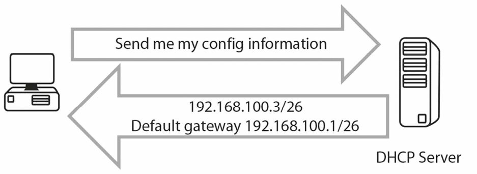
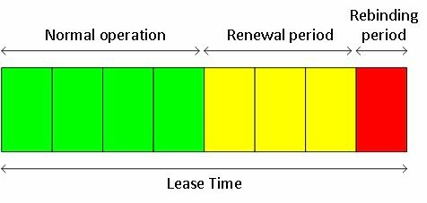

# DHCP 的功能

## DHCP 的运行

DHCP 通过自动分配 IP 信息给网络上的主机，简化了网络管理任务。这些信息包括 IP 地址、子网掩码及默认网关等，并通常在主机启动时分配，也可以定期更新。

> *译注*：通过 DHCP 分配的其他配置还包括 NTP 服务器、提供操作系统镜像的 PXE 服务器地址等等，他们是通过 [DHCP 的选项](#DHCP-的选项) 实现的。

当主机首次启动时，若其已被配置为使用 DHCP（大多数主机都如此），那么他会发送一条要求分配 IP 信息的广播报文。这条广播会被 DHCP 服务器听到，进而这一信息得以中继。

**FARAI 有言**：“这是假设了他们（译注：网络主机与 DHCP 服务器）在同一子网中，若他们不在同一子网，那么请参阅下面的 `ip helper-address` 命令”。

**图 28.1** -- **主机请求 IP 配置信息**

DHCP 实际上使用 UDP 端口 67 和 68 在网络上通信，当然，一些真实服务器通常会被用作 DHCP 服务器，尽管当有必要时，路由器也可扮演这一角色。当有必要时，路由器也可被配置为从某个 DHCP 服务器处获取其 IP 地址，不过很少这样做。要这样配置的命令为：

`Router(config-if)#ip address dhcp`

客户端的 DHCP 状态分别如下：

- 初始化
- 选择
- 请求
- 绑定
- 续订
- 重新绑定

DHCP 服务器可配置为在称为租期的指定时间段内，提供一个 IP 地址给某个主机。租期可以是数小时或数天。咱们可以并应该保留那些，不能分配给网络主机的 IP 地址。这些 IP 地址已于路由器接口或服务器上在用。当咱们未能这样做时，按么咱们就会在咱们网络上，看到重复的 IP 地址的告警，因为 DHCP 服务器已经分配了咱们的地址分配给了某个主机。

完整的 DHCP 请求及分配过程，见下图 28.2 中。

**图 28.2** -- **DHCP 的请求及分配过程**

1. DHCP 的 `Discover` 数据包：当某个设备启动，且其被配置为经由 DHCP 获取地址时，他会发出一个源自 UDP 端口 68（`bootpc`）的广播报文，到 UDP 端口 67。这个数据包将到达网络上的每台设备，包括位于其中的任何可能的 DHCP 服务器；

2. DHCP 的 `Offer` 数据包：本地网络上的 DHCP 服务器会看到这个由客户端发送的广播 `Discover` 报文，并会通过使用 UDP 的 `bootps` 源端口 67 及 `bootpc` 目的端口 68，发回一个响应（DHCP `Offer` 数据包），同样以广播地址的形式发送，因为该客户端还没有 IP 地址，而无法接收单播数据包；

3. DHCP 的 `Request` 数据包：一旦客户端工作站收到由 DHCP 服务器构造的一个 `Offer` 数据包后，他将发送一个广播的（让所有 DHCP 服务器都知道，他已接受某个服务器的 `Offer`）DHCP `Request` 报文到某个特定 DHCP 服务器，再次通过使用 UDP `bootpc` 源端口 68 与 `bootps` 目的端口 67。该客户端可能已收到了来自多个 DHCP 服务器的 `Offer` 数据包，但他只需要单个 IP 地址，因此他必须选择一个 DHCP 服务器（根据标识符），而这通常是以 “先到先得” 方式完成的；

4. DHCP 的 `ACK` 数据包：DHCP 服务器会发送另一条广播报文，确认该特定客户端的 IP 地址分配，再次使用了 UDP 的 `bootps` 源端口 67 及 `bootpc` 目的端口 68。

## DHCP 的保留

DHCP 服务器可被配置为以数种不同方式提供 IP 地址，包括：

- 动态分配
- 自动分配
- 静态分配

经由 DHCP 服务器分配地址的一种常见方法，便是使用动态分配过程，在这个过程中，DHCP 服务器会被配置以一个大的 IP 地址池，并根据客户端的请求，分配其中一个地址给客户端。当设备租期超时，或设备离开网络时，这个特定 IP 地址就会交还给 DHCP 服务器，从而随后其可被分配给另一客户端。

通过使用 DHCP 服务器分配 IP 地址的另一种方式，称为自动分配，其是个与动态分配非常相似的过程，但通过使用这种方法，DHCP 服务器会尝试保留一个所有过去分配的列表，并当某个 “老” 客户端请求 IP 地址时，那么他将被分配与之前相同的那个地址（即上次他请求 IP 地址时的）。自动分配是一种 IP 地址分配的一种底效方式，但当咱们有一个非常大的可用 IP 地址池时，这是一种几乎保证了客户端在他们于网络中变为活动时，都能获得同一 IP 地址的明智方式。

通过 DHCP 服务器的静态 IP 地址分配，意味着定义咱们希望在网络上看到的 MAC 地址，并为每个 MAC 地址手动分配一个唯一 IP 地址，从而管理性第建立一个 MAC 到 IP 的关联表。这种方式通常用于某种服务器环境，因为为了可被访问，服务器必须使用可预测的 IP 地址。

## DHCP 的作用域

打算配置 DHCP 服务器的网络管理员，作为这一配置过程的一部分，还需要配置 DHCP 的作用域。所谓作用域，是网络中某个特定部分的 IP 地址编组。每个子网通常都有其自己的作用域。

作用域也可以是个供 DHCP 服务器分配的连续地址池。大多数（DHCP）服务器，同时提供了为避免向客户动态分配一些地址，而从地址池中排除某些地址的功能。这些被排除的地址，通常是那些会手动分配给网络中的服务器（及一些网络设备）的 IP 地址。

在所定义的 DHCP 范围内，咱们可配置数个参数，比如：

- IP 地址范围
- 子网掩码
- 租用期限
- 默认网关
- DNS 服务器
- WINS 服务器

根据所使用的 DHCP 服务器，咱们或许能够以一些不同参数，创建出一些通常与不同子网相关联的不同范围。

## DHCP 租约

由 DHCP 提供的主要优势之一，便是租用 IP 地址的能力，即临时地分配 IP 地址。通常情况下，当某个客户端离开该网络时，那个特定分配的 IP 地址就会空闲出来，并可由 DHCP 服务器分配给另一设备。

DHCP 租约与每次 DHCP 分配有关，定义了某个用户被允许使用某个已分配 IP 地址的期限。这个参数通常是管理性地配置在 DHCP 范围内。无论某个客户端何时重启，他都将必须再次向 DHCP 服务器请求一个 IP 地址。DHCP 服务器通常被配置为重新分配同一个地址，并延长该特定客户端的租期。

工作站也可手动释放 IP 地址，例如在这些情况下：

- 该设备被无限期关闭
- 该设备迁移到另一子网（例如，自某个有线网络迁移到某个无线网络）

租用过程有数个与之关联的计时器，因此咱们可确保咱们始终会在每个网络设备上，有着一个更新的 IP 地址始。两个重要的 DHCP 定时器如下：

- 续订 (`T1`) 定时器（默认为租期的 50%）：每当某个工作站获得某个 IP 地址时，这个计时器就会启动，当在达到租期的 50% 时，该 DHCP 客户端将尝试与原先的 DHCP 服务器续约其租期；
- 重新绑定（`T2`）计时器（默认值：87.5% 的租期）：这第二个定时器，用于 DHCP 服务器在续订定时器超时后，未应答或确认该次分配延期的情形。这个计时器规定，当租用时间已过八分之七时，那么客户端将尝试寻找（发送一个 DHCP `Request` 数据包）其他或许能够提供一个 DHCP 地址的 DHCP 服务器。

有了上面讲到的租用流程及并与这些计时器相关联，咱们就可确保，咱们将总是会及时有着一个 IP 地址，而不会因此出现任何停机时间，同时咱们还将自动有了一种在 DHCP 流程中建立冗余的方式。

`T1` 和 `T2` 两个定时器，与租用时间的关系如下图 28.3 所示。

**图28.3** -- **DHCP 的租约计时器**

## DHCP 的选项

在 DHCP 中，有个可用的帮助扩展这一自动配置过程能力的特殊字段。咱们可将许多不同配置选项，置于这个字段内，这些不同选项，也出现在 [DHCP 的 RFC](https://www.rfc-editor.org/rfc/rfc5678.html) 中。

**注意**：这些 `BOOTP` 的选项，被称为 “厂商扩展”。

DHCP 提供了 256 个选项值，其中只有 254 个可用，因为 0 属于填充选项，255 为结束选项。许多的 DHCP 选项，都是一些常用的众所周知参数，包括：

- 括子网掩码
- 域名服务器
- 域名

多年来，一些其他 DHCP 还选项已被增加，特别是那些用于 VoIP 用途的选项，比如以下这些：

- `Option 129`：呼叫服务器的 IP 地址
- `Option 135`：特定于话机应用的 HTTP 代理

所有这些选项，都直接是在 DHCP 服务器上配置的，但并非所有 DHCP 服务器，都提供了设置 DHCP 选项的能力。当网络管理员希望使用这些特性时，他们就应使用某种企业级的 DHCP 服务器。在家庭办公室使用小型路由器作为 DHCP 服务器时，则可能不会从此类功能中获益。

