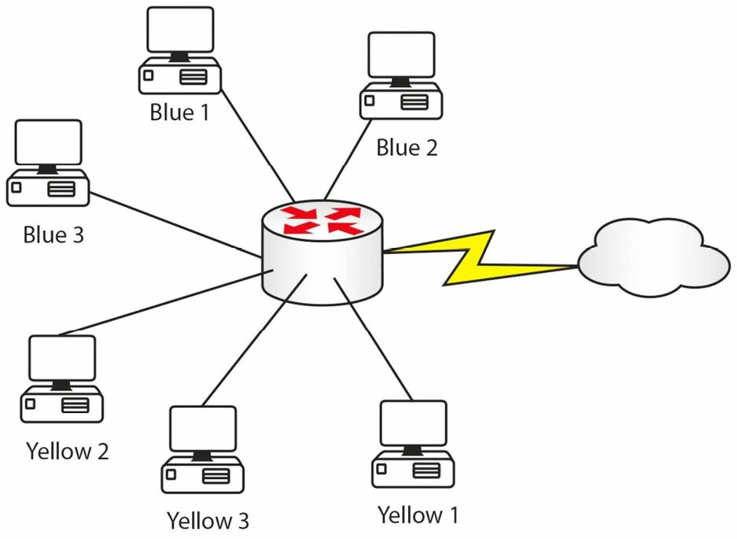
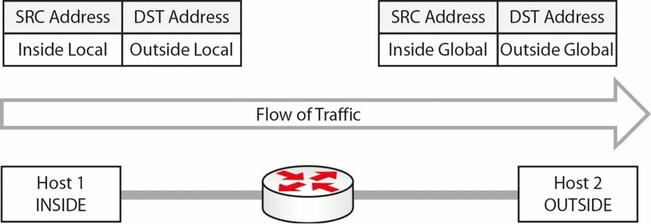

#  NAT 基础知识

试想一下，网络运行于颜色上，而不是使用 IP 地址。蓝色和黄色的供应是无限的，但其他颜色却供不应求。咱们的网络分为许多使用蓝色和黄色的用户，因为他们可免费使用。蓝色的用户需要经常访问 web，因此咱们购买了少量绿色令牌，当蓝色用户需要访问 web 主机时，咱们的路由器便可用这些令牌，交换蓝色用户的令牌。咱们的路由器会这样做：

**图 30.1** -- **内部令牌交换为外部令牌**

| 内部令牌 | 外部令牌 |
| :- | :- |
| 蓝色 1 | 绿色 1  |
| 蓝色 2 | 绿色 2  |
| 蓝色 3 | 绿色 3  |

当每个蓝色设备结束外部连接后，绿色令牌就可以释放供另一蓝色设备使用。这样做的好处是，外部设备无法看到咱们的内部令牌 ID，同时咱们正帮助节省可用于互联网用途的有限数量绿色令牌。NAT 便运行于这一原理之上。

正如咱们能看到的，NAT 不仅保护了咱们网络 IP 地址的身份，也是另一种地址保存的方法。NAT 于路由器或防火墙上执行，因此，咱们看到的不是颜色，而是像下面这样的一些东西：

**图 30.2** -- **内部地址交换为外部地址**

| 内部地址 | 外部地址 |
| -: | -: |
| 192.168.1.1 | 200.100.1.5 |
| 192.168.1.3 | 200.100.1.7 |

在咱们的路由器上配置 NAT 的方法有三种，具体取决于咱们的特定要求。针对 CCNA 考试，咱们将需要掌握全部三种方法。

为了配置 NAT，咱们需要告诉路由器，哪些接口在咱们 NAT 网络内部，哪些在外部。这是因为咱们实际上可以将内部地址，交换为一个 NAT 的地址池，或极端情况下交换为单个 NAT 地址，并在咱们路由器上的两个以太网接口之间完成 NAT。

尽管如此，对于考试及现实世界中，咱们将通常把私有 Internet 地址，交换为互联网上的可路由地址。咱们将在咱们的家庭宽带路由器上，看到这种情况，宽带路由器通常会给到咱们的笔记本电脑， 一个 `192.168.1` 范围内的 IP，而到在 ISP 的接口上有个可路由地址。

NAT 使私有网络上的主机，能访问互联网或其他公共网络上的资源。NAT 属于一项 IETF 标准，使 LAN 能够使用一组用于内部流量的 IP 地址，通常是定义于 [RFC 1918](https://datatracker.ietf.org/doc/html/rfc1918) 中的私有地址空间，而使用另一组用于外部流量的地址，通常是公开注册的 IP 地址空间。

NAT 会转换传入与传出流量的数据包头，并跟踪每个会话。掌握 NAT 与最终 NAT 故障排除的关键，在于 NAT 术语的扎实掌握。咱们应熟悉以下 NAT 术语：

- NAT 的内部接口
- 内部本地地址
- 内部全局地址
- NAT 的外部接口
- 外部本地地址
- 外部全局地址

在 NAT 术语中，所谓内部接口，是该组织控制的管理域的边界接口。这并不一定非得是位处该内部网络中主机，所使用的默认网关。

所谓部本地地址，是位处该内部网络主机的 IP 地址。在大多数情形下，内部本地地址都会是个 RFC 1918 的地址（即不可路由的，比如 `192.168.x.x` 或 `172.16.x.x`）。这一地址会被转换为通常是某个公共分配，或注册池中的 IP 地址外部全局地址。然而，重要的是要记住，内部本地地址也可以是个公共地址。

内部全局地址，是内部主机呈现给外部世界的 IP 地址。一旦内部的 IP 地址已被转换，那么他将作为某个内部全局地址，呈现到 Internet 外网，或任何别的外部网络或主机。

无喔诶外部接口，是不受该组织控制的管理域的边界。换句话说，外部接口与外部网络相连，外部网络可以是比如 Internet，或诸如合作伙伴网络等的任何别的外部网络。位处外部接口之外的任何主机，均属于本地组织管理之外。

外部的本地地址，是某个外界，或外部主机，在呈现于内部主机时的 IP 地址。最后，外部的全局地址，便是某个合法的，并可用于 Internet 的地址。外部的本地地址于外部的全局地址，通常都是从某个全球可路由的地址或网络空间分配的。

为了进一步阐明这些概念，下面的图 30.3 显示了在两台主机之间的某个会话中，这些地址的使用。NAT 已于其中的中间网关上启用：

**图 30.3** -- **掌握 NAT 的内部及外部地址**

NAT 的内部及外部分址，是个经典的考试问题，所以要多复习几次这个概念。

