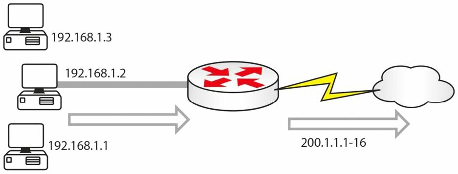

# 配置并验证 NAT

在 Cisco 10S 软件下 NAT 的配置与验证，是一项简单易行的任务。在配置 NAT 时，要执行以下操作：

- 使用 `ip nat inside` 这条接口配置命令，指定一个或多个接口为为内部接口；
- 使用 `ip nat outside` 这条接口配置命令，指定一个接口为外部接口；
- 配置一个将匹配全部要转换流量的访问控制列表 (ACL)。这个 ACL 可以是个标准或扩展的命名或编号的 ACL。
- 作为可选项，可使用 `ip nat pool <name> <start-ip> <end-ip> [netmask <mask> | prefix-length <length>]` 这条全局配置命令，配置一个全局地址池。这会定义出一个内部的全局地址池，那些内部本地地址，将被转换到这个地址池；
- 使用 `ip nat inside source list <ACL> [interfacelpool] <name> [overload]` 这条全局配置命令，配置全局地 NAT。

**Farai 有言**：“还请查看 `ip nat inside source static` 这条命令, 咱们可在 [web.archive.org: `ip nat inside source static`](https://web.archive.org/web/20150325010326/www.howtonetwork.net/public/698.cfm) 处免费查阅。”


下面的输出显示给咱们，在 Cisco IOS 软件下配置 NAT（动态 NAT）的一种方式。咱们可以看到，这种配置使用了可用的 `description` 及 `remark` 特性，帮助管理员更轻松地管理他们的网络及排除故障：


```console
R1(config)#interface FastEthernet0/0
R1(config-if)#description ‘Connected To The Internal  LAN ’
R1(config-if)#ip address 10.5.5.1 255.255.255.248
R1(config-if)#ip nat inside
R1(config-if)#exit
R1(config)#interface Serial0/0
R1(config-if)#description ‘Connected To The  ISP ’
R1(config-if)#ip address 150.1.1.1 255.255.255.248
R1(config-if)#ip nat outside
R1(config-if)#exit
R1(config)#access-list 100 remark ‘Translate Internal Addresses  Only ’
R1(config)#access-list 100 permit ip 10.5.5.0 0.0.0.7 any
R1(config)#ip nat pool INSIDE-POOL 150.1.1.3 150.1.1.6 prefix-length 24
R1(config)#ip nat inside source list 100 pool INSIDE-POOL
R1(config)#exit
```

这一配置之后，`show ip nat translations` 这条命令既可用于验证该路由器上，是否真的发生着转换（一旦流量开始穿越该路由器），如下所示：

```console
R1#show ip nat translations
Pro		Inside global	Inside local	Outside local	Outside global
icmp	150.1.1.4:4		10.5.5.1:4		200.1.1.1:4		200.1.1.1:4
icmp	150.1.1.3:1		10.5.5.2:1		200.1.1.1:1		200.1.1.1:1
tcp		150.1.1.5:159	10.5.5.3:159	200.1.1.1:23	200.1.1.1:23
```

在咱们的路由器上配置 NAT 时，咱们实际上有三种选择：

- 将一个内部地址交换为一个外部地址（静态的 NAT）
- 将多个内部地址，交换为两个或更多外部地址（动态的 NAT）
- 将用多个内部地址，交换为多个外部端口（端口地址转换或单向的 NAT）


## 静态的 NAT

当咱们在咱们网络内部，有个 web 服务器（比如）时，咱们会希望将一个特定地址，交换为另一地址。当咱们继续使用动态分址时，那么就无法到达这个目的地址，因为他会不断变化。

**FARAI 有言**：“针对任何需要经由 Internet 可达的服务器，比如电子邮件或 FTP 等，咱们都会使用静态的 NAT（见下图 30.4）。”


**图 30.4** -- **在用的静态 NAT**

| 内部地址 | 外部 NAT 地址 |
| -: | -: |
| 192.168.1.1 | 200.1.1.1 |
| 192.168.2.1 | 200.1.1.2 |

对于上面的网络，咱们的配置将如下：

```console
Router(config)#interface f0/0
Router(config-if)#ip address 192.168.1.1 255.255.255.0
Router(config-if)#ip nat inside
Router(config)#interface f0/1
Router(config-if)#ip address 192.168.2.1 255.255.255.0
Router(config-if)#ip nat inside
Router(config)#interface s0/0
Router(config-if)#ip nat outside
Router(config-if)#exit
Router(config)#ip nat inside source static 192.168.1.1 200.1.1.1
Router(config)#ip nat inside source static 192.168.2.1 200.1.1.2
```

`ip nat inside` 与 `ip nat outside` 两条命令，告诉该路由器哪些属于内部的 NAT 接口，哪些属于外部的 NAT 接口。`ip nat inside source` 这条命令，定义了那些静态转换，只要咱们支付了这些公共 IP 地址的费用，咱们就可以有着咱们想要的任意数量静态转换。我（作者）在思科期间修复的绝大多数配置错误，都是缺少 `ip nat inside` 与 `ip nat outside` 这两条语句！咱们可能在考试中，看到其中咱们必须指出配置错误的一些问题。

我（作者）强烈建议，咱们要在某个路由器上键入上面的命令。咱们将完成这本书中的许多 NAT 实验，但咱们在阅读理论部分的同时，键入的命令越多，那么咱们脑子里的信息就会越牢固。

## 动态 NAT 或 NAT 池

咱们将经常需要用到一组，或一池的可路由地址。当然，一对一的 NAT 映射有着其局限性，费用及路由器上的大量配置行，便是可列出的两条。动态的 NAT 允许咱们配置供咱们内部主机使用的一组或多组地址。

咱们的路由器会保留一个内部地址到外部地址的列表，而最终该数据表中的那些转换会超时。咱们可更改超时值，但要按照 Cisco TAC 工程师的建议行事。



**图 30.5** -- **到某个 NAT 可路由地址池的内部地址**

当咱们在一些内部主机已建立了一些外部连接时，于路由器上执行 `show ip nat translations` 这条命令，那么咱们就会看到，包含着像下面这些信息的一个图表：


| 内部地址 | 外部的 NAT 地址 |
| -: | -: |
| 192.168.1.3 | 200.1.1.11 |
| 192.168.1.2 | 200.1.1.14 |


在上面的图 30.5 中，咱们会有着一些，正使用 `200.1.1.1` 到 `200.1.1.16` 中地址的一个池的内部地址。下面是实现他的配置文件。此刻我（作者）已保留了路由器的接口地址：

```console
Router(config)#interface f0/0
Router(config-if)#ip nat inside
Router(config)#interface s0/1
Router(config-if)#ip nat outside
Router(config)#ip nat pool poolname 200.1.1.1 200.1.1.16 netmask 255.255.255.0
Router(config)#ip nat inside source list 1 pool poolname
Router(config)#access-list 1 permit 192.168.1.0 0.0.0.255
```

其中的 ACL 用于告诉路由器，哪些地址他可以转换，哪些地址不能转换。其中的子网掩码实际上是反转的，称为通配符掩码，这已在早先介绍过。所有 NAT 池都需要一个名字，在这个示例中，他就被简称为 `"poolname"`。其中 `source list` 指向了那个 ACL。


## NAT 过载/端口地址转换/单向 NAT


IP 地址供不应求，当咱们有成百上千甚至数万个需要路由的地址时，那么就会花费咱们很多钱。在这种情形下，咱们可使用 NAT 过载（见图 30.6），也被思科其称为端口地址转换（PAT），或单向 NAT。PAT 巧妙地允许将端口号添加到 IP 地址，作为将其与另一使用同一 IP 地址的转换标识的方式。每个 IP 地址都有超过 65,000 个的可用端口。

虽然这超出了 CCNA 考试的范围，但了解 PAT 如何处理端口号，会非常有用。根据 Cisco 文档，他将每个全球 IP 地址的可用端口，分为三个范围：0-511、512-1023 及 1024-65535。PAT 会分配一个唯一源端口，给每个 UDP 或 TCP 会话。他将尝试分配原始请求的同一端口值，但当这个原始源端口已被使用时，那么他将从特定端口范围的起点开始扫描，找到第一个可用端口并将其分配给该次对话。


**图 30.6** -- **NAT 过载**

这次的 `show ip nat translations` 数据表，就会显示 IP 地址及端口号。

| 内部地址 | 外部 NAT 地址（带有端口号） |
| -: | -: |
| 192.168.1.1 | 200.1.1.1:30922 |
| 192.168.2.1 | 200.1.1.2:30975 |

要配置 PAT，咱们将执行与动态 NAT 完全相同配置，不过咱们将添加 `overload` 这个关键字到池的末尾。

```console
Router(config)#interface f0/0
Router(config-if)#ip nat inside
Router(config)#interface s0/1
Router(config-if)#ip nat outside
Router(config)#ip nat pool poolname 200.1.1.1 200.1.1.1 netmask 255.255.255.0
Router(config)#ip nat inside source list 1 pool poolname overload
Router(config)#access-list 1 permit 192.168.1.0 0.0.0.255
```

这该很容易记住吧！

**FARAI 有言**：“以多个 IP 使用 PAT，属于一种地址空间的浪费，因为路由器将使用第一个 IP，并针对每个后续连接，递增端口号。这就是为什么 PAT 通常被配置对接口过载的原因。”
