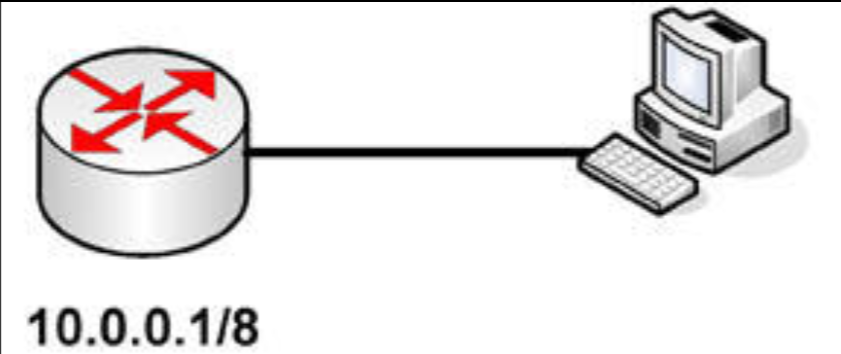
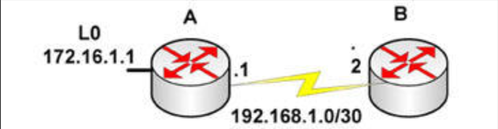
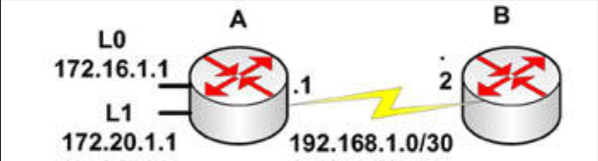
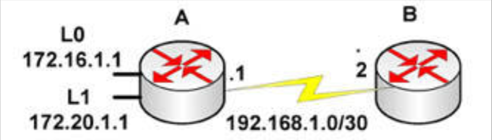

# 第 31 天 复习

## 第 31 天任务

- 复习前 3 天的理论及实验
- 参加挑战实验室（若咱们愿意）
- 阅读 CCNA 补习指南
- 参加 [Free CCNA Training Bonus – Cisco CCNA in 60 Days v4](https://www.in60days.com/free/ccnain60days/) 处今天的考试；
- 在 subnetting.org 上花 15 分钟

在过去的三天中，我们已讨论了一些困难主题。他们都是一些肯定会出现在考试中核心 TCP/IP 主题，同时也将构成咱们作为网络工程师，日常工作的一部分。

## 挑战 1 -- DHCP 实验

### 拓扑结构

### 实验说明

连接一个 PC 连接到路由器的以太网接口。

1. 配置 IP 地址 `10.0.0.1/8` 到其中路由器上；
2. 创建一个 `10.0.0.0/8` 网络的 DHCP 池；
3. 添加路由器接口的一个排除地址；
4. 添加一个 `192.168.1.1` 的默认路由器地址;
5. 配置该 PC 为经由 DHCP 获取 IP 地址；
6. `no shut` 路由器接口；
7. 检查该 PC 的 IP 配置，查看是否分配了 IP 地址；
8. 检查路由器上的 DHCP 池分配。

## 挑战 2 -- NTP 实验室

### 拓扑结构

### 实验说明

分别以控制台线及以太网线，连接到路由器。还要连接另一路由器。

1. 在两台路由器上分别配置 IP 地址，并相互 `ping`；
2. 将 `Router A` 配置为一台 NTP 服务器，将 `Router B` 配置为 NTP 客户端；
3. 在 `Router B` 上执行 `show ntp associations` 命令。

## 挑战 3 -- 静态 NAT 实验

### 拓扑结构

### 实验说明

以串行线或交叉网线，连接两台路由器。

1. 根据图示，添加 IP 地址到两台路由器，并在 `Router A` 上添加环回接口；
2. 指定 NAT 的内部及外部接口；
3. 在 `Router B` 添加一条静态路由，以发送所有流量回 `Router A`；
4. 在 `Router A` 与 `Router B` 之间 `ping`，测试串行线路（要记住时钟频率）；
5. 创建 `172.16.1.1` 到 `10.1.1.1` 的静态 NAT，并打开 NAT 调试；
6. 执行一次从 `loopback 0` 的扩展 `ping`；
7. 检查 NAT 的转换数据表。

## 挑战 4 -- NAT 池实验

### 拓扑结构

### 实验说明

以串行线或交叉网线，连接两台路由器。

1. 根据图示添加 IP 地址到两台路由器，并在 `Router A` 上添加环回接口；
2. 指定 NAT 的内部及外部接口；
3. 在 `Router B` 上添加一条静态路由，以发送所有流量回 `Router A`；
4. 在 `Router A` 与 `Router B` 之间 `ping`，测试串行线路（要记住时钟频率）；
5. 创建一个 `10.1.1.1-10`（含） 的 NAT 池；
6. 创建两个放行那些环回网络 (`/16`) 的访问列表行；
7. 打开 NAT 调试；
8. 从 `LO` 与 `L1`，发出两次扩展的 `ping`；
9. 检查 NAT 的转换数据表。

## 挑战 5 -- PAT 实验

### 拓扑结构

### 实验说明

以串行线或交叉网线，连接两台路由器。

1. 根据图示添加 IP 地址到两台路由器，并在 `Router A` 上添加环回接口；
2. 指定 NAT 的内部及外部接口；
3. 在 `Router B` 上添加一条静态路由，以发送所有流量回 `Router A`；
4. 在 `Router A` 与 `Router B` 之间 `ping`，测试串行线路（要记住时钟频率）；
5. 创建一个仅有 `10.1.1.1` 地址的 NAT 池，并对这个池（地址）过载；
6. 创建两个放行那些环回网络 (`/16`) 的访问列表行；
7. 打开 NAT 调试；
8. 从 `LO` 与 `L1`，发出两次扩展的 `ping`；
9. 检查 NAT 的转换数据表。

## 挑战 6 -- ACL 实验

### 拓扑结构

### 实验说明

使用控制台线及以太网线，连接该路由器。

1. 在 PC 及路由器上配置同一子网中的 IP 地址；
2. 添加一个 `telnet` 用户名与口令到该路由器，并通过 `telnet` 拨入测试；
3. 创建一个拒绝到该路由器的 `telnet`，但放行所有其他 IP 流量的 ACL；
4. 再次测试 `telnet`。

