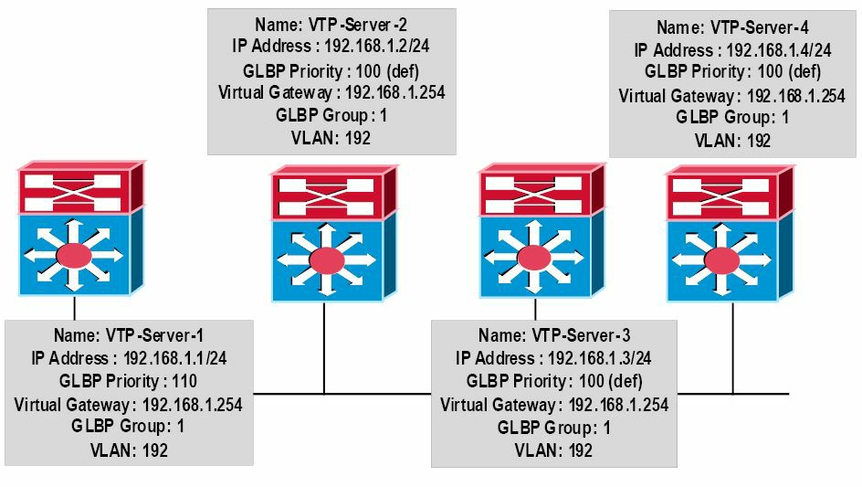

# 网关负载均衡协议的运行

在 GLBP 启用后，GLBP 分组的成员，就会选出一个网关作为该分组的活动虚拟网关（AVG）。AVG 是有着最高优先级值的那个网关。在优先级值都相等的情形下，那么这个分组内有着最高 IP 地址的 AVG，将被选为网关。在这个 AVG 成为不可用的情形下，该 GLBP 分组中的其他网关，就提供了这个 AVG 的备份。

AVG 会应答虚拟路由器地址的所有地址解析协议 (ARP) 请求。出了这点外，AVG 指派一个虚拟 MAC 地址到这个 GLBP 分组的每个成员。因此，每个网关都有责任转发那些，发送这个由 AVG 指派的虚拟 MAC 地址的数据包。这些网关被称为他们所分配到 MAC 地址的活动虚拟转发器（AVF）。这样做便允许 GLBP 提供负载均衡。这一概念在下图 32.25 中得以演示。


**图 32.25** -- **GLBP 的活动虚拟网关与活动虚拟转发器**

图 32.25 显示了一个使用 GLBP 作为 FHRP 的网络。其中三个网关均被配置在 GLBP 的 `Group 1` 中。网关 `GLBP-1` 配置了 10 的优先级，网关 `GLBP-2` 配置了 105 的优先级，而网关 `GLBP-3` 则正使用 100 的默认优先级。`GLBP-1` 被选为 AVG，同时 `GLBP-2` 和 `GLBP-3` 分别分配了虚拟 MAC 地址 `bbbb.bbbb.bbbb` 及 `cccc.cccc.cccc`，并成为这些虚拟 MAC 地址的 AVF。`GLBP-1` 还是其虚拟 MAC 地址 `aaaa.aaaa.aaaa` 的 AVF。


`Host 1`、`Host 2` 及 `Host 3` 都配置了默认网关地址 `192.168.1.254`，这是分配给该 GLBP 组的虚拟 IP 地址。`Host 1` 会发出一个其网关 IP 地址的 ARP 广播。这一广播会被 AVG (`GLBP-1`) 收到，其便会已其自己的虚拟 MAC 地址 `aaaa.aaaa.aaaa` 回应。`Host 1` 便会将到 `192.168.1.254` 的流量，转发到这个 MAC 地址。

`Host 2` 会发出其网关 IP 地址的一个 ARP 广播。这条广播会被 AVG (`GLBP-1`) 收到，其会以 `bbbb.bbbb.bbbb` (`GLBP-2`) 的虚拟 MAC 地址回应。`Host 2`  会将到 `192.168.1.254` 的流量，转发到这个 MAC 地址，而 `GLBP-2` 就会转发这些流量。

`Host 3` 会发出其其网关 IP 地址的 ARP 广播。这一广播会被 AVG (`GLBP-1`) 收到，其会以 `cccc.cccc.cccc` (`GLBP-3`) 的虚拟 MAC 地址回应。`Host 3` 会将到 `192.168.1.254` 的流量，转发到这一 MAC 地址，同时 `GLBP-3` 会转发这些流量。


通过使用该分组中的全体网关，GLBP 在不必像使用 HSRP 或 VRRP 作为 FHRP 时那样，配置多个组的情况下，实现负载均衡。

## GLBP 的虚拟 MAC 地址指派

GLBP 的分组，允许每个分组四个虚拟 MAC 地址。AVG 负责指派虚拟 MAC 地址到该组的每个成员。别的群成员会在他们发现 AVG 后，通过 `Hello` 报文请求虚拟 MAC 地址。

这些网关会按顺序分配到下一虚拟 MAC 地址。由 AVG 分配虚拟 MAC 地址的网关，称为主虚拟转发器，而已学习到虚拟 MAC 地址的网关，则称为辅助虚拟转发器。

## GLBP 的冗余

在 GLBP 分组内，单一网关会被选为活动虚拟网关（AVG），而另一网关会被选为备用虚拟网关。分组中的全部其余网关，均被置于监听状态。当 AVG 失效时，那么备用虚拟网关将接管虚拟 IP 地址的职责。与此同时，一次选举得以举行，经而一个新的备用虚拟网关，会于随后从那些当前处于监听状态的网关中选出。

在 AVF 失效的情形下，处于监听状态的辅助虚拟转发器之一，会接管这一虚拟 MAC 地址的责任。但由于这个新的 AVF，已是一个正使用着另一虚拟 MAC 地址的转发器，GLBP 就需要确保那个旧的转发器 MAC 地址停止使用，以及那些主机要被迁离这个地址。这是通过以下两个计时器实现的：

1. 重定向计时器
2. 超时计时器

所谓重定向计时器，是 AVG 继续将那些主机，重定向至那个旧的虚拟转发器 MAC 地址的时间间隔。在这个计时器超时后，AVG 会在 ARP 应答中停止使用那个旧的虚拟转发器 MAC 地址，但这个虚拟转发器将继续转发那些发往到这个旧的虚拟转发器 MAC 地址的数据包。

在超时计时器到期后，那么这个虚拟转发器就会从该 GLBP 组中的全体网关中移除。任何仍在其 ARP 缓存中，使用着那个旧 MAC 地址的客户端，都必须刷新该条目，获取新的虚拟 MAC 地址。GLBP 使用 `Hello` 报文，传递这两个计时器的当前状态。


## GLBP 的负载抢占

默认情况下，GLBP 的抢占是关闭的，这意味着某个备份虚拟网关只能在当前 AVG 失效时，才能成为AVG，而无关指派给这些虚拟网关的优先级。这种运行方式，类似于 HSRP 用到的。

Cisco 10S 软件允许管理员启用抢占，这允许某个备份网关在其被指派了一个相比当前 AVG 更高的优先级时，成为 AVG。默认情况下，GLBP 的虚拟转发器抢占方案，会以 30 秒的延迟启用。但这个可被管理员可手动调整。


## GLBP 的权重

GLBP 使用了一种权重方案，确定 GLBP 组中每个网关的转发能力。指派给某个 GLBP 组中某个网关的权重，可用于确定其是否将转发数据包，以及在转发时其将为 LAN 中多少比例的主机转发数据包。

默认情况下，每个网关会被指派一个 100 的权重。管理员可通过与 GLBP 结合，配置诸如接口及 IP 前缀的对象跟踪，额外地将这些网关配置为实现动态的权重调整。当某个接口失效时，那么权重便会根据指定值，被动态地降低，从而允许那些有着更高权重值的网关，能被用于相比那些有着更低权重值的网关，转发更多流量。

除此以外，阈值也可被设置，以在某个 GLBP 分组的权重掉至某个值以下时禁用转发，当其回升至另一阈值时转发自动重新启用。在当前 AVF 的权重掉在低权重阈值以下达到 30 秒时，某个备用虚拟转发器便可成为 AVF。


## GLBP 的负载分担

GLBP 支持以下三种负载分担方式：

1. 主机依赖
2. 循环轮询
3. 加权

在主机依赖的负载分担下，生成虚拟路由器地址 ARP 请求的每个客户端，都会始终在应答中，收到同一个虚拟 MAC 地址。这种方式提供到客户端一个一致的网关 MAC 地址。

循环轮询的负载分担机制，会将流量平均分配给分组中作为 AVF 参与的全部网关。这是默认的负载分担机制。

加权的负载分担机制，使用权重值来确定发送到某个特定 AVF 的流量比例。较高的权重值会带来更频繁的包含那台网关虚拟 MAC 地址的 ARP 响应。

加权的负载分担机制，会使用权重值确定应发送到某个特定 AVF 的流量比例。更高的权重值，会导致包含该网关虚拟 MAC 地址的 ARP 响应更频繁。


## GLBP 的客户端缓存

GLBP 的客户端缓存，包含着那些正将 GLBP 分组用作默认网关的网络主机的信息。缓存条目包含着有关该主机发送 IPv4 ARP 或 IPv6 邻居发（ND）请求的信息、AVG 已分配给他的转发器、每个网络主机已被分配的 GLBP 转发器的编号，以及指派给 GLBP 分组中每个转发器的网络主机总数等。

GLBP 分组的 AVG 可被启用为存储所有使用这一组的 LAN 客户端的一个客户端缓存数据库。可缓存的条目最大数目，可最多达到 2000 条，但建议这一数目永远不要超过 1000。虽然 GLBP 的缓存配置超出了 CCNA 考试要求范围，但这一特性可通过使用 `glbp client-cache` 命令加以配置，随后可使用 `show glbp detail` 命令加以验证。

## 在网关上配置 GLBP

要网关上配置 GLBP，需要以下的步骤：

1. 使用 `ip address [address] [mask] [secondary]` 这条接口配置命令，配置网关的正确 IP 地址及掩码；
2. 经由 `glbp [number] ip [virtual address][secondary]` 这条接口配置命令，在网关接口上创建 GLBP 分组。其中 `[secondary]` 关键字会将该虚拟 IP 地址，配置为指定分组的辅助网关地址；
3. 作为可选项，使用 `glbp [number] name [name]` 这条接口配置命令，给这个 GLBP 分组取个名字（译注：这里原文作者误将 GLBP 写作了 VRRP）；
4. 作为可选项，当咱们打算控制 AVG 的选举，那么就要经由 `glbp [number] priority [value]` 这条接口配置命令，设置分组优先级。


这一小节中的那些 GLBP 配置示例，都将基于下图 32.26。




---

*图 34.26 -- GLBP配置示例的拓扑*

> **注意：** 这里假定在`VTP-Server-1`与`VTP-Server-2`之间的 VLAN 与中继已有配置妥当，同时交换机之间可以经由VLAN192 `ping`通。为简短起见，这些配置已在配置示例中省略。

```console
VTP-Server-1(config)#interface vlan192
VTP-Server-1(config-if)#glbp 1 ip 192.168.1.254
VTP-Server-1(config-if)#glbp 1 priority 110
VTP-Server-1(config-if)#exit
VTP-Server-2(config)#interface vlan192
VTP-Server-2(config-if)#glbp 1 ip 192.168.1.254
VTP-Server-2(config-if)#exit
VTP-Server-3(config)#interface vlan192
VTP-Server-3(config-if)#glbp 1 ip 192.168.1.254
VTP-Server-3(config-if)#exit
VTP-Server-4(config)#interface vlan192
VTP-Server-4(config-if)#glbp 1 ip 192.168.1.254
VTP-Server-4(config-if)#exit
```

一旦该 GLBP 组已被配置，就可使用命令`show glbp brief`来查看该 GLBP 配置的摘要信息了，如同下面的输出所示：

```console
VTP-Server-1#show glbp brief
Interface   Grp  Fwd Pri State      Address         Active router   Standby router
Vl192       1    -   110 Active     192.168.1.254   local           192.168.1.4
Vl192       1    1   -   Active     0007.b400.0101  local           -
Vl192       1    2   -   Listen     0007.b400.0102  192.168.1.2     -
Vl192       1    3   -   Listen     0007.b400.0103  192.168.1.3     -
Vl192       1    4   -   Listen     0007.b400.0104  192.168.1.4     -

VTP-Server-2#show glbp brief
Interface   Grp  Fwd Pri State      Address         Active router   Standby router
Vl192       1    -   100 Listen     192.168.1.254   192.168.1.1     192.168.1.4
Vl192       1    1   -   Listen     0007.b400.0101  192.168.1.1     -
Vl192       1    2   -   Active     0007.b400.0102  local           -
Vl192       1    3   -   Listen     0007.b400.0103  192.168.1.3     -
Vl192       1    4   -   Listen     0007.b400.0104  192.168.1.4     -

VTP-Server-3#show glbp brief
Interface   Grp  Fwd Pri State      Address         Active router   Standby router
Vl192       1    -   100 Listen     192.168.1.254   192.168.1.1     192.168.1.4
Vl192       1    1   -   Listen     0007.b400.0101  192.168.1.1     -
Vl192       1    2   -   Listen     0007.b400.0102  192.168.1.2     -
Vl192       1    3   -   Active     0007.b400.0103  local           -
Vl192       1    4   -   Listen     0007.b400.0104  192.168.1.4     -

VTP-Server-4#show glbp brief
Interface   Grp  Fwd Pri State      Address         Active router   Standby router
Vl192       1    -   100 Standby    192.168.1.254   192.168.1.1     local
Vl192       1    1   -   Listen     0007.b400.0101  192.168.1.1     -
Vl192       1    2   -   Listen     0007.b400.0102  192.168.1.2     -
Vl192       1    3   -   Listen     0007.b400.0103  192.168.1.3     -
Vl192       1    4   -   Active     0007.b400.0104  local           -
```

从上面的输出可以看出，基于`VTP-Server-1`（192.168.1.1）有着优先级值110, 该值高于所有其它网关的优先级值，而已被选举作为活动虚拟网关。网关`VTP-Server-4`（192.168.1.4）, 由于有着剩下三台网关中最高的 IP 地址，而就算这三台网关有着同样的优先级值，被选举作备份虚拟网关。因此网关`VTP-Server-2`与`VTP-Server-3`都被置于侦听状态了。

命令`show glbp`将有关该 GLBP 组状态的详细信息打印了出来，下面对此命令的输出进行了演示：

```console
VTP-Server-1#show glbp
Vlan192 - Group 1
    State is Active
        2 state changes, last state change 02:52:22
    Virtual IP address is 192.168.1.254
    Hello time 3 sec, hold time 10 sec
        Next hello sent in 1.465 secs
    Redirect time 600 sec, forwarder time-out 14400 sec
    Preemption disabled
    Active is local
    Standby is 192.168.1.4, priority 100 (expires in 9.619 sec)
    Priority 110 (configured)
    Weighting 100 (default 100), thresholds: lower 1, upper 100
    Load balancing: round-robin
    Group members:
        0004.c16f.8741 (192.168.1.3)
        000c.cea7.f3a0 (192.168.1.2)
        0013.1986.0a20 (192.168.1.1) local
        0030.803f.ea81 (192.168.1.4)
    There are 4 forwarders (1 active)
    Forwarder 1
        State is Active
            1 state change, last state change 02:52:12
        MAC address is 0007.b400.0101 (default)
        Owner ID is 0013.1986.0a20
        Redirection enabled
        Preemption enabled, min delay 30 sec
        Active is local, weighting 100
    Forwarder 2
        State is Listen
        MAC address is 0007.b400.0102 (learnt)
        Owner ID is 000c.cea7.f3a0
        Redirection enabled, 599.299 sec remaining (maximum 600 sec)
        Time to live: 14399.299 sec (maximum 14400 sec)
        Preemption enabled, min delay 30 sec
        Active is 192.168.1.2 (primary), weighting 100 (expires in 9.295 sec)
    Forwarder 3
        State is Listen
        MAC address is 0007.b400.0103 (learnt)
        Owner ID is 0004.c16f.8741
        Redirection enabled, 599.519 sec remaining (maximum 600 sec)
        Time to live: 14399.519 sec (maximum 14400 sec)
        Preemption enabled, min delay 30 sec
        Active is 192.168.1.3 (primary), weighting 100 (expires in 9.515 sec)
    Forwarder 4
        State is Listen
        MAC address is 0007.b400.0104 (learnt)
        Owner ID is 0030.803f.ea81
        Redirection enabled, 598.514 sec remaining (maximum 600 sec)
        Time to live: 14398.514 sec (maximum 14400 sec)
        Preemption enabled, min delay 30 sec
        Active is 192.168.1.4 (primary), weighting 100 (expires in 8.510 sec)
```

当在活动虚拟网关上执行时，命令`show glbp`除了展示其它内容外，还会给出备份虚拟网关的地址和组中所有活动虚拟转发器的数目，以及由活动虚拟网关所指派给这些活动虚拟转发器的状态。同时还显示了各台活动虚拟转发器的虚拟 MAC 地址。


