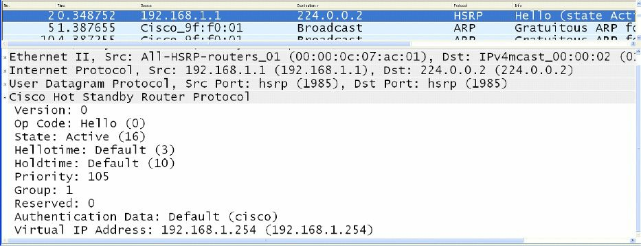
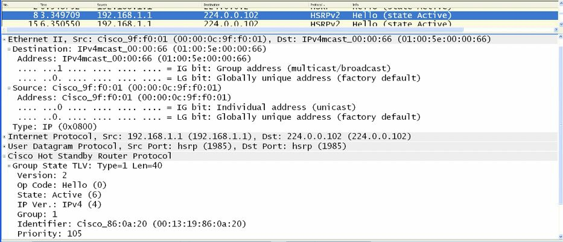
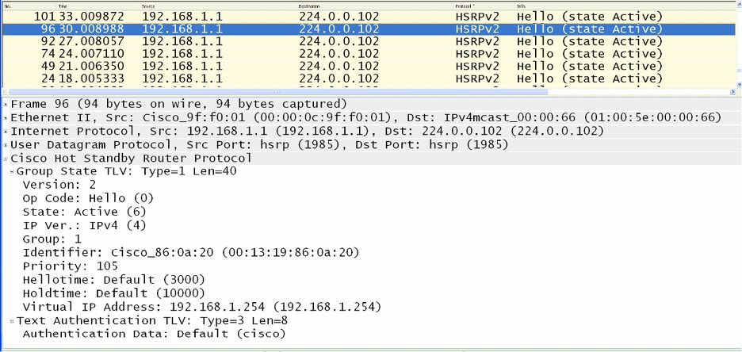
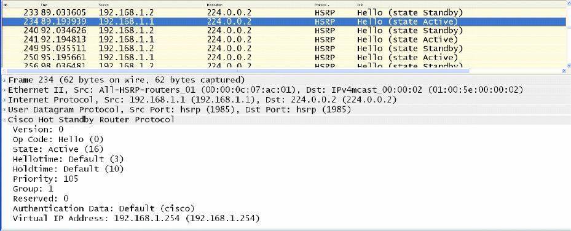
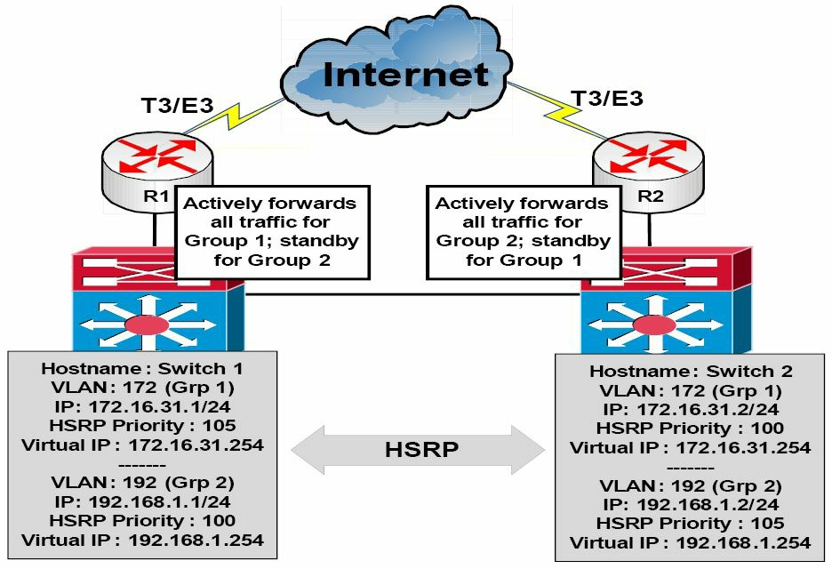

# 热备路由器协议


热备路由器协议（HSRP），属于思科专有的第一跳冗余协议（FHRP）。HSRP 允许配置为同一 HSRP 组的两个物理网关，共用同一个虚拟网关地址。与这两个网关位于同一子网的网络主机，会以这个虚拟网关 IP 地址，配置为其默认网关。


在运行时，主网关会转发以这个 HSRP 组的虚拟网关 IP 地址为目的地的那些数据包。在主网关失效的情形下，辅助网关会承担主网关的角色，转发发送到虚拟网关 IP 地址的所有数据包。下图 32.1 演示了某个网络中 HSRP 的运行。


**图 32.1** -- **热备路由器协议 (HSRP) 的运行**


参考图 32.1，HSRP 配置与两台三层（分布层）交换机之间，为 `VLAN 10` 提供着网关冗余。分配给三层的 `Switch 1` 上交换机虚拟接口 (SVI) 的 IP 地址，为 `10.10.10.2/24`，分配给三层的 `Switch 2` 上交换机虚拟接口 (SVI) 的 IP 地址，为 `10.10.10.3/24`。两台交换机均被配置为同一 HSRP 组的一部分，共用了 `10.10.10.1` 的虚拟网关 IP 地址。

`Switch 1` 已配置了 105 的优先级，`Switch 2` 正使用默认 100 的优先级。由于更高的优先级，三层的 `Switch 1` 被选为主交换机，三层的 `Switch 2` 则被选为辅助交换机。`VLAN 10` 上的所有主机，都配置了 `10.10.10.1` 的默认网关地址。基于这一解决方案，`Switch 1` 交换机将转发发送到 `10.10.10.1` 这个地址的所有数据包。但是，在 `Switch 1` 失效的情形下，那么 `Switch 2` 就将承担这一责任。这一过程对那些网络主机完全透明。


**现实世界的部署**


在生产网络中，配置 FHRP 时，确保活动（主）网关也是某个特定 VLAN 的生成树根桥，被视为好的做法。例如，参考图 32.1 中的图示，`Switch 1` 就将被配置为 `VLAN 10` 的根桥，同时也是这同一个 VLAN 的 HSRP主网关。

这样做会得到一个确定网络，而避免了二层或三层处的次优转发。例如，当 `Switch 2` 为 `VLAN 10` 的根网桥，而 `Switch 1` 为 `VLAN 10` 的主网关时，那么从网络主机到默认网关 IP 地址的数据包，就会如下图 32.2 所示的那样被转发。


**图 32.2** -- **将 STP 拓扑与 HSRP 同步**

在上面的网络中，从 `Host 1` 到 `10.10.10.1` 的数据包，会被如下转发：

1. 接入层交换机从 `Host 1`，接收到一个以虚拟网关 IP 地址的 MAC 地址为目的地的数据帧。这个数据帧是在 `VLAN 10` 中接收的，同时虚拟网关的 MAC 地址已有该交换机，经由其根端口学习到；
2. 由于 `VLAN 10` 的根桥是 `Switch 2`，因此朝向 `Switch 1`（HSRP 的主路由器）的上行链路，已被置于阻塞状态。该接入层交换机就会经由到 `Switch 2` 的上行链路转发这个数据帧；
3. `Switch 2` 会经由连接到 `Switch 1` 的指定端口转发这个数据帧。

目前，有两个版本的 HSRP 在 Cisco 10S 软件中受到支持：版本 1 和 2。这两个版本之间的异同，将在接下来的小节中介绍。


## HSRP 版本 1

默认情况下，在热备路由器协议于 Cisco IOS 软件中启用时，版本 1 会被启用。HSRP 的版本 1 限制了可配置的 HSRP 组数量到 255。HSRP 版本 1 的路由器，通过使用 UDP 端口 1985，发送报文到组播组地址 `224.0.0.2` 通信。这在下图 32.3 中得以展示。


**图 32.3** -- **HSRP 版本 1 的组播组地址**

虽然深入有关 HSRP 数据包格式的细节，超出了 CCNA 考试要求的范围，但下图 32.4 演示了包含于 HSRP 版本 1 数据包中的信息。


**图 32.4** -- **HSRP 版本 1 数据包的字段**

在图 32.4 中，要注意 `Version` 字段显示了一个 0 的值。这是版本 1 启用时这个字段的默认值；但要记住，这暗示了 HSRP 版本 1。


## HSRP 版本 2

HSRP 的版本 2，使用新的组播地址 `224.0.0.102` 发送 `Hello` 数据包，而不是版本 1 用到的组播地址 `224.0.0.2`。但 UDP 端口号则保持不变。如下图 32.5 中所示，这个新的地址，还被编码到了 IP 数据包及以太网数据帧中。


**图 32.5** -- **HSRP 版本 2 的组播组地址**


虽然深入有关 HSRP 版本 2 据包格式的细节，超出了 CCNA 考试要求的范围，但重要的是要记住，HSRP 版本 2 并未使用与 HSRP 版本 1 同样的数据包格式。

这个版本 2 的数据包格式，使用了一种类型/长度/值 (TLV) 的格式。被某个 HSRP 版本 1 路由器接收到的 HSRP 版本 2 数据包，会将 `Type` 字段映射到 HSRP 版本 1 的 `Version` 字段，且随后将被忽略。图 32.6 演示了包含于 HSRP 版本 2 数据包中的信息。


**图 32.6** -- **HSRP 版本 2 数据包的字段**


## HSRP 的版本 1 与版本 2 比较

HSRP 版本 2 包括了对 HSRP 版本 1 的一些增强。版本 2 对版本 1 的那些增强与区别，将在这一小节中介绍。

尽管 HSRP 版本 1 会通告一些定时器值，但这些值总是以整秒为单位。版本 1 不具备通告或学习毫秒的定时器值的能力。版本 2 则具备通告和学习毫秒计时器值的能力。下图 32.7 和 32.8，分别突出显示了 HSRP 版本 1 和 HSRP 版本 2 的这些定时器字段之间的差别。



**图 32.7** -- **HSRP 版本 1 的定时器字段**


**图 32.8** -- **HSRP 版本 2 的定时器字段**

HSRP 版本 1 组编号，限制在 0 到 255 的范围，而版本 2 的组编号，范围已扩展为从 0 到 4095。这一差异，将于这一教学模组稍后提供的 HSRP 配置示例中得以演示。

版本 2 通过包含一个 6 字节的 `Identifier` 字段，提供了改进后的管理及故障排除，这一字段产生自物理路由器接口的 MAC 地址，用于唯一标识 HSRP 活动 `Hello` 报文的来源。在版本 1 中，这些报文包含虚拟 MAC 地址为源 MAC，这意味着要确定哪个 HSRP 路由器具体发送了 HSRP `Hello` 报文是不可能的。下图 32.9 显示了出现于版本 2 数据包中，而未在 HSRP 版本 1 数据包中的这个 `Identifier` 字段。


**图 32.9** -- **HSRP 版本 2 的 `Identifier` 字段**

在 HSRP 版本 1 中，由虚拟 IP 地址用到的二层地址，将是个由 `0000.0C07.ACxx` 构成的虚拟 MAC 地址，其中 `xx` 是十六进制值的 HSRP 组编号，并基于相应接口。而 HSRP 版本 2 则将一个新的 MAC 地址范围 `0000.0C9F.FO00` 至 `0000.0C9FE.FFFF`，用于虚拟网关 IP 地址。这些差异在下面图 32.10 与图 32.11 中得以演示，前者显示了 HSRP `Group 1` 的版本 1 虚拟 MAC 地址，同时在图 32.11 中，其显示了 HSRP `Group 1` 的版本 2 虚拟 MAC 地址。


**图 32.10** -- **HSRP 版本 1 的虚拟 MAC 地址格式**



**图 32.11** -- **HSRP 版本 2 的虚拟 MAC 地址格式**


## HSRP 的主网关选举

HSRP 的主网关选举，可通过调整 HSRP 的默认优先级 100，到 1 至 255 之间的任意值加以影响。有着最高优先级的路由器，将被选为该 HSRP 组的主网关。

当两个网关均正使用默认的优先级值时，或当两个网关上的优先级值，被手动配置为相等时，那么有着最高 IP 地址的路由器，将被选作主网关。HSRP 优先级值和路由器的当前状态（如主用或备用），均承载与 HSRP 数据帧中。下图 32.12 演示了以 105 的非默认优先级值，配置的某个网关的 `Priority` 与 `State` 两个字段，所配置的 105 的优先级值，导致该路由器被选为这个 HSRP 组的活动网关。




**图 32.12** -- **HSRP 的 `Priority` 与 `State` 字段**

## HSRP 的报文

HSRP 路由器会交换以下三种报文类型：

- `Hello` 报文
- `Coup` 报文
- `Resign` 报文


`Hello` 报文是经由组播交换的，他们会另一网关，本地路由器的 HSRP 状态与优先级值。`Hello` 报文还包括了分别 ID、HSRP 的定时器值、版本及认证信息等。显示于前面那些图片中的所有报文，均是 HSRP 的 `Hello` 报文。

HSRP 的 `Coup` 报文，会于当前备用路由器打算承担该 HSRP 分组的活动网关角色时发送。这类似于现实生活中的政变（a coup d’état）。

HSPR 的 `Resign` 报文，会由活动路由器在其即将关闭时，或某个有着更高有限的网关，发送 `Hello` 或 `Coup` 信息时发送。换句话说，这种报文会在活动网关要放弃其作为主网关的角色时发送。


## HSRP 的抢占

当某个网关已被选为活动网关，而作为该 HSRP 组一部分的另一网关，被重新配置了某个更高优先级值时，那么当前的活动网关会保留主要转发的角色。这是 HSRP 的默认行为。

当 HSRP 组的主网关已存在时，为了使某个有着更高优先级的网关承担活动网关的功能，那么这个路由器就必须被配置为抢占。这样做就允许这个网关，发起一次政变并接过该 HSRP 组活动网关的角色。HSRP 的抢占，会在接着的配置示例中得以演示。

**注意**：抢占并不一定意味着，生成树的拓扑结构也会发生变化。


## HSRP 的状态

在某种类似于开放式最短路径优先 (OSPF) 的方式，当 HSRP 于某个接口上启用后，那么这个网关接口，就会经历以下一系列状态：

- `Disabled`
- `Init`
- `Listen`
- `Speak`
- `Standby`
- `Active`

**注意**： 并没有为这些接口状态过渡设定的一些时间值。

在 `Disabled` 或 `Init` 两种状态下，网关尚未准备就绪，或无法参与 HSRP，可能是因为相关接口未启动。

`Listen` 状态适用于备用网关。只有备用网关才会监听来自活动网关的 `Hello` 报文。当备用网关在 10 秒内没有收到 `Hello` 报文时，他便会认为活动网关已宕机，并会自行承担这一角色。当有别的网关存在于该同一网段上时，那么他们也会监听 `Hello` 报文，并当他们有着下一最高优先级值或 IP 地址时，他们将被选为这个 HSRP 组的活动网关。

在 `Speak` 阶段期间，备用网关会与活动网关交换报文。这一阶段完成后，主网关会转换到 `Active` 状态，而备用网关则会转换到 `Standby` 状态。`Standby` 状态表明，该网关已准备好在主网关失效时，承担活动网关的角色，而 `Active` 状态表明，该网关已准备好积极转发数据包。


下面的输出显示了，在某个 HSRP 刚已启用的网关上，于 `debug standby` 命令中所显示的那些状态转换：

```console
R2#debug standby
HSRP debugging is on
R2#
R2#conf t
Configuring from terminal, memory, or network [terminal]?
Enter configuration commands, one per line.
End with CNTL/Z.
R2(config)#logging con
R2(config)#int f0/0
R2(config-if)#stand 1 ip 192.168.1.254
R2(config-if)#
*Mar 1 01:21:55.471: HSRP: Fa0/0 API 192.168.1.254 is not an HSRP address
*Mar 1 01:21:55.471: HSRP: Fa0/0 Grp 1 Disabled -> Init
*Mar 1 01:21:55.471: HSRP: Fa0/0 Grp 1 Redundancy “hsrp-Fa0/0-1” state Disabled -> Init
*Mar 1 01:22:05.475: HSRP: Fa0/0 Interface up
...
[Truncated Output]

...
*Mar 1 01:22:06.477: HSRP: Fa0/0 Interface min delay expired
*Mar 1 01:22:06.477: HSRP: Fa0/0 Grp 1 Init: a/HSRP enabled
*Mar 1 01:22:06.477: HSRP: Fa0/0 Grp 1 Init -> Listen
*Mar 1 01:22:06.477: HSRP: Fa0/0 Redirect adv out, Passive, active 0 passive 1
...
[Truncated Output]

...
*Mar 1 01:22:16.477: HSRP: Fa0/0 Grp 1 Listen: d/Standby timer expired (unknown)
*Mar 1 01:22:16.477: HSRP: Fa0/0 Grp 1 Listen -> Speak
...
[Truncated Output]

...
*Mar 1 01:22:26.478: HSRP: Fa0/0 Grp 1 Standby router is local
*Mar 1 01:22:26.478: HSRP: Fa0/0 Grp 1 Speak -> Standby
*Mar 1 01:22:26.478: %HSRP-5-STATECHANGE: FastEthernet0/0 Grp 1 state Speak -> Standby
*Mar 1 01:22:26.478: HSRP: Fa0/0 Grp 1 Redundancy “hsrp-Fa0/0-1” state Speak -> Standby
```


## HSRP 的分址


在这一教学模组的早些时候，咱们曾了解到在 HSRP 版本 1 中，有虚拟 IP 地址用到的二层地址，将是个由 `0000.0C07.ACxx` 构成的虚拟 MAC 地址，其中 `xx` 是十六进制值的 HSRP 分组编号，并基于相应接口。不过，HSRP 版本 2 将一个新的 MAC 地址范围 `0000.0C9F.FO0O0` 至 `0000.0C9FE.FFFF`，用于虚拟网关 IP 地址。

在某些情形下，使用这些默认的地址范围，可能并不可取。例如，在连接到某个配置了端口安全交换机端口的路由器接口上，配置了多个 HSRP 分组的情形下。在这种情形下，路由器将针对每个 HSRP 分组，使用不同的 MAC 地址，结果就是多个 MAC 地址都需要在端口安全配置中相容。这种配置在每次某个 HSRP 分组添加到该接口上时，都必须加以修改；否则一次端口安全违反事件就会发生。

要解决这一问题，Cisco 10S 软件允许管理员配置 HSRP 为，使用于其上其被配置的物理接口的实际 MAC 地址。结果便是单个 MAC 地址会被全部的分组使用（即活动网关的 MAC 地址会被使用），同时在每次某个 HSRP 分组在连接到交换机的两个路由器之间得以配置时，端口安全配置都无需修改。这是经由 `standby use-bia` 这条接口配置命令完成的。下面的输出演示了 `show standby` 这一命令，其显示了配置了两个不同 HSRP 分组的某个网关接口：


```console
Gateway-1#show standby
FastEthernet0/0 - Group 1
    State is Active
        8 state changes, last state change 00:13:07
    Virtual IP address is 192.168.1.254
    Active virtual MAC address is 0000.0c07.ac01
        Local virtual MAC address is 0000.0c07.ac01 (v1 default)
    Hello time 3 sec, hold time 10 sec
        Next hello sent in 2.002 secs
    Preemption disabled
    Active router is local
    Standby router is 192.168.1.2, priority 100 (expires in 9.019 sec)
    Priority 105 (configured 105)
    IP redundancy name is “hsrp-Fa0/0-1” (default)
FastEthernet0/0 - Group 2
    State is Active
        2 state changes, last state change 00:09:45
    Virtual IP address is 172.16.1.254
    Active virtual MAC address is 0000.0c07.ac02
        Local virtual MAC address is 0000.0c07.ac02 (v1 default)
    Hello time 3 sec, hold time 10 sec
        Next hello sent in 2.423 secs
    Preemption disabled
    Active router is local
```

在上面的输出中，根据默认的 HSRP 版本，HSRP `Group 1` 的虚拟 MAC 地址为 `0000.0c07.ac01`，而 HSRP `Group 2` 的虚拟 MAC 地址为 `0000.0c07.ac02`。这意味着这个网关连接的交换机端口，会学习三个不同地址：分配给具体物理 `FastEthernet0/0` 接口的实际或烧入 MAC 地址、HSRP `Group 1` 的虚拟 MAC 地址，和 HSRP `Group 2` 的虚拟 MAC 地址。

以下输出演示了如何配置 HSRP 为使用网关接口的实际 MAC 地址，作为这两个不同 HSRP 分组的虚拟 MAC 地址：

```console
Gateway-1#conf
Configuring from terminal, memory, or network [terminal]?
Enter configuration commands, one per line. End with CNTL/Z.
Gateway-1(config)#int f0/0
Gateway-1(config-if)#standby use-bia
Gateway-1(config-if)#exit
```

根据上述输出中的配置，`show standby` 这条命令就反映了 HSRP 分组的新 MAC 地址，如下输出中所示：

```console
Gateway-1#show standby
FastEthernet0/0 - Group 1
    State is Active
        8 state changes, last state change 00:13:07
    Virtual IP address is 192.168.1.254
    Active virtual MAC address is 0013.1986.0a20
        Local virtual MAC address is 0013.1986.0a20 (bia)
    Hello time 3 sec, hold time 10 sec
        Next hello sent in 2.756 secs
    Preemption disabled
    Active router is local
    Standby router is 192.168.1.2, priority 100 (expires in 9.019 sec)
    Priority 105 (configured 105)
    IP redundancy name is “hsrp-Fa0/0-1” (default)
FastEthernet0/0 - Group 2
    State is Active
        2 state changes, last state change 00:09:45
    Virtual IP address is 172.16.1.254
    Active virtual MAC address is 0013.1986.0a20
        Local virtual MAC address is 0013.1986.0a20 (bia)
    Hello time 3 sec, hold time 10 sec
        Next hello sent in 0.188 secs
    Preemption disabled
    Active router is local
    Standby router is unknown
    Priority 105 (configured 105)
    IP redundancy name is "hsrp-Fa0/0-2" (default)
```

同时由两个组使用的 MAC 地址 `0013.1986.0a20`，正是分配给那个物理网关接口的 MAC 地址。这一点在以下输出中得以演示：


```console
Gateway-1#show interface FastEthernet0/0
FastEthernet0/0 is up, line protocol is up
    Hardware is AmdFE, address is 0013.1986.0a20 (bia 0013.1986.0a20)
    Internet address is 192.168.1.1/24
    MTU 1500 bytes, BW 100000 Kbit/sec, DLY 100 usec,
        reliability 255/255, txload 1/255, rxload 1/255
    Encapsulation ARPA, loopback not set
...
[Truncated Output]
```


**注意**： 除了将 HSRP 配置为使用烧入地址 (BIA) 外，管理员还有着经由 `standby [number] mac-address [mac]` 这条接口配置命令，静态地指定虚拟网关应使用的 MAC 地址这一选项。这一选项通常应避免使用，因为它会导致交换网络中的重复 MAC 地址，而这会造成严重的网络问题，甚至可能一次网络中断。


## HSRP 的明文认证

默认情况下，HSRP 报文以明文的密钥字符串 `"cisco"`，作为认证 HSRP 对等体的一种简单方法发送。当报文中的密钥字符串，与 HSRP 对等设备上配置的密钥匹配时，那么报文即被接受。当不匹配时，HSRP 会忽略未认证的报文。

明文的密钥仅提供了极低安全性，因为通过使用一些诸如 Wireshark 与 Ethereal 等简单数据包捕获工具，他们即可被 “于线路上捕获”。下图 32.13 显示了用于 HSRP 报文中的那个默认明文认证密钥。




**图 32.13** -- **查看默认的 HSRP 明文密钥**

由于明文的认证仅提供了极低安全性，那么接下来小节中要介绍的消息摘要（MD5）的认证，便是推荐的 HSRP 认证方式。


## HSRP 的 MD5 认证

这不是个 CCNA 的主题，但出于完整性，同时为了将在真实网络工作中，应用这些课程的人，其就在此包括在内了。

消息摘要的认证，通过生成组播 HSRP 协议数据包 HSRP 部分的一个 MD5 摘要，提供了相比明文认证更高的 HSRP 安全性。使用 MD5 的认证，允许每个 HSRP 组成员使用某个密钥，生成一个作为传出数据包一部分的密钥化 MD5 散列值。传入 HSRP 数据包的密钥化哈希值得以生成，而当传入数据包内的哈希值，与 MD5 生成的哈希值不匹配时，那么该数据包会被接收路由器直接忽略。


MD5 哈希值的密钥，既可以在配置中使用一个密钥字符串直接提供，也可以通过密钥链间接提供。两种配置选项都将在这一教学模组稍后将详细介绍。使用明文或 MD5 的认证时，若以下任何一点为真，网关都将拒绝 HSRP 数据包：

- 路由器上的认证方案与传入数据包中的不同
- 路由器上的 MD5 摘要与传入数据包中的不同
- 路由器上的明文认证字符串与传入数据包中的不同


## HSRP 的接口跟踪

HSRP 允许管理员跟踪当前活动网关上接口的状态，这样当那个接口失效时，该网关就会根据默认为 10 的指定值，降低其优先级，从而允许另一网关接过该 HSRP 分组活动网关的角色。这一概念在下图 32.14 中得以演示。


**图 32.14** -- **HSRP 的接口跟踪**

参照图 32.14，HSRP 已于 `Switch 1` 及 `Switch 2` 上，针对 `VLAN 150` 启用。基于当前的优先级配置，有着 105 的优先级值的 `Switch 1`，已被选为这个 VLAN 的主交换机。`Switch 1` 与 `Switch 2` 均经由他们的 `GigabitEthernet5/1` 接口，连接到两个路由器。假设这两台路由器，均与别的外部网络对等，比如 Internet。

在没有 HSRP 的接口跟踪下，当 `Switch 1` 与 `R1` 之间的 `GigabitEthernet5/1` 接口失效时，那么 `Switch 1` 将保留其主网关的状态。随后他就将必须使用其本身与 `Switch 2` 之间的连接，转发任何接收到的目的地为互联网的数据包转发到 `Switch 2`。这些数据包将经由 `R2` 向其预定目的地转发出去。这就导致了该网络内的次优流量路径。

HSRP 的接口跟踪，允许管理员配置 HSRP 为跟踪某个接口的状态，并根据 10 的默认值，或由管理员指定的某个值，间地活动网关的优先级。参考图 32.14，当 HSRP 的接口跟踪于 `Switch 1` 上，使用默认值加以配置时，那么就允许 `Switch 1` 跟踪接口 `GigabitEthernet5/1` 的状态，而当该接口失效时，那么 `Switch 1` 就会将其 HSRP 分组优先级降低 10，从而得到一个 95 的优先级。

假定 `Switch 2` 已被配置为抢占，在这种情况下这是强制性的，那么他就会意识到，他有着更高的优先级（100 对 95）而发动一次政变，承担起这一 HSRP 分组的主动网关角色。

    **真实世界的部署**

    在生产网络中，Cisco Catalyst 交换机还支持增强的对象跟踪 (EOT)，其可与任何的 FHRP（即 HSRP、VRRP 及 GLBP）一起使用。增强的对象跟踪，允许管理员配置交换机以跟踪以下的一些参数：

    - 某个接口的 IP 路由状态
    - IP 路由的可达性
    - IP 路由度量值阈值
    - IP SLA 的运行

    > *译注*：服务等级协议，参见 [Service-Level Agreements](http://www.cisco.com/c/en/us/tech/ip/ip-service-level-agreements-ip-slas/index.html)

    比如 HSRP 的这些 FHRP，可被配置为跟踪这些增强对象，从而实现部署 FHRP 故障切换时的更大灵活性。例如，运用 EOT，那么 HSRP 路由器就可被配置为，当某个网络或主机的路由（即出现于路由表中）不可达时，根据某一定量降低其优先级值。EOT 超出了 CCNA 考试要求的范围，而将不在配置示例中加以演示。

## HSRP 的负载均衡

HSRP允许管理员在物理接口上配置多个 HSRP 分组，以实现负载均衡。默认情况下，在两个网关之间配置 HSRP 时，任何时候都只有一台网关积极转发该分组的流量。这会造成备用网关链路带宽的浪费。这点在下图 32.15 中得以演示。


**图 32.15** -- **一个没有 HSRP 负载均衡的网络**


在图 32.15 中，两个 HSRP 分组于 `Switch 1` 与 `Switch 2` 之间得以配置。根据其更高的优先级值，`Switch 1` 已被配置为这两个分组的活动（主）网关。`Switch 1` 和 `Switch 2` 都分别连接到 `R1` 和 `R2`。这两个路由器均经由 T3/E3 的专线，连接到 Internet。由于 `Switch 1` 是两个组的活动网关，他将转发两个组的流量，直到他失效为止，此时 `Switch` 将承担活动（主）网关的角色。

虽然这种部署确实满足了网络的冗余需求，但也导致 `R2` 上昂贵的 T3/E3 链路，直到 `Switch 2` 成为活动网关而开始通过他转发流量前，一直处于空闲状态。自然，这代表了带宽的浪费。

通过配置多个 HSRP 分组，每都使用不同的活动网关，管理员便可有效防止这种不必要的资源浪费，并在 `Switch 1` 与 `Switch 2` 之间负载均衡。这点在下图 32.16 中得以演示。



**图 32.16** -- **一个将 HSRP 用于负载均衡的网络**

通过将 `Switch 1` 配置为 HSRP `Group 1` 的活动网关，将 `Switch 2` 配置为 HSRP `Group 2` 的活动网关，管理员便可允许来自这两个分组的流量，在 `Switch 1` 和 `Switch` 间实现负载均衡，并最终通过这两条专用 T3/E3 WAN 连接。两台交换机随后都会为另一分组提供备份。例如，当 `Switch 2` 失效时，那么 `Switch 1` 就将承担 `Group 2` 的活动网关角色，反之亦然。


    **真实世界的部署**

    在生产网络中，重要的是要记住，创建多个 HSRP 分组可能导致网关的 CPU 利用率增加，以及由于 HSRP 报文交换导致的网络实用率增加。Cisco Catalyst 交换机，比如 Catalyst 4500 及 6500 系列交换机，均支持 HSRP 的客户端组部署。

    在前面的一个小节中，咱们曾了解到，HSRP 允许于单个网关接口多个分组的配置。在网关接口上运行多个不同 HSRP 分组的主要问题，是其会增加该网关的 CPU 使用率，并考虑 HSRP 用到 3 秒 `Hello` 时间间隔，而潜在地也会增加网络流量。

    为解决这一潜在问题，HSRP 还允许客户端或从属分组的配置。这些分组只是一些被配置为跟随某个主 HSRP 分组，而不参与 HSRP 选举的 HSRP 分组。这些客户端或从属分组，会跟随主分组的运行及 HSRP 状态，因此，他们无需定期交换 `Hello` 数据包。在使用多个 HSRP 分组时，这一特征降低了 CPU 及网络的使用率。

    但应注意的是，客户端的分组，为了刷新他们在交换机中的虚拟 MAC 地址，而会发送一些定期报文。这些刷新报文，会以相较于与主分组所发送的协议选举报文，低得多的频率发送。虽然客户端分组的配置超出了 CCNA 考试要求范围，但以下输出演示了两个客户端分组的配置，他们被配置为跟随主分组的 HSRP `Group 1`，也被命名为 `SWITCH-HSRP` 分组：

    ```console
    Gateway-1(config)#interface vlan100
    Gateway-1(config-if)#ip address 192.168.1.1 255.255.255.0
    Gateway-1(config-if)#ip address 172.16.31.1 255.255.255.0 secondary
    Gateway-1(config-if)#ip address 10.100.10.1 255.255.255.0 secondary
    Gateway-1(config-if)#standby 1 ip 192.168.1.254
    Gateway-1(config-if)#standby 1 name SWITCH-HSRP
    Gateway-1(config-if)#standby 2 ip 172.16.31.254
    Gateway-1(config-if)#standby 2 follow SWITCH-HSRP
    Gateway-1(config-if)#standby 3 ip 10.100.10.254
    Gateway-1(config-if)#standby 3 follow SWITCH-HSRP
    Gateway-1(config-if)#exit
    ```


    在上面输出的配置中，`Group 1` 被配置为主 HSRP 分组，而 `Group 2` 与 `Group 3` 则被配置为客户端，或从 HSRP 分组。


