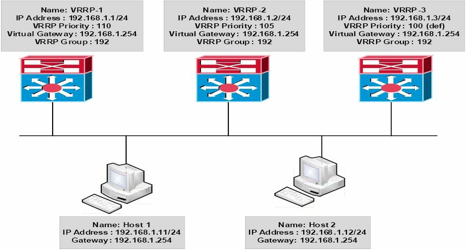
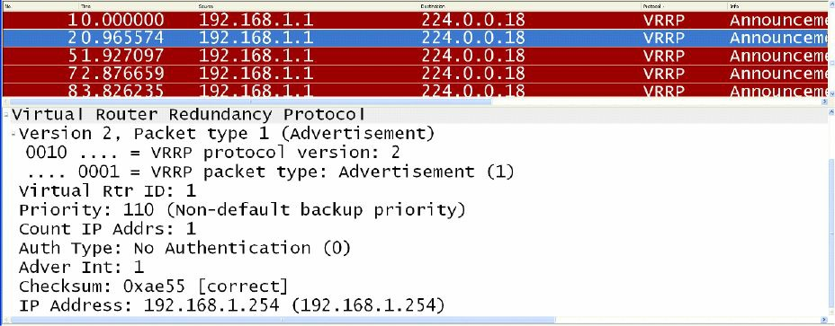

# 虚拟路由器冗余协议


虚拟路由器冗余协议（VRRP），是一种动态地将一个或多个虚拟网关的职责，指派到 LAN 上 VRRP 路由器，从而允许以太网等多路访问网段上的多个路由器，使用同一虚拟 IP 地址作为其默认网关的网关选举协议。

VRRP 以与 HSRP 类似的方式运行；但不同于 HSRP，VRRP 属于一项定义在 [RFC 2338](https://datatracker.ietf.org/doc/html/rfc2338) 中的开放标准，而这个 RFC 已被 [RFC 3768](https://datatracker.ietf.org/doc/html/rfc3768) 淘汰。VRRP 使用 IP 协议编号 112，发送通告到组播目的地址 `224.0.0.18` (VRRP)。在数据链路层，一些通告会从主虚拟路由器的 MAC 地址 `00-00-5e-00-01xx` 发送，其中 `"xx"` 标识两位的十六进制分组编号。这在下图 32.18 中得以演示。


<a name="f-32.18"></a>
**图 32.18** -- **VRRP 的组播地址**

**注意**：其中的协议编号为十六进制的值。十六进制值 `0x70` 相当于十进制的值 112。类似地，目的数据链路层地址 `01-00-5e-00-00-12` 中的 `12`，便是十进制值 18 的十六进制值（即 `224.0.0.18`）。当咱们无法确定出这些值是如何得出的时，那么十六进制到十进制的转换，在可在线获取的当前这本 CCNA 指南中，已详细介绍过。

**真实世界的部署**

与 HSRP 不同，VRRP 并无将 BIA，或某个静态配置的地址，用作 VRRP 分组 MAC 地址的选项。因此，在有着多个 VRRP 分组的生产网络中，重要的时要掌握，某个特定接口上多个 MAC 地址的影响，尤其是一些诸如端口安全等特性已被部署的情况下。切记要纵观全局；否则，咱们可能会发现，即使得以正确配置，某些特性及协议，也未在如他们应该的那样工作。

VRRP 网关被配置为与一台或多台连接到某个 LAN 的其他路由器一起，运行 VRRP 协议。在 VRRP 配置中，一个网关会被选为主虚拟路由器，其他网关扮演着在这个主虚拟路由器失效时的备份虚拟路由器。这一概念在下图 32.19 中得以演示。


**图 32.19** -- **虚拟路由器冗余协议的基本运行**


## VRRP 的多虚拟路由器支持

咱们可于某个接口上，配置最多 255 个虚拟路由器。某个路由器接口可支持的虚拟路由器具体数量，取决于以下因素：

- 路由器的处理能力
- 路由器的内存容量
- 路由器接口对多个 MAC 地址的支持


## VRRP 的主路由器选举


默认情况下，VRRP 使用优先级值，决定出哪个路由器将被选为主虚拟路由器。默认的 VRRP 优先级值为 100；但这个值可被手动调整某个 1 到 254 之间的值。当一些网关有着同一优先级值时，那么有着最高 IP 地址的网关，将被选为主虚拟路由器，而有着较低 IP 地址的，则会称为网关备份虚拟路由器。


当有两个以上路由器被配置为该 VRRP 组的组成部分时，那么在当前主虚拟路由器失效或不可用时，有着第二高优先级的备份虚拟路由器，就会被选为主虚拟路由器。当这些备份虚拟路由器有着同一优先级值时，那么有着最高 IP 地址的备份虚拟路由器，就会被选为主虚拟路由器。这一概念在下图 32.20 中得以演示。



**图 32.20** -- **VRRP 的主虚拟路由器与备份虚拟路由器选举**

图 32.20 演示了一个将 VRRP 用于网关冗余的网络。其中 `Host 1` 与 `Host 2` 均配置了的 `192.168.1.254` 的默认网关，这是定义在交换机 `VRRP-1`、`VRRP-2` 及 `VRRP-3` 三台交换机上 VRRP `group 192` 的虚拟 IP 地址。

`VRRP-1` 有着一个 110 的配置优先级值，`VRRP-2` 有着一个 105 的配置优先级值，`VRRP-3` 正使用默认 100 的 VRRP 优先级。根据这一配置，`VRRP-1` 会被选为主虚拟路由器，同时 `VRRP-2` 和 `VRRP-3` 便成为备份虚拟路由器。


在 `VRRP-1` 失效的情形下，`VRRP-2` 就会成为主虚拟路由器，因为他后着一个比 `VRRP-3` 更高的优先级值。但是，当两台交换机有着同一优先级值时，那么 `VRRP-3` 将被选为主虚拟路由器，因为他有着更高的 IP 地址。


## VRRP 的抢占

不同于 HSRP，默认情况下抢占对 VRRP 是启用的，无需由管理员显式配置，即可启用这一功能。但是，这项功能可通过使用 `no vrrp [number] preempt` 这条接口配置命令禁用。


## VRRP 的负载均衡

VRRP 允许以类似 HSRP 的方式的负载均衡。例如，在多个虚拟路由器已配置于某个网关的网络中，那么这一接口便可充当一个虚拟路由器的主接口，以及一个或多个虚拟路由器的备份接口。这在下图 32.21 中得以演示。


**图 32.21** -- **虚拟路由器冗余协议的负载均衡**

## VRRP 的版本

默认情况下，在 Cisco IOS 软件中于某个网关上配置 VRRP 时，VRRP 版本 2 会被启用。版本 2 是默认及当前的 VRRP 版本。要像 HSRP 下的情形那样更改版本是不可行的。并无 VRRP 版本 1 的标准。

**注意**：在编写这本指南的时候，定义针对 IPv4 和 IPv6 的 VRRP 的 VRRP 版本 3，仍处于草案形式，而尚未被标准化。



**图 32.22** -- **虚拟路由器冗余协议版本 2 的数据包**


## VRRP 的通告

主虚拟路由器会发送通告到同一组中的其他 VRRP 路由器。这些通告传达了主虚拟路由器的优先级及状态。VRRP 的通告封装于 IP 数据包中，并被发送到分配给 VRRP 分组的 IP 版本 4 组播地址，如 [图 32.18](#f-32.8) 中所示。默认情况下，这些通告会每秒发送；但这一时间间隔属于用户可配置的，而可加以更改。备份虚拟路由器也可选择学习这个主虚拟路由器上的通告间隔时间。


## 在网关上配置 VRRP

要在网关上配置 VRRP，需要以下步骤：

1. 通过使用 `ip address [address] [mask] [secondary]` 这条接口配置命令，配置网关接口的正确 IP 地址及子网掩码；
2. 在网关接口上创建一个 VRRP 分组，并经由 `vrrp [number] ip [virtual address][secondary]` 这条接口配置命令，指派给该分组指派虚拟 IP 地址。其中 `secondary]` 关键字会将这个虚拟 IP 地址，配置为这一指定分组的辅助网关地址；
3. 作为可选项，可通过使用 `vrrp [number] description[name]` 这条接口配置命令，为这个 VRRP 分组指定一个描述；
4. 作为可选项，当咱们打算控制主虚拟路由器及备份虚拟路由器的选举时，那么就要经由 `vrrp [number] priority [value]` 这条接口配置命令，配置该分组的优先级。

这一小节中的那些 VRRP 配置输出，将基于下图 32.23。


**图 32.23** -- **VRRP 配置示例的拓扑结构**

**注意**：这里假设了 `VTP-Server-1` 与 `VTP-Server-2` 之间的 VLAN 及中继配置已就位，同时两台交换机能成功通过 `VLAN 172` 互相 `ping` 通。出于简洁目的，这些配置输出，将在这些配置示例省略。

```console
VTP-Server-1(config)#interface vlan192
VTP-Server-1(config-if)#ip address 192.168.1.1 255.255.255.0
VTP-Server-1(config-if)#vrrp 1 ip 192.168.1.254
VTP-Server-1(config-if)#vrrp 1 priority 105
VTP-Server-1(config-if)#vrrp 1 description ‘SWITCH-VRRP-Example’
VTP-Server-1(config-if)#exit
```

```console
VTP-Server-2(config)#interface vlan192
VTP-Server-2(config-if)#ip address 192.168.1.2 255.255.255.0
VTP-Server-2(config-if)#vrrp 1 ip 192.168.1.254
VTP-Server-2(config-if)#vrrp 1 description ‘SWITCH-VRRP-Example’
VTP-Server-2(config-if)#exit
```


**注意**：针对这一 VRRP 配置，并无手动指派的优先级应用到 `VTP-Server-2`。默认情况下，VRRP 将使用 100 的优先级值，从而允许有着 105 优先级的 `VTP-Server-1` 赢得选举而当选为主虚拟路由器。除此以外，一个描述也已被可选地对这个分组配置。


这一配置已通过使用 `show vrrp [all|brief|interface]` 这条命令验证。其中 `[all]` 关键字显示了与这一 VRRP 配置有关的所有信息，其包括该分组的状态、描述（在已配置时）、本地网关的优先级，以及和主虚拟路由器等等。`[brief]` 关键字则会打印这一 VRRP 配置的一个摘要。`[interface]` 关键字会打印所指定接口的 VRRP 信息。以下是 `show vrrp all` 这一命令的输出：

```console
VTP-Server-1#show vrrp all
Vlan192 - Group 1
‘SWITCH-VRRP-Example’
    State is Master
    Virtual IP address is 192.168.1.254
    Virtual MAC address is 0000.5e00.0101
    Advertisement interval is 1.000 sec
    Preemption enabled
    Priority is 105
    Master Router is 192.168.1.1 (local), priority is 105
    Master Advertisement interval is 1.000 sec
    Master Down interval is 3.589 sec
VTP-Server-2#show vrrp all
Vlan192 - Group 1
‘SWITCH-VRRP-Example’
    State is Backup
    Virtual IP address is 192.168.1.254
    Virtual MAC address is 0000.5e00.0101
    Advertisement interval is 1.000 sec
    Preemption enabled
    Priority is 100
    Master Router is 192.168.1.1, priority is 105
    Master Advertisement interval is 1.000 sec
    Master Down interval is 3.609 sec (expires in 3.328 sec)
```

以下输出显示了由 `show vrrp brief` 这条命令打印的信息：

```console
VTP-Server-1#show vrrp brief
Interface          Grp Pri Time Own Pre State   Master addr     Group addr
Vl192              1   105 3589      Y  Master  192.168.1.1     192.168.1.254
VTP-Server-2#show vrrp brief
Interface          Grp Pri Time Own Pre State   Master addr     Group addr
Vl192              1   100 3609      Y  Backup  192.168.1.1     192.168.1.254
```

## 配置 VRRP 的接口跟踪

例如，为了配置 VRRP 为跟踪某个接口，那么某个跟踪对象，就必须在全局配置模式下，针对接口的跟踪，使用 `track [object number] interface] [line-protocol|ip routing]` 这条全局配置命令创建，或针对 IP 前缀的跟踪，使用 `track [object number] ip route [address/prefix] {reachability | metric threshold}` 命令创建。根据软件及平台，最多 500 个跟踪对象，可于交换机上被跟踪。这些跟踪对象，随后即会通过使用 `vrrp [number] track [object]` 这条接口配置命令，被 VRRP 跟踪。


**注意**： 咱们不需要执行任何高级对象跟踪的配置。

以下输出显示了如何配置 VRRP 的跟踪，其中引用了跟踪 `Loopback0` 接口线路协议的 `object 1`：


```console
VTP-Server-1(config)#track 1 interface Loopback0 line-protocol
VTP-Server-1(config-track)#exit
VTP-Server-1(config)#interface vlan192
VTP-Server-1(config-if)#vrrp 1 track 1
VTP-Server-1(config-if)#exit
```

以下输出显示了如何配置 VRRP 的跟踪，其中引用了跟踪 `1.1.1.1/32` 这个前缀可达性的 `object 2`。所谓某个被跟踪的 IP 路由对象，在该路由的路由表条目存在，且该路由并非不可访问（即有着 255 的路由度量值）时，会被视为在线且可达；而在该路由不可访问（即有着 255 的路由度量值）情形下，该路由会从路由信息库 (RIB) 中移除。


```console
VTP-Server-1(config)#track 2 ip route 1.1.1.1/32 reachability
VTP-Server-1(config-track)#exit
VTP-Server-1(config)#interface vlan192
VTP-Server-1(config-if)#vrrp 1 track 2
```


VRRP 的跟踪配置，是通过使用 `show vrrp interface [name]` 这条命令加以验证的。这在以下输出中得以演示：

```console
VTP-Server-1#show vrrp interface vlan192
Vlan192 - Group 1
‘SWITCH-VRRP-Example’
    State is Master
    Virtual IP address is 192.168.1.254
    Virtual MAC address is 0000.5e00.0101
    Advertisement interval is 0.100 sec
    Preemption enabled
    Priority is 105
        Track object 1 state Up decrement 10
        Track object 2 state Up decrement 10
    Authentication MD5, key-string
    Master Router is 192.168.1.1 (local), priority is 105
    Master Advertisement interval is 0.100 sec
    Master Down interval is 0.889 sec
```

要查看跟踪对象的那些参数，既要使用 `show track [number][brief][interface][ip][resolution][timers]` 这条命令。`show track` 这条命令的输出如下所示：


```console
VTP-Server-1#show track
Track 1
    Interface Loopback0 line-protocol
    Line protocol is Up
        1 change, last change 00:11:36
    Tracked by:
        VRRP Vlan192 1
Track 2
    IP route 1.1.1.1 255.255.255.255 reachability
    Reachability is Up (connected)
        1 change, last change 00:08:48
    First-hop interface is Loopback0
    Tracked by:
        VRRP Vlan192 1
```

> **注意：** 这些被追踪对象亦可与 HSRP 和 GLBP 配合使用。 GLBP 在下面的小节进行说明。

### VRRP的调试

命令`debug vrrp`提供给管理员用于查看有关 VRRP 运作情况实时信息的诸多选项。这些选项如下面的输出所示：

```console
VTP-Server-1#debug vrrp ?
    all Debug all VRRP information
    auth VRRP authentication reporting
    errors VRRP error reporting
    events Protocol and Interface events
    packets VRRP packet details
    state VRRP state reporting
    track Monitor tracking
    <cr>
```


**注意**：这些跟踪对象，也可与 HSRP 及 GLBP 一些结合使用。GLBP 会在接下来的小节中介绍。

## 虚拟路由器冗余协议的调试


`debug vrrp` 这条命令，提供了数个管理员可使于查看 VRRP 运行实时信息的选项。这些选项在以下输出中得以演示：

```console
VTP-Server-1#debug vrrp ?
  all      Debug all VRRP information
  auth     VRRP authentication reporting
  errors   VRRP error reporting
  events   Protocol and Interface events
  packets  VRRP packet details
  state    VRRP state reporting
  track    Monitor tracking
  <cr>
```

