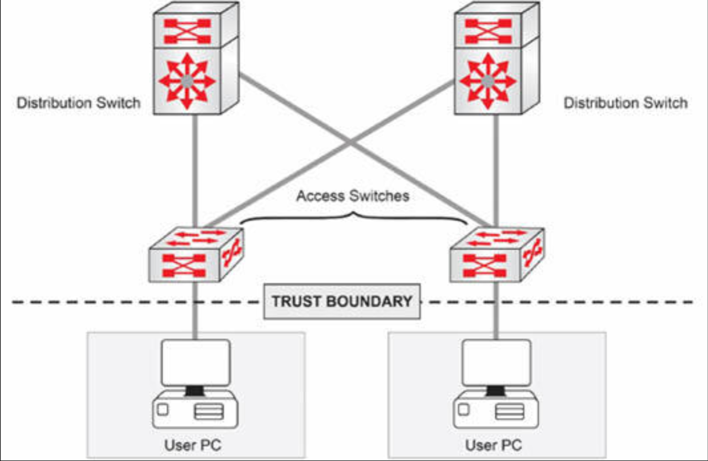
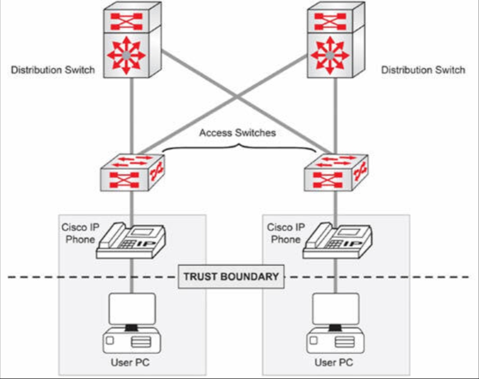
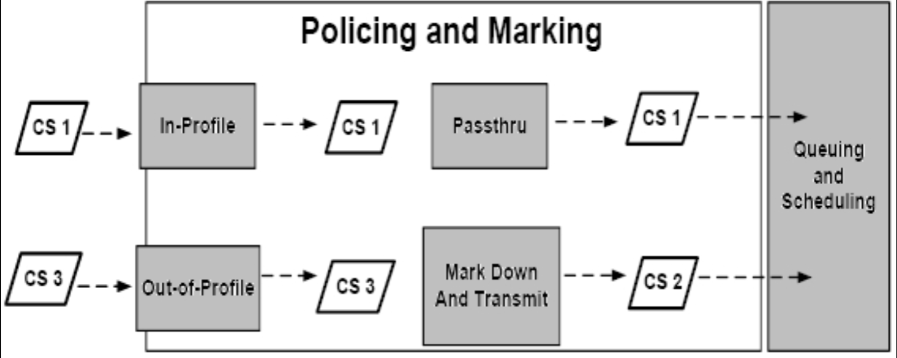
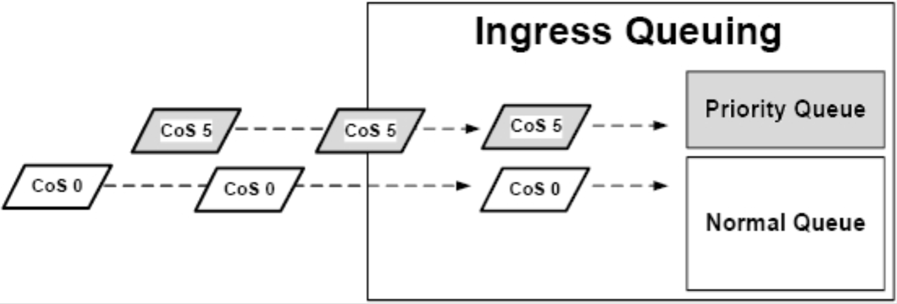
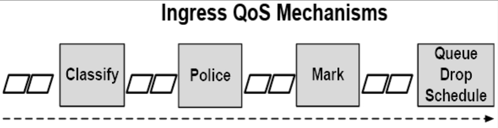

# Catalyst 的入站 QoS 机制

所谓入站 QoS 机制，会应用到交换机在接收方向所接收的那些数据帧及数据包。以下 Catalyst 交换机的入站 QoS 机制，将在接下来的小节中介绍：

- 流量的分类
- 流量监管
- 标记
- 拥塞管理及规避

**注意**：QoS 内容远超出我们在这一小节中所能容纳的内容，但出于 CCNA 考试目的，我们需要涵盖一些内容。


## 流量分类

分类用于区分一个流量流与另一流量流，从而不同服务级别，可应用与不同流量流。数据帧可根据入站的 CoS 或 DSCP 值分类，亦可根据访问控制列表（ACL）的配置分类。CoS 通过操作一些二进制位（数据帧头部中），对特定流量（于二层）分类。CoS 会标记流量，从而 QoS 便能依据咱们的策略，将这种分类用作操控流量的一种方式。这是识别流量的一种方式（与 ToS、ACL 等方式一起），从而 QoS 便清楚流量为何，以及要怎样控制他。


数据帧包含着用于区分不同流量类别的一些 CoS 位。三层头部中的分类，会在 ToS 字段中进行。三层 IP 头部中用到的 QoS 标签，分别是 IP 优先级与 DSCP。

当交换机接收到某个带有已存在 QoS 值的数据帧或数据包时，他必须决定是否要信任所接收到的 QoS 值。这是通过使用端口信任的设置决定的。正如本章前面所指出的，在 QoS 启用后，所有交换机接口均不受信任。不受信任的端口，不会信任由相连设备发送的任何 QoS 标记，进而交换机将把所有入站的以太网数据帧，重新标记为零的 CoS 值。

### 端口信任

我们已知默认情况下 QoS 是禁用的（在交换机上）。在其被启用后，所有端口在 QoS 标记方面，均属于不受信任的。默认情况下每个端口均被赋予等于零的 CoS。

```console
Switch#conf t
Enter configuration commands, one per line.  End with CTRL/Z.
Switch(config)#mls qos
Switch(config)#end
Switch#show mls qos int f0/1
FastEthernet0/1
trust state: not trusted
trust mode: not trusted
COS override: dis
default COS: 0
```

数据包会以可信或不可信的 QoS 标记到达，而信任关系则配置于具体的交换端口。正如咱们在下图 33.3 中会看到的，信任域会止步于主机所连接的端口。



**图 33.3** -— **信任域止步于主机端口**

但他将包含语音 VLAN，如下图 33.4 中所示。




**图 33.4** -— **有着思科 IP 话机的信任边界**

信任配置与考试无关，但在这一配置已应用后，那么该端口即受信任。

```console
Switch#show mls qos interface fastethernet0/1
FastEthernet0/1
trust state: trust cos
trust mode: trust cos
COS override: dis
default COS: 0
pass-through: none
trust device: cisco-phone
```

## 流量整形、监管与标记

流量整形器与流量监管器，通常会使用同一方式，识别流量违规。但他们对流量未归的回应方式有所不同。

所谓流量整形，通常会通过将超额流量置于缓冲区或队列，在数据速率已恢复正常时再行传输，延迟那些超额流量。通用的流量整形（GTS），与基于类别的流量整形（CTS），均使用加权的公平队列，延迟数据包。

所谓流量监管，是一个限制流量到某个预设速率的过程。流量监管用于将传入/传出流量速率，与某个配置的监管器比对。监管器会配置以一个速率及突发量。其中的速率定义在每一单位间隔时间内，发送的流量数量，在这一指定数量已发送后，那么在这个给定间隔时间，就不会在有更多流量发送。而所谓突发量，则定义了可预先缓存待发送的流量数量。超出突发量的流量可被丢弃，或其优先级设置可被降低。

符合流量监管配置的流量，被视为合规流量，而将如配置那样被交换机转发；但是，那些不符合流量监管配置的流量，则被视为超出规范的流量，他们可被丢弃，或降级标记（即以一个较低的 QoS 值标记）。

所谓流量标记，涉及设置二层或三层头部内那些 QoS 位，这一特性允许其他互联网络设备，根据所标记的值分类。流量标记通常会与流量监管结合使用。例如，当流量属于合规时，那么交换机就通常会允许这些数据包通过（即他将不修改或重置这些数据包中的 QoS 设置）。但若流量不合规时，那么交换机就可能被配置为，以一个较低的 QoS 值标记这一流量。这一概念在下图 33.5 中得以演示。




**图 33.5** —— **理解流量监管与流量标记**


上图 33.5 显示了两个到达流量监管器的数据包。这里假设了这两个数据包，已根据端口信任的状态配置得以分类。这些传入的数据包，随后就会与所配置的监管器速率比对。有着 CS 1 的 DSCP 值的那个数据包是合规的（即符合流量监管的速率配置）。根据这一流量监管配置，这个数据包会在不该变的 QoS 设置下，通过该交换机。

有着 CS 3 的 DSCP 值的那个数据包，是不合规的（即流量超出突发量配置）。这种流量可被丢弃或降级标记。在图 33.5 中，假设流量监管配置已被部署，进而这一流量就会被降级标记，并以降级后的 DSCP 值得以传输。这个值会被设置为 CS 2，同时这个数据包会得以传输。这个数据包随后会被发送到拥塞管理与避免机制，这种机制将根据 QoS 标签，确定数据包应放置的传入队列。

### 拥塞管理与避免

拥塞管理与避免，由三个要素构成：

- 排队
- 丢弃
- 调度

所谓排队，用于根据 QoS 标签，将数据包放入不同的软件队列。在流量被分类，并打上 QoS 标签后，其就会根据这些 QoS 标签，分配并置于不同队列中。

**注意**："Queuing" 还会在世界上一些地方被拼写为 queueing。其指的是一回事。

Catalyst 交换机通常有着两个传入队列，其中一个要么是个优先队列，要么可被配置为优先队列。交换机接收到的传入数据帧及数据包，就会根据传入（接收道德）CoS 值，被置于一个队列中。例如，接收到的带有 CoS 5 或 DSCP EF 语音流量，就将被置于优先队列中，而常规的数据流量，则将被置于普通队列中。这一队列概念，在下图 33.6 中得以演示。



**图 33.6** -— **Catalyst 交换机传入队列的运行**

一旦数据包已根据其 QoS 值被置于相应队列中后，随即丢弃机制即被用于管理队列。所谓丢弃机制，提供了不同类别流量的丢弃优先级。队列有着丢弃阈值，所谓丢弃阈值，被用于一旦该队列已排满超过某一阈值时，指明那些数据包可丢弃。

传入数据包在被置于队列后，某种拥塞避免机制就将使用某种 CoS 对阈值的映射关系，在阈值被触发时，确定出哪些数据帧合乎被丢弃。这种机制防止了队列排满。可使用的不同拥塞避免机制，超出了 CCNA 考试范围，而将不会于这一章中介绍。


所谓调度，指的是队列会如何被处理或清空。当优先队列被配置了时，那么其只有在普通队列前被处理（清空）时才有意义。换言之，优先队列中的数据包，应在普通队列中的数据包前发送。Catalyst 交换机针对传入调度，使用严格循环调度（SRR）。但深入 SRR 的细节，超出了 CCNA 考试要求范围。SRR 将不会在这一章中详述。下图 33.7 演示了这一小节中所述的处理传入 QoS 机制的顺序。





**图33.7** -— **传入的 QoS 机制**

参照上图 33.7，咱们可以看到，该数据包或数据帧，会被分类、监管与标记，并随后被发送到传入队列。

出口的 QoS 机制，会被应用到交换机在出口方向接收到的数据帧与数据包。

请参加 [Free CCNA Training Bonus – Cisco CCNA in 60 Days v4](https://www.in60days.com/free/ccnain60days/) 处今天的考试。

上面的 URL 处的免费练习册中，有个可选的 QoS 实验。

