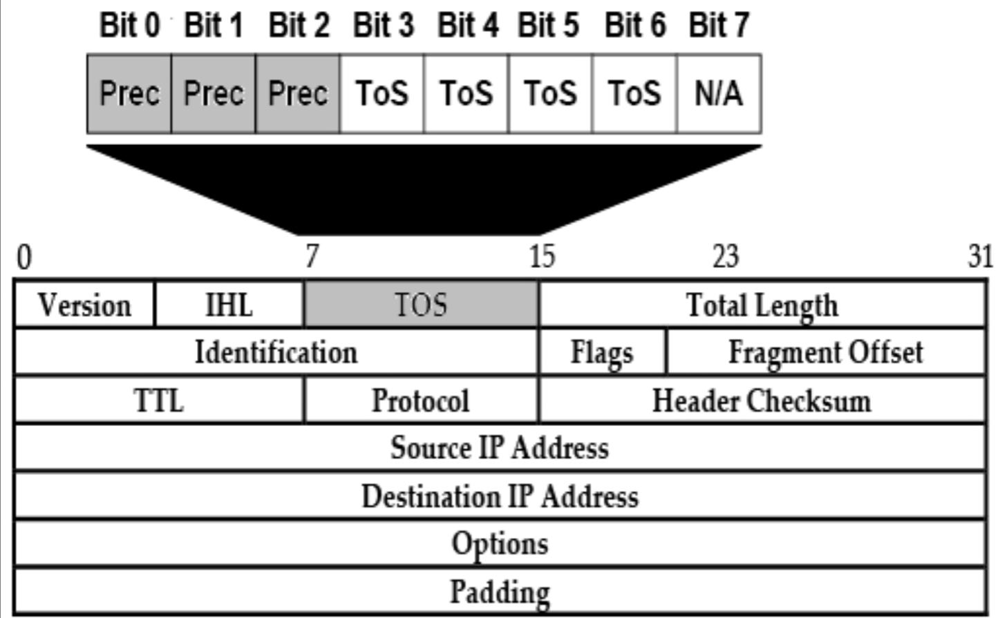
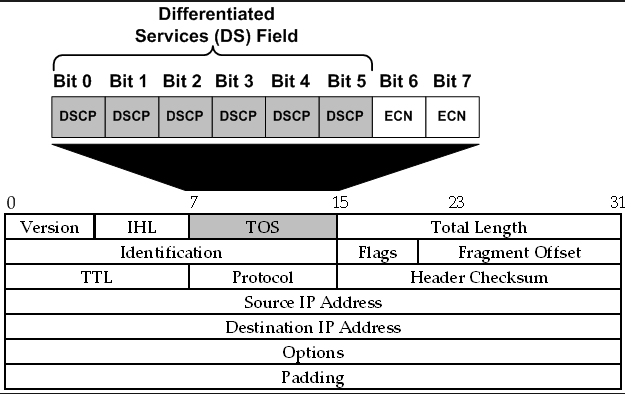

# QoS 的模型

QoS 提供了三种在设计与部署网络基础设施时，要考虑的宽泛投送模型：

- 尽力投送（默认）
- 综合业务
- 差异化服务

其中尽力投送模型，未提供业务保证。他扩展良好，但不会区分语音、视频或数据的流量。在这一实例模型下无 QoS 得以应用。这种投送类型，取决于接口的类型及二层连接的类型（如帧中继、PPP、以太网等）。语音、视频及数据流量，均被平等对待。

综合业务模型（`IntServ`），定义于 [RFC 1633](https://datatracker.ietf.org/doc/html/rfc1633) 中，属于一套对尽力而为模型的扩展。他会对每个流量流应用一项策略，并显式地管理网络资源，以实现端到端的 QoS。`IntServ` 依赖资源预留协议（RSVP），这一协议提供一种向路由器传达信息的设置机制，从而路由器可提供所请求的资源给那些流量流。由于逐个流量流处理所需的过高开销，这种方案完全不能良好扩展。

区分服务（`DiffServ`）模型，定义了服务等级的这个概念。每个设备都会单独处理数据包（基于每跳）。二层的 `DiffServ`，使用封装于 802.1Q 数据帧（`VLAN` 字段中）的一些服务等级(`CoS`) 位。

IPv4 的头部，实际上包含了各 8 位的服务类型 (ToS) 字段。数据包头部内，有个区分服务代码点（DSCP）字段。这一字段以区分服务（DS）字段，取代了原来的 IP 优先级字段 —— 关于这个区分服务（DS）字段，我们很快将介绍到。下图 33.1 演示了 IP 优先级字段。

**图 33.1** -— **服务类型的 IP 优先级位**

网络会运用这些设置，于传输期间定义对数据报的处理方式。这一操作通常通过使用 `IP Precedence` 值执行，其包含于 ToS 字段的前三个二进制位中。`IP Precedence` 位如上图 33.1 中所示。

上图 33.1 演示了 IPv4 数据包的头部，并突出显示了那个 8 位的 ToS 字段。这一字段的前三个位（第 0 至 2 位），用于 `IP Precedence`，其允许高达八个（2^3）的 IP 优先级值。接着的四个位（第 3 至 6 位），构成这个 ToS 字节内的 ToS 字段，他们分别用于吞吐量、延迟、可靠性及开销的标志位。不过这些位超出了 CCNA 考试要求范围。最后一位（第 7 位）未使用。

IP 优先级字段的值，用于表示某种特定服务类别（CoS）。本质上，IP 优先级值（数值）越高，那么该流量的重要性就越高。下表 33.1 列出并描述这些不同的 IP 优先级值：

**表 33.1** -— **服务类型的 IP 优先级值**

| IP 优先级值 | 二进制位 | 描述/名字 |
| --: | --: | :-- |
| 0 | `000` | 常规，routine |
| 1 | `001` | 优先，priority |
| 2 | `010` | 立即, immediate |
| 3 | `011` | 快速, flash |
| 4 | `100` | 快速覆盖, flash override |
| 5 | `101` | 关键, critical |
| 6 | `110` | 互联控制, internetwork control |
| 7 | `111` | 网络控制, network control |

**注意**：应支派给数据流量（比如语音数据包）的最高 IP 优先级值，应始终为 5。IP 优先级值 6 和 7 绝不应分配给用户流量，因这些值会被网络用于控制比如路由协议更新等的流量。

`DiffServ` 通过重新定义这个 ToS 字节，并以一个新的叫做 `DS` 字段的 6 位字段，创建出这个 IP 优先级字段的替代，而定义了个新的 DSCP 字段。此外，这个 ToS 字节的最后两位，现可用于执行流控制，被称为显式拥塞通知（ECN）位。这点下图 33.2 中得以演示。

**图 33.2** -— **服务类型的区分服务代码点位**

上图 33.2 演示了 IPv4 的数据包头部，并突出显示了那个 8 位的 ToS 字段。这一字段的前六位（第 0 至 5 位）用于 DSCP，其允许最多最多 64（2^6）个DSCP 值。 十进制的 DSCP 取值范围为 0 至 63。接下来两位为显式拥塞通知（ECN）位。显式拥塞通知超出 CCNA 考试要求范围，而将不在这一章中介绍。64 个 DSCP 值对 IP 优先级值向后兼容。这种兼容性基于 IP 优先级与 DSCP 共用的前三位（第 0 至 2 位）。下表 33.2 显示了映射到 IP 优先级值的那些十进制 DSCP 值：

**表 33.2** -— **将十进制的 DSCP 值映射到 IP 优先级值**

| IP 优先级值 | 十进制的 DSCP 值 |
| --: | --: |
| 0 | 0 |
| 1 | 8 |
| 2 | 16 |
| 3 | 24 |
| 4 | 32 |
| 5 | 40 |
| 6 | 48 |
| 7 | 56 |

**注意**：咱们无需深入这些值如何得出的细节。相反，咱们只需确保熟悉这些与 IP 优先级值相对应的十进制 DSCP 值。

