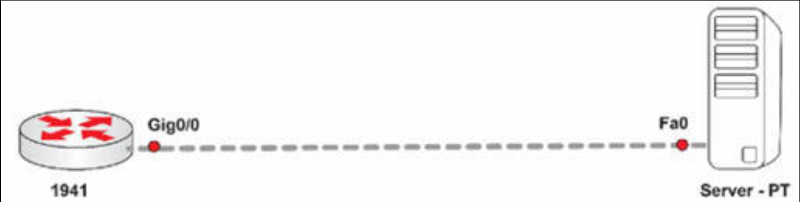
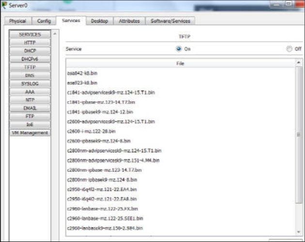
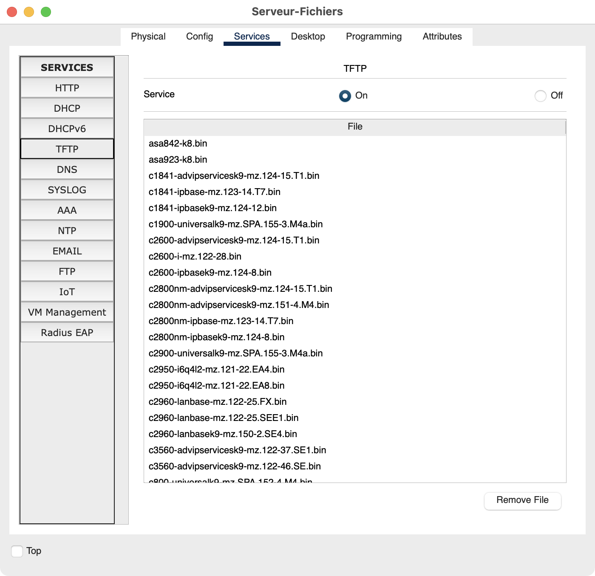

# 第 34 天实验

## 日志记录实验

在思科路由器上配置日志记录：

1. 选择日志记录设施 `local3`：`logging facility local3`（译注：这里原文写作了 `logging facility local2`）；
2. 执行全局的  `logging` 命令；
3. 选择日志记录严重性 `informational`；
4. 在 PC 上配置一个免费的 `syslog` 服务器，并将其连接到路由器；
5. 执行 `logging [address]` 这条命令，指定出该 `syslog` 服务器；
6. 指定 `logging source-interface` 这条命令；
7. 验证 `show logging` 这条命令；
8. 配置 `service timestamps log datetime localtime msec show-timezone` 这一命令；
9. 在 PC 上验证 `syslog` 消息。


## 拷贝 IOS 及启动配置实验

### 拓扑结构




### 实验目的

学习如何更新思科 IOS 版本及保存启动配置。Packet Tracer 通过允许咱们使用交叉网线连接路由器与服务器，并在服务器上启用 TFTP，提供了一种简单方案。Packet Tracer 的 TFTP 服务器仅支持数量有限的 10S 版本，因此要检查咱们的路由器型号是否与可用版本匹配。

### 实验步骤

1. 添加同一子网中的 IP 地址到路由器及为服务器接口；

    ```console
    Router(config)#int g0/0
    Router(config-if)#ip add 192.168.1.1 255.255.255.0
    Router(config-if)#no shut
    ```

    


    ```console
    Router#ping 192.168.1.2

    Type escape sequence to abort. Sending 5, 100-byte ICMP Echos to 192.168.1.2, timeout is 2 seconds:
    .!!!!
    Success rate is 80 percent (4/5), round-trip min/avg/max = 0/0/1 ms
    ```

2. 检查路由器上的 IOS 闪存文件；


```console
Router#dir flash:
Directory of flash0:/

    3  -rw-  33591768 <no date> c1900-universalk9-mz.SPA.151-4.M4.bin
    2  -rw-       28282          <no date>  sigdef-category.xml
    1  -rw-      227537          <no date>  sigdef-default.xml

255744000 bytes total (221896413 bytes free)
Router#
```

3. 检查服务器上是否 TFTP 服务器软件已启用（请注意，其上没有 1900 路由器的 IOS 镜像）；


    


4. 拷贝路由器中的 10S 文件到 TFTP 服务器；

    ```console
    Router#copy flash: tftp:
    Source filename []? c1900-universalk9-mz.SPA.151-4.M4.bin
    Address or name of remote host []? 192.168.1.2
    Destination filename [c1900-universalk9-mz.SPA.151-4.M4.bin]?
    Writing c1900-universalk9-mz.SPA.151-4.M4.bin...!!!!!!!!!!!!!!!!!!!!!!!!!!!!!!!!!!!!!!!!!!!!!!!!!!!!!!!!!!!!!!!!!!!!!!!!!!!!!!!!!!!!!!!!!!!!
    [OK - 33591768 bytes]

    33591768 bytes copied in 0.57 secs (6187713 bytes/sec)
    Router#
    ```


5. 请注意，这个 IOS 文件现已存在于 TFTP 服务器上。咱们可能需要退出页面并重新进入以刷新内容；


    


6. 现在拷贝启动配置文件到 TFTP 服务器。若该文件从未保存过，那么咱们可能需要先执行一次 `copy run start` 命令。咱们可修改这个文件的名字，从而其更易于记忆，只要咱们以原先的名字将其拷贝回来既可；

    ```console
    Router#copy startup-config tftp
    %% Non-volatile configuration memory invalid or not present
    Router#copy run start
    Destination filename [startup-config]?
    Building configuration... [OK]
    Router#copy startup-config tftp:
    Address or name of remote host []? 192.168.1.2
    Destination filename [Router-confg]? config16may

    Writing startup-config...!!
    [OK - 620 bytes]

    620 bytes copied in 0 secs
    Router#
    ```


7. 再次检查 TFTP 文件。


## SNMP实验

在思科路由器上配置 SNMP ：

- 使用`snmp-server host`命令配置 SNMP 服务器
- 使用`snmp-server community`命令，配置 SNMP 的只读（ RO ）与读写（ RW ）共有字符串（Configure SNMP RO and RW communities using the `snmp-server community` command）


## NetFlow实验

在思科路由器上配置 NetFlow ：

- 在某个路由器接口上开启 IP 数据流的入口与出口（Enable IP flow ingress and egress on a router interface）
- 在有流量通过路由器后，对`show ip cache flow`命令进行检查
- 使用`ip flow-export`命令对 NetFlow 的版本进行配置
- 使用`ip flow-export`命令配置一台外部 NetFlow 服务器

