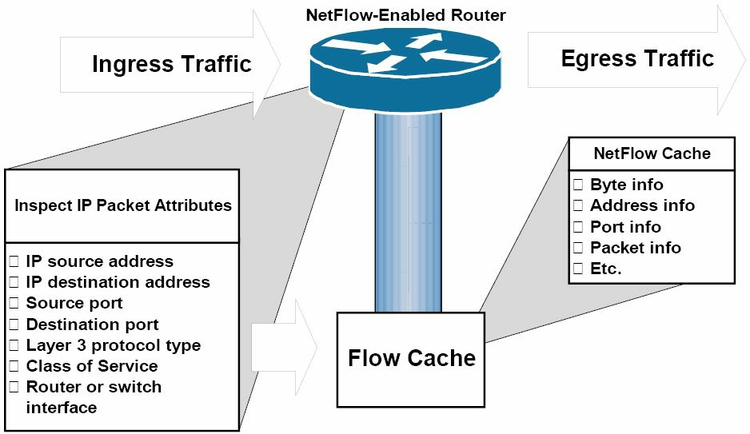

# IOS 许可

自从首款思科路由器的首个互联网络操作系统（10S）创建以来，思科始终遵循了每个路由器型号，均有着其专属版本及发布构建的同一做法。主要版本给与了12.0 的编号体系，这些版本的变更随后被编号为 12.1、12.2 等。在这些版本中，是一些修复 bug 及增加模组及其他特性支持的发布，比如 12.1(1a)。

不幸的时，随着支持的增加与 bug 的修复，这些发布被拆分为多个系列，因此每个型号都有了自己的 10S，这导致了不同版本及发布。当咱们想要某个安全或语音镜像时，那么咱们就必须购买有着咱们路由器正确版本、具备正确特性支持与 bug 修复的特定镜像。

思科最终发布了一些完整培训工具及演示文稿，以便咱们理解命名规范、版本级别及所支持的模组。随着软件得以测试及成熟，其也会被赋予不同名字，比如 早期部署版的 ED，一般部署的 GD 等！这一切都让客户感到非常困惑。以下是一张思科文档中解释 IOS 版本的图片：


*图 35.4 -- IOS软件的特别发布，IOS Special Releases(Image Copyright Cisco Systems Inc.)*

作者在思科技术支持中心（Technical Assistant Center, TAC）就解决了数不清的那些买了一台路由器及一套 IOS 软件，却发现到手的产品无法支持其对网络设施所要求的那些特性，而迷惑的或是愤怒的客户。还要记住对于大型、企业网络，必须要提前数月来安排 IOS 升级，把 IOS 升级放到一个很小的维护窗口。

## 一个新的型号

**A New Model**

思科公司现在已经改变了其 IOS 型号，且从 IOS 发布 12 跳到了 15 （Cisco have now changed their IOS model and jumped from IOS release 12 to 15）。当前，对于每个型号的路由器，有着一个通用镜像。此镜像有着你需要的所有特性，但为了获取到那些真正所需的高级特性的使用，就需要购买适当的许可证，并在具体设备上对许可证加以验证。这样做的目的是为了思科公司及其客户的便利，以及阻止对思科软件的窃取与未授权共享，可以想象，这些思科软件是花了可观成本去开发的。

购买自思科（零售商）的所有新型号路由器，都带有安装好的基础镜像，以及启用了的许可证。而如果客户想要开启高级安全或是语音特性，那么就需要开启这些特性。这通常是经由使用一个名为思科许可证管理器（Cisco License Manager, CLM）的免费思科应用完成的。在[Cisco.com](http://www.cisco.com/)网站可轻易搜寻到此应用：


*图 35.5 -- 思科许可证管理器的下载页面*

可在某台允许客户在他们的设备与思科公司的许可证门户之间进行操作的服务器或主机上，安装 CLM 。 CLM 专注于对当前许可证及各台设备的特性的跟踪，使用图形界面。


*图 35.6 -- 思科许可证管理器的图形界面（Image Copyright Cisco Systems Inc.）*

## 许可证的激活

**License Activation**

每种型号的思科路由器（支持许可证的），都已分配了一个叫做唯一设备标识符（the unique device identifier, UDI）的，唯一识别编号（a unique identifying number）。唯一设备标识符是由序列号及产品身份证组成的（this is compromised of the serial number(SN) and the product identification(PID)）。执行`show license udi`命令，来查看此信息。

```console
Router#show license ?
all        Show license all information
detail     Show license detail information
feature    Show license feature information
udi        Show license udi information
Router#show license udi
Device#   PID               SN              UDI
--------------------------------------------------------------------
*0        CISCO1941/K9      FTX15240000     CISCO1941/K9:FTX15240000
```

在[www.cisco.com/go/license](http://www.cisco.com/go/license)处将 IOS 于思科公司进行注册时，就需要输入 UDI 。还需要把由经销商在你为 IOS 付款后提供给你的许可证（产品授权密钥，Product Authorization Key, PAK）加入进去，此许可证将与 UDI 进行比对检查。在验证通过后，思科将发送给你一封许可证密钥的电子邮件。

在下面可以看到有哪些特性也被激活。特性`ipbasek9`将总是开启的。

```console
Router#show license all
License Store: Primary License Storage
StoreIndex: 0   Feature: ipbasek9                   Version: 1.0
        License Type: Permanent
        License State: Active, In Use
        License Count: Non-Counted
        License Priority: Medium
License Store: Evaluation License Storage
StoreIndex: 0   Feature: securityk9                Version: 1.0
        License Type: Evaluation
        License State: Inactive
            Evaluation total period: 208 weeks 2 days
            Evaluation period left: 208 weeks 2 days
        License Count: Non-Counted
        License Priority: None
StoreIndex: 1   Feature: datak9                     Version: 1.0
        License Type:
        License State: Inactive
            Evaluation total period: 208 weeks 2 days
            Evaluation period left: 208 weeks 2 days
        License Count: Non-Counted
        License Priority: None
```

命令`show license feature`将打印出已开启的特性摘要信息：

```console
Router#show license feature
Feature name        Enforcement  Evaluation  Subscription   Enabled
ipbasek9            no           no          no             yes
securityk9          yes          yes         no             no
datak9              yes          no          no             no
```

一旦许可证得到验证，就必须通过 U 盘或网络服务器，及在命令行执行`license install [url]`, 将该许可证密钥添加到路由器。需要注意“.lic”这个文件名。

```console
Router#dir usbflash0:

Directory of usbflash0:/

   1  -rw-        3064  Apr 18 2013 03:31:18 +00:00  FHH1216P07R_20090528163510702.lic

255537152 bytes total (184524800 bytes free)
Router#
Router#license install usbflash0:FHH1216P07R_20090528163510702.lic
Installing...Feature:datak9...Successful:Supported
1/1 licenses were successfully installed
0/1 licenses were existing licenses
0/1 licenses were failed to install
Router#
*Jun 25 11:18:20.234: %LICENSE-6-INSTALL: Feature datak9 1.0 was installed in this device. UDI=CISCO2951:FHH1216P07R; StoreIndex=0:Primary License Storage
*Jun 25 11:18:20.386: %IOS_LICENSE_IMAGE_APPLICATION-6-LICENSE_LEVEL: Module name = c2951 Next reboot level = datak9 and License = datak9
```

此时将必须重启该路由器，以激活新的特性集。


## 第 35 天问题

1. Which files would you usually find in DRAM?
2. Where is the compressed IOS held?
3. You want to boot the router and skip the startup configuration. Which command do you use to modify the configuration register?
4. Which command puts the running configuration into NVRAM?
5. Which command will copy your startup configuration onto a network server?
6. You want to boot your router from a network server holding the IOS. Which command will achieve this?
7. The universal image includes all the feature sets you require, but in order to gain access to the advanced features you need to buy the appropriate license and verify it on the actual device. True or false?
8. The ROM monitor has a very small code called bootstrap or boothelper in it to check for attached memory and interfaces. True or false?
9. Which command do you use to view the files stored on the flash memory on a Cisco router?
10. What is the purpose of the POST?


## 第 35 天答案

1. Uncompressed IOS, running configuration, and routing tables.
2. On the flash memory.
3. The `config-register [version]` command in Global Configuration mode.
4. The `copy run start` command.
5. The `copy start tftp:` command.
6. The `boot system [option]` command.
7. True.
8. True.
9. The `show flash/dir` command.
10. The POST tests the hardware in order to verify that all the components are present and healthy (interfaces, memory, CPU, ASICs, etc.).


## 第 35 天实验

对本课程模块中讲到的那些配置命令进行测试：

- 在某台思科设备上执行一下`show version`命令，并对输出进行检查；将这些输出项与课程中详细解释进行联系

- 将启动配置拷贝到一台 TFTP 服务器上

- 从某台 TFTP 服务器拷贝配置文件到路由器上

- 从某台 TFTP 服务器拷贝一个 IOS 镜像到路由器的闪存中

- 使用`show flash`命令，对闪存中的内容进行检查

- 以`boot system flash: [name]`命令，使用新的 IOS 文件启动设备

访问[www.in60days.com](http://www.in60days.com/)网站，免费观看作者完成此实验。


（End）


下图34.4展示了路由器内部的主要内存组件。每种内存类型承担不同功能，并存储不同文件。

*图 40.4 - 有关设备资源使用情况的示例 SNMP 报告*

## 思科 IOS 的 NetFlow （Cisco IOS NetFlow）

与 SNMP 一样，思科 IOS 的 NetFlow 是一个强大的维护与监控工具，可用于对网络性能进行基准测量及辅助故障排除。但其与 SNMP 之间有着一些显著的区别。第一个不同就是 SNMP 主要报告的是有关设备统计数据（比如资源使用情况等），而思科 IOS 的 NetFlow 则是就流量统计数据进行报告（比如数据包与字节）。

这两个工具之间的第二个不同，就是 SNMP 是一种基于轮询的协议（a poll-based protocol），意味着受管理设备被轮询信息。在那些 SNMP 设备发送陷阱（甚至报告，even report）到管理站的实例中，也可认为它是基于推送的（push-based）。而思科 IOS 的 NetFlow ，则是基于推送的技术，意味着配置了 NetFlow 的设备，是将其收集的信息发送出来，到某个中心存储库的。由于这个原因， NetFlow 与 SNMP 互为补充，可作为标准网络维护与监控工具套件（the standard network maintenance and monitoring toolkit）的组成部分。但它们并非各自的替代；这是一个常被误解的概念，重要的是记住这一点。

IP（数据）流基于五个，上至七个的一套 IP 数据包属性，它们可能包含下面这些：

- 目的 IP 地址
- 源 IP 地址
- 源端口
- 目的端口
- `Layer 3`的协议类型
- 服务类（Class of Service）
- 路由器或交换机的接口

除了这些 IP 属性外，（数据）流还包含了其它一些额外信息。这些额外信息包括对于计算每秒数据包与字节数有用的时间戳。时间戳还提供了有关某个数据流生命周期（持续时间）的信息。数据流还包括下一跳 IP 地址的信息，其包含了边界网关协议的路由器自治系统信息。除了 TCP 流量的标志外，数据流源与目的地址的子网掩码信息也有包含，而 TCP 流量的诸多标志，则可用于对 TCP 握手进行检查。

> **译者注**：总的来说，思科 IOS 的 NetFlow 中的数据流，包含了数据包属性（七种）、时间戳、包含 BGP 路由自治系统的下一跳 IP 地址信息、 TCP 流量的诸多标志，以及源与目的地址的子网掩码信息。

简要地讲，思科 IOS 的 NetFlow 特性，除了可用于提供有关网络用户与网络应用、峰值用量时间，与流量路由之外，还可用于有关的信息网络流量记账、基于用量的网络计费、网络规划、安全、拒绝服务攻击的监视能力，以及网络监控。所有的这些用途，令到其成为一个非常强大的维护、监控与故障排除工具。

思科 IOS 的 NetFlow 软件，对数据流数据进行收集，并将其存储在一个名为“ NetFlow 缓存”或简单地说就是“数据流缓存”的数据库中。数据流信息会留存到该数据流终止或停止、超时或缓存溢出为止。有两种方式来访问存储在数据流中的数据：使用命令行界面（也就是使用`show`命令），或导出该数据，并通过使用某种类型的报告工具对导出的数据进行查看。下图40.5演示了在思科 IOS 路由器上的 NetWork 操作，以及数据流缓存的生成方式：



*图 40.5 - 基本的 NetFlow 操作与数据流缓存的生成*

参考图40.5，在本地路由器上入口流量被接收到。该流量被路由器加以探测，且 IP 属性信息被用于创建一个数据流。随后该数据流信息被存储在流缓存中。该信息可使用命令行界面进行查看，或被导出到某个称为 NetFlow 收集器的外部目的地，随后在 NetFlow 收集器出，该同样的信息可使用某种应用报告工具（an application reporting tool）进行查看。要实现将 NetFlow 数据报告给 NetFlow 收集器，需要使用以下步骤：

1. 在设备上要配置思科 IOS 的 NetFlow 特性，以将数据流捕获到 NetFlow 缓存。

2. 要配置好 NetFlow 导出功能，以将数据流发送到收集器。

3. 就那些已经有一段时间不活动的、以被终止的，或者仍活动但超出了活动计时器的数据流，对 NetFlow 进行搜索（The NetFlow cache is searched for flows that have been inactive for a certain period of time, have been terminated, or, for active flows, that last greater than the active timer）。

4. 将这些已标识出的数据流导出至 NetFlow 收集器服务器（Those identified flows are exported to the NetFlow Collector server）。

5. 将接近 30 到 50 个数据流打包在一起，并通常经由 UPD 进行传送。

6. NetFlow收集器软件从数据创建出实时或历史性的报告。

在配置思科 IOS 的 NetFlow 特性时，需要三个主要步骤，如下所示：

1. 在那些希望对信息进行捕获并在流缓存中存储的所有接口上，使用接口配置命令`ip flow ingress`，把接口配置为将数据流捕获进入 NetFlow 缓存。重要的是记住 NetFlow 仅在每个接口的基础上配置的（Configure the interface to capture flows into the NetFlow cache using the `ip flow ingress` interface configuration command on all interfaces for which you want information to be captured and stored in the flow cache. It is important to remember that NetFlow is configured on a per-interface basis only）。


    > **Dario先生的提醒**：命令`ip route-cache flow`可在物理接口及其下的所有子接口上，开启（ NetFlow ）数据流（the `ip route-cache flow` command will enable flows on the physical interface and all subinterfaces associated with it）。
    > 而`ip flow ingress`命令则将开同一接口上的单个子接口、而非所有子接口上，开启（ NetFlow ）数据流。这在对观看某个接口的子接口`X`、`Y`及`Z`上的数据流不感兴趣，而真正想要观看同一接口上的子接口`A`、`B`与`C`子接口上的数据流时，此命令就很好用。
    > 此外，在 NetFlow 版本 5 下，唯一选项是使用`ip flow ingress`命令来监视上传统计数据（with NetFlow v5, the only option was to monitor inbound statistics using the `ip flow ingress` command）。不过随着 NetFlow 版本 9 的发布，现在就了使用`ip flow egress`命令，来对离开各个接口的流量进行监控的选择了。


    > **注意：** 从思科 IOS 版本`12.4(2)T`及`12.2(18)SXD`起，已将命令`ip flow ingress`替换为`ip route-cache flow`命令。而从思科 IOS 版本`12.2(25)S`起，命令`show running configuration` 的输出已被修改，因此命令`ip route-cache flow`命令，以及`ip flow ingress`命令，将在二者之一被配置后，出现在`show running-configuration`的输出中。

    随后 NetFlow 信息就存储在本地路由器上，同时可在本地设备上，使用`show ip cache flow`查看到。

    在打算将数据导出到 NetFlow 收集器的情况下，将需要两个额外任务，如下：

2. 使用全局配置命令`ip flow-export version [1 | 5 | 9]`，配置思科IOS NetFlow的版本或格式。 NetFlow 版本`1`（`v1`）是在首个 NetFlow 发布中所支持的最初格式。在用于分析导出的 NetFlow 数据的应用仅支持该版本时，才应使用此版本。相比版本`1`，版本`5`导出更多的字段，同时也是应用最广泛的版本。而版本`9`则是最新的思科IOS NetFlow版本，也是一个新的 IETF 标准的基础。版本`9`是一个灵活的导出格式版本。

3. 使用全局配置命令`ip flow-export destination [hostname | address] <port> [udp]`，配置并指定 NetFlow 收集器的 IP 地址，并于随后指定 NetFlow 收集器用于接收来自思科设备的 UDP 输出的 UDP 端口。其中的`[udp]`关键字是可选的，且在使用该命令是不需要指定，因为在将数据发送到 NetFlow 收集器时，用户数据报协议是默认使用的传输协议。

以下实例演示了如何为某个指定的路由器接口开启 NetFlow ：

```console
R1#config t
Enter configuration commands, one per line.
End with CNTL/Z.
R1(config)#interface Serial0/0
R1(config-if)#ip flow ingress
R1(config-if)#end
```

根据此配置，可使用`show ip cache flow`命令来查看在数据流缓存中所收集的统计数据，如下面的输出所示：

```console
R1#show ip cache flow
IP packet size distribution (721 total packets):
   1-32   64   96  128  160  192  224  256  288  320  352  384  416  448  480
   .000 .980 .016 .000 .000 .000 .000 .000 .000 .000 .000 .000 .000 .000 .000
   512   544  576 1024 1536 2048 2560 3072 3584 4096 4608
  .002  .000 .000 .000 .000 .000 .000 .000 .000 .000 .000

IP Flow Switching Cache, 278544 bytes
  4 active, 4092 inactive, 56 added
  1195 ager polls, 0 flow alloc failures
  Active flows timeout in 30 minutes
  Inactive flows timeout in 15 seconds

IP Sub Flow Cache, 21640 bytes
  4 active, 1020 inactive, 56 added, 56 added to flow
  0 alloc failures, 0 force free
  1 chunk, 1 chunk added
  last clearing of statistics never

Protocol         Total    Flows   Packets Bytes  Packets Active(Sec)  Idle(Sec)
--------         Flows     /Sec     /Flow  /Pkt     /Sec     /Flow      /Flow
TCP-Telnet           2      0.0        34    40      0.0      10.5       15.7
TCP-WWW              2      0.0         9    93      0.0       0.1        1.5
UDP-NTP              1      0.0         1    76      0.0       0.0       15.4
UDP-other           42      0.0         5    59      0.0       0.0       15.7
ICMP                 5      0.0        10    64      0.0       0.0       15.1
Total:              52      0.0         7    58      0.0       0.4       15.1

SrcIf      SrcIPaddress   DstIf   DstIPaddress   Pr SrcP DstP  Pkts
Se0/0      150.1.1.254    Local   10.0.0.1       01 0000 0800   339
Se0/0      10.0.0.2       Local   1.1.1.1        06 C0B3 0017     7
Se0/0      10.0.0.2       Local   10.0.0.1       11 07AF D0F1     1
Se0/0      10.0.0.2       Local   10.0.0.1       11 8000 D0F1    10
Se0/0      150.1.1.254    Local   10.0.0.1       01 0000 0800   271
Se0/0      10.0.0.2       Local   1.1.1.1        06 C0B3 0017    59
```

下面的示例演示了如何配置并开启指定路由器接口的 NetFlow 数据收集，并于随后使用 NetFlow 版本`5`的数据格式，将数据导出到某台有着 IP 地址`150.1.1.254`的 NetFlow 收集器：

```console
R1(config)#interface Serial0/0
R1(config-if)#ip flow ingress
R1(config-if)#exit
R1(config)#interface FastEthernet0/0
R1(config-if)#ip flow ingress
R1(config-if)#exit
R1(config)#interface Serial0/1
R1(config-if)#exit
R1(config)#ip flow-export version 5
R1(config)#ip flow-export destination 150.1.1.254 5000
R1(config)#exit
```

根据此配置，就可在那台NetFlow Collector上，使用某种应用报告工具，查看到收集的信息。而尽管有数据的导出，仍然可以在本地设备上，使用`show ip cache flow`命令来查看统计数据，在对网络故障进行排除或报告问题时，此命令可作为一个有用的工具。

### 使用 NetFlow 的数据进行故障排除（Troubleshooting Utilising NetFlow Data）

典型的企业网络，有着成千上万的、仅在很短时间内就生成海量 NetFlow 数据的连接。 NetFlow 数据可转换为帮助管理员弄清楚网络中正在发生什么的，有用图形与表格。 NetFlow 数据可辅助于以下方面：

- 提升整体网络性能
- 对一些诸如网络电话（ VoIP ）的应用提供支持
- 更好地对峰值流量进行管理（Better manage traffic spikes）
- 加强网络规定的执行（Enforce network policies）
- 揭示出那些指向恶意行为的流量模式（Expose trffic patterns that point to malicious activities）

NetFlow信息还可帮助管理员掌握到任何时候，各种数据类型所消耗的网络资源百分比。一眼就可以发现由电邮、计费与 ERP 系统及其它应用等使用了多少带宽，以及工作日期间有多少用户在观看 YouTube 视频，或在打互联网电话。

NetFlow数据可以易于理解的形式进行呈现，这就使得管理员能够轻易地对更多细节信息进行研究。他们可以就用户、应用、部门、对话、接口与协议等所产生的流量进行检查。使用 NetFlow 数据可以解决的一些情况示例，包括：

- 网络容量问题（Capacity issues）： NetFlow 可清楚地显示什么应用使用了最多的带宽，及它们在何时使用了最多的带宽。此信息有助于改变应用流量模式，从而提升网络性能。通用的做法对用户进行应用。
- 安全问题（Security issues）： NetFlow 数据可对网络上的未授权流量模式进行探测，并可在对网络造成任何危害之前阻止威胁。
- 网络语言故障（比如低质量，VoIP problems(poor quality, for example)）：在使用 NetFlow 分析识别出原因后，这方面的问题可被矫正。 NetFlow 报告可给出对网络语音通话造成影响的带宽不足（insufficient bandwidth）、延迟或网络抖动等因素。

## 第 40 天问题

1. What underlying protocol does syslog use?
2. The syslog client sends syslog messages to the syslog sever using UDP as the Transport Layer protocol, specifying a destination port of `_______`.
3. The priority of a syslog message represents both the facility and the severity of the message. This number is an `________` -bit number.
4. Name the eight Cisco IOS syslog priority levels.
5. In Cisco IOS software, the `_______` `_______` `_______` global configuration command can be used to specify the syslog facility.
6. Which command do you use to globally enable logging on a router?
7. Name the command used to specify the syslog server destination.
8. Name the command used to set the clock on a Cisco IOS router.
9. On which ports does SNMP operate?
10. Name the command you can use to change the NetFlow version.

## 第 40 天答案

1. UDP.
2. `514`.
3. `8`.
4. Emergencies, alerts, critical, errors, warnings, notifications, informational, and debugging.
5. The `logging facility [facility]` command.
6. The `logging on` command.
7. The `logging [address]` or `logging host [address]` command.
8. The `clock set` command.
9. UDP `161` and `162`.
10. The `ip flow-export version x` global configuration command.

## 第 40 天实验

### 日志记录实验

在思科路由器上配置日志记录：

- 选择日志记录设施`local3`：`logging facility local2`
- 执行全局的`logging on`命令
- 选择日志记录的严重程度`informational`
- 在一台 PC 机上配置一个自由的`syslog`服务器并将其连接到路由器
- 执行`logging [address]`命令来指定该`syslog`服务器
- 指定`logging source-interface`命令
- 验证命令`show logging`
- 配置`service timestamp log datetime localtime msec show-timezone`命令
- 在 PC 机上检查`syslog`消息

### SNMP实验

在思科路由器上配置 SNMP ：

- 使用`snmp-server host`命令配置 SNMP 服务器
- 使用`snmp-server community`命令，配置 SNMP 的只读（ RO ）与读写（ RW ）共有字符串（Configure SNMP RO and RW communities using the `snmp-server community` command）


### NetFlow实验

在思科路由器上配置 NetFlow ：

- 在某个路由器接口上开启 IP 数据流的入口与出口（Enable IP flow ingress and egress on a router interface）
- 在有流量通过路由器后，对`show ip cache flow`命令进行检查
- 使用`ip flow-export`命令对 NetFlow 的版本进行配置
- 使用`ip flow-export`命令配置一台外部 NetFlow 服务器

请访问[www.in60days.com](http://www.in60days.com)网站，免费观看作者完成此实验。


（End）


