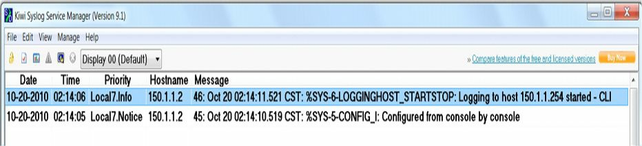

# Syslog 日志记录

所谓某个 `syslog` 守护进程或服务器，属于一种监听发送到他的 `syslog` 报文的实体。咱们无法配置 `syslog` 守护进程为请求某一特定设备，发送给他 `syslog` 报文。换言之，当某一特定设备不具备生成 `syslog` 报文能力时，那么 `syslog` 进程也无法对其执行任何操作。在现实世界中，企业通常会将 SolarWinds（或类似）软件，用于 `syslog` 的捕获。此外，诸如 [Kiwi Syslog 守护进程](https://www.solarwinds.com/free-tools/kiwi-free-syslog-server) 等免费软件，也可用于 `syslong` 捕获。

Syslog 使用用户数据报协议（UDP），作为底层传输机制，因此这些数据包是无序的且不予确认。虽然 UDP 没有包含于 TCP 中的开销，但这意味着在某个重度使用网络中，一些数据包可能会被丢弃，而因此一些日志信息将丢失。不过 Cisco 10S 软件允许管理员出于冗余目的，配置多个 Syslog 服务器。`syslog` 解决方案由两种主要元素构成：`syslog` 服务器与 `syslog` 客户端。

`syslog` 客户端会通过使用 UDP 作为传输层协议，并指定 514 的目的端口，发送 `syslog` 报文到 `syslog` 服务器。这些报文不得超过 1024 字节大小；但无最小长度限制。所有 `syslog` 报文都包含三个独立部分：优先级、头部与报文本身。

所谓 `syslog` 报文的优先级，同时标识了这一报文的设施和严重程度。这是个 8 位的数字。其中前 3 个最低有效位，表示这一报文的严重程度（在 3 个二进制位下，咱们可表示 8 种不同严重程度），而其余 5 位表示设施。咱们可运用这些值，在 `syslog` 守护进程中对事件应用过滤器。

> *译注*：其中 `syslog` 报文优先级字段种的 5 位设施，facility，主要用于标识该报文来源于那个设备/进程。
>
> 参考：
>
> - [信息中心loghost配置中facility是什么意思](https://support.huawei.com/enterprise/zh/doc/EDOC1000160160/29e41555)
>
> - [What are the Syslog Facilities and Levels?](https://www.opswat.com/docs/mdmft/knowledge-base/what-are-the-syslog-facilities-and-levels-)


**注意**：要记住，这些值由事件得以生成的应用生成，而非由 `syslog` 服务器本身生成。


由思科 IOS 设备设定的那些值，列出并描述于下表 34.2 种（请务必熟记这些级别，与这些级别的名字）。

**表 34.2** —— **思科 IOS 软件的系统日志优先级别与定义**

| 级别 | 级别名字 | `syslog` 的定义 | 描述 |
| --: | :-- | :-- | :-- |
| 0 | 紧急 | `LOG_EMERG` | 这一级别用于那些会导致系统无法使用的最严重错误情形。 |
| 1 | 告警 | `LOG_ALERT` | 这一级别用于指示那些需要管理员立即关注的情形。 |
| 2 | 严重 | `LOG_CRIT` | 这一级别用于指示那些相较于告警不那么严重，但仍需管理员干预的关键情形。
| 3 | 错误 | `LOG_ERR` | 这一级别用于指示一些不会导致系统无法使用的系统内的报错。
| 4 | 警告 | `LOG_WARNING` | 这一级别用于指示有关一些未成功完成系统操作的告警情形。 |
| 5 | 通知 | `LOG_NOTICE` | 这一级别用于指示系统内的状态变更（如某种路由协议的邻接关系过渡到 `down` 状态）。 |
此级别用于表示系统中的状态改变（比如路由协议临接关系过渡到`down`状态）。 |
| 6 | 信息 | `LOG_INFO` | 这一级别用于指示有关系统正常运行的信息性消息。 |
| 7 | 调试 | `LOG_DEBUG` | 这一级别用于指示一些通常用于故障排除目的的实时（调试）信息。 |


在 `syslog` 中，所谓设施，用于表示生成消息的来源。这个来源可以是本地设备上的某个进程、应用，甚至是操作系统。设施通过数字（整数）表示。 在思科 IOS 软件中，有八项可被进程与应用（以及设备本身）用于发送 `syslog` 消息的本地用途设施。默认情况下，思科 IOS 设备会使用 `local7` 这一设施，发送 `syslog` 消息。但应注意到，多数思科设备提供修改默认设施级别的选项。在思科 IOS 软件中，`logging facility [facility]` 这条全局配置命令，可用于指定 `syslog` 的设施。

这一命令下可用选项如下：

```console
R1(config)#logging facility ?
  auth    Authorization system
  cron    Cron/at facility
  daemon  System daemons
  kern    Kernel
  local0  Local use
  local1  Local use
  local2  Local use
  local3  Local use
  local4  Local use
  local5  Local use
  local6  Local use
  local7  Local use
  lpr     Line printer system
  mail    Mail system
  news    USENET news
  sys10   System use
  sys11   System use
  sys12   System use
  sys13   System use
  sys14   System use
  sys9    System use
  syslog  Syslog itself
  user    User process
  uucp    Unix-to-Unix copy system
```


要经由 `syslog` 发送消息，咱们必须在设备上执行以下步骤序列：

1. 通过使用 `logging on` 这条配置命令，全局启用在路由器或交换机上的日志记录。默认情况下，在 Cisco IOS 软件中，日志记录是启用的；但其仅被启用为发送消息到控制台。在发送消息到除控制台外的任何目的地时，`logging on` 这条均是强制性要求；
2. 通过使用 `logging trap [severity]` 这条全局配置命令，指定要发送到 `syslog` 服务器消息的严重性。咱们以数字方式，或使用等效的严重性名字指定严重性；
3. 通过使用 `logging [address]` 或 `logging host [address]` 这两条全局配置命令，指定处一个或多个 `syslog` 服务器目的地；
4. 作为可选项，通过使用 `logging source-interface [name]` 这条命令，指定用于 `syslog` 消息中的源 IP 地址。在配置多个接口的设备上，这一步属于一种常见做法。当这一命令为未指定时，那么 `syslog` 消息将包含用于到达服务器的路由器或交换机接口的 IP 地址。当出于冗余目的而有多个接口时，那么这个地址会在主路径（接口）宕掉时变化。因此其通常会被设置为某个环回接口。


以下配置示例演示了如何发送全部信息级（6 级）及以下消息，到某个有着 IP 地址 `192.168.1.254` 的 `syslog` 服务器：

```console
R2(config)#logging on
R2(config)#logging trap informational
R2(config)#logging 192.168.1.254
```

这一配置可通过使用 `show logging` 命令加以验证，如下所示：


```console
R2#show logging
Syslog logging: enabled (11 messages dropped, 1 messages rate-limited, 0 flushes, 0 overruns, xml disabled, filtering disabled)
    Console logging: disabled
    Monitor logging: level debugging, 0 messages logged, xml disabled,filtering disabled
    Buffer logging: disabled, xml disabled, filtering disabled
    Logging Exception size (4096 bytes)
    Count and timestamp logging messages: disabled
No active filter modules.

    Trap logging: level informational, 33 message lines logged
        Logging to 192.168.1.254(global) (udp port 514, audit disabled, link up), 2 message lines logged, xml disabled, filtering disabled
```

一般在配置日志记录时，重要的是要确保路由器或交换机的时钟，要反映当前实际时间，这允许咱们关联故障数据。日志消息上的不准确或不正确时间戳，会使运用过滤及关联流程的故障与问题隔离极其困难且耗时。在思科 IOS 设备中，系统时钟可手动配置，或者设备可被配置为将其时钟，与某个网络时间协议（NTP）服务器同步。这两种时钟选项，将在接下来的小节中讨论。

当咱们在咱们的网络中，仅有少量互联设备，那么手动的时钟或时间配置就很好。在 Cisco IOS 软件中，系统时间是通过使用 `clock set hh:mm:ss [day & month | month & day] [year]` 这条特权 `EXEC` 命令配置的。其不是在全局配置模式下配置或指定的。以下配置示例，演示了如何设置系统时钟为 10 月 20 日凌晨 12:15。

```console
R2#clock set 12:15:00 20 october 2010
```

或者，同一配置可在路由器上按以下方式得以部署：

```console
R2#clock set 12:15:00 october 20 2010
```

这一配置之后，`show clock` 命令便可用于查看系统时间。

```console
R2#show clock
12:15:19.419 utc wed oct 20 2010
```

需要注意的一个有趣现象，便是当系统时间为手动配置，或使用 `clock set` 这条命令设置的时，那么其会默认为 GMT（UTC）时区，正如上面可看到的。为了确保系统时钟反映正确时区，那么针对那些位处非 GMT 时区的用户，咱们必须使用 `clock timezone [time zone name] [GMT offset]` 这条全局配置命令。例如美国有着六个不同时区，每个都有不同的 GMT 偏移量。这六个时区分别是：`Eastern Time`、`Central Time`、`Mountain Time`、`Pacific Time`、`Hawaii Time` 以及 `Alaska Time`。


此外，一些时区使用了标准时间及夏令时。有鉴于此，重要的是要记住，在手动配置系统时钟时，就要确保系统时间在所有设备上均要设置正确（标准时间或夏令时）。以下配置示例演示了如何将系统时钟设置为中部标准时间（CST）的 10 月 20 日凌晨 12:40，这个时区比 GMT 晚六小时。


```console
R2#config t
Enter configuration commands, one per line.
End with CNTL/Z.
R2(config)#clock timezone CST -6
R2(config)#end
R2#clock set 12:40:00 october 20 2010
```

这一配置之后，本地路由器的系统时钟现在显示如下：

```console
R2#show clock
12:40:17.921 CST Wed Oct 20 2010
```

**注意**：若咱们在 `clock timezone` 这条命令前使用 `clock set` 命令时，那么咱们通过使用 `clock set` 命令指定的时间，将被通过使用 `clock timezone` 命令偏移。例如，假设上面示例中用到的配置命令，在路由器上如下输入：

```console
R2#clock set 12:40:00 october 20 2010
R2#config t
Enter configuration commands, one per line. End with CNTL/Z.
R2(config)#clock timezone CST -6
R2(config)#end
```

由于 `clock set` 命令被首先使用，因此路由器上 `show clock` 命令的输出，就会显示系统时钟偏移 6 小时，正如使用 `clock timezone` 命令所指定的那样。这一行为在同一路由器上的以下输出中得以演示：


```console
R2#show clock
06:40:52.181 CST Wed Oct 20 2010
```

**注意**：思科的 IOS 路由器和交换机，均可通过使用 `clock summer-time zone recurring [week day month hh:mm week day month hh:mm [offset]]` 这条全局配置命令，配置为自动切换到夏令时（日间节约时间）。这一特性消除了标准时间与夏令时期间，在所有手动配置设备上，手动调整系统时钟的需要。

设置或同步系统时钟的第二种方式，便是使用某个网络时间协议（NTP）服务器作为参考时间源。这是那些相比仅有少量互联网络设备，有着更多设备的大型网络中的首选方式。早先我们曾介绍过 NTP。

系统时钟无论手动还是经由 NTP 设置后，重要的是，都要确保发送到服务器的日志记录，包含正确的时间戳。这点是通过使用 `service timestamps log [datetime | uptime]` 这条全局配置命令完成的。其中 `[datetime]` 关键字支持以下这些自解释性子关键字：

```console
R2(config)#service timestamps log datetime ?
  localtime      Use local time zone for timestamps
  msec           Include milliseconds in timestamp
  show-timezone  Add time zone information to timestamp
  year           Include year in timestamp
<cr>
```

`[uptime]` 关键字没有额外的子关键字，而会将本地路由器配置为仅包含系统运行时间，作为所发送消息的时间戳。以下配置示例演示了如何配置本地路由器为针对全部消息，包含本地时间、毫秒的信息及时区：


```console
R2#configure terminal
Enter configuration commands, one per line. End with CNTL/Z.
R2(config)#logging on
R2(config)#logging console informational
R2(config)#logging host 150.1.1.254
R2(config)#logging trap informational
R2(config)#service timestamps log datetime localtime msec show-timezone
```

这一配置之后，本地路由器的控制台将打印以下消息：

```console
Oct 20 02:14:10.519 CST: %SYS-5-CONFIG_I: Configured from console by console
Oct 20 02:14:11.521 CST: %SYS-6-LOGGINGHOST_STARTSTOP: Logging to host 150.1.1.254 started - CLI initiated
```

此外，服务器 `150.1.1.254` 上的 `syslog` 守护进程，也会反映相同情况，如下图 34.10 中的 Kiwi Syslog Manager 截图所示。



**图 34.10** -- **配置日志记录的时间戳**


请参加 [Free CCNA Training Bonus – Cisco CCNA in 60 Days v4](https://www.in60days.com/free/ccnain60days/) 处今天的考试。


