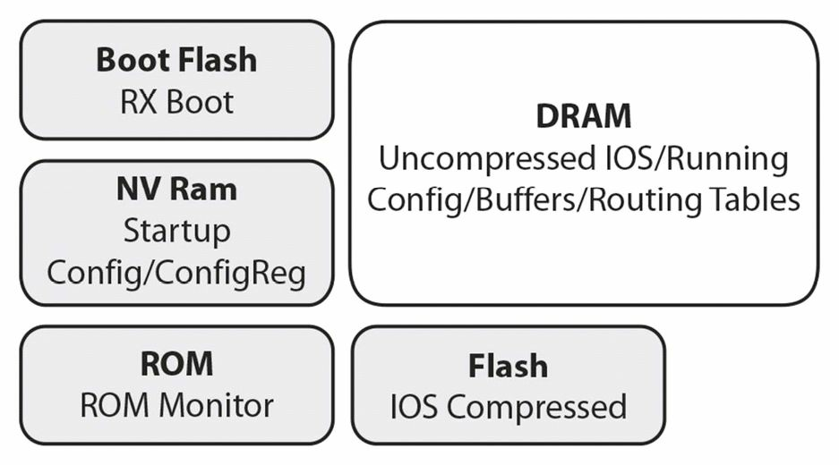
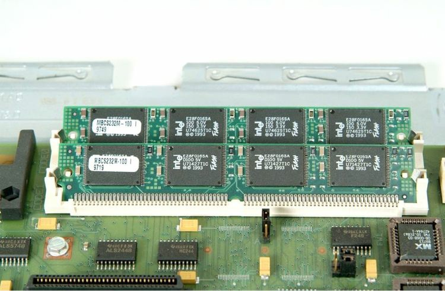

# 路由器的存储与文件

下图 34.4 演示了路由器内部的主要存储组件。每种存储类型，都扮演不同角色，并包含着不同文件。



**图 34.4** -- **路由器的存储组件**

在盖子取下后，咱们通常可以看到路由器内的一些存储槽位。咱们还经常可以看到插在一些外部路由器插槽中的闪存卡。不要在咱们办公室处的那些路由器上这样做，因为当咱们有着保修时，这可能导致保修失效。图 34.5 展示了我（作者）持有的一台旧款 2500 路由器上的那些 DRAM SIMM 内存条。

在将路由器盖子打开后，在其内部常能见到不同的存储器插槽。还能发现一些闪存卡插在路由器插槽中。



**图34.5** -— **某一路由器主板上的一些 DRAM SIMM**

> **译注**：DRAM SIMM，单列直插内存模组，Dynamic Random Access Mememory Single In-line Mememory Module


以下是每种存储及文件类型的功能：

- 启动 ROM —— 用于启动对话/`Rommon` 的 EEPROM，并加载 IOS。当路由器启动时，若没有 IOS 存在，那么他将引导进入名为 `Rommon` 的紧急模式，这种模式一些有限命令得以输入，以恢复该路由器并加载另一 IOS。这称为引导（`bootstrap`）模式，咱们可以下两种路由器提示符之一识别这一模式：

    ```console
    >
    ```

    ```console
    Rommon>
    ```

- NVRAM —— 存储路由器的启动配置及配置寄存器。所谓启动配置，是用于存储已保存路由器配置的那个文件。在路由器重新加载时，其不会被清除；

    > *译注*：Non-Volatile Random Access Mememory, NVRAM

- 闪存卡/PCMCIA —— 包含 IOS 系统及一些配置文件。闪存亦称为 EEPROM，Cisco IOS 便通常以压缩形式存储于此。事实上，当有空间时，咱们可在闪存有着多个版本的 Cisco IOS；

    > *译注*：Personal Computer Mememory Card International Association, PCMCIA

- DRAM —— 亦称RAM，他存储着完整的 IOS、运行配置及路由表。这属于工作内存，在路由器重启时会被清除；
- ROM 监视器 —— 系统的诊断与启动程序。ROM 监视器中有着名为引导程序或启动辅助程序，用于检查所连接存储及接口的非常小的代码；
- RxBoot —— Mini-IOS，允许完整 10S 的上传。他也称为引导加载程序，可用于完成一些路由器维护操作；
- 路由器配置 —— 虽然严格来说不属于一种路由器组件，但他存储于 NVRAM 中并会在启动时被拉入 DRAM。咱们可以 `copy run start` 这条命令，将 DRAM 中的配置放入 NVRAM 中，并以 `copy start run` 这条命令，将 NVRAM 中的文件，放入 DRAM 中；
- 配置寄存器 —— 设置用于启动的一些指令。咱们掌握这种存储至关重要，因为咱们将需要操作实验中用到的路由器上的配置寄存器（如无配置下的干净启动），或执行一次密码恢复。一些型号有所不同，但最常见的两种设置如下：

    引导并忽略启动配置 —— `0x2142`

    正常启动 —— `0x2102`

    ```console
    Router(config)#config-register 0x2102
    ```

    咱们可以一条 `show version`命令，查看当前的配置寄存器设置。


    ```console
    Router#show version
    Cisco Internetwork Operating System Software
    IOS (tm) 2500 Software (C2500-JS-L), Version 12.1(17), RELEASE SOFTWARE (fc1)
    Copyright (c) 1986-2002 by Cisco Systems, Inc.
    Compiled Wed 04-Sep-02 03:08 by kellythw Image text-base: 0x03073F40, data-base: 0x00001000
    ROM: System Bootstrap, Version 11.0(10c)XB2, PLATFORM SPECIFIC RELEASE SOFTWARE (fc1)
    BOOTLDR: 3000 Bootstrap Software (IGS-BOOT-R), Version 11.0(10c)XB2, PLATFORM SPECIFIC RELEASE SOFTWARE (fc1)

    Router uptime is 12 minutes
    System returned to ROM by reload
    System image file is “flash:c2500-js-l.121-17.bin”

    Cisco 2500 (68030) processor (revision L) with 14336K/2048K bytes of memory.
    Processor board ID 01760497, with hardware revision 00000000 Bridging software.
    X.25 software, Version 3.0.0.
    SuperLAT software (copyright 1990 by Meridian Technology Corp).
    TN3270 Emulation software.
    2 Ethernet/IEEE 802.3 interface(s)
    2 Serial network interface(s)
    32K bytes of non-volatile configuration memory.
    16384K bytes of processor board System flash (Read ONLY)

    Configuration register is 0x2102
    ```

这条命令还显示了这个路由器已在线多久，以及上次重新加载的原因 —— 当咱们需要排查某个启动问题时，这非常实用。

    ```console
    Router uptime is 12 minutes
    System returned to ROM by reload
    ```

这同一条命令，还将显示该路由器上的不同存储类型。

```console
Router#show version
Cisco Internetwork Operating System Software
IOS (tm) 2500 Software (C2500-IS-L), Version 12.2(4)T1, RELEASE SOFTWARE Copyright (c) 1986-2001 by Cisco Systems, Inc.

ROM: System Bootstrap, Version 11.0(10c), SOFTWARE← ROM code
BOOTLDR: 3000 Bootstrap Software (IGS-BOOT-R), Version 11.0(10c)
System image file is “flash:c2500-is-l_122-4_T1.bin”← Flash image
Cisco 2522 (68030) processor CPU← CPU
with 14336K/2048K bytes of memory. ← DRAM
Processor board ID 18086064, with hardware revision 00000003
32K bytes of non-volatile configuration memory.← NVRAM
16384K bytes of processor System flash (Read ONLY) ← EEPROM/FLASH
```

以下是路由器启动过程的一种图形化表示：


**图34.6** -— **路由器的启动过程**


