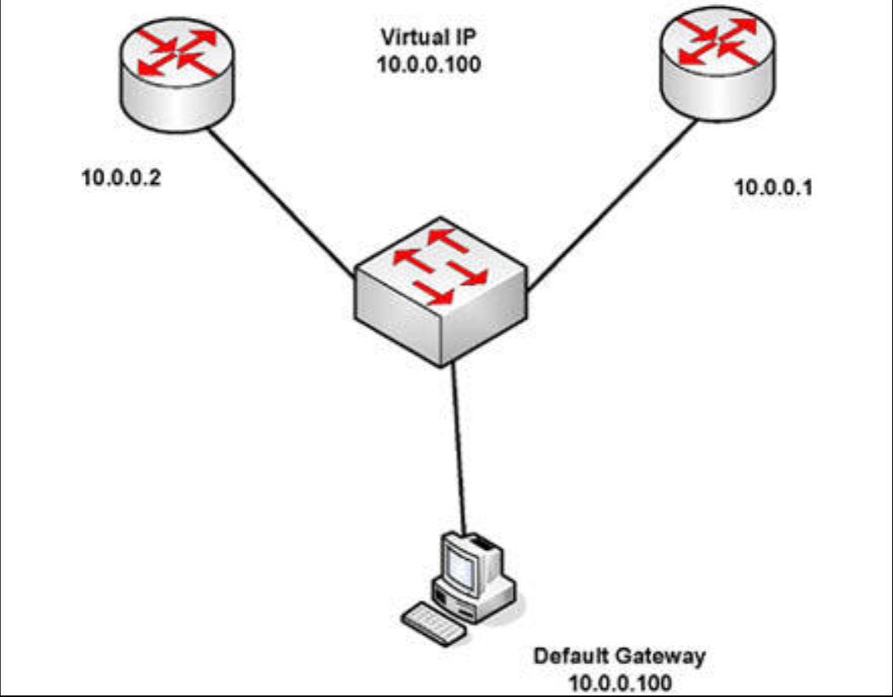

# 第 35 天 复习

## 第 35 天任务

- 复习前 3 天的理论及实验
- 参加挑战实验（若咱们愿意）
- 阅读 CCNA 补习指南
- 参加 [Free CCNA Training Bonus – Cisco CCNA in 60 Days v4](https://www.in60days.com/free/ccnain60days/) 处今天的考试；
- 配置上面网址处免费工作簿中的 VRRP 与 GLBP 实验
- 在 subnetting.org 上花 15 分钟

在过去的三天中，我们已讨论了一些困难主题。他们都是一些肯定会出现在考试中核心 TCP/IP 主题，同时也将构成咱们作为网络工程师，日常工作的一部分。

## 挑战 -- HSRP 实验

### 拓扑结构

### 实验说明

经由交换机连接两台路由器，并连接一台 PC 至该交换机（或使用 Packet Tracer）

1. 不要添加任何配置到交换机；
2. 在全部设备上配置 `10.0.0.0/8` 网络中的 IP 地址。在 PC 上设置一个 IP 地址；
3. 在交换机上配置 HSRP 分组，并赋予其中一台路由器更高的优先级；
4. 配置抢占特性，及一个 `10.0.0.100` 的虚拟 IP 地址；
5. 自 PC `ping` 这个虚拟 IP；
6. 现在关闭活动路由器的那个接口，检查另一路由器是否已成为主网关。
