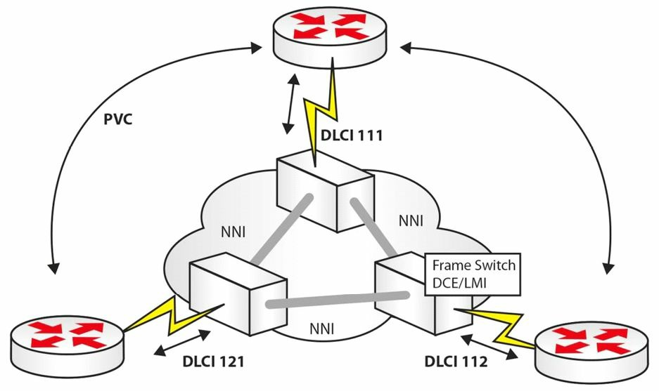
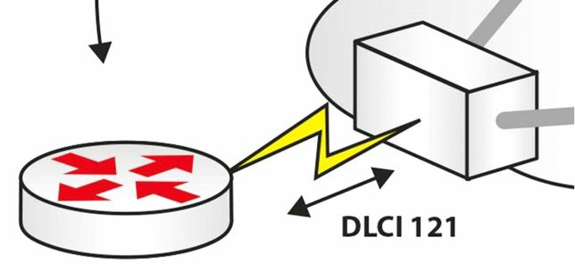

# FR 的运行

帧中继属于一种基于名为 X.25 的较旧协议的，二层 WAN 协议，X.25 协议因其强大的错误检查能力，而仍为 ATM 所使用。帧中继由一条其上可形成许多条逻辑电路的物理电路构成。FR 的连接是按需建立的。一个帧中继网络示例如下所示：



**图 37.7** -- **一个 FR 网络**


## 常用 FR 术语

### LMI

本地管理接口（Local Management Interface, LMI），是个运行在 FR 交换机上的保活接口。这种交换机归属咱们的业务提供商，并位于他们的场地。咱们将需要于咱们的路由器上指定 LMI 类型，除非使用默认的 `CISCO` 接口类型。有如下三种可用的 LMI 类型：

- `CISCO`
- `ANSI`
- `Q933a`


这些 LMI 如下图 37.8 中所示：


**图 37.8** -- **LMI 的类型**

当咱们在咱们的 FR 连接中遇到故障时，那么调试 LMI 消息，就将是咱们故障排除步骤之一，如下输出中所示：

```console
RouterA#debug frame-relay lmi

00:46:58: Serial0(in): Status, myseq 55
00:46:58: RT IE 1, length 1, type 0
00:46:58: KA IE 3, length 2, yourseq 55, myseq 55
00:46:58: PVC IE 0x7 , length 0x6 , dlci 100, status 0x2 , bw 0
```

LMI 消息会每 10 秒发送，而第六条消息便是一次完整的状态更新。正如上面所示，咱们会希望他报告 `status 0x2`，即一条活动链路。


### PVC

所谓永久虚拟电路（Permanent Virtual Circuit，PVC），是自咱们帧中继网络一端到另一端所形成的逻辑端到端连接，如下图 37.9 中所示。两个端点都会被赋予一个 DLCI 编号（见下一小节），用于识别二者。


**图 37.9** -- **一条永久虚拟电路**


> **译注**： NNI，Network-to-Network Interface, 网络到网络接口, 参考 [wikipedia: NNI](https://en.wikipedia.org/wiki/Network-to-network_interface)。


### DLCI

数据链路的连接标识符（Data Link Connection Identifier, DLCI），是个用于标识咱们到帧中继交换机连接的本地有效编号，如下图 37.10 中所示。这一编号可以是 10 到 1007中的任意数字（含 10 和 1007）。



**图 37.10** -- ** DLCI 向电信公司标识咱们的路由器**


通常，在排查帧中继链路故障时，问题会位于在其配置中使用了错误 DLCI  编号的客户或业务提供商处。

当咱们的 DLCI 处于活动状态时，那么一条端到端的连接，就会以以下顺序形成：


1. 活动的 DLCI 会发送反向 ARP 请求
2. DLCI 会等待带有网络地址的响应
3. 远端路由器的映射得以创建
4. 活动/非活动/已删除的 DLCI 状态

### NNI

网络到网络接口（Network-to-Network Interface, NNI），属于帧中继交换机之间的连接。


