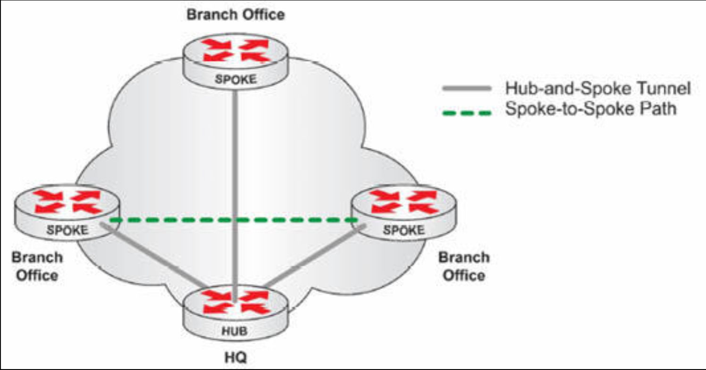

# VPN 技术

所谓 VPN，属于一种叠层通信网络，而给予这些通信网络业务所需的安全性与可管理性的技术。在 VPN 技术下，咱们可在享受 Internet 低成本与高可用性的同时，建立安全关系、自动连接、授权与加密等。

VPN 在数据通过 Internet 传输，或在公司飞地内传输时予以保护。VPN 具备多种能力，但主要功能包括以下这些：

- 保障数据机密性（加密）
- 验证通信双方身份（认证）
- 保护通信各方身份 (隧道)
- 确保数据准确且为原始形式（不可否认）
- 防范数据包重复发送（重放攻击防护）

尽管 VPN 这一概念大多数时候意味着安全性，但不安全的 VPN 也存在。帧中继便是这种不安全 VPN 的一个示例，因为他提供了两地间的私有通信，但他可能并无其上的任何安全特性。咱们是否应添加安全性到 VPN 连接，取决于该连接的具体需求。

因为缺乏业务提供商基础设施方面的可见性，VPN 的故障排除难于进行。业务提供商通常被视为聚合了所有网络位置处连接的云。执行 VPN 故障排除时，咱们应首先确保问题未在咱们的设备处，然后才再联系业务提供商。

VPN 技术类型很多，包括以下这些：

- 站点到站点的 VPN，或内联网 VPN，例如叠层 VPN（如帧中继），或点对点 VPN（如 MPLS）。当咱们打算于公共基础设施上，连接不同地点时，咱们就会用到这些 VPN 技术。在使用对等基础设施时，咱们便可在无需担心 IP 地址重叠下，于站点间无缝通信；
- 远程接入 VPN，例如虚拟专用拨号网络（VPDN），属于一种通常以安全为考量，而完成的 VPN 拨号方式；
- 外部网络 VPN，适用于咱们打算连接到业务伙伴，或客户网络时；

当咱们使用 VPN 时，为了在某一基础设施上发送流量，咱们通常会通过隧道传输流量。有一种三层的隧道方法，称为通用路由封装（GRE）。GRE 允许咱们通过隧道传输流量，但其并未提供安全性。为了通过隧道传输流量并同时提供安全性，咱们可使用一种叫做 IP 安全（`IPSec`）的技术。这一技术属于 IPv6 的一个强制实现组件，但其并非 IPv4 的一个要求。IPSec 还可与认证、授权及计费（AAA）服务结合使用，其实现了用户活动的追踪。

VPN 的主要优势包括以下这些：

- 可扩展性（咱们可持续添加站点到 VPN）
- 灵活性（咱们可运用像是 MPLS 等一些非常灵活的技术）
- 开销（咱们可在太多费用下，即可在 Internet 上通过隧道发送流量）

## 客户端 VPN

经由浏览 Internet，咱们肯定了解了安全套接字层（SSL）协议。每次咱们曾在线购买过什么东西时，以 https:// 开头的 Web 地址，便是咱们正利用 SSL 确保咱们的金融信息被加密及安全的一个指征。

SSL 同样可用于创建 VPN 会话。例如，思科的 AnyConnect 软件客户端，便可安装在任何操作系统上，允许用户建立到某一网络的安全隧道。一旦该隧道建立，用户便可如同身处同一网络上一样，访问网络资源，即他们可查看内网页面、访问电子邮件，或如同置身办公室那样，使用内部 Skype 服务器通讯。全部这些信息，在 Internet 上均被加密。

客户端 VPN 的 SSL 连接，通常与思科 ASA 防火墙建立。当咱们完成一天的工作后，咱们只需只需断开咱们的 VPN 会话。

## DMVPN

所谓动态多点 VPN，可在不必通过总部 VPN 服务器或路由器这一传统方式下，实现站点之间的安全通行。DMVPN 节省了开支，并节约了带宽，当然还提高了速度。

中心分支型拓扑结构为这种连接类型所需要。分支节点将收集目标分支节点的相关信息，并与随后建立一条直连 VPN 隧道。下图 37.6 演示了这一连接类型：

**图 37.6** -- **运作中的 DMVPN**

