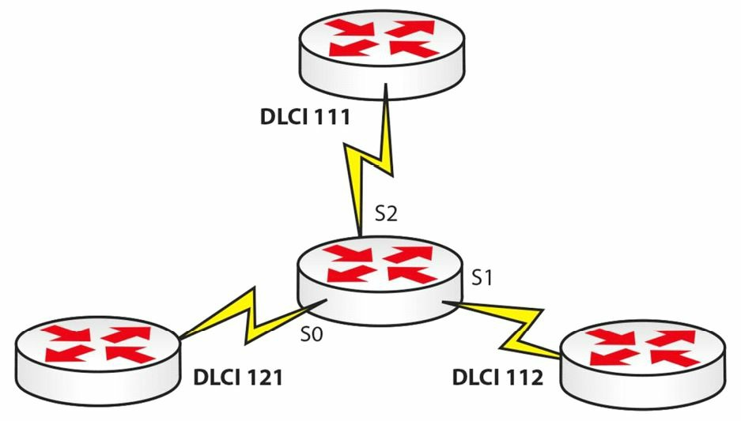

# 配置帧中继

不幸的是，配置帧中继可能有些棘手，这是因为不同网络类型需要不同的命令。其原因在于，要解决 WAN 上网络地址如何解析，以及路由协议如何运行两大问题。配置帧中继的步骤如下：

1. 设置封装方式
2. 设置 LMI 类型（可选）
3. 配置静态/动态的地址映射
4. 解决特定于协议的问题

在 CCNA 考试中，咱们不会被要求掌握如何配置电信级的帧中继交换机。只有在家庭或远端实验中建立自己的帧中继连接时，咱们才会打算了解如何完成这一配置。



**图 37.12** -- **帧中继网络***

针对上面的网络拓扑，咱们将在中间的帧中继交换机上配置以下内容。请仅将这一信息作为参考，因为对于考试咱们将不需要他：

```console
Router#conf t
Router(config)#frame-relay switching
Router(config)#int s0
Router(config-if)#clock rate 64000
Router(config-if)#encapsulation frame-relay
Router(config-if)#frame-relay intf-type dce
Router(config-if)#frame-relay route 121 interface s1 112
Router(config-if)#frame-relay route 121 interface s2 111
Router(config-if)#no shut
Router(config-if)#int s1
Router(config-if)#clock rate 64000
Router(config-if)#encapsulation frame-relay
Router(config-if)#frame-relay intf-type dce
Router(config-if)#frame-relay route 112 interface s0 121
Router(config-if)#frame-relay route 112 interface s2 111
Router(config-if)#int s2
Router(config-if)#clock rate 64000
Router(config-if)#encapsulation frame-relay
Router(config-if)#frame-relay intf-type dce
Router(config-if)#frame-relay route 111 interface s0 121
Router(config-if)#frame-relay route 111 interface s1 112
Router(config-if)#no shut
Router#show frame-relay route
```


> **译注**：
>
> - 上面的示例配置中，在添加第二个 `frame-relay route 121 interface s1/2 111` 时，会报出 `Can't use same dlci on overlapping circuits` 错误；
>
> - 为更好的理解帧中继的配置，请参考：[Frame Relay – GNS3 Lab](https://www.9tut.com/frame-relay-gns3-lab)。
