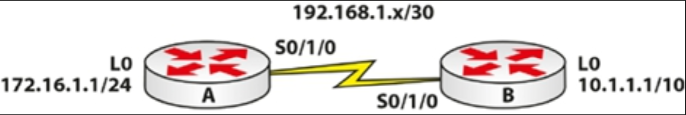
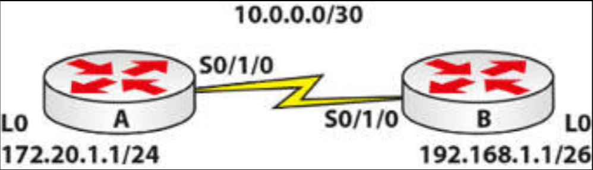
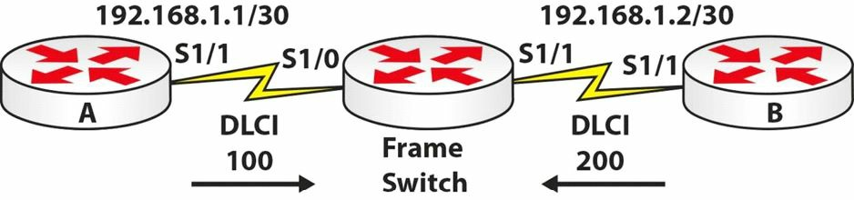

# 第 37 天实验


## HDLC 实验

### 拓扑结构




### 实验目的

动手尝试 WAN 的故障排除。

### 实验步骤

这个实验没有实验步骤（咱们已经掌握如何创建出这一拓扑结构）。要配置上面的网络。咱们的 WAN 将自动使用 HDLC 工作。要在其中的串行链路上 `ping`，确保这个网络是工作的。随后按以下方式破坏这个网络：

1. 修改 `Router B` 上的封装类型为 PPP（从而于二层破坏该链路）。以如下配置完成这一操作：

    ```console
    RouterB(config)#int Serial0/1/0
    RouterB(config-if)#encapsulation ppp

    %LINEPROTO-5-UPDOWN: Line protocol on Interface Serial0/1/0, changed state to down
    RouterB(config-if)#
    ```


2. 在 `Router A` 的串行接口上执行 `shut` 命令。随后执行 `show ip interface brief` 这一命令。咱们应看到咱们接口的 `up`/`down` 状态；
3. 移除咱们 DCE 接口侧的时钟速率。随后执行 `show controllers serial x` 这一命令。该命令应告诉咱们，没有配置时钟速率；
4. 配置 `Router B` 侧的子网掩码为 `255.255.255.0`。咱们可以 `show interface serial x` 这一命令，看到该子网掩码。若这条命令在考试中不允许，那么就要执行 `show run` 这条命令；
5. 修复上面的全部问题。这一步正是咱们要在考试中必须完成的，同时这些问题属于一些最常见的故障。请务必测试咱们在故障排查这种问题时，将输入的这些命令，以显示给咱们 IP 地址、封装类型及时钟速率等。


## 点对点协议实验

### 拓扑结构




### 实验目的

学习如何配置 PPP 及 CHAP。

### 实验步骤

1. 根据上面的拓扑结构，配置 IP 地址及主机名；
2. 将两侧的封装方式，设置为 PPP。下面是 `Router A` 配置命令：


    ```console
    RouterA(config)#interface s0/1/0
    RouterA(config-if)#encapsulation ppp
    ```


3. 在两台路由器上设置 CHAP。咱们将设置对端路由器的主机名，及口令 `cisco`；

    ```console
    RouterA(config)#username RouterB password cisco
    RouterA(config)#interface s0/1/0
    RouterA(config-if)#ppp authentication chap
    RouterA(config-if)#exit
    ```

    ```console
    RouterB(config)#username RouterA password cisco
    RouterB(config)#interface s0/1/0
    RouterB(config-if)#ppp authentication chap
    RouterB(config-if)#exit
    ```

4. 在该链路上 `ping`，确保其为 `up` 状态；


    ```console
    RouterB#ping 10.0.0.1

    Type escape sequence to abort.
    Sending 5, 100-byte ICMP Echos to 10.0.0.1, timeout is 2 seconds:
    !!!!!
    Success rate is 100 percent (5/5), round-trip min/avg/max = 31/31/32 ms

    RouterB#
    ```


5. 通过将 `Router A` 上的主机名修改为 `Router C` 破坏这一连接。咱们还将打算开启 PPP 的调试，以及 `shut/no shut` 接口以再次打开协商。咱们将务必要快速输入 `undebug all` 这条命令。当咱们位于接口提示符处时，那么就要输入 `do undebug all` 这一命令；


```console
RouterA#conf t
Enter configuration commands, one per line.  End with CNTL/Z.
RouterA(config)#hostname RouterC
RouterC(config)#exit
RouterC# RouterC#debug ppp neg
PPP protocol negotiation debugging is on

RouterC#debug ppp auth
RouterC#config t
RouterC(config)#int s0/1/0
RouterC(config-if)#shut

Serial0/1/0 LCP: State is Open
Serial0/1/0 PPP: Phase is AUTHENTICATING

Serial0/1/0 IPCP: O CONFREQ [Closed] id 1 len 10 ← Router won’t authenticate

RouterC(config-if)#do undebug all

RouterC#sh int s0/1/0
Serial0/1/0 is up, line protocol is down (disabled)
```

## 帧中继实验

### 拓扑结构




### 实验目的

学习配置基本的帧中继。

### 实验步骤

1. 首先配置帧中继交换机。在 CCNA 考试中咱们永远不必完成这一步。同时，要添加 IP 地址到 `Router A` 及 `Router B` 的串行接口；


    ```console
    Router#conf t
    Enter configuration commands, one per line. End with CNTL/Z.
    Router#hostname FrameSwitch
    FrameSwitch(config)#frame-relay switching
    FrameSwitch(config)#int s1/0
    FrameSwitch(config-if)#encap frame-relay
    FrameSwitch(config-if)#frame-relay intf-type dce
    FrameSwitch(config-if)#clock rate 64000
    FrameSwitch(config-if)#frame-relay route 100 int s1/1 200
    FrameSwitch(config-if)#no shut
    *May 10 04:28:13.275: %LINK-3-UPDOWN: Interface Serial1/0, changed state to up
    *May 10 04:28:29.275: %LINEPROTO-5-UPDOWN: Line protocol on Interface Serial1/0, changed
    state to up
    FrameSwitch(config-if)#int s1/1
    FrameSwitch(config-if)#encap frame
    FrameSwitch(config-if)#frame-relay intf-type dce
    FrameSwitch(config-if)#clock rate 64000
    FrameSwitch(config-if)#frame route 200 int s1/0 100
    FrameSwitch(config-if)#no shut
    FrameSwitch(config-if)#^Z
    FrameSwitch#show frame route
    Input Intf  Input Dlci  Output Intf     Output Dlci Status
    Serial1/0   100         Serial1/1       200         inactive
    Serial1/1   200         Serial1/0       100         inactive
    FrameSwitch#
    ```

2. 于 `Router A` 上配置帧中继；

    ```console
    RouterA(config)#interface s0/1/0
    RouterA(config-if)#encap frame-relay
    RouterA(config-if)#frame-relay interface-dlci 100
    RouterA(config-if)#no shut
    ```

3. 在 `Router B` 上拷贝这些命令，不过咱们 DLCI 编号为 200；
4. 在这条帧中继链路上 `ping`，测试其是否已建立；


    ```console
    RouterB#ping 192.168.1.1
    Type escape sequence to abort.
    Sending 5, 100-byte ICMP Echos to 192.168.1.1, timeout is 2 seconds:
    !!!!!
    Success rate is 100 percent (5/5), round-trip min/avg/max = 12/17/20 ms
    RouterB#
    ```

5. 查看帧中继的 PVC 及映射关系；


```console
RouterB#show frame-relay pvc
PVC Statistics for interface Serial1/1 (Frame Relay DTE)
              Active     Inactive      Deleted       Static
  Local          1            0            0            0
  Switched       0            0            0            0
  Unused         0            0            0            0
DLCI = 200, DLCI USAGE = LOCAL, PVC STATUS = ACTIVE, INTERFACE = Serial1/1
  input pkts 1 output pkts 1 in bytes 34
  out bytes 34 dropped pkts 0 in pkts dropped 0
  out pkts dropped 0 out bytes dropped 0
  in FECN pkts 0 in BECN pkts 0 out FECN pkts 0
  out BECN pkts 0 in DE pkts 0 out DE pkts 0
  out bcast pkts 1 out bcast bytes 34
  5 minute input rate 0 bits/sec, 0 packets/sec
  5 minute output rate 0 bits/sec, 0 packets/sec
  pvc create time 00:00:26, last time pvc status changed 00:00:26
RouterB#
RouterB#show frame map
Serial1/1 (up): ip 192.168.1.1 dlci 200(0xC8,0x3080), dynamic,
              broadcast, status defined, active
RouterB#
```

6. 调试帧中继的 LMI 交换。当咱们看到 `status 0x2` 的标签时，就要执行 `undebug a11` 这一命令关闭调试；


```console
Router3#debug frame-relay lmi
Frame Relay LMI debugging is on
Displaying all Frame Relay LMI data
Router3#
*May 10 04:42:48.311: Serial1/1(out): StEnq, myseq 24, yourseen 23, DTE up
*May 10 04:42:48.311: datagramstart = 0xF1A6FCC4, datagramsize = 13
*May 10 04:42:48.311: FR encap = 0xFCF10309
*May 10 04:42:48.311: 00 75 01 01 01 03 02 18 17
*May 10 04:42:48.311:
*May 10 04:42:48.319: Serial1/1(in): Status, myseq 24, pak size 13
*May 10 04:42:48.319: RT IE 1, length 1, type 1
*May 10 04:42:48.319: KA IE 3, length 2, yourseq 24, myseq 24
Router3#
*May 10 04:42:58.311: Serial1/1(out): StEnq, myseq 25, yourseen 24, DTE up
*May 10 04:42:58.311: datagramstart = 0xF1A73AFC, datagramsize = 13
*May 10 04:42:58.311: FR encap = 0xFCF10309
*May 10 04:42:58.311: 00 75 01 01 00 03 02 19 18
*May 10 04:42:58.311:
*May 10 04:42:58.319: Serial1/1(in): Status, myseq 25, pak size 21
*May 10 04:42:58.319: RT IE 1, length 1, type 0
*May 10 04:42:58.319: KA IE 3, length 2, yourseq 25, myseq 25
*May 10 04:42:58.319: PVC IE 0x7, length 0x6, dlci 200, status 0x2, bw 0
Router3#un all
```

## PPPoE 实验

根据这一教学模组中提供的信息，在两台路由器之间配置带有 CHAP 的 PPPoE：

**服务器的配置**：

```console
Router(config)#bba-group pppoe GROUP
Router(config-bba-group)#virtual-template 1
Router(config)#interface virtual-template 1
Router(config-if)#ip address 10.10.10.1 255.255.255.0
Router(config-if)#peer default ip address pool POOL
Router(config)#ip local pool POOL 10.10.10.2 10.10.10.254
Router(config)#interface FastEthernet0/0
Router(config-if)#no ip address
Router(config-if)#pppoe enable group GROUP
Router(config-if)#no shutdown
```

**客户端的配置**:

```console
Router(config)#interface dialer1
Router(config-if)#dialer pool 1
Router(config-if)#encapsulation ppp
Router(config-if)#ip address negotiated
Router(config)#interface FastEthernet0/0
Router(config-if)#no ip address
Router(config-if)#pppoe-client dial-pool-number 1
Router(config-if)#no shutdown
```

**CHAP 认证**:

```console
Server(config)#username Client password Password
Server(config)#interface virtual-template 1
Server(config-if)#ppp authentication chap
Client(config)#username Server password Password
Client(config)#interface dialer 1
Client(config-if)#ppp authentication chap
```

**验证配置**：

```console
Router#show pppoe session
1 client session
Uniq ID  PPPoE  RemMAC      Port        Source   VA         State
       SID  LocMAC                               VA-st
N/A     16  ca00.4843.0008  Fa0/0       Di1      Vi1        UP
            ca01.4843.0008                                  UP
```
