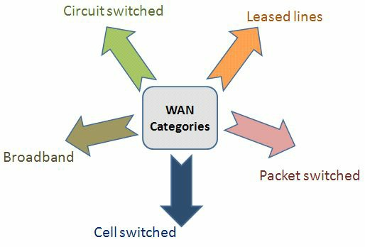

# WAN 概述

所谓广域网（WAN），为了提供网络基础设施不同部分的连接，而会跨越很远的地理区域。不同于 LAN 环境，并非所有的 WAN 组件都归其所服务的特定企业所有。相反，WAN 设备或连通性，可租用或租赁自业务提供商。

为了确保其不仅能支持传统的数据流量，还能支持长途地理距离上的语音及视频业务（这些都对延迟更敏感），多数业务提供商都经多良好培训。

WAN 的另一由区的事情在于，不同于 LAN，这些业务通常有一些初始固定开销，以及一些定期的持续费用。在广域组网下，咱们不仅不拥有连接及某些设备，咱们还将必须付费给业务提供商。这正是咱们应避免过度配置（即仅购买咱们认为咱们将用到的带宽）的原因之一。这导致部署有效的 QoS 机制，避免购买额外 WAN 带宽的需要。高昂的开销，通常与过渡配置带宽情形下的经常性费用有关。

WAN 技术设计的各项要求，通常基于以下要素：

- 应用类型
- 应用的可用性
- 应用的可靠性
- 与特定 WAN 技术相关的开销
- 应用的使用量级

## WAN 类别

WAN 分类中的一个基本概念，是电路交换技术，这项技术的一个最相关示例，便是公共交换电话网（PSTN）。属于这一类别的技术之一，便是综合业务数字网（ISDN）。电路交换的 WAN 连接工作方式，是在需要时建立，在不再需要时终止。反映这种电路交换行为的另一示例，便是老式的拨号连接（PSTN 上的拨号调制解调器模拟接入）。

**注意**：就在不久前，拨号技术都还是访问 Internet 资源的唯一途径，提供约 40Kbps 的平均可用带宽。如今这项技术几乎已经灭绝。

与电路交换这一选项相反的是专线技术。这属于归公司所有，完全专用且永久启用的一种连接。专线的示例包括基于时分复用（TDM）的专线。这些连接通常非常昂贵，因单一客户独占连接。

WAN 技术的另一主流类别，涉及数据包（分组）交换网络。在分组交换基础设施中，共享带宽利用了虚拟电路。客户可通过业务提供商的基础设施云，创建出虚拟路径（类似于专线）。这种虚拟电路有着专用带宽，尽管从技术上讲这并非真正的专线。帧中继（Frame Relay）便是这一技术类型的一个示例。

一些传统 WAN 技术包括帧中继前身的 X.25 协议。这一技术仍存在于某些部署中，但极为罕见（如今帧中继也已相当少见）。

咱们可能听说过的另一 WAN 类别，属于单元交换技术（cell-switched technology）。这种技术通常包含于分组交换技术中，因为他们非常相似。一种单元交换技术示例，便是 ATM（异步传输模式，如今同样罕见）。这一技术通过使用一些固定大小的单元，而非数据包（如同帧中继中用到的）运行。单元交换技术形成一种共享带宽的环境，从而业务提供商便可通过他们的基础设施，向客户保证提供某一特定水平的带宽。

宽带是另一增长中的 WAN 类别，同时这一类别包含了以下这些技术：

- DSL
- 有线电视
- 无线

宽带具备利用像是承载电视信号的老式同轴线，并探索如何运用这一带宽各个方面的能力。例如，通过复用技术，一路额外数字信号，便可与原始电视信号一并传输。

**图 37.1** -- **WAN 的类别**

如上图 37.1 中所示，讨论 WAN 类别时有多种选项，而这些只是对他们的一般介绍。所有这些技术均可支持运行于 20/80 设计规则下现代网络的需求，即为了访问远端资源，80% 的网络流量会用到某种 WAN 技术。

