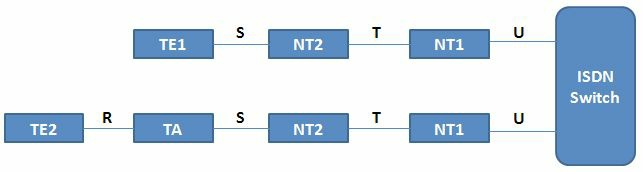

# WAN 业务

## 城域以太网

所谓城域以太网技术，涉及在城域网（MAN）中运行商以太网的使用。城域以太网可连接公司 LAN 及个人终端用户，到 WAN 或 Internet。公司经常会使用城域以太网，连接分支机构到内部网。

一种典型的城域以太网部署，会使用有着一些使用铜缆或光纤连接的互联网络节点的，星型或网状的拓扑结构。与使用 SONET/SDH 或 MPLS 技术相反，在城域以太网部署中使用标准且广泛部署的以太网技术，提供了数种优势：

- 更便宜
- 更易于部署
- 更易于管理
- 由于其使用标准的以太网方法，因此易于连接客户设备


一个典型的 MAN，可在接入/汇聚/核心这种标准设计（思科的设计模型）下予以架构：

- 接入层 —— 通常位于客户所在地。这一层可能包含一个办公路由器或住宅网关
- 汇聚层 —— 通常由微波、DSL 技术，或点对点的以太网链路等构成
- 核心层 —— 会使用 MPLS 互连不同 MAN


在 MAN 中，客户流量的隔离，通过使用实现数据包区分的以太网 VLAN 标签，而通常得以确保。


## VSAT

甚小孔径终端（VSAT）技术，属于一种基于无线卫星技术的电信系统。VSAT 的部署，由一个小型卫星地面站与一面典型天线构成，如下图 37.4 中所示。


**图 37.4** -— **卫星通信**

典型VSAT组件包括以下内容：

- 主地面站
- 远端地面站
- 卫星

所谓主地面站，是整个 VSAT 网络的网络控制中心。这是完成整个网络的配置、管理与监控之处。

远端地面站属于安装在客户场所的硬件设备，包含以下组件：

- ODU（outdoor unit，室外单元）
- IDU（indoor unit，室内单元）
- IFL（inter-facility link，站点间链路）

VSAT 卫星环绕地球运行，接收来自地面站的信号，以及传输信号到地面站。

VSAT 网络可配置为以下拓扑结构之一：

- 星型拓扑
- 网状拓扑
- 星-网组合拓扑

相较于使用传统的地面网络连接，使用卫星技术保障 WAN 连接一般会更为昂贵。此类连接所提供的速率，可达 5Mbps 的下载及 1Mbps 的上传，对于一些远端站点这通常已足够。


> **译注**：如今由 XSpace 公司提供的星链服务，下载速率已达 80-200Mbps，上传速率已达 15-35 Mbps，延迟在 25-75 ms。
>
> 参考：[Starlink Specifications](https://starlink.com/legal/documents/DOC-1470-99699-90)

使用卫星连通性的一个显著缺点，便是流量延迟增加，由于在很长距离上无线电信号的使用，单程延迟（天线至卫星或卫星至天线）可达 250 毫秒。在规划安装卫星的 WAN 连接时，这一点应加以仔细考虑，因为延迟增加会阻止一些敏感应用运行，而对别的应用没有影响。

使用卫星连接的另一挑战，在于卫星的碟形天线必须要有到卫星的视线。这意味着咱们必须使用高频范围（2 GHz），且任何干扰（如降雨或雷暴云等自然现象），都会影响这种连接的吞吐量及可用性。


## T1/E1

T1/E1 的广域组网标准已存在多年。T1 代表 T-载波级别 1，T-Carrier Level 1，其为一种使用根据时间，与不同信道关联数字信号下时分复用技术的线路。T1 通过使用 24 个独信道运行于 1.544Mbps，因此每个单独通道分配了 64Kbps 带宽。咱们可以咱们想要的任何方式，使用这 24 个通道，咱们甚至可以根据咱们的需要，只从业务提供商处购买少量信道。一般而言，可将 T1 连接视为承载着 24 条单独线路的一种干线/线束。T1 属于一项常用于以下地区的标准：

- 北美
- 日本
- 韩国

所谓 E1（E-载波级别 1），是一项类似于 T1 的标准，但专用于欧洲地区。E1 与 T1 的主要区别差异在于，E1 使用了同样运行于 64kbps 速率的 32 个信道而非 24 个，因此提供了 2.048Mbps 的总线路速率。就像 T1 一样，E1 也基于时分复用运行，因此这两项标准值之间的全部其他功能都是相通的。

## T3/E3

T3 及 E3 两项标准，提供了相比他们 T1/E1 前身更高的带宽。T3 代表 T-载波级别 3，T-Carrier Level 3，属于一种通常基于同轴线与 BNC 连接器的连接类型。这不同于通常经由双绞线介质提供的 T1。

T3 的连接，常被称为 DS3 连接，其于承载于 T3 线路上的数据有关。由于 T3 用到相当于 28 条 T1 电路，即 672 个 T1 信道，因此提供了额外吞吐量。这提供了 44.736 Mbps 的总线路速率。

E3 连接类似于 T3 的那些，出了相当于 16 条 E1 电路，即 512 个 E1 信道，以及 33.368Mbps 的总线路速率。

T3/E3 的连接，通常用于大型数据中心，因为他们在需要提升时，提供了提升吞吐总量的能力。

## ISDN

综合业务数字网（ISDN），属于一项在传统模拟电话线上实现数字通信的技术，从而语音及数据，可同时在公共交换电话网（PSTN）上数字化传输。由于其问世时其他替代技术已发展成熟，因此 ISDN 从未达到其预期的普及程度。

有两种 ISDN 风格：

- ISDN BRI（Basic Rate Interface，基本速率接口）
- ISDN PRI（Primary Rate Interface，主速率接口）

讲 ISDN 的设备，均被称为终端仿真设备，同时这些设备又可分类为原生的 ISDN 设备与非原生的 ISDN 设备。所谓原生的 ISDN 设备，由专为 ISDN 制造的设备构成，而称为 TE1（Terminal Equipment 1） 设备。非原生的 ISDN 设备则由 TE2 设备构成。通过使用一些特殊的终端适配器（Terminal Adapters，Tas），即仅 TE2 设备需要 TA 模组，非原生的 ISDN 设备可与原生的 ISDN 设备集成。

在向 ISDN 提供商迁移过程中，咱们将发现一些网络终端 2（Network Termination 2，NT2）设备，及一些网络终端 1（Network Termination 1，NT1）设备。 这些设备属于一些将五线制连接，转换为两线制连接（即 local loop，本地环路）的介质转换设备。所谓本地环路，就是用户的连接线路，其为两线制的一条链路。

关于网络中端设备的一件有趣事情，是在北美地区，客户负责 NT1 设备，而在世界其他地区，这个设备则由业务提供商责任。由于这个问题，部分思科路由器提供了内置的 NT1 功能，他们将在端口编号下，显示一个醒目的 `U`，以便用户可以快速看到这一能力。这个 `U` 的表示法，来自 ISDN 的参考点命名法，x这一 ISDN 参考点命名法，描述了在 ISDN 基础设施中，咱们可能遇到的问题，如下图 37.5 中所示。

> **译注**：关于 ISDN 参考点命名法，请参考：[Functional Devices and Reference Points](https://web.archive.org/web/20240724173631/https://crajkumar.tripod.com/isdn/chapter4.html)




**图 37.5** -— **ISDN 的参考点**


这些参考点在 ISDN 网络的故障排除或维护过程中至关重要。ISDN 交换机通常位于业务提供商处。这些不同 ISDN 参考点如下：

- `U` 参考点 —— 位于 ISDN 交换机及 NT1 设备之间
- `T` 参考点 —— 位于`NT2` 与 `NT1` 设备之间
- `S` 参考点 —— 位于终端（TE1 或 TA）与 NT2 设备之间
- `R` 参考点 —— 位于非 ISDN 原生设备与 TA 之间

ISDN 的基本速率接口（Basic Rate Interface，BRI），包含两个用于承载数据的 `B`（bearer，承载）信道，以及一个用于信令的 `D`（delta）信道。BRI 的连接简称为 `2B+D`，提示咱们每个连接所提供的信道数量。ISDN 中的每个承载通道，都将运行于 64Kbps 的速率。多链路的 PPP 可于这些接口上得以配置，允许用户达到 128Kbps 的带宽。根据现代网络的需求，这种带宽被视为非常低。

BRI ISDN 中的 delta（`D`）信道，专用于 16Kbps 的控制流量。在 ISDN 环境中，还有 48Kbps 的带宽，总体用于数据帧控制及其他开销，这意味着 BRI 的总 ISDN 带宽为 192Kbps（`B` 通道的 128Kbps + `D` 通道的 16Kbps + 48Kbps 的开销）。

ISDN 的主速率接口（PRI），在美国和日本有着 23 个 `B` 信道及 1 个 `D` 信道。承载信道与 delta （差分）信道均支持 64Kbps。当咱们包含开销时，那么宗的 PRI 带宽便是 1.544Mbps。在世界上的其他地区（如欧洲与澳大利亚），PRI 连接包含了 30 个 `B` 信道及 1 个 `D` 信道。

ISDN 的 PRI 连接，通常用于 PSTN 到大型电话系统（PBX）的连通性。23 或 30 个 `B` 信道中的每个信道，均可用作单条的电话线路，因此整个 PRI 连接可视为承载着多条线路的一条干线。使用一个 PRI 连接，而不是多条独立线路的优势在于，其更易于管理且提供了可扩展性。

上述的这些技术，均被称为时分复用（Time Division Multiplexing，TDM）技术。所谓时分复用，指能够在某单一整体传输介质上整合多个信道，并将这些不同信道用于语音、视频及数据。所谓时分，是指将连接划分为一些小的时间窗口，用于不同通信信道。

在 PSTN 中，咱们需要能在同一传输介质上传输多路呼叫，因此 TDM 便被用于达成这一目标。TDM 实际上起源于电报时代，并在随后在传真机及其他用到 TMD 技术的设备下而得以广泛应用。

当咱们有着一些专线（正购买着专用带宽）时，那么所售电路便是以带宽为计量单位。北美地区的 DS1 或 T1 电路，提供了 24 个每个 64Kbps 的时间槽，及1 个 9Kbps 控制时间槽（合计 1.544 Mbps，如前所提及）。TDM 术语体系与这一专线采购流程紧密相连。


## DSL

数字用户线路（DSL），是针对家庭用户的一种 ISDN 替代。有数种 DSL 连接类型，其中最重要的包括以下这些：

- ADSL
- HDSL
- VDSL
- SDSL

所谓非对称数字用户线路（ADSL），是在标准电话线上运行的最常见 DSL 连接形式。其被称为非对称的原因，在于不相等的下载与上传吞吐量，其中下载速率要高于上传速率。标准 ADSL 连接通常在 3 公里范围内，提供最高 24Mbps 的下载吞吐量，以及最高 3.5Mbps 的上传吞吐量。

在 ADSL 下，客户会连接到位于业务提供商处的数字用户线路接入复用器（DSLAM）。所谓 DSLAM，属于一种汇聚来自多名用户连接的 DSL 集中器设备。

**注意**：ADSL 下的问题之一，是用户与 DSLAM 距离有限。

所谓高比特率 DSL（HDSL），以及超比特率 DSL（VDSL），是两种用于大规模应用的别的 DSL 技术，与 ADSL 相比，他们提供了提升的吞吐量。VDSL 可运行于最高 100Mbps 的速率。

所谓对称 DSL（SDSL），提供了同样的下载与上传吞吐量，但其从未被标准化或被大规模使用。


## 有线

数字信号亦可被家庭用户在标准电视有线连接上接收。Intranet 访问可通过使用有线数据业务接口规范（DOCSIS）标准，于有线上得以提供。这种接入通常属于一种低成本业务，因为提供商无需再为数据业务安装新的基础设施。对现有网络的唯一升级，便是在用户处一个低成本有线调制解调器的安装，该设备通常为用户设备提供了 RJ45 的数据连通性。

有线技术上的数据传输速率可达 100Mbps，这对于家庭用户甚至小型企业而言，都已足够。

**注意**：除了电视及数据信号，有线连接还可承载语音流量。


以太网上的点对点协议（PPPoE），是另一项可与有线结合使用的技术。这一技术可应用于有线调制解调器与终端设备之间，增强有线调制解调器这一基础设施的安全性。这一技术允许用户登入，并要提供为了有线业务得以使用，而必须加以认证的用户名及口令。凭据会于以太网连接上，传输至有线调制解调器，并使用运行于以太网上的 PPP 协议传输。我们很快就将介绍 PPPoE。

## 蜂窝网络

蜂窝网络会与移动设备（如手机、平板、PDA 等）结合使用，与传统语音业务一起发送及接收数据。这些网络通过将广阔地域划分为多个蜂窝单元而予以覆盖，一些天线会被策略性地安放，确保这些单元间的最佳覆盖，以及确保从一处前往另一处的用户的单元漫游。传统的这种连接类型亦称为 2G，包含以下标准：

- GSM（Global System for Mobile Communications，全球移动通信系统）
- CDMA (Code Division Multiple Access，码分多路访问)


根据咱们使用的运营商及咱们所居住的国家，咱们可能使用 GSM 或 CDMA 的通信类型，尽管在功能上他们常都被称为 2G 网络。这两种网络都被设计为使用电路交换的模拟连接，且最初并非被设计用来传输数据。由于数据连接会用到分组（数据包）交换技术，2G 的连接仅提供了有限的数据传输支持。

蜂窝网络上的一些实现了全功能的分组交换，及规范数据传输的更新连接类型，包括以下这些：

---

- 高速包访问（High Speed Packet Access, `HSPA+`）
- 长期演进（方案）（Long Term Evolution, `LTE`）

`LTE`与`HSPA+`是由第三代合作伙伴计划（3rd Generation Partnership Project, 3GPP）所创建的标准，该计划是数个判断它们需要某种在蜂窝网络上发送数据的标准化方式的电讯公司，之间的协作。

`HSPA+`是一个基于`CDMA`的、提供高达`84Mbps`下载速率与`22Mbps`上传速率的标准。`LTE`则是基于`GSM/EDGE`的，提供高达`300Mbps`的下载与`75Mbps`上传速率的标准。

> **注意：** 这些标准都在持续开发中，因此它们的吞吐速率可能在将来会有所提升。

`GSM 3G`(第三代，third generation)，是一个对具备提供可达数兆（several `Mbps`）传输速率的网络的泛称。可通过提升信道的分配带宽（the channels' allocated bandwidth, 请参考[这里](https://en.wikipedia.org/wiki/Channel_allocation_schemes)，及[这里](https://en.wikipedia.org/wiki/Bandwidth_allocation)），并同时使用包交换技术，来达到这种传输速率。

`GSM 4G`(第四代，fourth generation)，则是 GSM 相关标准的最新补充（the latest addition to the GSM portfolio），同时在大多数国家，其仍处于部署阶段。`4G`提供到超过`100Mbps`的、适合高速宽带互联网访问的传输速率。`GSM 4G`完全基于 IP 通信，且原先`3G`中所使用的扩频视频技术（the spread spectrum radio technology），在`4G`中被正交频分多路复用多载波技术（Orthogonal Frequency Division Multiplex Access multi-carrier, OFDMA）所取代，从而可确保更高的传输速率。

## 虚拟专用网技术（VPN Technologies）

虚拟专用网是一种覆盖于通信网络之上，给予到这些通信网络业务所需的安全性与可管理性的技术。在 VPN 技术下，在享受到低成本与互联网可用的同时，还可建立起安全关系、自动连接、认证及加密等特性（VPN is a technology that overlays communications networks and gives them the security and manageability required by businesses. With VPN technology, you can set up secure relationships, automated connections, authorizations, and encryption, while still enjoying the low cost and availability of the Internet）。

虚拟专用网对跨越互联网传输的，或公司内部范围的数据进行保护（VPNs protect data while in transit across the Internet, or within a company's enclave）。虚拟专用网有着多种能力，但其主要功能包括这些：

- 保持数据机密（经由加密实现，Keep data confidential(encryption)）
- 确保通信双方身份可靠（经由认证实现，Ensure the identities of two parties communicating(authentication)）
- 保护通信各方的身份信息（经由隧道化实现，Safeguard the identities of communicating parties(tunnelling)）
- 确保数据是准确的，且以其最初形式呈现（具有不可抵赖性，Ensure data is accurate and in its original form(non-reudiation)）
- 防止数据包被反复发送（可防止回放，Guard against packets being sent over and over(replay prevention)）

虽然虚拟专用网概念大多数时间默认就带有了安全性，但仍存在不安全的虚拟专用网（Even though the VPN concept implies security most of the time, unsecured VPNs still exists）。帧中继就是不安全虚拟专用网的一个实例，因为它提供了两个地点之间的专用通信，但却可能在其上没有任何的安全特性。是否应将安全性添加到 VPN 连接，取决于该连接的特定需求。

而因为在服务提供商设施中缺乏可见性， VPN 的故障排除难于进行（VPN troubleshooting is difficult to manage because of the lack of visibility in the service provider infrastructure）。通常将服务提供商视为聚合了全部网络地点的连接的云。在执行 VPN 的故障排除时，应首先确定故障不在自己的设备上，随后才联系服务提供商。

虚拟专业网的类型有很多，包括下面这些：

- 站点到站点的 VPNs ，或内部网 VPNs （Site-to-Site VPNs, or Intranet VPNs ），比如覆盖式 VPN （如帧中继，`Overlay VPN`(like Frame Relay)）或对等点到对等点 VPN （如同多协议标签交换，Peer-to-Peer VPNs(like MPLS)）。在将不同地点经由公共设施进行连接时，必须使用这些类型。在使用对等点到对等点设施时，可在站点之间无缝通信，而不必担心 IP 地址分配的重复。
- 远程访问 VPNs （Remote Access VPNs），比如虚拟专用的拨号网络（Virtual Private Dial-up Network, VPDN），是一种通常考虑到安全性的 VPN 的拨号方式（which is a dial-up approach for the VPN that is usually done with security in mind）。
- 外部网 VPNs （Extranet VPNs），在要连接到业务伙伴或客户的网络时，需要使用此种 VPN 。

在使用 VPNs 时，就通常是将流量进行隧道化处理，以将其经由某项设施加以发送（When you use VPNs, you are often tunnelling traffic in order to send it over an infrastructure）。一种`Layer 3`的隧道化方法，被叫做通用路由封装（Generic Routing Encapsulation, GRE）。通用路由封装实现了流量的隧道传输，但其并不提供安全性。为了在对流量进行隧道化传输的同时提供到安全性，可使用一种名为 IP 安全（IP Security, `IPSec`）的技术。`IPSec`是`IPv6`的一项强制实现的组件，但对`IPv4`来说却不是。`IPSec`同时与认证、授权与计费（Authentication, Authorisation and Accounting, AAA）服务一同使用，实现对用户行为的追踪。

VPNs带来的主要好处如下：

- 可伸缩性（可将更多站点持续加入到 VPN ，Scalability(you can contiously add more sites to the VPN)）
- 灵活性（可使用如 MPLS 这样的非常灵活的技术，Flexibility(you can use very flexible technologies like MPLS)）
- 成本低（可以较低代价，经由互联网实现流量的隧道化传送，Cost(You can tunnel traffic through the Internet without much expense)）

## 多协议标签交换技术（Multiple Protocol Label Switching, MPLS）

多协议标签交换，是通过将一个标签追加到任意类型的数据包上，而运作的（Multiprotocol Label Switching(MPLS) functions by appending a label to any type of packet）。随后数据包就根据该标签的值，而非任何`Layer 3`信息，经由网络设施得以转发。给数据包打上标签，提供了非常高效的转发，且令到 MPLS 可工作在极大范围的现有技术上。通过简单地将一个标签添加到数据包头部中， MPLS 就可在许多物理与数据链路层的广域网实现中使用（The labeling of the packet provides very efficient forwarding and allows MPLS to work with a wide range of undelying technologies. By simply adding a label in the packet header, MPLS can be used in many Physical and Data Link Layer WAN implementations）。

MPLS的标签，是放在`Layer 2`头部与`Layer 3`头部之间的。使用 MPLS 技术，仅在数据包进入服务提供商云时，才会加入额外开销。在进入 MPLS 网络后，相比传统的`Layer 3`网络，数据包交换的完成要快得多，因为 MPLS 的包交换只是基于 MPLS 标签的交换，而不是要拆封整个的`Layer 3`头部（By using MPLS, overhead is added only when the packet enters the service provider cloud. After entering the MPLS network, packet switching is done much faster than in traditional Layer 3 networks because it is based only on swapping the MPLS label, instead of stripping the entire Layer 3 header）。

MPLS有两种不同样式（MPLS comes in two different flavours）：

- 帧模式的 MPLS （Frame Mode MPLS）
- （数据）单元模式的 MPLS （Cell Mode MPLS）

帧模式的 MPLS 是最为流行的 MPLS 类型，而在此场景中，标签是放在`Layer 2`头部与`Layer 3`头部之间的（因此 MPLS 通常被视为一种`Layer 2.5`的技术）。单元模式的 MPLS 用在`ATM`网络中，并使用`ATM`头部中的一些字段，作为标签。

兼容 MPLS 的路由器（MPLS-capable routers），也被叫做标签交换路由器（Label Switched Routers, LSRs），同时这些路由器也有两种样式：

- 边沿标签交换路由器（服务提供商边沿路由器，Edge LSR(PE<Provider Edge> routers)）
- 服务提供商标签交换路由器（P(Provider) LSR）

`PE routers`（服务提供商边沿路由器），是那些关注标签分布的服务提供商边沿设备（`PE routers` are Provider Edge devices that take care of label distribution）；它们根据标签对数据包进行转发，并负责标签的插入与移除。`P routers`就是服务提供商路由器，它们的职责包括 _标签式转发_，以及基于标签的高效率包转发（`P routers` are Provider routers and their responsibility consists of _label forwarding_ and efficient packet forwarding based labels）。

> **注**：请参考[这里](http://blog.51cto.com/sirstma/1860720)。

## 基本的串行线路配置（Basic Serial Line Configuration）

在不打算改变默认的`HDLC`（High-level Data Link Control，高级数据链路控制，思科专有）封装时，那么为建立 WAN 连接，仅需完成下面的步骤：

1. 给接口添加一个 IP 地址
2. 开启接口（以`no shutdown`命令）
3. 确保在数据通信设备侧有一个时钟速率（Ensure there is a clock rate on the DCE side）

在连接了数据通信设备电缆时的配置如下：

```console
Router#config t
Router(config)#interface Serial0
Router(config-if)#ip address 192.168.1.1 255.255.255.0
Router(config-if)#clock rate 64000
Router(config-if)#no shutdown
Router(config-if)#^Z
Router#
```

## 以太网上的点对点协议（Point-to-Point over Ethernet, PPPoE）

以太网上的点对点协议，是一个用于在以太网帧内部，封装点对点协议帧的网络协议（Point-to-Point Protocol over Ethernet(PPPoE) is a network protocol used to encapsulate PPP frames inside Ethernet frames）。

要实现客户部署非对称数字订户线路，他们就必须支持在极大安装基数的老旧桥接的客户处设备上的点对点样式的认证与授权。`PPPoE`技术提供了将主机网络经由简单的桥接访问设备，连接到远端访问集中器，或聚合集中器的能力（As customers deploy ADSL, they must support PPP-style authentication and authorisation over a large installed base of legacy bridging customer premises equipment(CPE). PPPoE provides the ability to connect a network of hosts over a simple bridging access device to a remote access concentrator or aggregation concentrator）。在此模型下，每台主机都使用其自身的点对点协议栈，因此呈现给用户的是一个熟悉的用户界面。访问控制、计费与服务类型（type of service），可基于每名用户，而不是基于每个地点完成。

如同在[RFC 2516](http://man.chinaunix.net/develop/rfc/RFC2516.txt)中所指明的那样， PPPoE 有两个不同阶段：发现阶段与会话阶段（As specified in RFC 2516, PPPoE has two distinct stages: a discovery stage and a session stage）。在主机发起一个 PPPoE 会话时，其必须首先进行发现，以找到可满足客户端请求的服务器，并找到对等点的以太网 MAC 地址而建立一个 PPPoE 会话 ID 。在 PPP 定义一个对等点到对等点的关系时，发现本质上就是一个客户端服务器的关系（While PPP defines a peer-to-peer relationship, discovery is inherently a client-server relationship）。

### PPPoE的配置

下面的小节涵盖了服务器（互联网服务提供商处）与客户端 PPPoE 的配置。之所以包含此内容，是因为现在 CCNA 大纲强制要求考生知道如何配置 PPPoE 。

#### 服务器的配置

创建 PPPoE 服务器配置的第一步，是定义一个将对传入连接进行管理的宽带聚合组（broadband aggregation group, BBA group）。该宽带聚合组必须关联到某个虚拟模板：

```console
Router(config)#bba-group pppoe GROUP
Router(config-bba-group)#virtual-template 1
```

下一步为面向客户端的接口，创建出一个虚拟模板。在虚拟模板上，需要配置一个 IP 地址以及一个可从中为客户端分配到协商地址的地址池（The next step is to create a virtual template for the customer-facing interface. On the virtual template you need to configure an IP address and a pool of address from which clients are assigned a negotiated address）：

```console
Router(config)#interface virtual-template 1
Router(config-if)#ip address 10.10.10.1 255.255.255.0
Router(config-if)#peer default ip address pool POOL
```

该 IP 地址池是在全局配置模式中定义的。这与 DHCP 地址池的配置类似：

```console
Router(config)#ip local pool POOL 10.10.10.2 10.10.10.254
```

最后一步就是在面向客户端的接口上开启该 PPPoE 分组：

```console
Router(config)#interface FastEthernet0/0
Router(config-if)#no ip address
Router(config-if)#pppoe enable group GROUP
Router(config-if)#no shutdown
```

#### 客户端的配置（Client Configuration）

在客户端侧上，必须创建出一个拨号器接口（On the client side a dialer interface has to be created）。拨号器接口将对 PPPoE 连接进行管理。可将手动 IP 地址分配给拨号器接口，或将其设置为从服务器请求一个 IP 地址（使用`ip address negotiated`命令）：

```console
Router(config)#interface dialer1
Router(config-if)#dialer pool 1
Router(config-if)#encapsulation ppp
Router(config-if)#ip address negotiated
Router(config)#interface FastEthernet0/0
Router(config-if)#no ip address
Router(config-if)#pppoe-client dial-pool-number 1
Router(config-if)#no shutdown
```

### 关于认证（ Authentication ）

为了令到 PPPoE 连接安全，可使用两种方法：

- 口令认证协议（Password Authentication Protocol, PAP） - 不安全的、以明文方式发送凭据（包含用户名与口令）
- 询问握手协议（Challenge Handshake Authentication Protocol, CHAP） - 安全的（明文的用户名与经`MD5`散列化的口令），是首选方式

可如下配置`PAP`：

_服务器侧_：

```console
Server(config)#username Client password Password
Server(config)#interface virtual-template 1
Server(config-if)#ppp authentication pap
Server(config-if)#ppp pap sent-username Server password Password
```

_客户端_：

```console
Client(config)#username Server password Password
Client(config)#interface dialer 1
Client(config-if)#ppp authentication pap
Client(config-if)#ppp pap sent-username Client password Password
```

`CHAP`可如下进行配置：

_服务器侧_：

```console
Server(config)#username Client password Password
Server(config)#interface virtual-template 1
Server(config-if)#ppp authentication chap
```

_客户端_：

```console
Client(config)#username Server password Password
Client(config)#interface dialer 1
Client(config-if)#ppp authentication chap
```

### PPPoE的验证与故障排除（PPPoE Verification and Troubleshooting）

在 PPPoE 会话成功形成后，客户端控制台上将出现下面的消息：

```console
%DIALER-6-BIND: Interface Vi1 bound to profile Di1
%LINK-3-UPDOWN: Interface Virtual-Access1, changed state to up
%LINEPROTO-5-UPDOWN: Line protocol on Interface Virtual-Access1, changed state to up
```

在客户端路由器上使用下面的命令，可对拨号器接口，以及从 PPPoE 服务器处获取到的（协商到的） IP 地址进行检查：

```console
Router#show ip interface brief
Interface                  IP-Address       OK? Method Status               Protocol
Virtual-Access1            unassigned       YES unset  up/up
Dialer1                    10.10.10.2       YES IPCP   up/up
```

在客户端路由器上可使用下面的命令，显示出 PPPoE 会话的状态：

```console
Router#show pppoe session
1 client session
Uniq ID  PPPoE  RemMAC      Port        Source   VA         State
       SID  LocMAC                               VA-st
N/A     16  ca00.4843.0008  Fa0/0       Di1      Vi1        UP
            ca01.4843.0008                                  UP
```

一些对于 PPPoE 连接进行故障排除有用的命令如下：

```console
Router#debug ppp ?
  authentication  CHAP and PAP authentication
  bap             BAP protocol transactions
  cbcp            Callback Control Protocol negotiation
  elog            PPP ELOGs
  error           Protocol errors and error statistics
  forwarding      PPP layer 2 forwarding
  mppe            MPPE Events
  multilink       Multilink activity
  negotiation     Protocol parameter negotiation
  packet          Low-level PPP packet dump
```

## WAN连接的故障排除（Troubleshooting WAN Connections）

在试图启动一条广域网连接（现在先不管 PPP 与帧中继连接）时，可运用开放系统互联模型：

`Layer 1` -- 对线缆进行检查，以确保其连接正确。其外还要检查一下有没有执行`no shutdown`命令，以及在数据通信设备侧有没有应用一个时钟速率。

```console
RouterA#show controllers serial 0
HD unit 0, idb = 0x1AE828, driver structure at 0x1B4BA0
buffer size 1524 HD unit 0, V.35 DTE cable

RouterA#show ip interface brief
Interface     IP-Address     OK? Method Status              Protocol
Serial0       11.0.0.1       YES unset  administratively down down
Ethernet0     10.0.0.1       YES unset  up                    up
```

`Layer 2` -- 检查以确保对接口应用了正确的封装。确保链路的另一侧有着同样的封装类型。

```console
RouterB#show interface Serial0
Serial1 is down, line protocol is down
Hardware is HD64570
Internet address is 12.0.0.1/24
MTU 1500 bytes, BW 1544 Kbit, DLY 1000 usec, rely 255/255, load 1/255
Encapsulation HDLC, loopback not set, keepalive set (10 sec)
```

`Layer 3` -- IP地址与子网掩码对不对，子网掩码与另一侧是不是匹配。

```console
RouterB#show interface Serial0
Serial1 is down, line protocol is down
Hardware is HD64570
Internet address is 12.0.0.1/24
MTU 1500 bytes, BW 1544 Kbit, DLY 1000 usec, rely 255/255, load 1/255
Encapsulation HDLC, loopback not set, keepalive set (10 sec)
```

## 第 41 天问题

1. Name at least three WAN categories.
2. The need for NBMA appears when there is no native `_______` support for a group of systems that want to communicate over the same network.
3. In NBMA environments you still need to bind the Layer 3 address (IP address) to the Layer 2 address (DLCI). This can be done in an automated fashion, using a technology called Inverse ARP. True or false?
4. Name 2 NBMA interface types.
5. `_______` requires DTE and DCE and is the default encapsulation type on Cisco routers.
6. `_______` technologies involve the use of carrier Ethernet in Metropolitan Area Networks (MANs).
7. T1 is a standard often used in what geographical regions?
8. What are the two flavours of ISDN?
9. `_______` is the most common form of DSL connection that functions over standard telephone lines. It offers unequal download and upload throughput, with the download rate being higher than the upload rate.
10. `_______` functions by appending a label to any type of packet.


## 第 41 天答案

1. Circuit-switched, cell-switched, broadband, leased-line, and packet-switched.
2. Broadcast.
3. True.
4. Multipoint and Point-to-Point.
5. HDLC.
6. Metro Ethernet.
7. North America, Japan, and South Korea.
8. BRI and PRI.
9. ADSL.
10. MPLS.


## 第 41 天实验

### PPPoE实验

在两台路由器之间，以本课程模块中所给出的信息，配置带有 CHAP 的 PPPoE ：

__服务器配置__：

```console
Router(config)#bba-group pppoe GROUP
Router(config-bba-group)#virtual-template 1
Router(config)#interface virtual-template 1
Router(config-if)#ip address 10.10.10.1 255.255.255.0
Router(config-if)#peer default ip address pool POOL
Router(config)#ip local pool POOL 10.10.10.2 10.10.10.254
Router(config)#interface FastEthernet0/0
Router(config-if)#no ip address
Router(config-if)#pppoe enable group GROUP
Router(config-if)#no shutdown
```

__客户端配置__:

```console
Router(config)#interface dialer1
Router(config-if)#dialer pool 1
Router(config-if)#encapsulation ppp
Router(config-if)#ip address negotiated
Router(config)#interface FastEthernet0/0
Router(config-if)#no ip address
Router(config-if)#pppoe-client dial-pool-number 1
Router(config-if)#no shutdown
```

__询问握手认证协议（ CHAP ）配置__:

```console
Server(config)#username Client password Password
Server(config)#interface virtual-template 1
Server(config-if)#ppp authentication chap
Client(config)#username Server password Password
Client(config)#interface dialer 1
Client(config-if)#ppp authentication chap
```

__对配置进行验证__：

```console
Router#show pppoe session
1 client session
Uniq ID  PPPoE  RemMAC      Port        Source   VA         State
       SID  LocMAC                               VA-st
N/A     16  ca00.4843.0008  Fa0/0       Di1      Vi1        UP
            ca01.4843.0008                                  UP
```

请访问[www.in60days.com](http://www.in60days.com)并自由观看作者完成该实验。


（End）


