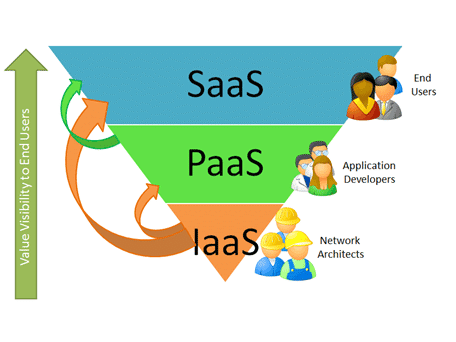

# 云计算

云计算是计算领域中一种相对较新的业务模式。根据美国国家标准与技术研究院（NIST）的官方定义，“云计算是一种实现对可以最小管理工作或业务提供商交互，得以配置及发布的可配置计算资源（例如网络、服务器、存储、应用与服务等）共享池的，无处不在、方便、按需的网络访问模型。”

> **译注**：请参阅 [The NIST Definition of Cloud Computing](../images/nistspecialpublication800-145.pdf)。

所谓虚拟化，是指诸如操作系统、服务器、存储设备或网络资源等某种事物虚拟（而非实际）版本的创建过程。运用虚拟化技术，我们便可实现云计算。虚拟化以不同的虚拟机或服务器，共享硬件资源，而云计算则采用虚拟化技术，在多个用户下共享虚拟服务器。地理位置不再是限制。

在（共有）云计算中，物理服务器的所有权归属某一组织，用户会按使用量计费。首个正式公有云服务是由 Sabeer Bhatia 与 Jack Smith 创建的电子邮件服务 Hotmail，并于 1997 年被微软收购。这一服务允许用户在无需在他们的 PC 上安装某种电子邮件客户端下，即可于某一远程平台上查看、发送及接收电子邮件。

云计算极为便捷地解决了我们作为网络管理员，需要关注的两个问题领域 —— 技术问题与业务问题。

技术问题包括峰值流量负载、可用性、冗余、维护（比如补丁）、采购与交付时间、部署规划及资源配置，以及安装与配置所需的专业技能和人员保障等。业务问题包括：成本（理所当然）、上市时间、协作便利性，以及业务连续性风险等。

云计算与虚拟化技术，允许公司快速创建出一台虚拟服务器，或整个网络的基础设施（包括路由器、防火墙及交换机等）、扩大或缩小规模、安装服务及软件、测试全体内容，并在随后关闭资源，而只为所使用的资源付费。

### 云计算模型

咱们可能已听说过这些术语，但未必清楚他们的具体含义。云计算可被部署为软件即服务（SaaS）、平台即服务（PaaS），或基础设施即服务（IaaS）。

所谓 SaaS，属于一种提供终端用户桌面需求解决方案的云计算类型，例如谷歌公司的 Gmail 与微软公司的 Office 365。PaaS 使开发者在无需投入昂贵硬件下，即可创建并测试软件，例如 Google App Engine。IaaS 则让应用能运行于云上，而不是使用他们自己的基础设施。使用 IaaS，网络管理员可在数分钟内构建起新的服务器及存储空间，例如亚马逊的 S3 存储服务。

下图 38.1 演示了这些服务在终端用户可见性层面的关联关系。

**图 38.1** -— **云服务对最终用户的可见性**

以下是某一组织可使用的一些云计算资源：

- 电子邮件账户
- 服务器（虚拟机）
- 数据存储
- Web 站点
- 数据备份

根据 NIST 的定义，云计算业务有下面的这些属性构成：

- 弹性扩展
- 按需使用
- 提供商站点处的池化计算资源
- 受监控与计量的业务使用量
- 广泛的网络访问能力

所谓弹性扩展，可根据客户业务活动，随时添加或移除云计算业务或用户，同时用户只会为使用的资源付费。与必须需物理安装更多内存或硬盘空间不同，用户只需移动滑块或输入一条命令。按需使用是指用户可随时随地访问业务。这提升云计算业务的可用性。所谓供应商站点处的池化计算资源，是指云计算提供商必须把他的资金，投资于适当的硬件、配置及维护上。提供商还必须随时注意物理基础设施的使用情况。

所谓受监控与计量的业务使用量，指的是大多数云业务，都将有着按月的订阅与使用量计费。云业务提供商将根据像是磁盘空间、处理能力等受计量资源的时长使用量收费。广泛的网络访问是指客户可从任何设备（如智能手机、平板电脑、笔记本或台式机等），经由 Internet 访问这些业务。

### 云部署模型

基于所需的使用量与可用性，云计算的部署模型分为四个组别。咱们要选择哪种模型，可归结为咱们组织需求、预算，以及所在国家对个人或财务数据存储与检索的监管要求（即合规性）。

云计算未必适用于所有组织。大型数据中心将通常需要其自有的资源，及出于维护与故障排除的物理访问。即使那些必须遵循对硬件物理/远程访问严格安全协议的组织，也可能未发现有用的云计算模型（在这种情形下，他们就会选择私有云）。

这四个可用的组别如下：

- 私有云
- 社区云
- 公有云
- 混合云

**私有云**：在这一模型类型下，组织会利用他们自有的硬件及软件资源，实现云服务。这一模型主要会用到虚拟化技术，并完全为组织的利益而运行。

**社区云**：这一模型由计算机资源池构成。这些资源对有着共同需求的一些不同组织可用。客户可快速而安全地访问资源。在这一模型下，客户称为租户。尽管这些客户在访问着同一计算机资源，但每个客户均拥有带有其自己配置和数据的专属计算环境。这些配置与数据细节，均被安全存储。

**公有云**：这种云计算模型的业务，可被任何的互联网用户访问。这些计算机资源对全体公众用户可用。这种云计算模型的示例，分别是 Gmail、Google Docs 及 Hotmail 等。目前，亚马逊 Web 服务（AWS）是最大的公有云提供商。

**混合云**：这种云计算模型，属于私有云与公有云的一种结合。除私有云外，用户对所使用的硬件或其他网络组件没有掌控。但他们可控制安装在服务器上的操作系统以及应用。

