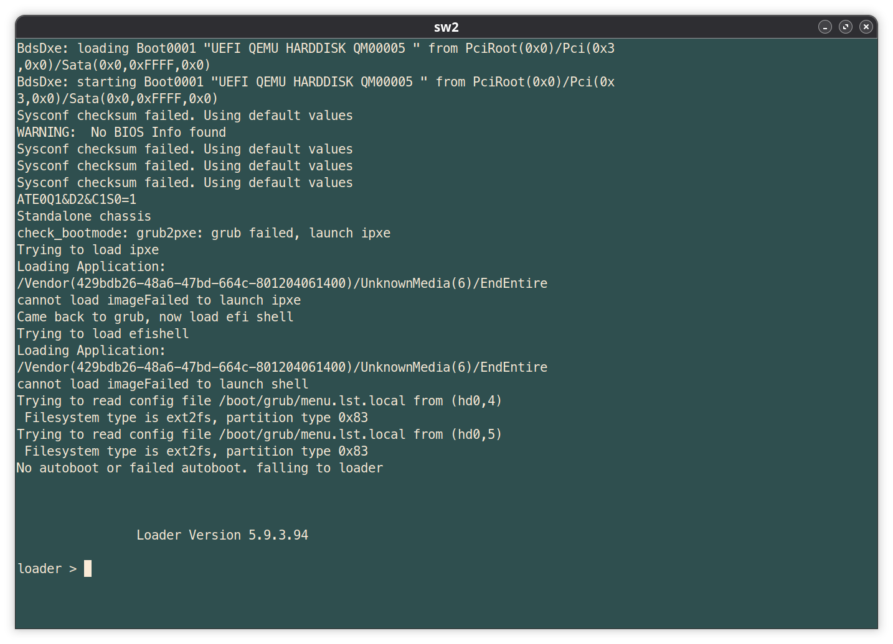
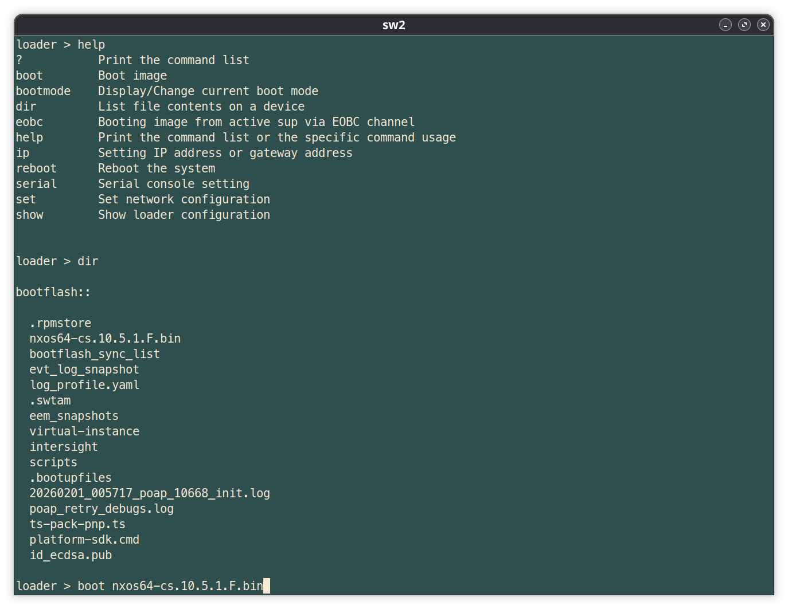

# 虚拟化故障排除

**注意**：这一小节为译者根据在实验中发现的问题，对这一章的补充。


## Nexus 9000（9300） 重启后进入 `loader>` 界面


在初次于 GNS3 或其他环境下，使用 `nexus9300v64.10.5.1.F.qcow2` 的 QEMU 镜像时，由于未在全局配置模式下配置 boot 选项，而导致关机重启后进入 `loader>` 提示符界面。





这时可运行 `help` 命令，查看这一环境下可用的命令，接着运行 `dir` 查看 `bootflash::` 下的文件，然后运行 `boot nxos64-cs-10.5.1.F.bin` 即可正常其中所指定的系统镜像了。这一过程就是 Linux 系统引导的过程。





### 如何避免进入 `loader>` 提示符

分析上述问题原因，在于系统引导程序找不到引导镜像。因此我们要通过以下步骤，在配置文件中指定出要引导的镜像文件。


- 在 EXEC 模式下使用 `dir` 命令列出 `bootflash:` 下的文件；

    ```console
    sw2# dir
           4096    Feb 01 00:57:12 2026  .bootupfiles/
           4096    Feb 01 02:49:10 2026  .rpmstore/
           4096    Feb 01 00:55:46 2026  .swtam/
          14273    Feb 01 00:59:18 2026  20260201_005717_poap_10668_init.log
              0    Feb 01 00:55:40 2026  bootflash_sync_list
           4096    Feb 01 00:55:47 2026  eem_snapshots/
           4096    Feb 01 00:55:45 2026  evt_log_snapshot/
            175    Feb 01 02:35:30 2026  id_ecdsa.pub
           4096    Feb 01 02:50:56 2026  intersight/
            946    Feb 01 02:49:22 2026  log_profile.yaml
     2366777344    Jul 26 05:19:12 2024  nxos64-cs.10.5.1.F.bin
              0    Feb 01 01:00:30 2026  platform-sdk.cmd
             47    Feb 01 00:57:44 2026  poap_retry_debugs.log
           4096    Feb 01 00:56:10 2026  scripts/
          55404    Feb 01 00:58:35 2026  ts-pack-pnp.ts
           4096    Feb 01 00:56:00 2026  virtual-instance/

    Usage for bootflash://
     2988933120 bytes used
     5610168320 bytes free
     8599101440 bytes total
    ```

- 在全局配置模式下，使用 `boot nxos bootflash:///nxos64-cs.10.5.1.F.bin` 命令指定要引导的镜像文件并保存配置，随后这一问题解决。

    ```console

    sw2(config)# boot nxos bootflash:///nxos64-cs.10.5.1.F.bin
    Performing image verification and compatibility check, please wait....
    sw2(config)#
    sw2# copy r s
    [########################################] 100%
    Copy complete, now saving to disk (please wait)...
    Copy complete.
    ```


参考：[NX-OS 9k stuck in loader> mode](https://community.cisco.com/t5/switching/nx-os-9k-stuck-in-loader-gt-mode/td-p/3779755)


**注意**：

- Nexus 9300 只支持使用公钥连接到其 SSH 服务器，配置过程参见：[使用基于密钥的身份验证通过SSH连接到NX-OS交换机](https://www.cisco.com/c/zh_cn/support/docs/voice/mds/200640-Ssh-into-NX-OS-Switches-using-key-based.html)。
- 当以 `ssh admin@192.168.122.161 -vvv` 登录 Nexus 9300 交换机时，会导致如下无法关闭的调试输出。

    ```console
    sw2# debug3: obfuscate_keystroke_timing: stopping: chaff time expired (0 chaff packets sent)
    debug3: obfuscate_keystroke_timing: starting: interval ~20ms
    ```

    此调试输出在以正常的 SSH 登录 `ssh admin@192.168.122.161` 下即会消失。
