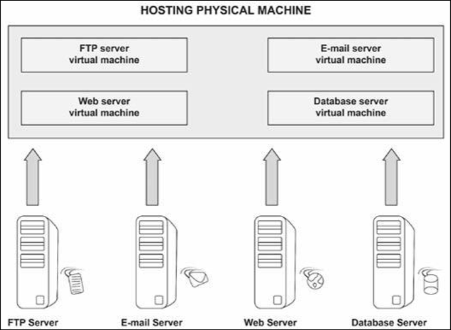
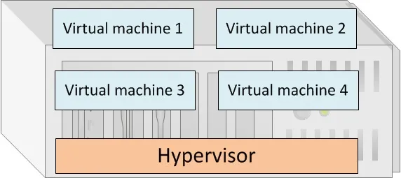

# 虚拟化

虚拟化技术在计算领域已存在很长时间，但其最近在服务器和桌面环境中经历了激增，这很大程度上得益于其可横向扩展出超大规模环境的能力。许多虚拟环境，都是由数百或数千台设备构成，而因此有大量相关的网络问题。

作为网络工程师，我们需要理解这项技术的工作原理，以便我们可对会议贡献专业见解，并在需要时提供建议。当咱们打算深入研究虚拟化技术时，那么就要关注比如 VMware 及 NetApp 等一些提供认证的市场领导者。

## 虚拟桌面与服务器

虚拟化技术允许咱们采用多台物理设备，而将他们迁移到逻辑上被划分为更小的虚拟域的单一物理设备（参见下图 38.2）。换言之，其允许咱们创建出，模拟原先就有的硬件的一种软件环境。将托管所有这些虚拟服务器的那个单一设备，将拥有丰富的可用资源，特别是以下几项：

- CPU 能力
- 存储
- 磁盘空间
- 带宽

**图 38.2** -— **网络虚拟化**

虚拟化技术涉及单一物理设备，咱们会于其上，使用能够在该物理设备内部隔离出独立虚拟机的虚拟化软件。这种虚拟化软件，将非配一定数量的磁盘空间、内存及 CPU 能力给每个定义于内部的虚拟机（VM）。当咱们打算构建某一新服务器时，咱们只需从则hyi物理设备上开辟一个新部分，来创建另一虚拟操作系统并分配必要资源，使其完全向一个物理设备一样运行（和思考）（见下图 38.3）。

实现这一能力的软件，称为虚拟机管理器，或超管理程序（hypervisor，其不仅仅是个管理程序，supervisor）。虚拟机管理程序有着以下职责：

- 管理所有虚拟系统
- 管理物理的硬件资源
- 管理虚拟机对物理服务器内部硬件组件的关系
- 桥接虚拟世界与物理世界
- 在咱们不希望虚拟机与对方通信时，维持虚拟机之间的隔离

值得注意的是，尽管所有虚拟机都位于同一物理设备上，虚拟机管理程序软件的开发者，仍必须确保他们有着限制所有虚拟机之间，可见性与访问权限的一些恰当安全特性。

**图 38.3** -— **虚拟化组件与管理程序**

虚拟机管理程序有两种类型：

